# 使用说明

## 1. 概述

LayaAir智能资源管理插件是一个用于管理和打包程序资源的插件，当一个资源被设置为“智能资源管理”后，开发者可以使用该资源的地址从任何位置加载它，无论该资源是在本地程序中还是在远端服务器上。

使用智能资源管理插件可以显著提高项目的灵活性，开发者可以在需要使用资源的时候再对资源进行加载，不需要随程序一起下载资源。在开发阶段，开发者可任意修改资源所在的位置，而无需重写任何游戏代码。

本节会对智能资源管理插件中的一些概念进行基础的介绍，以帮助开发者对此插件建立一个基础的认识。

**分组名/资源别名：**标识被插件管理的资源的字符串ID，开发者可使用资源别名对资源进行加载。

**标签：**一个标记，开发者可将其分配给多个资源，并使用标签作为关键字加载资源。

**资源组：**资源管理的基础单元，插件会根据资源组的设置对资源进行打包。

**资源构建：**对资源进行打包的操作，插件会根据开发者的设置来打包资源。

**构建报告：**资源进行构建后，插件会生成资源构建报告，开发者可根据构建报告，优化资源设置。


## 2. 配置智能资源管理对象

### 2.1 智能资源管理插件配置

在构建发布 - 智能资源管理栏中打开配置面板。


#### 2.1.1 构建参数及配置

**构建输出目录：**构建后生成的文件存放的路径，插件会根据激活的构建配置，将生成的文件存放在与构建配置同名的文件夹下。此路径是相对于项目路径的路径。一般不建议修改。

**DCC资源输出路径：**构建后生成的 .dcc 文件夹存放的路径。此路径不可修改。

**报告输出路径：**构建报告存放的路径，插件会根据激活的构建配置，将生成的文件存放在与构建配置同名的文件夹下。此路径是相对于项目路径的路径。

**资源版本信息输出路径：**该数据用于在更新上一次构建时比较资源变化，一般不建议修改。

#### 2.1.2 运行时参数及配置

**项目地址：**用于加载项目资源。

**包文件下载重试次数：**包文件下载失败时插件会重试的次数。

**包文件下载重试延迟：**包文件下载失败时，插件要延迟多久才会重新下载。 

**包文件最大下载线程：**最多同时下载多少个文件。

#### 2.1.3 预览参数及配置

**远端预览端口号：**在预览模式为远端模式时，插件会启动一个服务器用于模拟远端加载，而服务器使用的便是此端口。

### 2.2 资源组配置

选择一个组后，可在右侧面板中对此组进行配置管理。

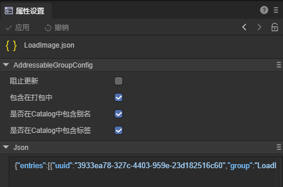

**阻止更新：**所有启用了阻止更新属性的组都不会进行资源构建，但开发者也不能对这些组中的资源做出修改；如果资源有修改，插件会提醒开发者将资源移动到其它资源组中。

**包含在打包中：**只有启用了这一属性的资源组才会进行打包。未启用此属性的组相当于不存在。

**是否在Catalog中包含别名/标签：**未启用此属性时，插件生成的Catalog文件中不会有资源的别名/标签，资源也无法通过别名/标签作为关键字进行加载。

### 2.3 构建配置

在智能资源管理 - 工具栏中打开智能资源管理构建配置面板。


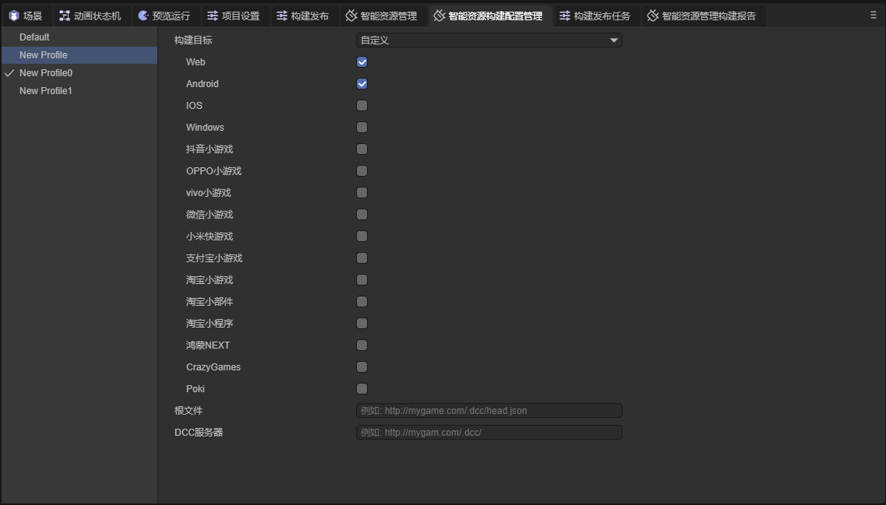

**构建目标：**此构建配置会在哪个平台生效。

**根文件：**在资源构建成功后，会在资源包目录中的 .dcc 文件夹中会生成 head.json 文件，插件会根据根文件属性设置的地址加载 head.json 文件，如果开发者没有设置此属性，则会使用构建发布时设置的项目地址。

**DCC服务器：**在资源构建成功后，会在资源包目录中的 .dcc 文件夹，插件会根据DCC服务器属性中填写的地址加载 .dcc 文件。

### 2.4 预览模式

预览模式在程序开发阶段使用，用于模拟加载资源，方便开发者调试程序。

预览模式分为两种，本地模式和远端模式。

当选择本地模式时，资源不会通过包文件加载，而是通过 assets 目录加载资源；


当选择远端模式时，插件将在本地启动一个Server服务用于模拟外网资源加载。注意: 修改模式后, 需要使用ctrl+shift+R刷新编辑器, 才可以开启/关闭Server服务。

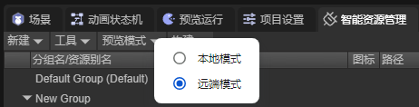

## 3. 资源管理

### 3.1 资源组管理

#### 3.1.1 新建资源组

点击面板上方的“新建”按钮，新建一个资源组


#### 3.1.2 资源组重命名

可以通过右键组名 - 重命名，慢速双击或者选中资源条目后，按键:F2组名的方式为组重命名


#### 3.1.3 删除资源组

可以通过右键组名 - 移除组的方法来将组删除


#### 3.1.4 改变组顺序

通过拖动改变组的排列顺序


### 3.2 组内资源管理

#### 3.2.1 添加资源

第一种方式：将需要打包的资源拖入到新建的资源组中，生成资源条目


第二种方式：在项目资源面板中选中要添加的资源，在右侧面板中勾选“智能资源管理”这一选项，并应用，

这种方式会将资源添加到默认组中


#### 3.2.2 移除资源

第一种方式：在智能资源管理面板中，右击想要移除的资源，点击移除。


第二种方式：在项目资源面板中选中要移除的资源，在右侧面板中将“智能资源管理”这一选项取消勾选，并应用


#### 3.2.3 资源别名重命名  

通过右键资源-重命名的方式或者选中资源条目后，按键:F2来更改资源的资源别名

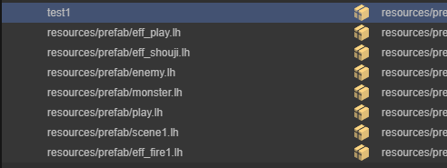

#### 3.2.4 更改资源所在的资源组

通过拖动更改资源所在的资源组


也可以将项目资源面板中的资源拖入不同组来更改资源所在的资源组


#### 3.2.5 资源标签管理

在标签管理界面对标签进行增加，移除，重命名操作

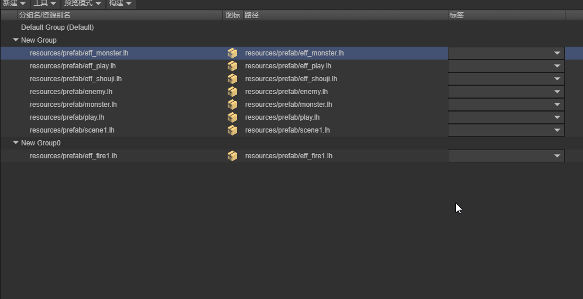

为资源添加标签。一个资源可以有多个标签，一个标签也可以对应多个资源。


### 3.3 构建配置管理

在智能资源管理面板，点击工具栏，打开智能资源构建配置管理。


开发者可管理构建配置，包括新建，删除，重命名，激活这些操作。

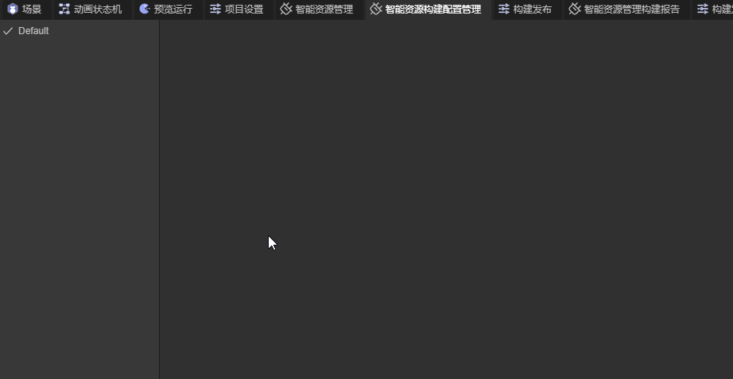

对于每一个构建配置，开发者可自行设置其属性。


构建发布前，开发者需选择正确的构建配置，如果激活的构建配置的构建目标中不包含此次构建的平台，插件会提醒开发者更换构建配置。

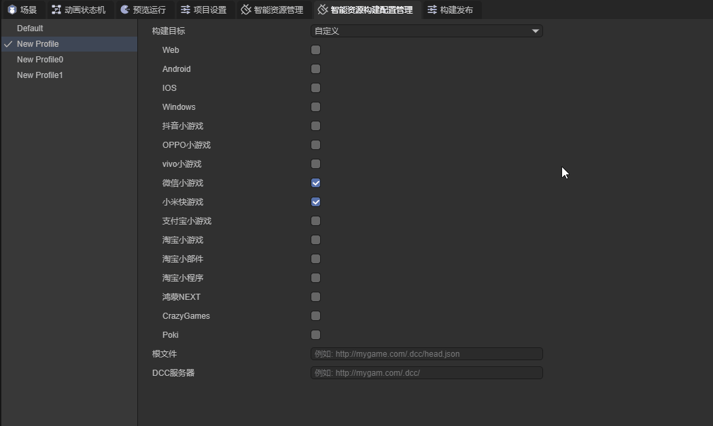

## 4. 构建内容

### 4.1 构建设置

要对资源进行构建，开发者需进行以下操作：

1.对资源组进行设置。

2.在构建发布 - 智能资源管理页面进行设置。

3.选择正确的构建配置文件。

4.执行构建。

### 4.2 执行构建

#### 4.2.1 新构建

进行构建时，开发者可通过新构建单独对智能资源管理中的资源进行构建，而不构建整个项目。

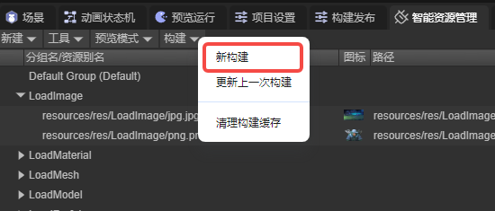

#### 4.2.2 构建发布

构建发布时，插件会对资源进行构建，此时生成的 .dcc 文件会保存在项目输出目录中，开发者可根据激活的构建配置，将 .dcc 文件和 head.json 文件移动到对应的服务器中。


### 4.3 更新资源

当开发者需要更新资源时，可以使用更新上一次构建的功能。


更新上一次构建会根据资源组是否启用阻止更新这一属性，决定是否进行资源构建。所有启用了阻止更新属性的组都不会进行资源构建，但开发者也不能对这些组中的资源做出修改；如果资源有修改，插件会提醒开发者将资源移动到其它资源组中。

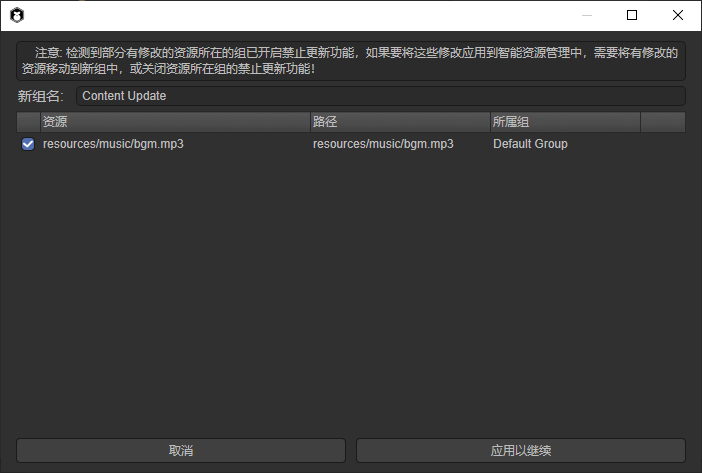

完成构建后，生成的文件会存放在构建输出目录中，开发者需要将新打包的资源和 head.json 文件转移到指定的服务器中。

## 5. 在运行时使用

运行时，共有四种方法用于加载资源。

```typescript
/**
 * 加载资源
 * @param key 用来筛选资源的关键字
 * @param options {LoadAssetOptions} 加载资源的选项
 * @returns {Promise<LoadResult>}
 */
static async loadAssetAsync(key: string, options?: LoadAssetOptions): Promise<LoadResult> ;

/**
 * 加载资源
 * @param key 用来筛选资源的关键字
 * @param options {LoadAssetsOptions} 加载资源的选项
 * @returns {Promise<LoadResult>}
 */
static async loadAssetsAsync(key: string | string[], options?: LoadAssetsOptions): Promise<LoadResult> ;

/**
 * 创建资源的实例
 * @description 在 {@link LoadResult.data} 中返回创建的实例, 仅当加载的资源是一个Prefab时有效
 * @param key 用来筛选资源的关键字
 * @param options
 * @return {Promise<LoadResult>}
 */
static async instantiateAsync(key: string, options?: InstantiateOptions): Promise<LoadResult> ;

/**
 * 加载场景
 * @description 在 {@link LoadResult.data} 中返回加载场景所需的路径
 * @param key 用来筛选资源的关键字
 * @param options
 * @returns {Promise<LoadResult>} 在 {@link LoadResult.data} 中返回加载的场景的路径
 */
static async loadSceneAsync(key: string, options?: LoadSceneOptions): Promise<LoadResult>;
```

### 5.1 加载单个资源 

```typescript
/**
 * 加载资源
 * @param key 用来筛选资源的关键字
 * @param options {LoadAssetOptions} 加载资源的选项
 * @returns {Promise<LoadResult>}
 */
static async loadAssetAsync(key: string, options?: LoadAssetOptions): Promise<LoadResult> ;
```

Addressables.loadAssetAsync ，此方法会根据关键字加载第一个找到的资源。

    onStart(): void {
        Addressables.loadAssetAsync('test1').then((result: LoadResult) => {
            console.log(result);
        });
    }

输出结果：


### 5.2 加载多个资源

```typescript
/**
 * 加载资源
 * @param key 用来筛选资源的关键字
 * @param options {LoadAssetsOptions} 加载资源的选项
 * @returns {Promise<LoadResult>}
 */
static async loadAssetsAsync(key: string | string[], options?: LoadAssetsOptions): Promise<LoadResult> ;
```

Addressables.loadAssetsAsync，此方法根据不同的 options 值有三种加载选项。

#### 5.2.1 UseFirst

在使用此加载选项时，插件会根据传入的第一个关键字，加载所有包含此资源别名或标签的资源，如果此时传入多个关键字，只有第一个关键字生效。


```typescript
onStart(): void {
    Addressables.loadAssetsAsync(['test2', 'test1'], { mode: MergeMode.UseFirst }).then((result: LoadResult) => {

        console.log(result);

        for(let i = 0; i < result.data.length; i++) {
            console.log(result.data[i].url);
        }
    });
}
```

输出结果：


#### 5.2.2 Union

插件会筛选出每个关键字所对应的所有资源，并对这些资源求并集。


```typescript
onStart(): void {
    Addressables.loadAssetsAsync(['test1', 'test2'], { mode: MergeMode.Union }).then((result: LoadResult) => {

        console.log(result);

        for(let i = 0; i < result.data.length; i++) {
            console.log(result.data[i].url);
        }
    });
}
```

输出结果：


#### 5.2.3 Intersection

插件会筛选出每个关键字所对应的所有资源，并对这些资源求交集。


```typescript
onStart(): void {
    Addressables.loadAssetsAsync(['test1', 'test2'], { mode: MergeMode.Intersection }).then((result: LoadResult) => {

        console.log(result);

        for(let i = 0; i < result.data.length; i++) {
            console.log(result.data[i].url);
        }
    });
}
```

输出结果：


### 5.3 创建资源的实例

```typescript
/**
 * 创建资源的实例
 * @description 在 {@link LoadResult.data} 中返回创建的实例, 仅当加载的资源是一个Prefab时有效
 * @param key 用来筛选资源的关键字
 * @param options
 * @return {Promise<LoadResult>}
 */
static async instantiateAsync(key: string, options?: InstantiateOptions): Promise<LoadResult> ;
```

Addressables.instantiateAsync,  插件会根据传入的关键字，将检索到的第一个预制体资源直接转换为对应的节点，其他资源会被忽略


```typescript
onStart(): void {
    Addressables.instantiateAsync('test1').then((result: LoadResult) => {
        console.log(result);
    });

    Addressables.instantiateAsync('test3').then((result: LoadResult) => {
        console.log(result);
    });
}
```

输出结果：


### **5.4 加载场景**

```typescript
/**
 * 加载场景
 * @description 在 {@link LoadResult.data} 中返回加载场景所需的路径
 * @param key 用来筛选资源的关键字
 * @param options
 * @returns {Promise<LoadResult>} 在 {@link LoadResult.data} 中返回加载的场景的路径
 */
static async loadSceneAsync(key: string, options?: LoadSceneOptions): Promise<LoadResult> 
```

Addressables.loadSceneAsync， 插件会根据传入的关键字，加载检索到的第一个场景资源，非场景资源会被忽略。


```typescript
onStart(): void {
    Addressables.loadSceneAsync("resources/scene/SceneForLoad.ls").then((res) => {
        console.log(res);
        Laya.Scene.open(res.data);
    })
}
```

输出结果：


### 5.5 获取资源的描述信息列表

Addressables.getLocationAsync, 插件会根据传入的关键字，加载并返回资源的描述信息，需要注意的是，此方法不会加载资源

```typescript
/**
 * 获取资源的描述信息列表
 * @param keys 用来筛选资源的关键字列表
 * @param mode 合并模式
 * @returns {Promise<ResourceLocation[]>}
 */
static async getLocationAsync(key: string | string[], mode?: MergeMode): Promise<ResourceLocation[]>
```

与加载多个资源的方法相同，Addressable.getLocationAsync 也可以根传入的关键字的不同，使用不同的加载选项。

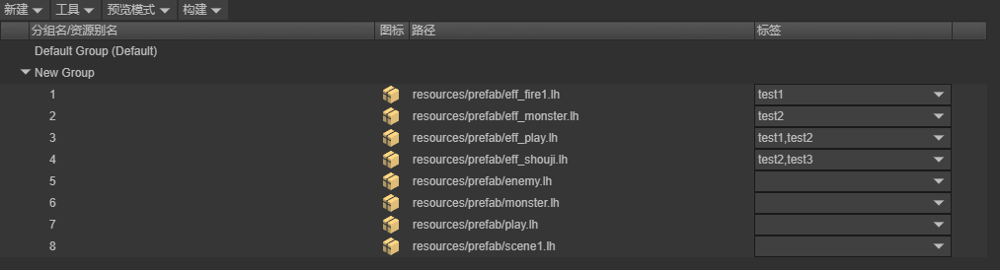

```typescript
onStart(): void {
    Addressables.getLocationAsync(["test2"], MergeMode.Union).then((res) => {
        console.log(res);
    })
}
```

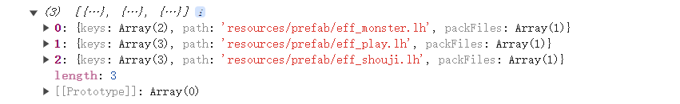

## 6. 构建报告

资源构建完成后，会生成资源报告。点击智能资源管理构建报告面板，可以查看相关信息。报告中有概要、浏览、潜在问题三个页面。

### 6.1 概要

概要页面中包含了本次报告的编译时间、版本号、资源量统计、冲突问题等信息。


### 6.2 浏览

浏览页面中，显示了每个包中包含的资源，资源之间的依赖关系、包之间的依赖关系等信息。


### 6.3 潜在问题

不同包内的多个资源同时引用了相同的资源，且该资源没有加入资源管理，此时这个被引用的资源会同时存在于多个包内，造成空间浪费。


