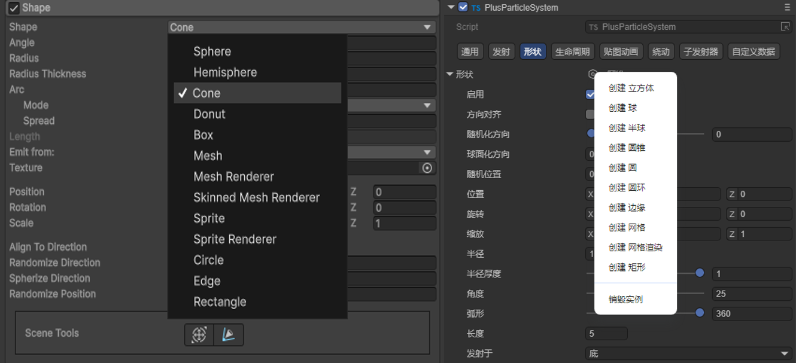
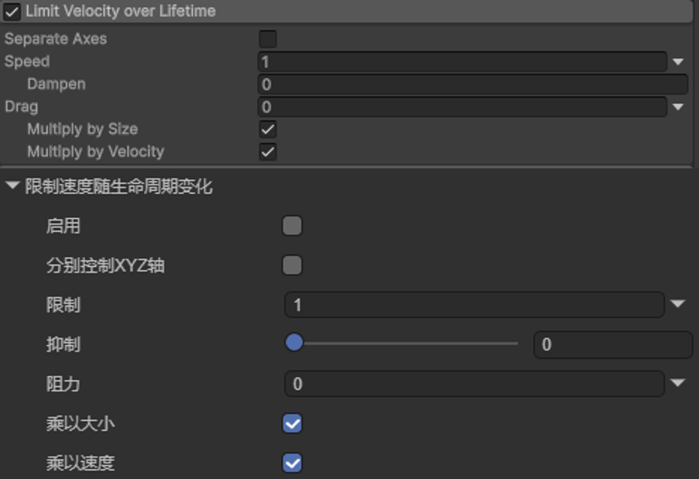
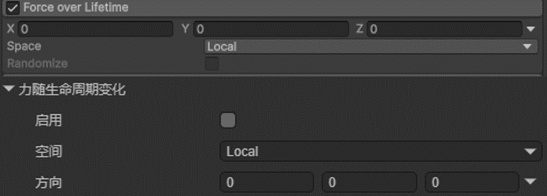
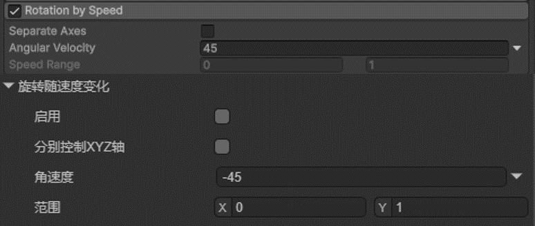
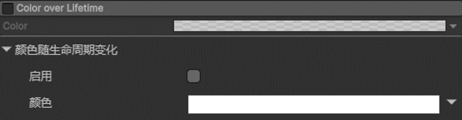
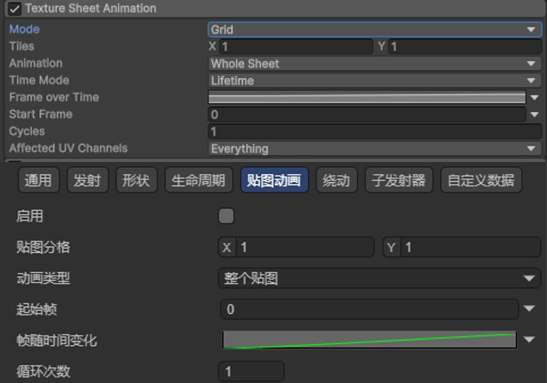
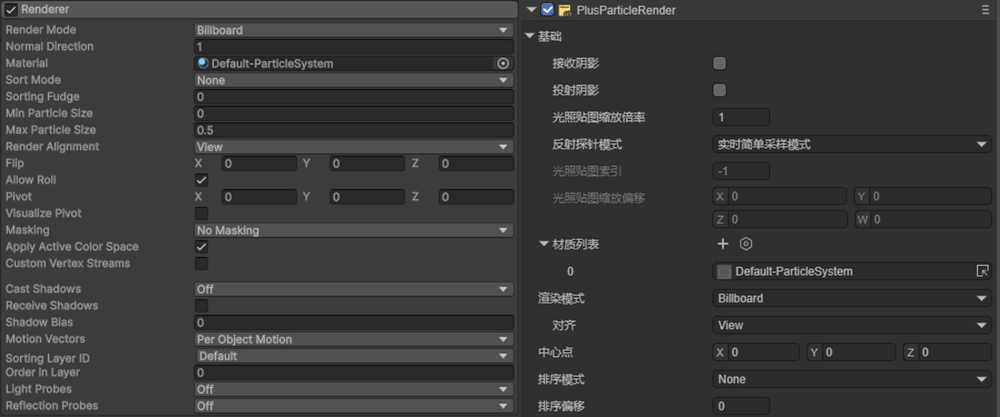

# Unity资源导出插件-导出粒子


## 一、介绍

为实现快速将Unity粒子导出到LayaAir-IDE中，[Unity资源导出插件](../../../../../3D/advanced/Unity/readme.md)支持了从Unity中导出粒子系统。但是，LayaAir自带的粒子系统与Unity的架构不一样，不支持Unity导出后的粒子，所以Unity导出的粒子资源只能在[CPU粒子系统](../readme.md)中使用。

粒子导出的方法与其它资源导出的方法一样，点击[这里](../../../../../3D/advanced/Unity/readme.md)查看流程。

需要注意的是，如果在Unity中使用的是自定义的shader，那么在导出前，需要先手动将unityshader转为layashader，这样导出后的粒子着色器才能得到正确的效果。


## 二、导出的参数

### 2.1 曲线编辑面板数据的导出

在Unity插件的`ParticleSystemData.cs`中：

- 可以找到writeMinMaxCurveData方法，minmaxCurve描述最小值-最大值曲线之间的变化：

Constant：单个常量；

Curve：单条曲线； 

TwoCurves： 2 条曲线之间的随机值；

TwoConstants： 2 个常量之间的随机值；

- 还有writeMinMaxGradientData方法，MinMaxGradient描述两个颜色之间的变化：

Color：单颜色；

Gradient：渐变颜色；

TwoColors：两个颜色之间随机；

TwoGradients:2 个颜色渐变之间的随机；


### 2.2 功能模块的解析

在插件的`ParticleSystemData.cs`中，GetParticleSystem方法调用了整体的流程。

```c
    public static JSONObject GetParticleSystem(ParticleSystem particleSystem, bool isOverride, NodeMap map, ResoureMap resMap)
    {
        JSONObject compData = JsonUtils.SetComponentsType(new JSONObject(JSONObject.Type.OBJECT), "ParticleSystem", isOverride);
        writeBaseNode(particleSystem, compData);
        writeEmission(particleSystem, compData);
        writeShape(particleSystem, compData,map, resMap);
        writeVelocityOverLifetime(particleSystem, compData);
        writeSizeOverLifetime(particleSystem, compData);
        writeForceOverLifetime(particleSystem, compData);
        writeRotationOverLifetime(particleSystem, compData);

        writeLimitVelocityOverLifetime(particleSystem, compData);
        writeColorOverLifetime(particleSystem, compData);
        writeColorBySpeed(particleSystem, compData);
        writeSizeBySpeed(particleSystem, compData);
        writeRotationBySpeed(particleSystem, compData);
        writeInheritVelocity(particleSystem, compData);
        writeNoise(particleSystem, compData);
        writeTextureSheetAnimation(particleSystem, compData);
        writeSubEmittersModule(particleSystem, compData, map);

        return compData;
    }
```

下面分别介绍各个模块的导出，

- writeBaseNode解析基础模块，对应LayaAir-IDE中的“通用”，如图2-1所示，Unity（左）与LayaAir（右）的对应关系。


（图2-1）

- writeEmission解析Emission模块，对应LayaAir-IDE中的“发射”，如图2-2所示，Unity（上）与LayaAir（下）的对应关系。


（图2-2）

- writeShape解析Shape模块，对应LayaAir-IDE中的“形状”，如图2-3所示，Unity（左）与LayaAir（右）的对应关系。



（图2-3）

- writeVelocityOverLifetime解析 Velocity over LifeTime 模块，对应LayaAir-IDE中的“生命周期-速度随生命周期变化”，如图2-4所示，Unity（上）与LayaAir（下）的对应关系。


（图2-4）

- writeLimitVelocityOverLifetime解析 Limit Velocity over Lifetime 模块，对应LayaAir-IDE中的“生命周期-限制速度随生命周期变化”，如图2-5所示，Unity（上）与LayaAir（下）的对应关系。



（图2-5）

- writeInheritVelocity解析 Inherit Velocity 模块，对应LayaAir-IDE中的“生命周期-继承速度”，如图2-6所示，Unity（上）与LayaAir（下）的对应关系。


（图2-6）

- writeForceOverLifetime解析 Force over Lifetime 模块，对应LayaAir-IDE中的“生命周期-力随生命周期变化”，如图2-7所示，Unity（上）与LayaAir（下）的对应关系。



（图2-7）

- writeRotationOverLifetime解析 Rotation over Lifetime 模块，对应LayaAir-IDE中的“生命周期-旋转随生命周期变化”，如图2-8所示，Unity（上）与LayaAir（下）的对应关系。


（图2-8）

- writeRotationBySpeed解析 Rotation by Speed 模块，对应LayaAir-IDE中的“生命周期-旋转随速度变化”，如图2-9所示，Unity（上）与LayaAir（下）的对应关系。



（图2-9）

- writeSizeOverLifetime解析Size over Lifetime模块，对应LayaAir-IDE中的“生命周期-大小随生命周期变化”，如图2-10所示，Unity（上）与LayaAir（下）的对应关系。


（图2-10）

- writeSizeBySpeed解析 Size by Speed 模块，对应LayaAir-IDE中的“生命周期-大小随速度变化”，如图2-11所示，Unity（上）与LayaAir（下）的对应关系。


（图2-11）

- writeColorOverLifetime解析 Color over Lifetime 模块，对应LayaAir-IDE中的“生命周期-颜色随生命周期变化”，如图2-12所示，Unity（上）与LayaAir（下）的对应关系。



（图2-12）

- writeColorBySpeed解析 Color by Speed 模块，对应LayaAir-IDE中的“生命周期-颜色随速度变化”，如图2-13所示，Unity（上）与LayaAir（下）的对应关系。


（图2-13）

- writeTextureSheetAnimation解析 Texture Sheet Animation 模块，对应LayaAir-IDE中的“贴图动画”，如图2-14所示，Unity（上）与LayaAir（下）的对应关系。



（图2-14）

- writeNoise解析 Noise 模块，对应LayaAir-IDE中的“绕动”，如图2-15所示，Unity（左）与LayaAir（右）的对应关系。


（图2-15）

- writeSubEmittersModule解析 Sub Emitters 模块，对应LayaAir-IDE中的“子发射器”，如图2-16所示，Unity（上）与LayaAir（下）的对应关系。


（图2-16）


### 2.3 渲染模块参数

粒子渲染的解析由GetParticleSystemRneder完成，如图3-1所示，Unity（左）与LayaAir（右）的对应关系。

```c
 public static JSONObject GetParticleSystemRneder(ParticleSystemRenderer renderer, bool isOverride,ResoureMap map)
    {
        JSONObject compData = JsonUtils.SetComponentsType(new JSONObject(JSONObject.Type.OBJECT), "ParticleSystemRenderer", isOverride);
        compData.AddField("renderMode", (int)(object)renderer.renderMode);
        compData.AddField("sortMode", (int)(object)renderer.sortMode);
        compData.AddField("alignment", (int)(object)renderer.alignment);
        compData.AddField("material", map.GetMaterialData(renderer.sharedMaterial));
        compData.AddField("cameraVelocityScale", renderer.cameraVelocityScale);
        compData.AddField("velocityScale", renderer.velocityScale);
        compData.AddField("lengthScale", renderer.lengthScale);
        if (renderer.mesh)
        {
            compData.AddField("sharedMesh", map.GetMeshData(renderer.mesh, renderer));
        }
        compData.AddField("pivot", JsonUtils.GetVector3Object(renderer.pivot));
        return compData;
    }
```



（图3-1）


