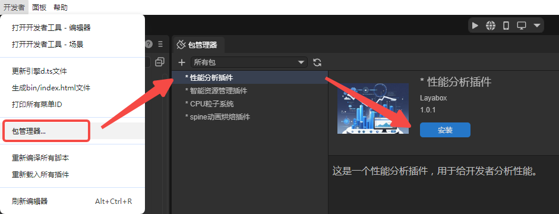
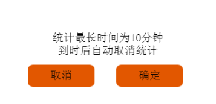
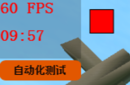
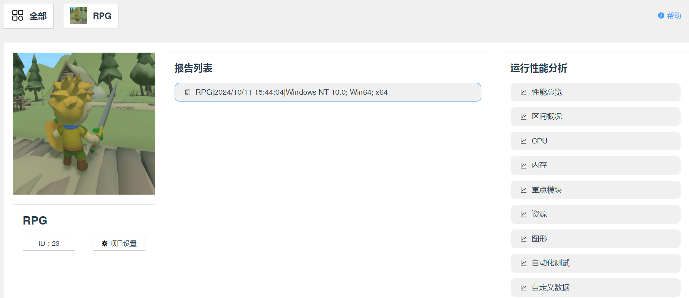
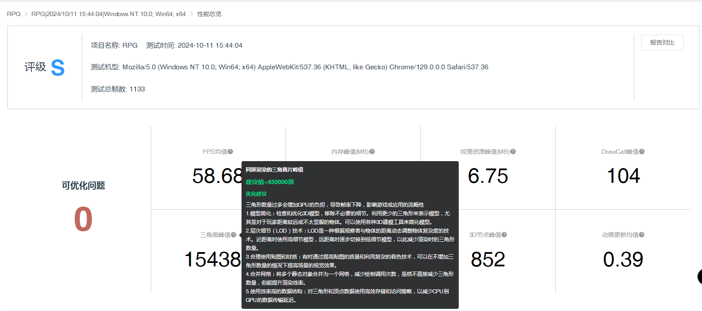
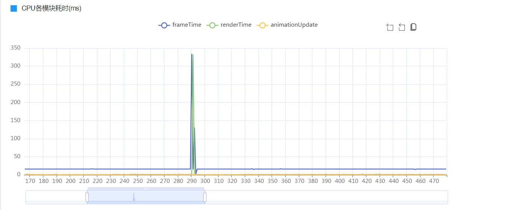
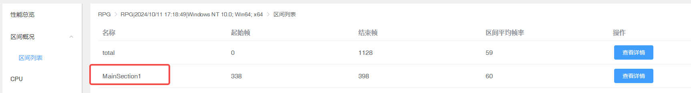
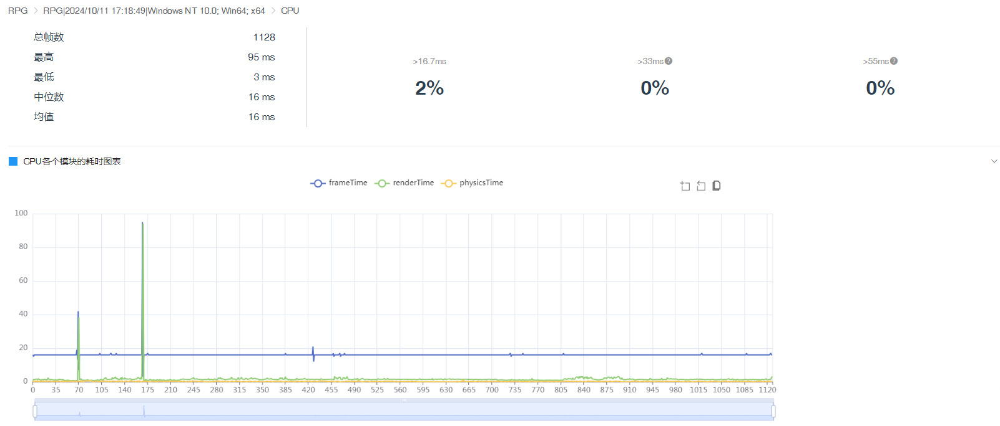
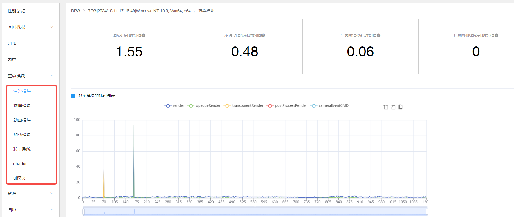
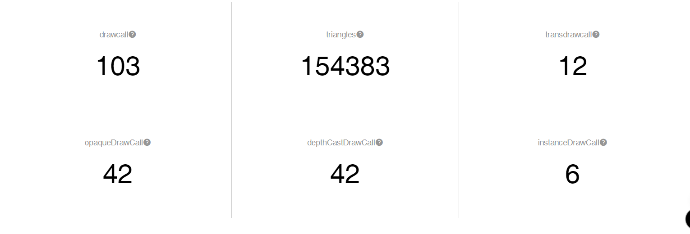

# 性能分析插件

性能分析插件用于检测LayaAir项目运行时的各种性能，开发者需要按照文档中的步骤，首先在IDE中安装插件，然后登录后端平台，最后在LayaAir项目中将插件接入。

在使用时，所有的性能分析报告会上传到服务器进行解析，最终在后端平台显示统计信息。

开发者利用此插件可以非常方便的获取到运行时的CPU、内存、资源、渲染、UI等信息，并且在后端平台会给出优化建议。

## 一、安装与接入

### 1.1 安装插件

如图1-1所示，在LayaAir-IDE的包管理器中，安装性能分析插件。



（图1-1）

### 1.2 登录后端平台

点击[这里](https://layame-1251285021.cos.ap-shanghai.myqcloud.com/maker_union/master-asset/performance/index.html#/home)登录后端平台，如图1-2所示，进入后端界面后，创建项目。


（图1-2）

### 1.3 项目中接入插件

在项目入口中，调用接口，初始化插件。

> 这里的项目入口指的是引擎初始化之后，项目首先要执行的地方。参考文档[《项目入口说明》](https://layaair.com/3.2/doc/basics/IDE/entry/readme.html)。
>
> 开发者可以专门设置一个脚本，用于初始化和配置性能分析工具。

```typescript
const { regClass, property } = Laya;

@regClass()
export class NewScript extends Laya.Script {

    @property(Number)
    public projectId: number = 23;

    private perfMain: LayaPerf = new LayaPerf();

    onEnable(): void {
        this.perfMain.init(this.projectId);
    }
}
```

`projectId`使用后端给项目分配的项目id，如图1-3所示，在后端界面可以看到id的值。


（图1-3）


## 二、工具的使用

### 2.1 录制

性能分析插件是用于运行中的项目，运行时，游戏左上角会出现录制相关的按钮。点击圆形的录制按钮，如图2-1所示，会出现图2-2所示的提示弹窗，点击“确定”则开始录制性能。


（图2-1）



（图2-2）

录制开始后，点击“自动化测试”按钮，系统会自动对关键指标（灯光、阴影、相机、物理、粒子等）打开/关闭，进行自动化测试。并且录制时，录制按钮会变成图2-3所示的方形，此时想要停止录制，则点击这个方形按钮就会停止录制，



（图2-3）

### 2.2 上传

停止录制后，会弹出是否上传录制结果的对话框，如图2-4所示。


（图2-4）

点击“上传”按钮，会将本次录制的性能分析文件上传到服务器进行解析。

> 注意：
>
> 每上传一次录制，则会消耗一次使用次数，剩余使用次数可以在[后端平台](https://layame-1251285021.cos.ap-shanghai.myqcloud.com/maker_union/master-asset/performance/index.html#/home)中查看。
>
> 录制结束后，如果点击“取消”，则不会上传录制结果，并且不会消耗使用次数。

### 2.3 查看报告

上传后，刷新后端界面，在项目页面可以看到对应的录制报告已经显示。

> 如果鼠标无法点击报告，则说明报告正在分析中，稍后刷新页面，点击对应的报告就可以正常显示报告内容了。



（图2-5）


## 三、功能说明

### 3.1 性能总览

性能总览给出了录制过程中的整体分析，可以查看测试过程中各参数的均值或峰值，如图3-1所示，点击“？”图标可以查看优化建议。





（图3-1）


### 3.2 区间概况

通常用于标记某段时间内的性能开销。例如，不同关卡或者用户自定的时间段。统计完成后，在后端"区间概况"的页面中，可以看到这段分析的性能开销，如图3-2所示，



（图3-2）

实现区间统计需要用到两个API：

`section_begin(tag: string): void;`：区域统计开始，在后台页面查看的时候，会根据分段进行展示到区间概况中。参数 tag 是统计的标识。
`section_end(tag: string): void;`：区域统计结束，传入和 section_begin 一样的tag参数，代表这个区间统计结束。

使用方式可以参考如下代码：

```typescript
    //组件被启用后执行，例如节点被添加到舞台后
    onEnable(): void {
        this.perfMain.init(this.projectId).then(res =>{

            Laya.timer.once(8000, this, () => {
                this.perfMain.section_begin("MainSection1");
            });
            Laya.timer.once(9000, this, () => {
                this.perfMain.section_end("MainSection1");
            });
            
        });
    }
```

录制后的数据如上图3-2所示，点击“查看详情”即可查看。


### 3.3 CPU

分析了项目运行时CPU的性能。



（图3-3）


### 3.4 内存

分析了内存峰值，以及各时间内存占用总量。


（图3-4）


### 3.5 重点模块

此模块分析了游戏运行过程中的主要模块，包括：渲染模块、物理模块、动画模块、加载模块、粒子系统、shader、ui模块。



（图3-5）

`渲染模块`：主要分析了渲染总耗时均值、不透明渲染耗时均值、半透明渲染耗时均值、后期处理渲染耗时均值。

`物理模块`：可以查看StaticRigidBody个数峰值、DynamicRigidBody个数峰值。

`动画模块`：包括动画更新时间均值、骨骼更新时间均值。

`加载模块`：显示了网络请求资源个数峰值。

`粒子系统`：包含shurikenParticle时间、shurikenParticle个数的分析。

`shader`：具有shader编译时间峰值、shader数量峰值分析。

`ui模块`：统计了UI渲染时间均值(ms)以及UI DrawCall。

> 点击对应的“？”图标可以查看优化建议，各模块的数据统计以折线图的形式展示。


### 3.6 资源

资源统计包含了纹理资源和几何数据。


（图3-6）

`纹理资源`：主要统计了纹理内存、个数，以及RenderTexture。

`几何数据`：包含顶点缓存与索引缓存的数据。


### 3.7 图形

此模块主要是各种DrawCall的统计。



（图3-7）


### 3.8 自动化测试

在2.1节中，开启录制时，点击自动化测试后的性能分析。


（图3-8）


### 3.9 自定义数据

此模块通常用于统计分析用户的自定义数据。数据分为"时间间隔数据"和"数值数据"。数据每帧都会进行统计。

`时间间隔数据`：一般用于统计某个函数的执行时间（CPU耗时）。例如，每帧渲染的耗时。

`数值数据`：一般用于统计每帧，某个数据的数值。例如，每帧渲染的三角面数量。

使用时，需要先注册标签，再进行数据统计：

#### 3.9.1 注册标签

首先，注册需要使用的标签。为了高效的数据压缩，分别提供了注册标签的方式：

`regTimeTag(tag: string[]): void;`：注册时间间隔数据的标签。

`regValueTag(tag: string[]): void;`：注册数值数据的标签。

两个API的参数 tag 可以注册多个标签。

使用的示例代码如下所示：

```typescript
    onEnable(): void {
        this.perfMain.init(this.projectId).then(res =>{
            this.perfMain.regTimeTag(["time1","time2"]);
            this.perfMain.regValueTag(["value1","value2"]);
        }); 
    }
```


#### 3.9.2 数据统计

注册标签后，就可以进行数据统计了。

**（1）时间间隔数据统计方式**

`perf_begin(tag: string): void;`：自定义耗时性能统计开始，在需要统计的代码块之前添加。

`perf_end(tag: string): void;`：自定义耗时性能统计结束，在需要统计的代码块结束时添加。

两个API的参数 tag 是3.9.1中注册标签 regTimeTag 时的时间标签。

使用的示例代码如下所示：

```typescript
    onUpdate(): void {
        this.perfMain.perf_begin("time2");
        const targetDuration = 2; // 目标持续时间（毫秒）
        const startTime = performance.now(); // 使用性能高精度时间标记

        // 一个简单的计数循环，用于占用CPU时间
        // 初始值和增量的大小可能需要调整以匹配大约2ms的执行时间
        let count = 0;
        while (performance.now() - startTime < targetDuration) {
            count++;
        }
        this.perfMain.perf_end("time2");
    }
```

录制后，后端的数据统计如下图所示，


（图3-9-1）


**（2）数值数据统计方式**

`perf_value(tag: string,value: any): void;`：参数 tag 是3.9.1中注册标签 regValueTag 时的数据标签；参数 value 是需要统计的数据值。

使用的示例代码如下所示：

```typescript
    onUpdate(): void {
        const targetDuration = 2; // 目标持续时间（毫秒）
        const startTime = performance.now(); // 使用性能高精度时间标记
        // 一个简单的计数循环，用于占用CPU时间
        // 初始值和增量的大小可能需要调整以匹配大约2ms的执行时间
        let count = 0;
        while (performance.now() - startTime < targetDuration) {
            count++;
        }

        this.perfMain.perf_value("value1", count);
    }
```

录制后，后端的数据统计如下图所示，


（图3-9-2）


