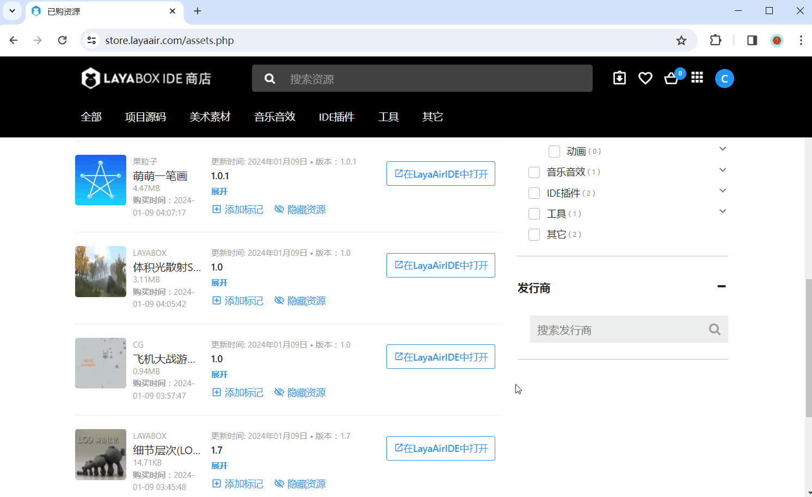

# 插件导入使用说明

> LayaAir3.1版本新增了资源商店，用户的LayaAir IDE最低版本需更新至**3.1**才能使用资源商店中的资源。

## 一、购买插件

### 1.1 入口

用户可以从以下入口进入资源商店：

1、3.1及以上版本的IDE内

（图1-1）

2、直接在浏览器里输入网址（https://store.layaair.com/）

（图1-2）

3、[官网](https://layaair.com/#/)的顶部导航

（图1-3）

### 1.2 插件分类

资源商店的插件总共分为以下几类：

1、项目源码类：用于完整的项目包。

（图1-4）

2、资源类：美术或音效等纯资源，无代码。

（图1-5）

3、基于IDE的插件系统：调用插件API，扩展IDE的开发能力。

（图1-6）

4、工具类：衔接外部工具，导入到IDE里使用，有助于IDE的集成化开发。

（图1-7）

5、其它项目相关的库资源或项目代码：例如第三方的物理引擎库、Shader代码等。

（图1-8）

> 注意：第一种项目源码类插件，**导入的方式与其它的不同**，第二节会进行详细说明。

### 1.3 购买

用户首先需要在资源商店首页进行账号注册，有手机号和微信两种登录方式。

（图1-9）

注册后就可以进行购买了。**需要注意的是，资源商店里的付费资源，在购买时，除非严重与描述不符合，否则不会退款**。所以建议付费资源在购买前，可以先与插件作者进行沟通确认。

购买资源时，首先点击`添加至我的资源`，

（图1-10）

购买后，点击`查看我的资源`，

（图1-11）

可以跳转到已购资源页面，购买的资源就都在这里了。

（图1-12）

## 二、导入使用

### 2.1 资源商店导入

#### 2.1.1 源码类插件导入

如果是导入像“飞机大战游戏源码”这样的项目源码类插件，

（图2-1）

点击在LayaAirIDE中打开，并在弹框中点击打开，

（动图2-2）

如果本地安装了LayaAirIDE的3.1及以上的版本，点击后就会打开IDE，在侧边栏的已购源码菜单中，有已经购买的飞机大战游戏源码。

（图2-3）

选择后点击下载模板，

（图2-4）

下载完成后点击创建项目，即可创建此游戏的工程项目。

（图2-5）

#### 2.1.2 普通插件导入

如果是其它类型的普通插件，例如“细节层次减面插件”，

（图2-6）

它是属于普通插件，点击在LayaAirIDE中打开后，要先在IDE中创建一个项目，

（动图2-7）

然后会提示导入资源。

（图2-8）

如果在资源商店点击前就已经有打开的LayaAir项目，则可以直接导入资源，导入后会直接打开插件面板。

（动图2-9）

#### 2.1.3 更新插件

另外要说明的一点是，如果商户对资源商店的资源进行了更新，用户需要在已购资源页面，手动更新资源。

以“LayaAIGC插件”为例，首先需要查看更新日志，然后在点击更新前，**建议开发者自行备份旧插件包**，最后点击更新按钮，并重新将插件导入到IDE即可完成更新。

（动图2-10）

### 2.2 本地导入插件

如果用户想要导入以前自己保存过的资源包，可以在IDE中，点击工具菜单栏下的导入资源包，注意资源包文件名后缀为`.layapkg`。

（图2-11）

如果用户将资源包存在了远端，可以选择从网络导入资源包，填写远端地址即可。

## 三、视频教程

用户还可以观看官方提供的视频教程，完成插件导入：[LayaAir3.1资源商店教程合集](https://www.bilibili.com/video/BV1oQ4y1E7j3/?share_source=copy_web&vd_source=f3dd357b10b2bb3c4e1be310439eb5cd)。

