# IDE的材质属性

为了将场景中的物体绘制出来，我们需要描述物体的形状与外表，我们使用mesh来表示物体的形状，使用材质来表示物体的外表。材质与着色器是紧密相连的，我们使用的材质必须设置对应的着色器形式。

# 1、材质的创建

我们可以在IDE的项目面板内创建材质，创建材质操作如动图1-1所示：

 

动图1-1

我们创建一个材质，并将其命名为"myMaterial"。

# 2、材质面板

创建完材质之后我们看到右侧的Inspector面板上会出现新的属性说明，当我们选中创建的材质后，属性面板便会显示当前材质的属性内容，属性面板主要由材质基础属性与材质效果展示两部分组成，如图2-1所示，我们详细说明下材质属性面板的组成。

 

图2-1

## 2.1 材质基础属性

材质是根据不同的着色器模型来描述不同表面的，IDE内置了八种着色器类型，我们根据着色器类型来说明每种着色器对应材质的基础属性，**切换材质的着色器是通过选择材质的Shader来实现的**，具体操作图动图2-1-1所示，来切换到其他类型的着色器。

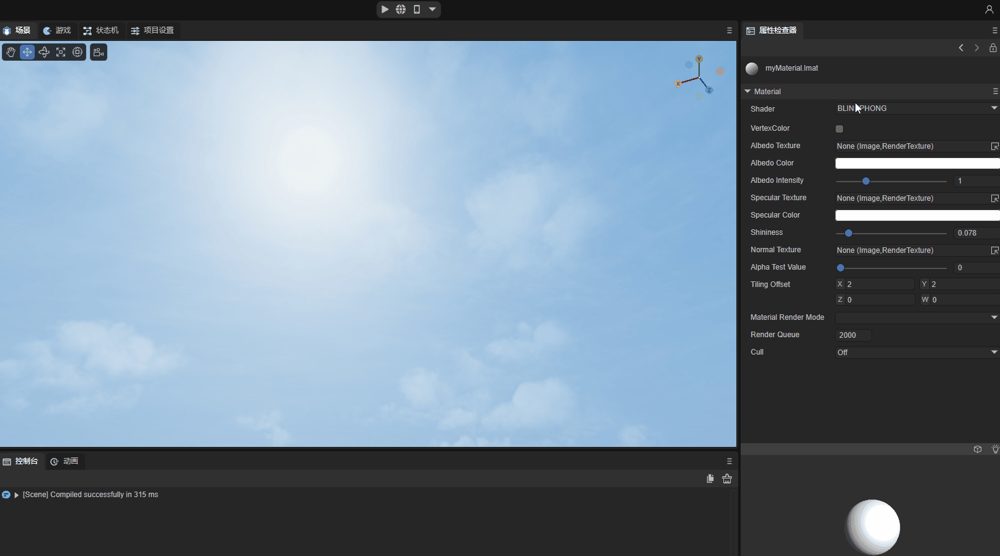 

动图2-1-1

### 2.1.1 BlinnPhong 着色器

Blinn-Phong光照模型能够简单描述物体表面对光的吸收与反射，使物体表面呈现不同的明暗程度，主要描述物体表面的高光、漫反射光与环境光部分。

#### （1） VertexColor顶点颜色

是否支持顶点颜色的宏定义开关，开启后可以叠加mesh的顶点颜色内容。

#### （2） AlbedoTexture漫反射贴图

可以设置材质的漫反射贴图的内容，示例使用一个砖块的贴图，效果如动图2-1-1-2-1所示：

 

动图2-1-1-2-1

#### （3） AlbedoColor漫反射颜色

可以设置材质的整体漫反射颜色，如动图2-1-1-3所示：

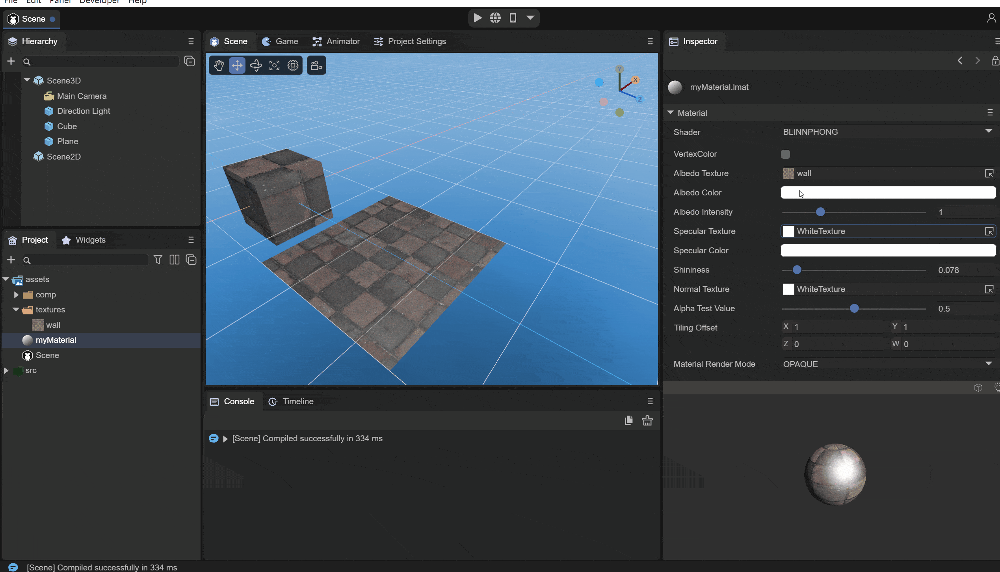 

动图2-1-1-3

#### （4） AlbedoIntensity

设置漫反射颜色的强度。

#### （5） SpecularTexture高光贴图

用来设置物体表面的高光镜面反射，根据物体当前顶点的uv在高光贴图上的rgb数值来反映物体当前顶点的光滑反射程度，如图2-1-1-5-1与图2-1-1-5-2所示：

 

图2-1-1-5-1

 

图2-1-1-5-2

在设置高光贴图前后，可以明显看到由于高光贴图的影响，只对墙壁的部分内容产生了高光效果，这样可以用来模拟不同的材质不同位置的高光现象。

#### （6） SpecularColor高光颜色

可以设置高光部分的颜色，如图2-1-1-6所示，将高光颜色设置为了绿色：

 

图2-1-1-6

#### （7） Shininess光泽度

用来设置高光的范围，效果如图2-1-1-7-1与2-1-1-7-2在不同的光泽度下的对比：

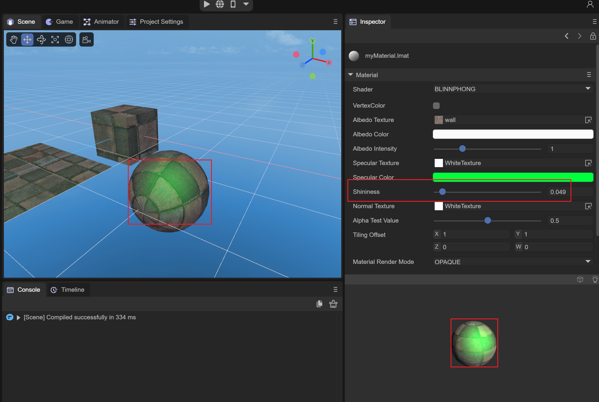 

图2-1-1-7-1

 

图2-1-1-7-2

在shininess值较小的时候，整体的高光范围较大；当shininess值较大的时候，整体的高光范围较小。

#### （8）NormalTexture法线贴图

用来设置物体模型在切线空间下的法线，用于光照的计算，**需要模型带有切线数据**。 如图2-1-1-8-1与图2-1-1-8-2所示，在法线贴图参与下的光照与着色更为真实。

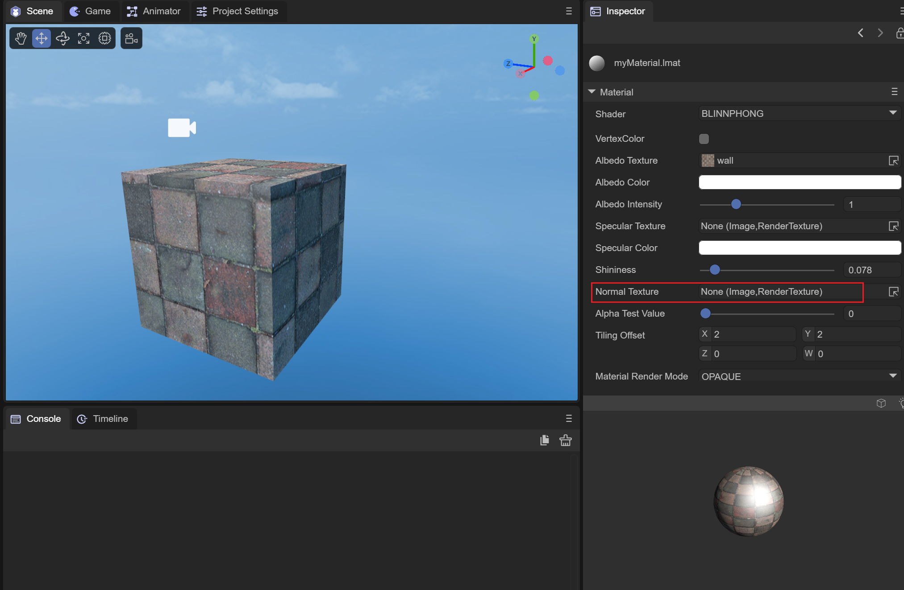 

图2-1-1-8-1

 

图2-1-1-8-2

可见在添加了法线贴图之后，光照重新进行了计算，物体的表面也有了凹凸感更为真实。

#### （9）AlphaTestValue alpha测试值

这个需要配合材质的渲染模式为CUTOUT来使用，在CUTOUT模式下，当前顶点的片元颜色值的alpha小于AlphaTestValue时，这个片元的值会被直接丢弃，不进行渲染，我们使用一张蛛网的图作为漫反射贴图，通过调整AlphaTestValue的值来查看这个值的效果。蛛网图如2-1-1-9-1所示，AlphaTestValue的值如动图2-1-1-9-2所示：

 

图2-1-1-9-1

镂空部分的alpha通道值为0

 

动图2-1-1-9-2

可以看到随着值的变大，舍弃的片元原来越多，直到所有的片元都被丢弃不渲染。

#### （10）TilingOffset缩放偏移

可以设置物体模型uv的缩放与偏移，来实现采样AlbedoTexture的不同效果，如动图2-1-1-10所示：

 

动图2-1-1-10

#### （11）MaterialRenderMode材质渲染模式

OPAQUE：不透明模式，遮挡在物体后面的模型不会渲染出来。

CUTOUT：剔除模式，会根据albedo贴图的alpha值与AlphaTestValue的值来舍弃部分片元。

TRANSPARENT：透明模式，会与后面的物体混合来透明效果。

ADDITIVE：叠加模式，会叠加物体后面的像素

ALPHABLENDED：与透明模式相同的混合方式，与透明模式的区别是不会混合场景中的雾。

#### （12）RenderQueue渲染队列

可以用来设置材质着色器的渲染队列，RenderQuere越大的话，其渲染越靠后。一般设置材质的渲染模式之后会根据渲染模式来设置渲染队列。

OPAQUE模式对应的队列为2000；

CUTOUT模式对应的队列为2450；

TRANSPARENT模式对应的队列为3000；

ADDITIVE模式对应的队列为3000；

ALPHABLENDED模式对应的队列为3000；

#### （13）Cull剔除模式

根据面顶点的不同连接顺序（顺时针或是逆时针）来进行剔除。

Off：关闭剔除

Back：剔除背面

Front：剔除前面

### 2.1.2 Unlit 着色器

Unlit着色器是不受光的材质，不会受到光照的影响，只靠材质的贴图与颜色来表现物体的表面效果。

#### （1）VertexColor顶点颜色

是否应用顶点颜色，开启此宏定义后会叠加模型顶点颜色。

#### （2）Texture贴图

设置用来描述物体描边颜色的贴图，如图2-1-2-2-1与图2-1-2-2-2所示，在设置贴图之后，物体表面根据uv来显示对应贴图部位的颜色，且能看到在场景中存在光的情况下，不会收到光照的影响。

 

图2-1-2-2-1

 

图2-1-2-2-2

#### （3）AlbedoColor漫反射颜色

同样AlbedoColor能够叠加颜色到物体表面，如图2-1-2-3-1所示，我们叠加一个红色到物体表面：

 

图2-1-2-3-1

#### （4）AlphaTestValue alpha测试值

这个同样也是需要在渲染模式为CUTOUT的模式下才生效，并配合使用，与Blinn-Phong着色器相同，也是通过判断当前顶点片元的alpha值与设置的AlphaTestValue的值大小，小于AlphaTestValue的值的都会被丢弃不进行渲染，我们还是使用上面Blinn-Phong着色器使用的蛛网贴图，来看下不同alphaTestValue的值的处理，如动图2-1-2-4-1所示：

 

动图2-1-2-4-1

可以看到**与Blinn-Phong不同的是Unlit的alpha值会叠加AlbedoColor.a的值，我们的AlbedoColor的alpha为1.0**，此时不会出现全部的片段都被丢弃的情况。

#### （5）TilingOffset缩放偏移

用来设置物体模型UV的缩放与偏移，与Blinn-Phong着色器的效果相同，如动图2-1-2-5-1所示：

 

动图2-1-2-5-1

#### （6）MaterialRenderMode 材质渲染模式

OPAQUE：不透明模式，遮挡在物体后面的模型不会渲染出来。

CUTOUT：剔除模式，会根据albedo贴图的alpha值与AlphaTestValue的值来舍弃部分片元。

TRANSPARENT：透明模式，会与后面的物体混合来透明效果。

ADDITIVE：叠加模式，会叠加物体后面的像素。

ALPHABLENDED：与透明模式相同的混合方式，与透明模式的区别是不会混合场景中的雾。

#### （7）RenderQueue 渲染队列

可以用来设置材质着色器的渲染队列，RenderQuere越大的话，其渲染越靠后。一般设置材质的渲染模式之后会根据渲染模式来设置渲染队列。

OPAQUE模式对应的队列为2000；

CUTOUT模式对应的队列为2450；

TRANSPARENT模式对应的队列为3000；

ADDITIVE模式对应的队列为3000；

ALPHABLENDED模式对应的队列为3000；

#### （8）Cull 剔除模式

根据面顶点的不同连接顺序（顺时针或是逆时针）来进行剔除。

Off：关闭剔除

Back：剔除背面

Front：剔除前面

#### 如何用unlit通过改设置，达到原来2.0引擎的effect材质效果

 将MaterialRenderMode 材质渲染模式改成 addtive 或者 blend 模式，不排除颜色空间的话效果是一样的，3.0的颜色空间已经变成linear了

### 2.1.3 PBR 着色器

PBR材质是一种基于物理的渲染材质，可以提供灯光与曲面交互方式的精确表示，可以更为真实的描述物体表面性质。我们使用基于图像照明(IBL)的光照模式来更好的展示PBR的属性，我们需要将场景的环境光来源从SolidColor转化成球谐，并点击下面的GenerateLighing生成一个IBL的立方体贴图CubeMap，如图2-1-3-1所示：

 

图2-1-3-1

#### （1）AlbedoTexture漫反射贴图

为了设置物体表面材质的整体纹理，同样使用上面的墙体作为贴图，如图2-1-3-1-1与图2-1-3-1-2所示，设置AlbedoTexture的效果：

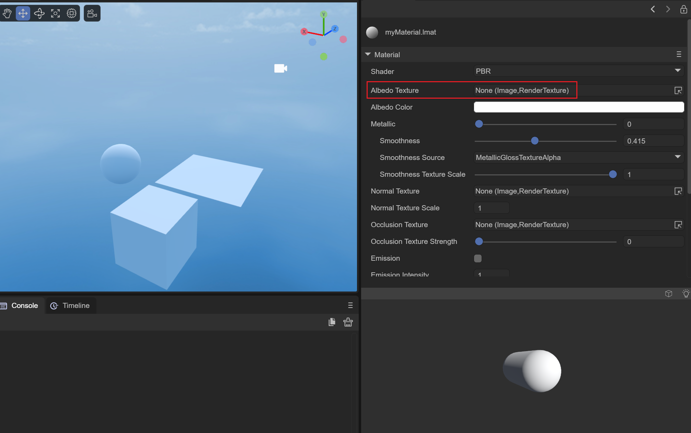  

图2-1-3-1-1

  

图2-1-3-1-2

#### （2）AlbedoColor漫反射颜色

可以叠加一个整体的颜色到物体的表面上，如图2-1-3-2-1所示我们叠加一个黄色到材质上：

 

图2-1-3-2-1

#### （3）Metallic金属度

用来设置物体的表面金属光泽度的效果，一般我们使用使用0与1来设置物体的金属度，完全没有或者完全存在，当金属度为1时，能够反射出周围环境的内容。想象下当我们看向一个表面光滑的金属球时，它会反射出我们的脸。这样在IDE内我们已经设置了基于IBL的球谐立方体贴图作为环境光，当我们将材质的金属度越来越接近1时，物体表面会反射出周围环境的内容，同时我们将光滑度设置为1，这样能够更清楚的看到效果，如动图2-1-3-3-1所示：

 

动图2-1-3-3-1

当我们调节材质的金属度向1滑动时，能够看到物体表面渐渐反射了周围环境的内容，当金属度为1时，能够完全反射周围的环境。

#### （4）Smoothness光滑度

用来设置物体表面的光滑度，光滑度为0时，物体表面的漫反射明显，高光不足，光滑度为1时，高光部分更为明显。如动图2-1-3-4-1所示：

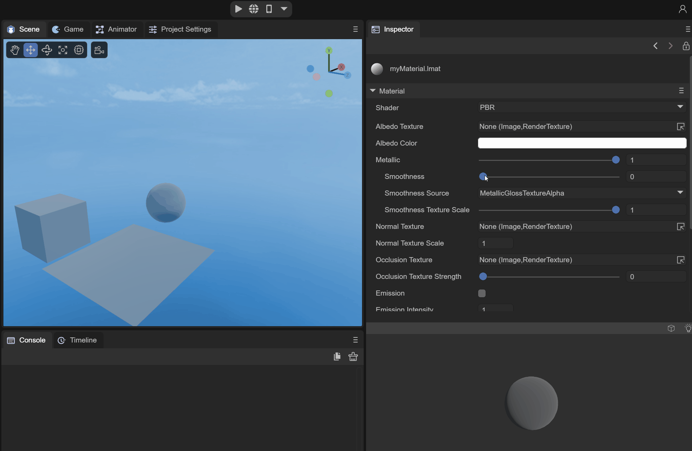 

动图2-1-3-4-1

#### （5）SmoothnessSource光滑度来源

可以设置两个光滑度来源，分别从AlbedoTexture的alpha通道去获取、从MetallicGloassTexture的alpha通道去获取。实际上是将物体表面材质的光滑度映射到AlbedoTexture贴图的alpha通道、或者映射到MetallicGloass贴图的alpha通道上，这样可以根据物体每个顶点的光滑度来进行光照计算。

AlbedoTextureAlpha：从Albedo贴图的alpha通道来获取物体的表面光滑度。

MetallicGloassTextureAlpha：从MetallicGloass贴图的alpha通道来获取物体的表面光滑度。

#### （6）SmoothnessTextureScale光滑度贴图缩放值

当设置了从贴图的alpha通道来获取光滑度值时，可以通过设置这个缩放值来控制贴图alpha通道下的整体光滑值。我们设置光滑度来源为albedoTexture的alpha值，并使用上面的蛛网贴图作为albedo贴图，如动图2-1-3-6-1所示：

 

动图2-1-3-6-1

#### （7）NormalTexture法线贴图

设置物体的法线贴图，会根据物体法线贴图来计算光照，如图2-1-3-7-1与图2-1-3-7-2所示，设置法线贴图后，光照的高光部分与漫反射部分重新计算了：

 

图2-1-3-7-1

 

图2-1-3-7-2

#### （8）OcclusionTexture遮蔽贴图

通过采样Occlusion贴图的g通道，可以设置模型顶点的AO环境光遮蔽的值，这样在进行PBR的光照计算时，能够更为真实的模拟在细小接缝等位置的光照数值。

#### （9）OcclusionTextureStrength遮蔽贴图强度

用来调整遮蔽贴图的强度。强度为0时，整体的遮蔽值为1；强度为1时，采用遮蔽贴图的遮蔽值。

#### （10）Emission自发光

用来设置模型的自发光是否开启，再开启后会新增两个自发光的参数，分别是EmissionColor与EmissionTexture；

##### EmissionColor自发光颜色

叠加的整体的自发光颜色，在漫反射部分会更为明显，如图2-1-3-10-1所示，叠加一个红色的自发光颜色：

 

图2-1-3-10-1

##### EmissionTexture自发光贴图

设置自发光贴图可以根据模型来对不同的顶点位置叠加上面设置的自发光颜色，如图2-1-3-10-2所示：

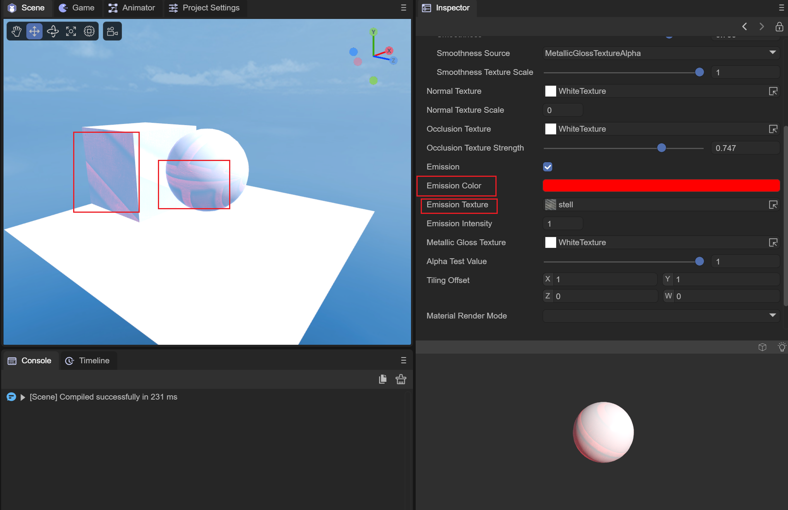 

图2-1-3-10-2

#### （11）EmissionIntensity自发光强度

设置自发光颜色的强度，强度为0没有自发光效果；强度为1时叠加设置的自发光颜色。

#### （12）MetallicGlossTexture金属光滑贴图

可以设置存放物体表面材质金属度与光滑度的贴图，贴图的r通道存放模型材质的金属度信息，贴图的a通道存放模型材质的光滑度信息，下面我们使用一张纯黑与纯白的贴图来展示金属光滑度贴图对PBR材质的影响，如图2-1-3-12-1与图2-1-3-12-2所示：

 

图2-1-3-12-1

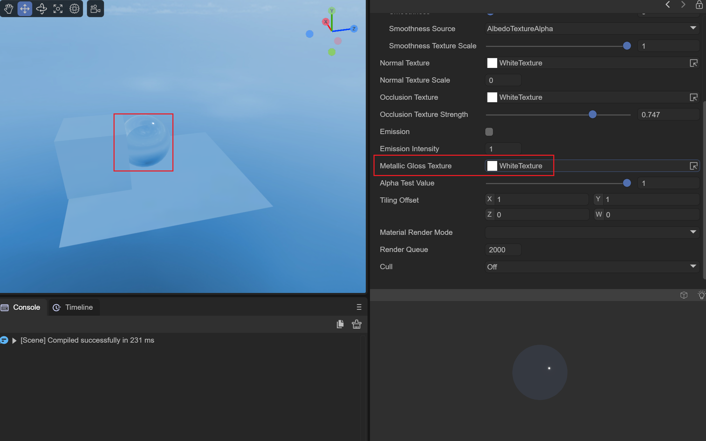 

图2-1-3-12-2

图2-1-3-12-1中纯黑图的金属度与光滑度为0，基本只有立方体贴图的漫反射效果，图2-1-3-12-2中纯白图的金属度与光滑度为1，能够很好的反射周围的立体环境光内容。

#### （13）AlphaTestValue alpha测试值

同样是需要配合渲染模式为CUTOUT模式来使用，会根据AlbedoTexture与AlbedoColor的alpha叠加值来进行测试，小于AlphaTestValue值得片元会丢弃不进行渲染。

#### （14）TilingOffset

与Blinn-Phong和Unlit的效果相同，可以用来设置模型uv缩放与偏移值，实现对Albedo贴图不同位置的采样。

#### （15）MaterialRenderMode材质渲染模式

OPAQUE：不透明模式，遮挡在物体后面的模型不会渲染出来。

CUTOUT：剔除模式，会根据albedo贴图的alpha值与AlphaTestValue的值来舍弃部分片元。

TRANSPARENT：透明模式，会与后面的物体混合来透明效果。

ADDITIVE：叠加模式，会叠加物体后面的像素

ALPHABLENDED：与透明模式相同的混合方式，与透明模式的区别是不会混合场景中的雾。

#### （16）RenderQueue渲染队列

可以用来设置材质着色器的渲染队列，RenderQuere越大的话，其渲染越靠后。一般设置材质的渲染模式之后会根据渲染模式来设置渲染队列。

OPAQUE模式对应的队列为2000；

CUTOUT模式对应的队列为2450；

TRANSPARENT模式对应的队列为3000；

ADDITIVE模式对应的队列为3000；

ALPHABLENDED模式对应的队列为3000；

#### （17）Cull剔除模式

根据面顶点的不同连接顺序（顺时针或是逆时针）来进行剔除。

Off：关闭剔除

Back：剔除背面

Front：剔除前面

### 2.1.4 Particle 着色器

粒子着色器用来设置粒子的表面显示，主要用于粒子特效中。我们需要在场景中创建一个粒子系统，如动图2-1-4-1所示：

 

动图2-1-4-1

同时需要将材质赋值给粒子系统，如动图2-1-4-2所示：

 

动图2-1-4-2

这样就将材质赋值给粒子系统来使用了，下面简单说下各个参数的作用。

#### （1）Color粒子颜色

用来设置粒子材质的颜色，如图2-1-4-1-1所示，我们设置为红色的粒子颜色，粒子系统此时发出的粒子变为红色：

 

图2-1-4-1-1

#### （2）Texture贴图

用来设置粒子的纹理样式，如图2-1-4-2-1所示：

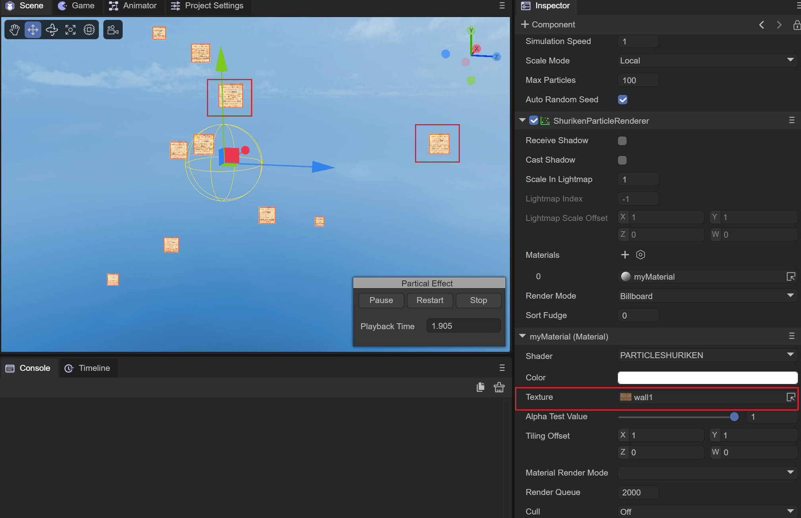 

图2-1-4-2-1

#### （3）AlphaTestValue alpha测试值

粒子着色器上的CUTOUT模式无效，alpha测试值不用设置。

#### （4）TilingOffset

与Blinn-Phong和Unlit得效果相同，可以用来设置模型得uv缩放与偏移值，实现对Albedo贴图不同效果的采样。

#### （5）MaterialRenderMode材质渲染模式

OPAQUE：不透明模式，遮挡在物体后面的模型不会渲染出来。

CUTOUT：粒子着色器下无效。

TRANSPARENT：透明模式，会与后面的物体混合来透明效果。

ADDITIVE：叠加模式，会叠加物体后面的像素

ALPHABLENDED：与透明模式相同的混合方式，与透明模式的区别是不会混合场景中的雾。

#### （6）RenderQueue渲染队列

可以用来设置材质着色器的渲染队列，RenderQuere越大的话，其渲染越靠后。一般设置材质的渲染模式之后会根据渲染模式来设置渲染队列。

OPAQUE模式对应的队列为2000；

CUTOUT模式对应的队列为2450；

TRANSPARENT模式对应的队列为3000；

ADDITIVE模式对应的队列为3000；

ALPHABLENDED模式对应的队列为3000；

#### （7）Cull剔除模式

根据面顶点的不同连接顺序（顺时针或是逆时针）来进行剔除。

Off：关闭剔除

Back：剔除背面

Front：剔除前面

### 2.1.5 Trail着色器

Trail着色器用来实现拖尾的效果，我们需要拖尾特效对象来对应实现，在场景中创建一个拖尾特效对象入动图2-1-5-1所示：

 

动图2-1-5-1

我们给拖尾特效对象添加对应的材质如动图2-1-5-2所示，将myMaterial材质添加到拖尾特效对象上：

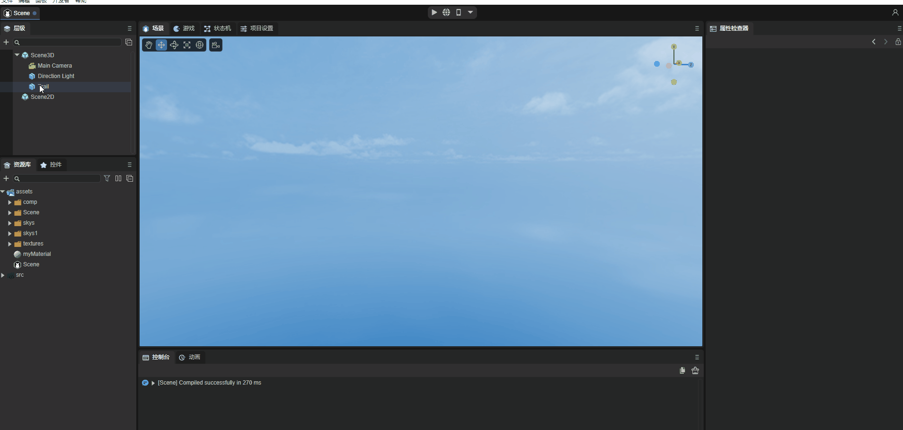 

动图2-1-5-2

**为了查看拖尾的效果，我们需要移动拖尾特效对象，为此我们添加一个Move脚本，使得特效对象能够沿着x轴进行移动。**

#### （1）Color颜色

用来设置拖尾的颜色，如动图2-1-5-1-1所示，我们设置一个红色作为拖尾颜色：

 

动图2-1-5-1-1

#### （2）Texture贴图

用来设置拖尾的形状，如动图2-1-5-2-2中，我们添加一个图2-1-5-2-1作为贴图使用，拖尾着色器使用ADDITIVE模式实现透明叠加的效果：

 

图2-1-5-2-1

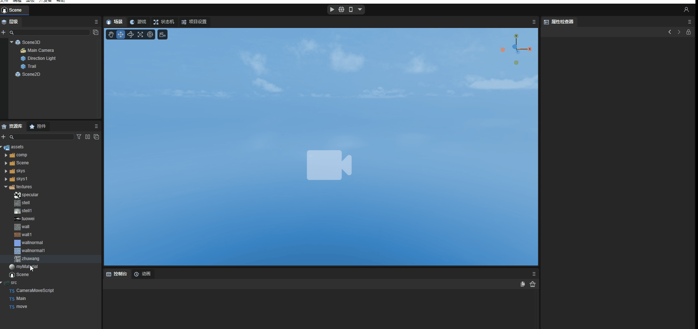 

动图2-1-5-2-2

#### （3）AlphaTestValue alphaTest值

拖尾着色器只使用ADDITIVE与ALPHABLENDED模式，这个值在这里无效。

#### （4）TilingOffset缩放偏移

可以用来设置贴图采样时UV的缩放与偏移，实现贴图缩放与偏移的效果。

#### （5）MaterialRenderMode材质渲染模式

拖尾着色器只使用ADDITIVE与ALPHABLENDED模式：

ADDITIVE：透明叠加模式，叠加后面像素的全部alpha值，实现透明效果。

ALPHABLENDED：与透明模式相同的混合方式，与透明模式的区别是不会混合场景中的雾，这个模式不会产生ADDITIVE的透明效果。

#### （6）RenderQueue渲染队列

可以用来设置材质着色器的渲染队列，RenderQuere越大的话，其渲染越靠后。一般设置材质的渲染模式之后会根据渲染模式来设置渲染队列。

OPAQUE模式对应的队列为2000；

CUTOUT模式对应的队列为2450；

TRANSPARENT模式对应的队列为3000；

ADDITIVE模式对应的队列为3000；

ALPHABLENDED模式对应的队列为3000；

拖尾着色器只使用ADDITIVE与ALPHABLENDED模式，这里设置为3000。

#### （7）Cull剔除模式

根据面顶点的不同连接顺序（顺时针或是逆时针）来进行剔除。

Off：关闭剔除

Back：剔除背面

Front：剔除前面

### 2.1.6 SkyBox着色器

天空盒着色器用来设置场景的天空盒样式，天空盒需要一个立方体贴图来进行采样，我们首先需要新建一个立方体贴图，并根据天空盒的上下左右前后面来设置贴图，如动图2-1-6-1所示：

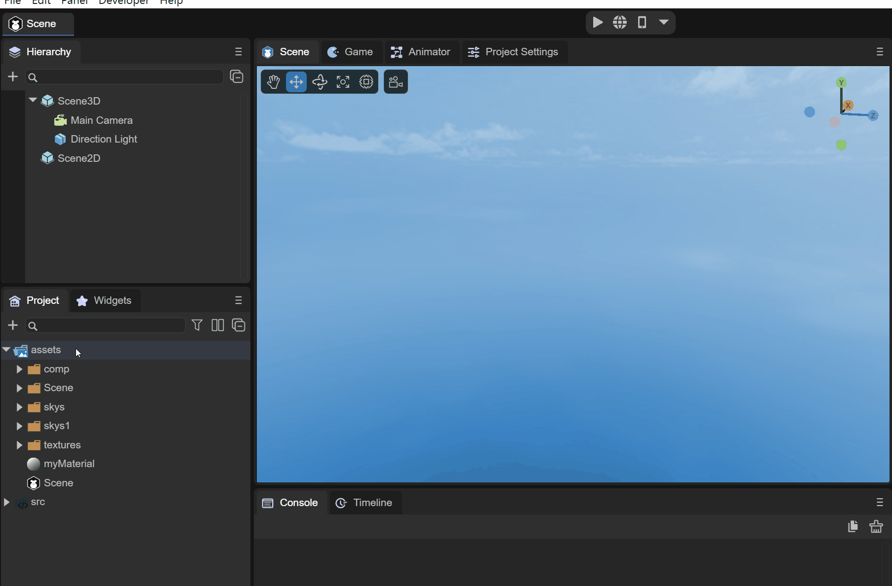 

动图2-1-6-1

设置天空盒需要修改Scene3D的天空盒材质，如动图2-1-6-2所示：

 

动图2-1-6-2

#### （1）TintColor颜色

叠加颜色到天空盒上，如图2-1-6-1-1所示，设置一个淡红色，使整个天空发红：

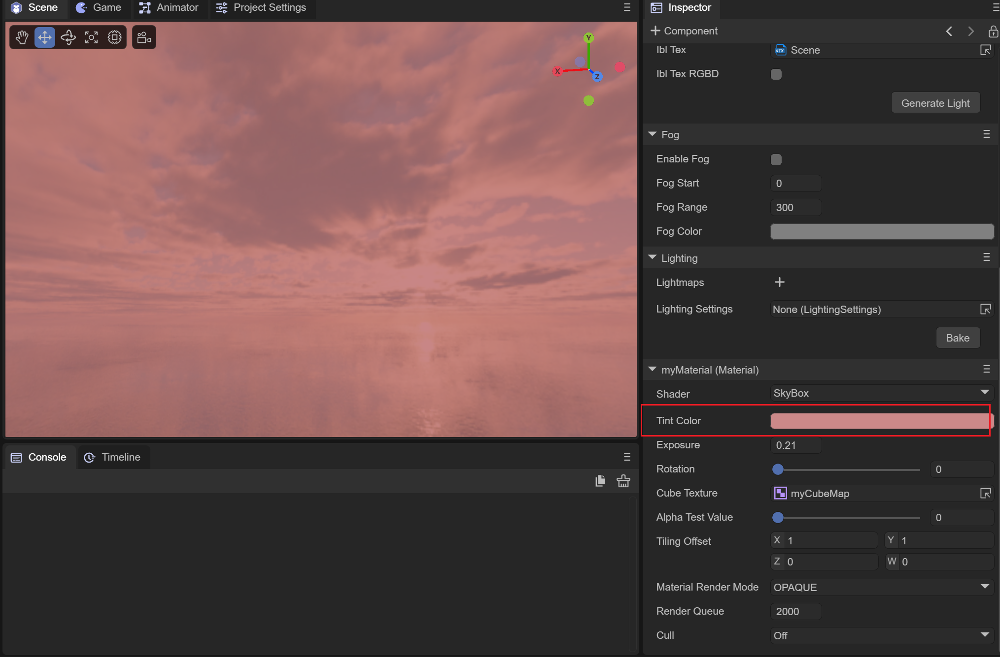 

图2-1-6-1-1

#### （2）Exposure曝光度

用来设置天空盒的曝光度，当曝光为0时，天空盒为黑色；随着曝光值的增大，逐渐显示正常的立方体贴图颜色，随后会由于过曝导致天空盒全变为白色。如动图2-1-6-2-1所示：

 

动图2-1-6-2-1

#### （3）Rotation旋转

可以将立方体贴图绕着y轴旋转0~360度。

#### （4）CubeTexture球状贴图

用来设置天空盒的采样贴图，需要使用CubeMap类型的立方体贴图。

#### （5）AlphaTestValue alpha测试值

这个值在天空盒着色器上，切换到CUTOUT模式下不生效。

#### （6）TilingOffset

由于使用的是立方体贴图，这个值在天空盒着色器上不生效。

#### （7）MaterialRenderMode材质渲染模式

在天空盒着色器上，设置为CUTOUT、TRANSPARENT、ADDITIVE、ALPHABLENED模式均不生效。

#### （8）RenderQueue渲染队列

可以用来设置材质着色器的渲染队列，RenderQuere越大的话，其渲染越靠后。一般设置材质的渲染模式之后会根据渲染模式来设置渲染队列。

OPAQUE模式对应的队列为2000；

CUTOUT模式对应的队列为2450；

TRANSPARENT模式对应的队列为3000；

ADDITIVE模式对应的队列为3000；

ALPHABLENDED模式对应的队列为3000；

这里由于天空盒材质的渲染模式只在OPAQUE模式下生效，设置2000即可。

#### （9）Cull剔除模式

根据面顶点的不同连接顺序（顺时针或是逆时针）来进行剔除。

Off：关闭剔除

Back：剔除背面

Front：剔除前面

### 2.1.7 SkyPanoamic 着色器

天空盒全景贴图着色器，这里使用的是一张2D的全景贴图来以立方体贴图的方式包裹场景实现环境光效果，这个材质的使用与天空盒相同，直接赋值给3D场景的天空盒渲染器即可。

#### （1）TintColor颜色

与天空盒着色器功能相同，都是叠加一个颜色到全景图天空盒上。

#### （2）Rotation旋转

可以设置天空盒绕Y轴旋转的角度，在0~360之间。

#### （3）PanoramicTexture全景贴图

全景贴图需要一个使用经纬度的、圆柱形样式的2D贴图。

#### （4）AlphaTestValue alpha测试值

在全景天空盒着色器上由于只有OPAQUE模式生效，所以这个值在CUTOUT模式下无效。

#### （5）TilingOffset

由于使用的是2D贴图来实现立方体贴图的方式，这个值无效。

#### （6）MaterialRenderMode材质渲染模式

在全景图天空盒模式下只有OPAQUE模式生效。

#### （7）RenderQueue渲染队列

可以用来设置材质着色器的渲染队列，RenderQuere越大的话，其渲染越靠后。一般设置材质的渲染模式之后会根据渲染模式来设置渲染队列。

OPAQUE模式对应的队列为2000；

CUTOUT模式对应的队列为2450；

TRANSPARENT模式对应的队列为3000；

ADDITIVE模式对应的队列为3000；

ALPHABLENDED模式对应的队列为3000；

由于只有OPAQUE模式生效，这里设置为2000；

#### （8）Cull剔除模式

根据面顶点的不同连接顺序（顺时针或是逆时针）来进行剔除。

Off：关闭剔除

Back：剔除背面

Front：剔除前面

### 2.1.8 SkyProcedural 着色器

程序化天空盒，通过设置太阳的参数来模拟天空。

#### （1）U_SunSize 太阳大小

太阳的圆盘大小设置，如图2-1-8-1-1所示，设置太阳大小为0.1：

 

图2-1-8-1-1

#### （2）Sun太阳类型

用来设置程序化天空盒的太阳类型，有如下三种类型：

##### SUN_NONE

没有太阳，选择此模式后，天空盒上没有太阳显示。

##### SUN_HIGH_QUALITY

高品质太阳模拟，这个模式下，太阳光的发散与收敛可以进行调节。

##### SUN_SIMPLE

简单的太阳模拟，只能调整太阳的整体大小。

#### （3）U_SunSizeConvergence太阳大小收敛

太阳的大小收敛，值越小，整体的太阳圆盘越大，只在SUN_HIGH_QUALITY的模式下生效。如动图2-1-8-3-1所示：

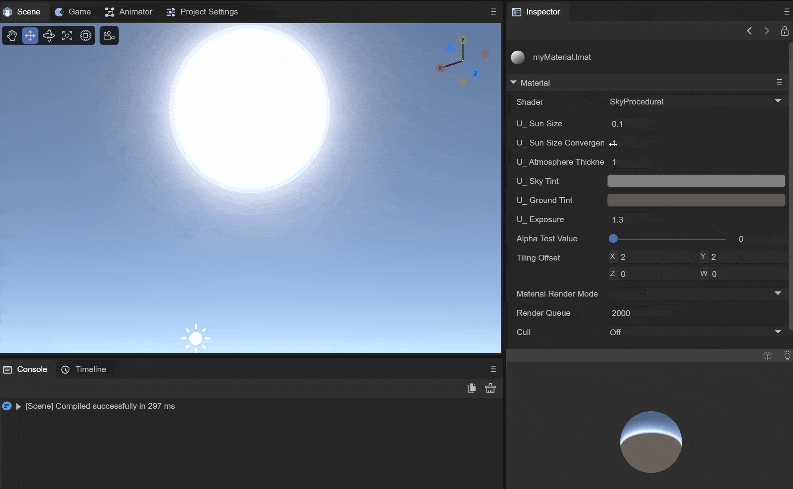 

动图2-1-8-3-1

#### （4）U_AtmosphereThickness大气层厚度

大气层的密度，更高密度的大气会吸收更多的颜色，如图2-1-8-4-1在密度为1时，与图2-1-8-4-2在密度为2时所示：

 

图2-1-8-4-1

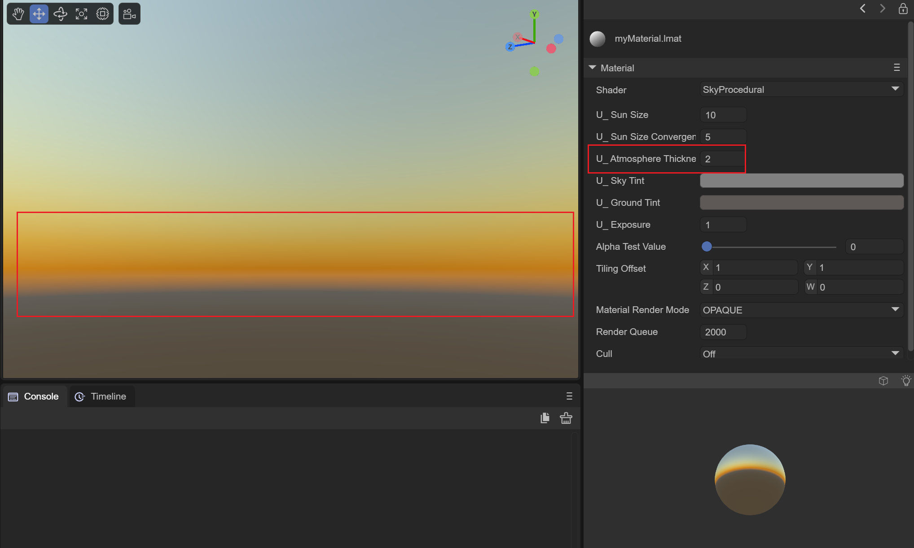 

图2-1-8-4-2

#### （5）U_SkyTint天空颜色

设置地平线以上天空的颜色。

#### （6）U_GroundTint地面颜色

设置地平线以下地面的颜色。

#### （7）U_Exposure曝光

通过曝光值来设置天空盒的明暗，如动图2-1-8-7-1所示：

 

动图2-1-8-7-1

#### （8）AlphaTestValue alpha测试值

由于程序化天空盒只使用OPAQUE，所以此值无效。

#### （9）TilingOffset

由于程序化天空并没有贴图，所以此值也无效。

#### （10）MaterialRenderMode材质渲染模式

只在OPAQUE模式下生效。

#### （11）RenderQueue渲染队列

可以用来设置材质着色器的渲染队列，RenderQuere越大的话，其渲染越靠后。一般设置材质的渲染模式之后会根据渲染模式来设置渲染队列。

OPAQUE模式对应的队列为2000；

CUTOUT模式对应的队列为2450；

TRANSPARENT模式对应的队列为3000；

ADDITIVE模式对应的队列为3000；

ALPHABLENDED模式对应的队列为3000；

由于程序化天空盒只在OPAQUE模式下生效，设置为2000.

#### （12）Cull剔除模式

根据面顶点的不同连接顺序（顺时针或是逆时针）来进行剔除。

Off：关闭剔除

Back：剔除背面

Front：剔除前面

## 2.2 材质效果展示

材质效果展示主要用来显示设置属性后的材质效果，可以使用鼠标在此处进行交互来操作材质球不同方向上的效果。

### 2.2.1 切换不同mesh的材质

可以通过点击右侧的方块键来切换不同mesh下材质的效果，如动图2-2-1所示：

 

动图2-2-1

### 2.2.2 关闭灯光效果

可以通过点击右侧的灯泡按键来切换材质在受光与不受光的效果，如动图2-2-2所示：

 

动图2-2-2

# 3、材质的使用

当我们调整材质的属性为我们想要的效果之后，就可以将材质赋值给场景中的物体，设置物体的材质有两种方法可以使用，分别是下列动图3-1与动图3-2所示：

 

动图3-1

上面动图3-1可以直接将材质拖拽到Scene窗口内的物体上，或者也可以按照动图3-2所示，在对应物体的渲染器上选择相应的材质。

 

动图3-2

