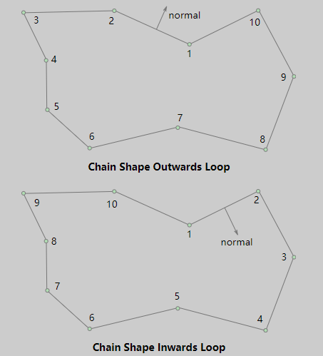
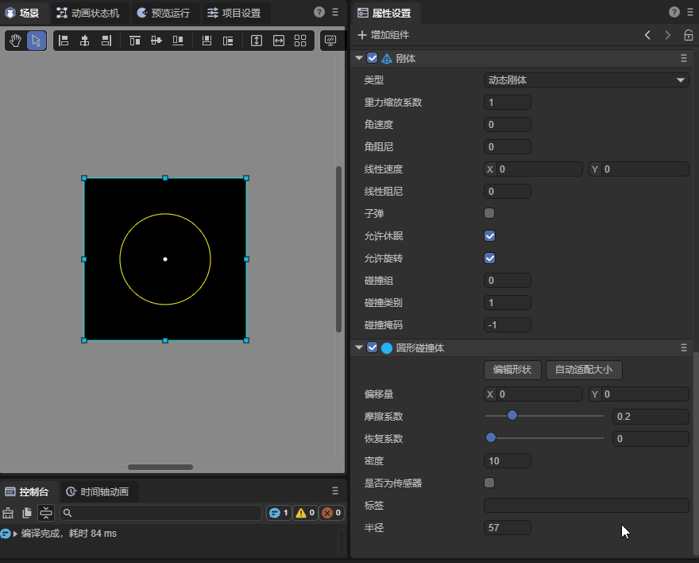
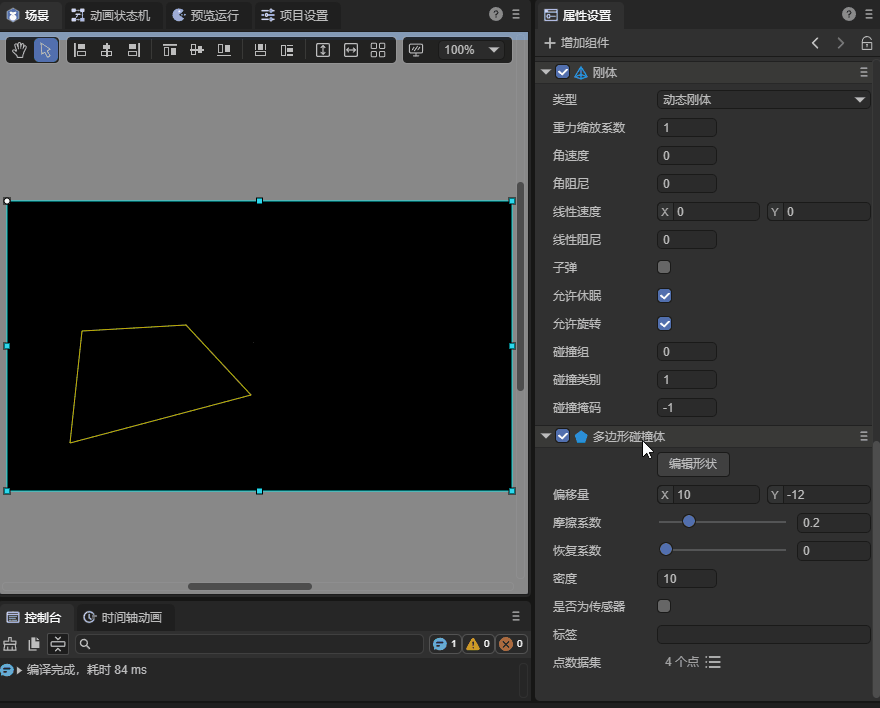
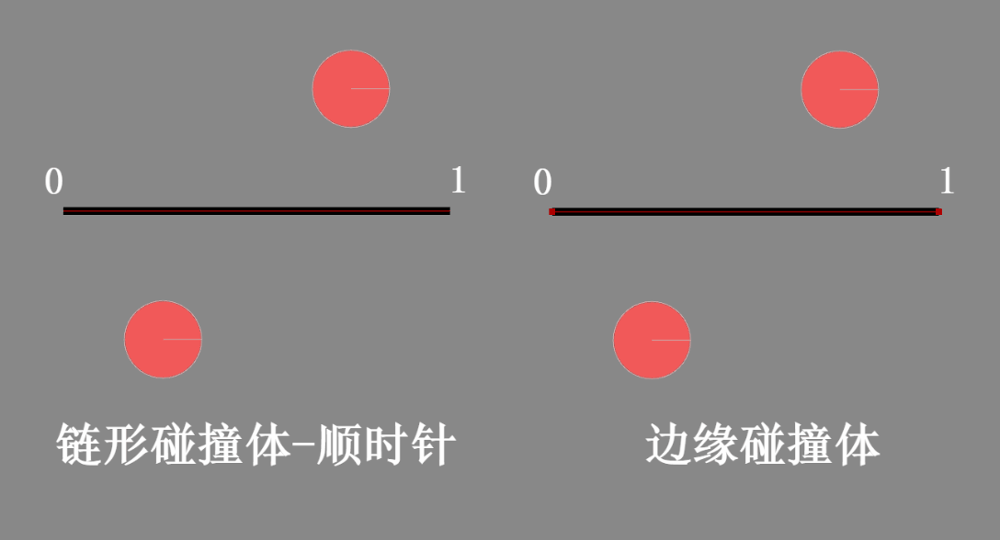

## LayaAirIDE的可视化2D物理编辑入门


## 一、基础知识

### 1.1 学习本文需要的前置知识

##### 物理学基础概念相关

本篇不可避免的会涉及一些物理学相关的基础概念，文中会尽可能简要说明，让大家理解作用与效果。但如果涉及到某块基础概念不理解，或者想进一步深入理解，需根据关键字自行搜索补习相关的基础知识。本篇重点在于介绍引擎中相关属性的作用与如何使用，为了文档的连贯性，对于过于基础的概念，可能不会太详细的进行描述。

### 1.2 LayaAir内置的物理引擎

LayaAir引擎在1.x的时候内置的是Matter.js物理引擎，核心原因是小巧轻便。但随着微信小游戏产业的兴起，以及物理小游戏的火爆，带动一阵物理小游戏的热潮，因此，对于物理游戏的需求也越来越多。从精度、圆形支持、防穿透等方面，Matter.js已经不能满足。于是在LayaAir 2.0引擎开始，选择了更加成熟和应用最广泛的Box2D作为LayaAir引擎内置的2D物理引擎，并且整合到LayaAirIDE中，可以通过LayaAirIDE可视化编辑物理游戏。让物理游戏开发起来更加轻松。

> 如果对于物理引擎功能需求较为简单，并且希望能减小引擎体积的情况下，LayaAir引擎仍然可以结合使用Matter物理引擎。 但不在本篇范围内，本篇全面介绍LayaAirIDE中的2D物理引擎组件。

## 二、物理引擎基础

要了解物理引擎的基础，必须要先充分的理解刚体、碰撞体、关节。

### 2.1 **刚体 `RigidBody`**

Box2D可以说是一个用于游戏的2D刚体仿真库。所以，刚体是我们需要首先理解的概念。

#### 2.1.1 什么是刚体

大家都知道，自然界一切有形体的物质，都可以叫物体。刚体是力学中为了体现物体特性的一种科学抽象概念，也是一种理想状态的力学表达模型，**是指在运动中和受到力的作用后，形状和大小不变，而且内部各点的相对位置不变的物体。**

然而，现实中不可能存在这种理想模型，物体在受力之后，会根据力、材料、弹性、 塑性等综合因素，决定是否改变或改变多少。 如果物体本身的变化不影响整个运动过程，为使被研究的问题简化，仍将该物体当作刚体来处理而忽略物体的体积和形状，这样所得结果仍与实际情况相当符合。

#### 2.1.2 刚体组件属性说明

LayaAir引擎中的2D刚体组件类是 `Laya.RigidBody` ，继承自创建组件的基类 Component。在LayaAirIDE中，我们可以直接为UI组件添加刚体组件。如下图1所示。

  

(图1)

##### 刚体类型 `type`

基于理论力学的理论基础，box2D物理引擎的刚体类型(type)分为：静力学类型`static`、动力学类型`dynamic`、运动学类型`kinematic`，IDE里默认为`dynamic`。 如图2-1所示。

 

(图2-1)

###### 静力学类型：`static`

静力学，它主要研究力系的平衡条件，力系的简化，物体受力分析的基本方法。

静力学`static`类型的刚体就是**始终静止不动**，无论施加怎样的力都不会移动， **不受重力影响**，**速度为零且不可设置** 。

> 在LayaAirIDE中创建的2D示例项目中，永远不会移动的地板，就是使用的static类型刚体。

###### 动力学类型：`dynamic`

动力学，它主要研究作用于物体的力与物体运动的关系。

动力学`dynamic`类型的刚体**会根据受到的力进行移动**， **会受到重力的影响，可设置速度。**

> 在LayaAirIDE中创建的2D示例项目中，受重力影响而不断掉落的方块盒子，使用的就是dynamic类型刚体。

###### 运动学类型：`kinematic`

运动学，它是运用几何学的方法来研究物体的运动，不考虑力和质量等因素的影响。重点研究物体的轨迹、位移、速度、加速度等运动特性。至于物体的运动和力的关系，则是动力学的研究课题。

运动学`kinematic`类型的刚体**不会根据受到的力进行移动**，**不受重力影响，可设置速度。**与静力学类型的刚体主要区别就是，通常会通过设置速度（线速度和角速度）使其移动。

> 在LayaAirIDE中创建的2D示例项目中，向上撞击或击碎方块盒子的圆形子弹，使用的就是kinematic类型刚体。

##### 重力缩放系数 `gravityScale`

 

（图2-2）

设置为0为没有重力

自然界中物体受地心吸引的作用而受到的力叫重力，物理引擎中也同样模拟了重力，并可以设置参数对其改变。

刚体的gravityScale属性是重力缩放系数，通过调整数值可以改变重力大小，数值可以为正数或负数，也包括了正负小数。默认值为1，即正常重力，IDE中如上图2-2所示。如果数值为0则表示没有重力。大于1的数值表示正常重力的倍数，数值越大则重力越大。gravityScale属性数值为负数，则表示反方向重力，数值越小则反方向的重力越大。

##### 角速度 `angularVelocity`

 

（图2-3）

刚体的angularVelocity属性是角速度， 角速度简单理解就是单位时间的角位移，以弧度每秒进行旋转 。当我们设置angularVelocity属性为正值的时候，则按顺时针旋转位移。angularVelocity属性为负值的时候，则按逆时针旋转位移。属性值的绝对值越大，旋转位移速度越快。angulaVelocity属性的默认值为0，如图2-3所示，此时不会产生旋转位移。

##### 角阻尼 `angularDampin`

 

（图2-4）

阻尼是外界作用或自身原因引起逐渐下降的衰减特性，刚体的角阻尼则是相对于角速度的旋转阻尼系数，使得旋转速度衰减。默认值为0，表示没有阻尼，如图2-4。通常阻尼的值在0到0.1之间。

##### 线性速度 `linearVelocity`

 

（图2-5）

刚体的linearVelocity属性称为线速度或者线性速度，是指物体的直线运动速度，如果物体呈曲线运动，就是沿着曲线路径切线方向的单位时间即时速度。

线速度是一个矢量值，它是描述作曲线运动的质点运动快慢和方向的物理量，既有大小也有方向。

在LayaAirIDE里，linearVelocity属性值，为`x,y`坐标方向的速度值，例如图2-5中示例的`10,10`，表示x坐标（向右）速度为10，y坐标（向下）速度为10。坐标值可以为负值，坐标值的绝对值越大，速度越快。

> 在理解角速度与线速度的关系上，假如我们围绕一个原点画一条曲线，那这个曲线从起始到结束的角度除以单位时间就是角速度，这个曲线的长度除以单位时间，就是线速度。

##### 线性阻尼 `linearDamping`

 

（图2-6）

刚体的linearDamping属性，是指线性速度的阻尼系数，使得线性速度衰减。范围从0到无穷大。默认值为0，表示没有阻尼，如图2-6。通常阻尼的值应该在0到0.1之间。

##### 子弹 `bullet`

 

（图2-7）

在有些情况下，物理引擎可能会捕捉不到某些已经发生的碰撞，导致互相穿透卡在一起。

刚体的bullet属性，中文是子弹，形容射出的子弹那样高速移动的物体，bullet属性用于防止高速穿透。

bullet默认值为false，如图2-7，此时不对刚体作防穿透处理（连续碰撞检测），会节省性能。当设置为true时，会通过连续碰撞检测防止高速穿透。

##### 允许休眠 `allowSleep`

 

（图2-8）

物理引擎进行模拟时，是存在性能消耗的。当刚体停止运动时，其实我们可以不去模拟它。刚体设置为休眠状态就会跳过该刚体的模拟，直到被其它刚体解除才会醒来（关节被破坏或者手动唤醒也可以），从而节省性能的消耗。

刚体的allowSleep属性，中文是允许休眠，默认值为ture，如图2-8所示。如果想保持一直醒着的状态，设置为false可以关闭允许休眠。

##### 允许旋转 `allowRotation`

 

（图2-9）

刚体的allowRotation属性，中文是允许旋转，实际理解还是与字面意思有些差异。这里是可以控制刚体碰撞时角度是否发生旋转改变。默认值为true，如图2-9所示。表示允许刚体发生碰撞时模拟自然撞击的角度改变，看起来更加自然。当设置为false，碰撞后不会产生角度变化。

比如，一把受重力自由下落的尖刀，是希望碰到地板后，最终平躺在地板上。还是始终保持尖刀竖立的状态，可以通过allowRotation属性来控制。

##### 碰撞组 `group`

 

（图2-10）

group属性可以设置当前刚体所属的碰撞组。默认值为0，如图2-10。

碰撞组规则如下：

1、如果两个对象的刚体group相等且group值大于零，它们将始终会发生碰撞。

2、如果两个对象的刚体group相等且group值小于零，它们将永远不会发生碰撞。

3、如果两个对象的刚体group值等于0或者group值不相等，则使用刚体的碰撞类别category和碰撞掩码mask来判断是否碰撞。

##### 碰撞类别 `category`

 

（图2-11）

category属性表示碰撞类别，与碰撞组group关联使用，默认值为1（2的0次方），如图2-11所示。

当两个对象的碰撞组（group）值等于0或者值不相等时，使用2的幂次方值来指定碰撞类别。此属性接收位字段，范围为[1,2^31]内2的幂，共有32种不同的碰撞类别可用。

> 按2的幂设置值不是强制规定，不按这个规则取值，不会引发报错，但是需要提前用mask值与category以按位与进行检查，否则简单的按category求和法来设置可能会导致结果出错。

##### 碰撞掩码 `mask`

 

（图2-12）

mask属性表示碰撞掩码，默认值为-1，如图2-12所示。

如果说category是用于设置碰撞组的类别ID，那碰撞掩码mask就是用于指定要和哪个category类别ID的对象进行碰撞。用以实现碰撞过滤。

关于如何设置mask的值，需要用到位运算的知识，可以通过**按位或**运算和**异或**运算得到指定的值。

通常，我们采用按位或的运算比较多，例如，想与刚体category属性值分别为1、2、8、4的四个物体对象发生碰撞。那我们就要把要碰撞的对象刚体mask属性设置为15（也就是1|2|8|4的位运算结果）。为了简化理解成本，我们也可以把这个二进制的按位或运算，按照表象特点，理解为十进制的求和运算（1+2+8+4），但一定要理解，实质上是**按位或的**位运算结果。

> 关于对碰撞分组，类别，掩码，以及位运算，想了解更多的，可以查看官网文档：https://ldc2.layabox.com/doc/?nav=zh-ts-3-5-5

##### 刚体标签 `label`

 

（图2-13）

label属性是刚体的标签名，默认值是RigidBody。如图2-13。

当我们想在项目代码中，通过自定义标签名来识别该刚体，用于判断控制的时候，可以在label属性中进行设置。

### 2.2 碰撞体 `collider`

LayaAir引擎与IDE基于Box2D物理引擎的形状（shape）封装了更容易理解和使用的碰撞体（collider）。下面针对LayaAir碰撞体进行介绍。

#### 2.2.1 碰撞体与刚体的关系

碰撞体顾名思义，是用来检测碰撞的形状体组件，而刚体是使游戏物体能获得重力和接受力的组件。没有碰撞体的形状区域，只有刚体，则无法产生碰撞效果。

在LayaAirIDE中，使用碰撞体组件，但没有添加刚体时，会强行添加刚体组件。碰撞体是必须依附于刚体的2D碰撞几何结构。具有摩擦(friction)和恢复(restitution)的材料性质。

#### 2.2.2 碰撞体的种类

 

(图3)

LayaAir的碰撞体一共有五种，如图3。我们根据2D几何图形的外观特性，分别命名为：矩形碰撞体`BoxCollider`，圆形碰撞体`CircleCollider`，链形碰撞体`ChainCollider`，多边形碰撞体`PolygonCollider`，边线碰撞体`Edgecollider`（Box2D 2.4.1版本新增）

> BoxCollider也可以称为盒子碰撞体。

#### 2.2.3 碰撞体的基类属性

五种碰撞体都继承于碰撞体基类ColliderBase，有着共有的基类属性。我们先介绍一下通用的属性和基类的属性。稍后再分别介绍各碰撞体的特有属性。

##### 坐标 `x`、`y`

 

（图4-1）

碰撞体的坐标与父子节点坐标作用一样。x和y属性是与该碰撞体所属节点偏移的坐标，默认值都为0，如图4-1所示，修改碰撞体x与y的坐标位置就是修改与其节点偏移的位置。

##### 摩擦系数 `friction`

 

（图4-2）

摩擦系数是指两表面间的摩擦力和作用在其一表面上的垂直力之比值。在现实中，它是和物体表面的粗糙度有关，而和接触面积的大小无关。

物理引擎模拟了摩擦系数，其属性值设置范围是0到1，值越大表示摩擦越大， 0表示没有摩擦，1表示强摩擦， 几乎移不动的摩擦。 默认值为0.2，如图4-2所示。

##### 恢复 `restitution`

 

（图4-3）

碰撞体的restitution属性直译是恢复，恢复可以使对象弹起，我们可以想象一下打乒乓球、篮球等，以恢复的特性使其弹出或弹起。所以恢复表示一种弹性的碰撞现象。

对于restitution属性值，我们可以理解为弹性系数。值的设置范围是0到1，值越大表示弹性越大。如图4-3的默认值为0，此时不具有弹性，1的时候为完全弹性碰撞，会以同样的速度反弹。

##### 密度 `density`

 

（图4-4）

密度是单位体积的质量。当一个对象的密度越大，那么它的质量就越大，碰撞时也就相对更难以移动。

密度density值可以为零或者是正数，如果为零， 那将会是一个静止的对象。 IDE里的默认值为10，如图4-4所示。建议使用相似的密度，当产生多物体堆叠在一起时，这样做可以使得堆叠更加稳定。

##### 是否为传感器 `isSensor`

 

（图4-5）

当游戏逻辑需要判断两个碰撞体是否相交，但不需要有碰撞反应。这时候，可以通过传感器来完成。传感器会侦测碰撞而不产生碰撞反应。

isSensor的默认值为false，如图4-5所示，表示不是传感器。当设置为true时，表示为传感器，此时能够触发碰撞事件，但不会产生碰撞反应。

##### 碰撞体标签 `label`

 

（图4-6）

碰撞体标签与刚体标签一样，当自定义了标签名后，用于项目代码中识别控制。

label属性的默认值是当前碰撞体的种类名，在LayaAirIDE 创建的2D示例项目中，地板的矩形碰撞体BoxCollider，就使用了自定义的标签ground，如图4-6所示。

#### 2.2.4 矩形碰撞体 `BoxCollider`

 

（图5-1）

##### 宽高 `width、height`

矩形碰撞体BoxCollider，也可以直译为盒子碰撞体，是封闭的直角平行四边形碰撞框，为节点添加BoxCollider组件后，默认的BoxCollider宽高会等于该节点的宽高。如果节点的宽高改变后，可以手动更改BoxCollider的width和height改变。或者通过fitsize功能来适配节点的宽高。

##### 适配宽高大小 `fitsize`

 

（图5-2）

当BoxCollider碰撞体的所属节点宽高改变后，碰撞体大小不会自动跟随改变。快捷的方法是，点击图5-2所示的fitsize按钮，可以自动按节点当前的宽高适配改变碰撞体的大小，让碰撞体的宽高等于所属节点的宽高。

#### 2.2.5 圆形碰撞体 `CircleCollider`

 

（图6-1）

##### 半径 `radius`

圆形碰撞体CircleCollider，是一个封闭的圆形框，其大小是通过半径来控制，半径越大，碰撞体的圆形框越大。

当节点添加CircleCollider组件后，半径值默认为该节点的width的一半。如果节点宽高被改变，需要手动修改半径radius值，或者通过fitsize快捷的设置为该节点width的一半。

##### 适配半径大小`fitsize`

 

（图6-2）

CircleCollider的fitsize与BoxCollider的fitsize作用其实一样，都是自动按节点来适配碰撞体大小，只不过规则不同而已。在4种不同的碰撞体种类里，只有BoxCollider与CircleCollider支持fitsize这种自动适配碰撞体大小的功能。

#### 2.2.6 链形碰撞体 `ChainCollider` 、多边形碰撞体 `PolygonCollider`

ChainCollider与PolygonCollider这两种碰撞体，除了继承的基类属性外，还有一个通用的属性Points。它们都是用x,y坐标点来表示一个线段节点，两个线段节点之间为线段或边，两种碰撞体都可以直接增加点，让ChainCollider成为任意多节的链条状碰撞体，让PolygonCollider成为任意凸多边形框状碰撞体。

##### 点坐标集合 `Points`

 

（图7-1）

Points的属性是一个由x,y坐标组成的点集合，每个x和y坐标为一个点，每一个坐标都是以逗号间隔区分。

除了直接在属性栏里输入坐标数值，在编辑界面中可以更快捷的操作。拖动线段或边上的点可改变位置，点击线段或边可增加新的线段点。双击线上或边上的点可以删除该点。

ChainCollider最少由2个点的线段组成，链接形状不能进行穿插自相交（不同的线形碰撞体可相交）。

PolygonCollider最少由3个点的封闭三角形组成，最多只能是8个点（超出会报错），并且只能是凸多边形。

所以，我们要注意，ChainCollider碰撞体为不自相交的形状或线段，PolygonCollider为一个整体的凸多边形。如下图7-2所示。

 

（图7-2）

> 凹多边形是不支持的，如果一定要凹多边形，可以用多个凸多边形组合拼接

链条碰撞体ChainCollider在LayaAir3.0中仅提供单侧碰撞。链条碰撞体的单侧碰撞方向取决于链条碰撞体的缠绕顺序，当链条碰撞体逆时针缠绕时，碰撞发线向外；顺时针缠绕时碰撞发线向内。如图7-3所示：

链形碰撞体ChainCollider只能是单侧碰撞。单侧碰撞的方向取决于链条碰撞体的缠绕顺序，规则如图7-3所示。当最终链的形状是呈逆时针缠绕时，碰撞的法线方向就是向外（从里向外可以发生碰撞，从外向里直接穿透）。当最终链的形状是呈顺时针缠绕时，碰撞的法线方向就是向内（也就是从外向里可以发生碰撞，从里向外直接穿透）。

 

（图7-3）

我们再放两组效果动图，让大家加深理解：

逆时针缠绕碰撞的动态演示如动图7-4所示：

  

（动图7-4）

顺时针缠绕碰撞的动态演示如动图7-5所示：

 

（动图7-5）

也许还会有开发者提出疑问，如果没有发生缠绕，例如直线，单边碰撞的规则是什么？

当处于水平直线时，

如果链的初始点在左边，末端点在右边，那么从下向上直接穿透，从上向下发生碰撞。

如果链的初始点在右边，未端点在左边，效果相反，从下向上碰撞，从上向下穿透。

具体效果，就不再放图了，开发者可以在LayaAirIDE里动手尝试体验一下。通常采用链形碰撞体大多会是缠绕的形状，非缠绕形态的直线，除非就是想使用单边碰撞效果，否则建议采用边线碰撞体。

#### 2.2.7 边线碰撞体 `Edgecollider`

这个碰撞体与链条碰撞体`ChainCollider`非常相似。属性参数完全一样，外观看上去相似，尤其是同样都处于两点组成的线段时。

但是，区别在于点坐标集合`points`的值，边线碰撞体`EdgeCollider`只能是两个端点的直线线段，如图7-6所示。

 

（图7-6）

链条碰撞体`ChainCollider`可以是两个端点的线段也可以是多个点的折线，如图7-7所示：

 

（图7-7）

另外，**ChainCollider只能是单边产生碰撞，另一边是可以穿透过去的。边线碰撞体 `Edgecollider`可以两边都发生碰撞**。

需要注意的是，边线碰撞体与链条碰撞体都不受重力影响。而以前版本的物理，链条碰撞体ChainCollider是可以受重力影响的。

边线碰撞体可以与矩形碰撞体、圆形碰撞体和多边形碰撞体碰撞，但不能与它们自身碰撞，也不能与未闭合的链条碰撞体碰撞。因为Box2D使用的碰撞算法要求俩个碰撞体形状中至少有一个具有体积。

### 2.3 关节 `Joint`

关节用于将刚体约束到物理世界或彼此约束。 譬如游戏中的提线木偶、钟摆等都是关节的应用。

LayaAir引擎封装了10种关节组件，可在IDE中直接添加使用，如图8所示。分别为：距离关节`DistanceJoint`、齿轮关节 `GearJoint`、马达关节`MotorJoint`、鼠标关节`MouseJoint`、平移关节`PrismaticJoint`、滑轮关节`PulleyJoint`、旋转关节`RevoluteJoint`、绳索关节`RopeJoint`、焊接关节`WeldJoint`、车轮关节`WheelJoint`。

 

（图8）

#### 2.3.1 距离关节`DistanceJoint`

距离关节描述了两个刚体锚点之间的距离，并且保持着这个约束的距离。 默认状态下像铁棍一样始终固定连接两点。也可以像弹簧一样连接着两个刚体点。

 

（图9-1）

##### 另一个刚体 `otherBody`

距离关节必须由两个刚体组成，otherBody属性用于绑定另一个刚体，此处需要拖拽层级面板中的目标节点或者目标节点刚体到该属性栏目。拖拽后，如图9-1所示。双击已绑定的otherBody属性输入栏，被绑定的目标刚体会在层级面板中被选中，方便我们快速定位被绑定的是哪个刚体。

至于两个刚体之间，谁是绑定或被绑定（otherBody）的关系，要综合实际业务逻辑考虑。仅是为了体现两者的约束关系，那谁是绑定者，并没有什么区别。

##### 另一个锚点 `otherbody`、自身锚点 `selfbody`

每一个刚体都有一个刚体锚点，默认是在自身刚体的左上角（自身`(0,0)`坐标），使用距离关节后，当选中距离关节，场景编辑面板中会出现一红一绿两个圆点，绿色圆点为自身锚点selfbody，红色锚点为otherBody绑定的另一个刚体锚点。如果开发者没有手动进行指定，则是绑定到IDE默认创建的另一个刚体初始坐标`(0,0)`。效果如下图9-2所示（图中的线是方便开发者观看用脚本挂载到Scene2D上实现的，下面是代码。红点和绿点也是方便开发者观看用截图工具的画笔画出来的引擎中并无红绿点）。

```
Laya.PhysicsDebugDraw.enable();
```

                                                                                                                                                                                                                                                                                   

（图9-2）

通常我们会指定锚点位置，例如钟摆的示例，如下图9-3所示。

 

（图9-3）

##### 振动频率 `frequency`

 

（图10-1）

默认情况下，关节之间的联系是固定的。要想让关节具有弹性，就可以调节`frequency`（振动频率）。

为了让大家更直观的理解，图10-2是个动图，左侧是`frequency`默认值，中间是`frequency`值为0.8，右侧是`frequency`值为3。

 

（动图10-2）

##### 阻尼率`damping`

 

 

（图11-1）

阻尼率`damping`会影响弹性的振动，0是无阻尼，也可以无穷大。但是建议取值0到1之间。

相对于动图10-2，我们将`damping`设置值为1，所以看到效果，如动图11-2所示，影响了振动的幅度和回弹效果。

 

（动图11-2）

##### 静止长度`length`

 

（图12-1）

`length`值是当约束的目标静止时，自身锚点到另一个锚点的距离长度（会受振动频率值影响）。默认值0是不设置长度。

上面的振动频率动图效果示例，我们去掉阻尼效果，把长度值都设置为20时，效果如动图12-2所示。

  

（动图12-2）

##### 连接刚体是否碰撞 `collideConnect`

 

（图13-1）

`collideConnect`是控制关节连接两端的刚体是否可以发生碰撞，当值为true是允许碰撞，所以连接的刚体就不会形成穿透现象，如动图13-2右侧的效果所示。不过，默认值为false，不发生物理碰撞，所以动图13-2左侧的两个球形刚体就直接穿透了。

 

（动图13-2）

##### 最小长度`minLength`

 

（图13-3）

最小长度`minLengh`属性，最小长度`minLength`设置的是俩个刚体锚点之间最小的距离长度，-1表示使用默认值。

##### 最大长度`maxLengh`

最大长度`maxLengh`属性，最大长度`maxLength`设置的是俩个刚体锚点之间最大的距离长度，-1表示使用默认值。

##### 注意要点：

距离关节的`otherBody`、`selfAnchor`、`otherAnchor`、`collideConnected`这几个属性全都是只读属性，只是在首次设置值有效（比如在IDE中设置属性值），不支持动态修改属性值。

#### 2.3.2 绳索关节`RopeJoint`（LayaAir2.12.1中删除）

> 绳索关节Rope Joint在LayaAir2.12.1中被删除，如有使用原绳索关节的，可以用此版本中的距离关节DistanceJoint来代替。

绳索关节与距离关节比较类似，稍有区别的是，距离关节有弹性（振动频率），并会受其影响；绳索关节只能通过maxLength设置固定的最大距离长度。

##### 最大长度 `maxLength`

 

（图14-1）

最大长度`maxLength`设置的是自己锚点与关节另一端锚点之间最大时的距离长度。无论在IDE如何摆放关节位置，运行时都会强行调整为`maxLength`属性设置的距离。正如下面动图14-2所示，图左是默认值1，图右是200的固定值。

 

（动图14-2）

##### 其它说明：

其它属性与距离关节一样去理解，就不再重复介绍了。

#### 2.3.3 鼠标关节 `MouseJoint`

鼠标关节用于通过鼠标来操控物体。它试图将物体拖向当前鼠标所在的位置。

##### 锚点 `anchor`

 

（图15-1）

关节的控制点，是相对自身刚体的左上角位置偏移，如果不设置，则根据鼠标点击点作为连接点

由于鼠标关节是刚体与鼠标之间的约束，所以默认情况下，鼠标点中这个刚体的哪里，锚点就在哪里。如动图15-2所示。

 

（动图15-2）

如果我们设置了锚点`anchor`的属性值为中心点（例如50,50），无论鼠标点中刚体的什么位置，都会以锚点为约束该关节的控制点。如动图15-3所示。

 

（动图15-3）

> `anchor`是只读属性，只是在首次设置值有效（比如在IDE中设置属性值），不支持动态修改属性值。

##### 最大力 `MaxForce`

 

（图16-1）

最大力是指鼠标在拖曳鼠标关节的目标刚体时，施加的最大作用力，默认值是10000。假如我们改成100，会发现，只有比较小的牵引力。比如，无法将目标刚体拖起。效果如动图15-2所示。

 

（动图16-2）

##### 其它说明：

其它属性与距离关节一样去理解，就不再重复介绍了。

#### 2.3.4 焊接关节`WeldJoint`

焊接关节的特点是约束两端的刚体不能相对运动，如同焊接起来的整体一样。

 

（动图17-1）

上面的动图17-1是对比距离关节的效果图，我们可以看到，右上摆动的梯形是受静态刚体约束的距离关节，我们用鼠标关节去撞击它，虽然约束的距离始终不变。但是运动方向却发生了改变。而左上的球形同样被静态刚体所约束着。但由于焊接关节的特性，左上的球性怎么去撞击，都不会发生运动，相当于焊接到静态刚体之上。

另外，我们注意到下面的焊接关节刚体，虽然两个刚体没有静态的，但也是如同一个整体一样，始终保持着相对的角度和位置。

那如果我们想让他既保持相对的位置，也可以灵活的动一下，可以通过设置振动频率`frequency`，让焊接起来的两个刚体保持一些弹性，如动图17-2所示。

 

（动图17-2）

##### 其它说明：

 

（图17-3）

其它属性可参考距离关节与鼠标关节去理解，就不再重复介绍了。

#### 2.3.5 滑轮关节 `PulleyJoint`

滑轮关节就是模拟改变施力方向杠杆的物理滑轮，当滑轮关节的其中一个刚体运动，滑轮另一端的刚体就会因约束而跟随运动。例如，当一个物体上升，另一个物体就会下降。效果如动图18-1所示：

 

（动图18-1）

> 动图18-1，对三角进行拖拽，结合了鼠标关节

##### 另一个范围点`otherGroundPoint`、自己的范围点`selfGroundPoint`

由于滑轮运动是基于杠杆原理的，那范围点就是运动的尽头，正如动图18-1所示，到达范围点后，就不会沿着原有运动方向继续运动。下面的图18-2，红圈中的绿色点就是滑轮约束自己的范围点`selfGroundPoint`，红圈中的红色点是滑轮约束连接的另一个范围点`otherGroundPoint`。

 

（图18-2）

初始的范围点与锚点是重合在一起，全都在`0,0`点的，需要按项目需求进行调整，如动图18-3所示。

 

（动图18-3）

##### 移动比率`ratio`

`ratio`属性值可以用来模拟滑轮组，它会使得一方的移动速度与距离是另一方的倍率关系。比如，我们为方块添加了滑轮关节，并设置`ratio`属性值为2.5。效果如动图18-4所示，很明显，左侧三角下降的速度与移动距离是右侧方块上升的2.5倍。

 

（动图18-5）

##### 其它说明：

- 滑轮关节的这些属性，均为只读属性，仅首次设置有效。
- 其它未介绍的属性可参照距离关节的属性介绍去理解。

#### 2.3.6 马达关节 `motorJoint`

马达关节是通过设置最大作用力与最大扭力，让A刚体（自己）到达目标位置（B刚体的偏移量）的一种约束。

即便B刚体处于运动中，那A刚体最终也会到达B刚体偏移量的相对目标位置，并且始终保持着相对的位置以及角度。

##### 线性偏移 `linearOffset`

 

（动图19-1）

线性偏移的值 ，就是基于B刚体（otherBody）的位置偏移量，当施加了力之后，动图19-2的左侧是默认值`0,0`效果，右侧是设置了`50,50`偏移值效果。

 

（动图19-2）

##### 角度偏移 `angularOffset`

 

（图19-3）

角度偏移的值，就是基于B刚体（otherBody）的旋转角度偏移量，当施加了扭力之后，动图19-4的左侧是没有设置角度偏移的效果（默认值0），右侧是设置旋转180度的角度偏移效果。

 

（动图19-4）

需要注意的是，`angularOffset`的属性值是弧度值，不是直接填写角度值。

> 弧度值计算公式：角度数 ×（π / 180）

##### 最大力 `maxForce` 与 最大扭力 `maxTorque`

 

（图19-5）

在物理引擎的计算中，为了满足约束条件，需要计算出一个受力，这个受力可能会很大。通常是为了提高计算的稳定性，需要设定一个最大受力的限制。

在马达关节里，

`maxForce`是用来限制为达到线性偏移`linearOffset`这个约束条件时受到力的最大值。

`maxTorque`是用来限制为达到角度偏移 `angularOffset`这个约束条件时受到扭力的最大值。

最大力与最大扭力的默认值都是1000，开发者可以根据实际需求来调节。如果设置为0，则被限制在0这个最大受力上，会导致无法达成约束条件。例如，无法到线性偏移位置，或者无法到达偏移的角度。

之前的动图19-2与动图19-4，就是分别设置了最大力与最大扭力的效果。

##### 修正系数 `correctionFactor`

 

（图19-6）

修正系数是修正自己刚体到达目标刚体位置时的位移速度参数。取值范围是0-1，值越大移动的速度越快。

 

（动图19-7）

动图19-7的左侧是默认值0.3，右侧值是0.05，很明显，0.05慢很多。

#### 2.3.7 旋转关节 `RevoluteJiont`

旋转关节会迫使两个刚体共享同一个锚点，这个共享的锚点通常被称为铰链点。旋转关节只有一个自由度，两个刚体处于相对旋转。

> 跳过之前小节介绍过的属性，不理解的可以前翻

##### 启动马达 `enableMotor`、 马达速度 `motorSpeed`

 

（图20-1）

想让旋转关节转起来，我们需要启动马达，将`enableMotor`属性值设置为`true`。

> 马达开启后，马达速度与最大马达扭力的值才会有效果。

然后设置马达的最大转动速度`motorSpeed`，通过动图20-2所示的效果看出，左侧明显转动的更快，这就是左侧设置马达转速值高于右侧的效果。

 

（动图20-2）

为了仅演示转速对比效果，动图20-2固定了三角刚体。如果三角刚体恢复为默认的动态刚体，当马达转速高的时候，我们就可以看到相对旋转的关节运动效果，如动图20-3所示。

 

（动图20-3）

##### 最大马达扭力 `maxMotorTorque`

 

(图20-4)

最大马达扭力是为马达施加的最大扭力。值越大，初始旋转的作用力越高。为0时，无法旋转。

在之前的动图效果中，由于`motorSpeed`是最大转速值，而最大马达扭力`maxMotorTorque`的默认值为10000，所以一开始就有一个较高的速度。

当我们把`maxMotorTorque`值设置为一个较小的值时，则会发现，初始转速会较慢，然后逐渐达到motorSpeed属性值的设置。效果如动图20-5的中间所示。

 

(动图20-5)

并且我们可以看到，动图20-5的左侧甚至没有转起来，这就是由于`maxMotorTorque`设置为0导致的。

另外要注意的是，即便是`maxMotorTorque`值设置的很大，当 `motorSpeed`值设置比较小，那转速还是会受到最高马达转速的限制，不会越来越快。效果如动图20-5的右侧所示。

##### 启用约束`enableLimit` 、下限角度`lowerAngle`、上限角度`upperAngle`

 

(图20-6)

当启用约束（`enableLimit`为`true`）后，下限角度`lowerAngle`与上限角度`upperAngle`这两个属性才会生效。

下限角度`lowerAngle`是弧度值来设置旋转关节的最小旋转角度，当马达的扭力不足时，甚至是不启动马达，这个最小角度的设置依然有效。

上限角度`upperAngle`是弧度值来设置旋转关节的最大旋转角度。即便马达的扭力再大，仍然会受到这个最大角度设置的限制。

具体效果如动图20-7所示，

 

(动图20-7)

#### 2.3.8 平移关节 `PrismaticJoint`

`PrismaticJoint`的关节特性是将两个刚体锁定在一个指定的平移轴进行相向或相背移动，平移关节只有一个自由度，无法旋转。所以尽管prismatic直译过来是棱柱的，但我们把`PrismaticJoint`叫做平移关节或者移动关节更容易理解记忆。

##### 轴向`axis`、开启马达`enableMotor`、马达速度`motorSpeed`、最大马达力`maxMotorForce`

 

（图21-1)

之前在介绍马达关节的时候，有两种力，作用力与扭力。

上个小节的旋转关节只用到了马达的扭力。这个小节的平移关节只用到了马达的作用力。

所以，与旋转关节类似，在使用平移关节的时候，也是要先开启马达（`enableMotor`设置为`true`），才会有移动效果。只是旋转关节的最大马达扭力在这里换成了平移的作用力`maxMotorForce`。马达的速度`motorSpeed`也变成了启用马达后的最大移动速度。

而移动的方向，就取决于轴向属性`axis`了，这个属性值是一个向量值，默认`1,0`是表示沿X轴向右移动，反之，沿X轴向左移动设置`-1,0`即可。具体效果可参考动图21-2所示。

 

(动图21-2)

##### 启用约束`enableLimit`、平移下限`lowerTranslation`、平移上限`upperTranslation`

 

(图21-3)

当启用平移关节的约束（`enableLimit`设置为`true`）后，与旋转关节类似，平移的范围也有下限和上限。

平移下限`lowerTranslation`是指移动的最短距离是离锚点`anchor`有多远。即便没有启用马达力，也会受这个限制影响。

平移上限`upperTranslation`是指移动的最长距离可以离锚点`anchor`有多远，达到限制后，无论设置多大的马达力，也不会再移动。

下限与上限的对比效果如动图21-4所示。

 

(动图21-4)

#### 2.3.9 齿轮关节 `GearJoint`

 

(图22-1)

要绑定的第一个关节，类型可以是RevoluteJoint或者PrismaticJoint

##### 绑定关节`joint`

通过图22-1，我们看到齿轮关节`joint1`与`joint2`绑定的不再是刚体，而是两个关节，而且必须是旋转关节或者平移关节。

这是因为，齿轮关节就是通过一个齿轮带动另一个齿轮进行旋转或者平移运动，来模拟现实中的齿轮效果。

 

（动图22-2）

在动图22-2中，我们就是使用了两个平移关节和两个旋转关节组成了一组复合的齿轮关节。

齿轮的关节，仅从IDE上的属性数量上来看，貌似最简单。其实对新手来说是一个不太容易直观理解的关节，在这个小节中，详细描述一下齿轮关节的制作方式，供开发者作为参考。

首先，我们要了解齿轮关节的本质，就是用一个关节的马达动力来驱动所有的关联关节。

所以，我们先设置一个动力关节，例如动图22-2中，我们用最上面的平移关节，作为齿轮的动力关节。

> Tips：
>
> 要想不让关节掉下来，要把所有的关节刚体重力值设置为0，否则会直接掉下去。
>
> 需要受力而运动的刚体不要设置为静力学或者运动学类型，否则会导致无法通过力来使其运动起来。

##### 第一步：

 

(图22-3)

如图22-3所示，我们为一个叫box的节点添加了刚体和矩形碰撞体。然后添加平移关节，并设置平移的方向（轴`axis`），开启马达（`enableMotor`），设置移动速度(`motorSpeed`)。

> 注意这里，关节属性上，不需要绑定其它的约束刚体（`otherBody`）。
>
> 在本个齿轮示例的后面，所有的关节属性上都没有绑定其它的约束刚体。

##### 第二步：

 

(图22-4)

如图22-4所示，我们为一个名为laya1的节点添加刚体和圆形碰撞体，然后添加旋转关节，设置锚点为中心点即可。马达等开关都不用管，保持默认的关闭就行。因为我们为laya1添加齿轮关节，并将laya1节点的旋转关节与box节点的平移关节关联起来之后（如图22-4箭头所指），box节点的平移关节马达，就会为laya1的旋转关节提供动力。

其实，到此，齿轮关节的完整制作方式已经完成。运行起来，我们就可以看到沿x轴向左平移运动的box正带动着laya1作逆时针旋转。

##### 第N步：

当需要更多齿轮结构的时候，所有的后续关节，我们衔接的方式，无论是旋转关节，还是平移关节，要想成为齿轮组成员之一，不仅要添加好对应的物理关节，还要同时为其所属的节点也添加上齿轮关节。而绑定关系，就是把自己的旋转关节或者平移关节绑到齿轮关节的joint1或者jonit2上。另一个绑定你打算与其发生齿轮咬合关系的关节。可参考图22-5与图22-4所示。基本上都是在重复第二步的操作流程。

 	

(图22-5)

##### 齿轮系数 `ratio`

齿轮系数与之前在滑轮关节介绍的移动比率类似，是一个比率值。对于平移是影响移动的速率，对于旋转是影响转动的速率，其值可以为负数。

#### 2.3.10 车轮关节`WheelJoint`

车轮关节是专为车辆而设计的，它同时提供了平移和旋转，平移的时候有弹簧和阻尼减震来模拟汽车悬架。而旋转马达可以用来模拟汽车的启动与刹车。

> 前面小节中介绍过的属性在这个小节就不再次说明了，不理解的可以往前翻。

##### LayaAir2.12.1新增属性：

刚体移动范围约束`enableLimit`

 

（图23-1）

是否对刚体的移动范围加以约束

当启用约束（`enableLimit`为`true`）后，移动范围下限`lowerTranslation`与移动范围上限`upperTranslation`才会生效。

移动范围下限`lowerTranslation`

 

（图23-2）

启用约束后，刚体移动范围的下限，是距离anchor的偏移量

刚体移动范围的下限`lowerTranslation`是指移动的最短距离距锚点`anchor`可以多远，即便没有启用马达力，也会受此限制的影响。

移动范围上限`upperTranslation`

 

（图23-3）

启动约束后，刚体移动范围的上限，是距离anchor的偏移量

刚体移动范围的上限`upperTranslation`是指移动的最长距离距锚点`anchor`可以多远，到达限制后，无论设置多大马达力都不会再移动。

##### 车轮关节的注意要点

###### 绑定刚体

在车轮关节里，所有的旋转车轮都可以绑定同一个车身刚体，如图23-1所示。

  

(图23-4)

###### 锚点

由于车轮是以自己的圆心为轴心进行旋转，一定要把轮子圆心点作为车轮关节的控制锚点`anchor`，如图23-1右侧的车轮关节`anchor`属性配置。

###### 震动频率

震动频率其实就是弹簧的弹性系数，引擎中的默认值是5，大家可以根据业务需求来调节，但不要过小，否则可能会导致轮子与车体的组合不稳定。

##### 效果展示

最后我们将调整好属性值的车轮关节运行效果展示出来，如动图23-2所示。

 

(动图23-5)

## 三、物理碰撞的生命周期

之前介绍的所有物理属性，开发者都可以在IDE里调节属性值，然后直接运行起来查看效果，不需要写一行代码。

从这个章节里，我们就了解一下脚本中有哪些物理生命周期方法。

> 如果有对生命周期也不理解的新手，请先去Layabox官网文档的组件化开发相关文档去补一下基础。

### 3.1 onTriggerEnter

`onTriggerEnter`是在发生物理碰撞时，也就是碰撞生命周期内的第一次进入碰撞，自动执行的生命周期虚方法。

### 3.2 onTriggerStay

`onTriggerStay`是在发生持续的物理碰撞时，也就是碰撞生命周期内的第二次碰撞到碰撞离开前，每帧都在触发，自动执行的生命周期虚方法。

### 3.3 onTriggerExit

`onTriggerExit`是在物理碰撞结束时，自动执行的生命周期虚方法。

> Tips:
>
> 以上的方法是发生在每一次碰撞发生的完整生命周期内，例如，从进入到离开为“Enter,Stay,Stay,……,Exit”
>
> 我们在为显示节点设置了碰撞体之后，开发者可以为这些节点挂接Script脚本。在脚本中直接重写以上虚方法的代码逻辑。当运行触发了这些物理碰撞条件，就可以自动执行相应的代码逻辑。