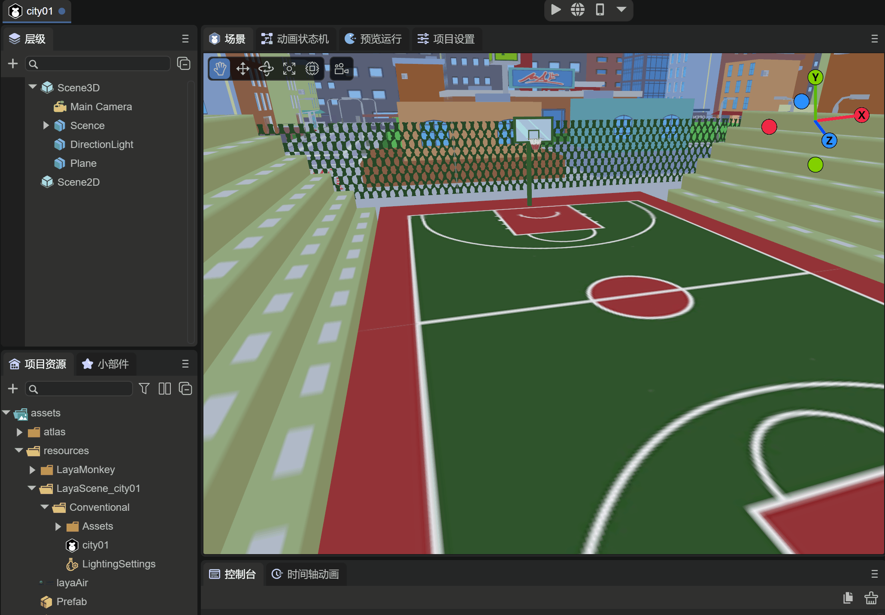

# 预制体模块


## 一、概述

在项目开发中，经常会出现这样的情况：

1，立项的时候，美术定义一系列标准的字体颜色，字号，在各个UI中应用，有一天美术突然说要更改默认的字体颜色，字号，苦逼的UI制作者就需要把所有界面都修改一次，这样会非常麻烦。**针对这种情况，使用预制体就能轻松应付，只修改一个地方，就能影响全局。**

2，不同的2D界面，局部有相同的布局，希望修改一次，多个界面相同布局跟着一起变化。**针对这种情况，使用预制体就能轻松应对**。

3，3D项目开发中，重复使用在同一场景中或者不同场景中的某种对象，例如模型，贴图，动画等设置都制作好了，就可以在场景中直接创建英雄，怪物，特效等等。我们希望在使用的时候只需用代码加载即可。**针对这种情况，使用预制体才能实现。**

针对类似上面需求，LayaAir3.x IDE提供了2D预制体和3D预制体，接下来本文将介绍这两种预设如何使用。


## 二、IDE中创建

创建预制体的过程只能在IDE中完成，通常预制体创建后都是以“.lh”为后缀的文件。本节介绍在IDE中如何创建预制体(2D)和预制体(3D)

### 2.1 创建预制体(2D)

预制体(2D)是针对2D界面开发过程中所使用的预制体，通常对于重复会用到的2D组件，局部界面等等。

如动图2-1所示，在IDE中项目资源的assets下，开发者可以选择希望预制体存放的目录，在此目录下，鼠标右键的菜单中创建预制体(2D)

 

（动图2-1）

创建好的预制体，通常开发者是需要重新命名的，这样才能通过名字来识别预制体的功能，如动图2-2所示

 

（动图2-2）

点击Title预制体，可以看到有一个根节点“Box”，如图2-3所示

 

（图2-3）

开发者可以在Box下创建2D组件，或者把Box节点转换成其它2D组件来使用，后面我们将详细介绍


### 2.2 创建预制体(3D)

创建预制体3D的过程同预制体2D一样，如动图2-4所示

  

（动图2-4）

不同的是，双击打开预制体3D，根节点是“Sprite3D”，也就是我们需要创建的3D精灵对象。同时图2-5右面是默认的IDE场景，用了IDE自带的天空盒

 

（图2-5）


### 2.3 修改预制体编辑场景

开发者可以通过如下的方式来更换3D预制体的编辑场景，如动图2-6所示

 

（动图2-6）

例如我们有一个3D的城市场景，在IDE的项目设置中 ，点击编辑选项，在预制体编辑场景中，拖入3D的城市场景文件，此时再次查看预制体的场景窗口，可以看到场景更换到3D城市了，这种情况下，可以更方便开发者更加灵活的在场景中制作3D预制体


## 三、使用预制体

### 3.1 2D预制体

第一小节中提到，由于开发过程中，会有很多界面使用类似于标题这样的字体，开发者最好通过预制体的方式来实现，当有需求改变所有界面标题的字体时，只需要修改一次预制体即可。

#### 3.1.1 转换节点类型

由于创建的预制体默认是Box跟节点，如果在Box下面创建标题的话，那么这个Box节点是多余的，如果界面中创建大量的标题，那么会创建很多的Box，对于性能的考虑来说是强烈不推荐的，因此我们希望使用转换节点来把Box改为Label组件。如动图3-1所示

 

（动图3-1）


#### 3.1.2 设置字体

接下来，这里就不多介绍标题的制作过程了，如图3-2所示，我们暂时制作一个黄色的30号黑体的字体，作为标题，并改名为Title


（图3-2）


#### 3.1.3 IDE中使用预制体

当预制体制作好之后，可以在IDE中拖入到我们希望使用到的界面中，如动图3-3所示

 

（动图3-3）

场景中有一个List，我们希望item里会有一个标题，我们把Title预制体拖入到List的Box下，作为List的item项的Label标题。可以看到节点中，Label名字颜色是绿色的，代表这个节点是预制体节点，当然这个节点下所有的节点都会是绿色的。

> ***注意：使用预制体的节点中，也就是任何绿色的节点，都是不可以删除的***


#### 3.1.4 修改预制体属性

当需求说想把所有的标题都改为红色时，也就是修改一次，多个界面跟着一起变化。那么只需要在Title预制体中修改文字的颜色即可，如动图3-4所示

 

（动图3-4）

修改预制体后，需要保存预制体文件，同时需要重新打开使用预制体的场景界面，才能在场景编辑器中刷新效果，当然你也可以不用这样操作，直接运行就可以

预制体中也可以继续添加新的UI组件，同理在场景中新加的UI组件同步过来了。这里就不展示了，开发者可以自己尝试。

> ***注意：任何UI组件上添加的脚本，也可以同步到场景中，但是预制体下的runtime类不能同步***


#### 3.1.5 覆盖预制体属性

如果我们在场景中操作了预制体节点，比如新增加了UI组件，修改了UI组件的属性，UI组件上挂了脚本，如图3-3所示

 

（图3-3）

例如场景中List下的有个item节点为预制体，我们在List下做了几个改动，在图3-3中都会有标识

- 对Label组件增加了LabelScript脚本（有“+”号标识）

- 对item节点修改了width属性（右边属性面板有黄色线提示）

- 添加了Button组件（有“+”号标识）

这些修改也可以覆盖到预制体中，我们来看看如何操作。如图3-4所示

 

（图3-4）

点击item节点，在右边的属性面板中，点击 `覆盖属性` 按钮，可以打开 `覆盖属性到 item` 的操作面板

由于之前有三个操作，那么我们点击 item，LabelScript，Button，可以看到，如图3-8所示

 

（图3-8） 

IDE记录了这三个修改操作，我们可以分别对每一项进行`撤销`或者`应用`，也可以直接进行`撤销全部`或者`应用全部`

当每个操作点击应用或者使用应用全部后，回到item预制体窗口后，三个修改都会更新并保存到预制体中，如图3-9所示

 

（图3-9） 

通过上面的操作，使用覆盖预制体属性的方式，也可以达到修改预制体的效果。


#### 3.1.5 代码中使用预制体

通过代码添加预制体的方式，就像使用一个组件一样简单，如图3-5所示，我们希望把Title预制体放到Box下

 

（动图3-5）

示例代码如下：

```typescript
const { regClass, property } = Laya;

@regClass()
export class ScriptA extends Laya.Script {
    //declare owner : Laya.Sprite3D;

    @property( { type: Laya.Box } )
    private box: Laya.Box;

    constructor() {
        super();
    }

    onStart(): void {

        //加载预制体文件
        Laya.loader.load("resources/Title.lh").then( (res)=>{
            //创建预制体
            let label: Laya.Label = res.create();
            //添加预制体Label字体到box节点下
            this.box.addChild( label );
        } );
    }
}
```

运行效果如图3-6所示

 

（图3-6）


### 3.2 3D预制体

3D预制体的使用过程同2D预制体一样，在这里我们就不介绍如何制作预制体了，通过下面的示例来看看3D预制体的使用效果

#### 3.2.1 IDE中使用

假设我们已经创建了3D预制体，并通过添加模型，材质，动画状态机等组件，制作了LayaMonkey，如图3-7所示

 

（图3-7）


此时，制作好的LayaMonkey可以拖入任何场景中，如动图3-8所示

 

（动图3-8）


#### 3.2.2 代码中使用

通过代码使用3D预制体是最常用的方式，往往在游戏战斗中的敌人是通过代码不断创建的，像上述IDE拖入LayaMonkey的情况，我们用代码来实现如下：

```typescript
const { regClass, property } = Laya;

@regClass()
export class Main extends Laya.Script {

    @property( { type : Laya.Camera } )
    private camera: Laya.Camera;  
    @property( { type : Laya.Scene3D } )
    private scene: Laya.Scene3D;

    onStart() {
        console.log("Game start");
        //加载预制体文件
        Laya.loader.load("resources/Prefab.lh").then( (res)=>{
            //创建预制体
            let monkey: Laya.Sprite3D = res.create();
            //添加预制体到场景中
            this.scene.addChild( monkey );
            monkey.transform.position = new Laya.Vector3(-28.9354,0.3,-63.20264);
        } );
    }
}

```

运行效果如动图3-9

 

（动图3-9）


## 四、预加载预制体

在开发过程中，我们会通过大量创建预制体的方式来实现各种功能，因此预制体也可以理解为一组资源的集合体，通过代码加载预制体文件时，可以一同加载所关联资源。因此在项目启动加载过程中，可以直接先加载所有的预制体，就像预加载场景一样，引擎会把关联的资源一起加载。

在LayaAir 2D入门示例代码中，可以看到，通过预加载一组预制体的实现代码：

```typescript
import { LoadingRTBase } from "./LoadingRT.generated";

const { regClass, property } = Laya;
@regClass()
export default class LoadingRT extends LoadingRTBase {
    onAwake(): void {
        Laya.loader.load(
            //先加载本场景要用的
            ["resources/UI/image.png", "resources/UI/progress.png", "resources/UI/progress$bar.png"]
        ).then(() => {
            let resArr: Array<any> = [

                { url: "resources/prefab/uiDemo/useUI/ChangeTexture.lh", type: Laya.Loader.HIERARCHY },
                { url: "resources/prefab/uiDemo/useUI/MouseThrough.lh", type: Laya.Loader.HIERARCHY },
                { url: "resources/prefab/uiDemo/useUI/PhysicalCollision.lh", type: Laya.Loader.HIERARCHY },
                { url: "resources/prefab/uiDemo/useUI/Progress.lh", type: Laya.Loader.HIERARCHY },
                { url: "resources/prefab/uiDemo/useUI/TextShow.lh", type: Laya.Loader.HIERARCHY },
                { url: "resources/prefab/uiDemo/page/IframeElement.lh", type: Laya.Loader.HIERARCHY },
                { url: "resources/prefab/uiDemo/page/UsePanel.lh", type: Laya.Loader.HIERARCHY },
                { url: "resources/prefab/uiDemo/list/BagList.lh", type: Laya.Loader.HIERARCHY },
                { url: "resources/prefab/uiDemo/list/ComboBox.lh", type: Laya.Loader.HIERARCHY },
                { url: "resources/prefab/uiDemo/list/LoopList.lh", type: Laya.Loader.HIERARCHY },
                { url: "resources/prefab/uiDemo/list/MailList.lh", type: Laya.Loader.HIERARCHY },
                { url: "resources/prefab/uiDemo/list/Refresh.lh", type: Laya.Loader.HIERARCHY },
                { url: "resources/prefab/uiDemo/list/TreeBox.lh", type: Laya.Loader.HIERARCHY },
                { url: "resources/prefab/uiDemo/list/TreeList.lh", type: Laya.Loader.HIERARCHY },
                { url: "resources/prefab/uiDemo/animation/AtlasAni.lh", type: Laya.Loader.HIERARCHY },
                { url: "resources/prefab/uiDemo/animation/FrameAni.lh", type: Laya.Loader.HIERARCHY },
                { url: "resources/prefab/uiDemo/animation/SkeletonAni.lh", type: Laya.Loader.HIERARCHY },
                { url: "resources/prefab/uiDemo/animation/TimelineAni.lh", type: Laya.Loader.HIERARCHY },
                { url: "resources/prefab/uiDemo/animation/TweenAni.lh", type: Laya.Loader.HIERARCHY },
                { url: "resources/prefab/uiDemo/interactive/Astar.lh", type: Laya.Loader.HIERARCHY },
                { url: "resources/prefab/uiDemo/interactive/Joystick.lh", type: Laya.Loader.HIERARCHY },
                { url: "resources/prefab/uiDemo/interactive/ShapeDetection.lh", type: Laya.Loader.HIERARCHY },
                { url: "resources/prefab/uiDemo/interactive/tiledMap.lh", type: Laya.Loader.HIERARCHY },

                { url: "resources/prefab/Bullet.lh", type: Laya.Loader.HIERARCHY },
                { url: "resources/prefab/closeBtn.lh", type: Laya.Loader.HIERARCHY },
                { url: "resources/prefab/ComboList.lh", type: Laya.Loader.HIERARCHY },
                { url: "resources/prefab/defaultButton.lh", type: Laya.Loader.HIERARCHY },
                { url: "resources/prefab/defaultLabel.lh", type: Laya.Loader.HIERARCHY },
                { url: "resources/prefab/DropBox.lh", type: Laya.Loader.HIERARCHY },
                { url: "resources/prefab/LoopImg.lh", type: Laya.Loader.HIERARCHY },
                { url: "resources/prefab/role.lh", type: Laya.Loader.HIERARCHY },

                { url: "resources/prefab/ani/cd.lh", type: Laya.Loader.HIERARCHY },
                { url: "resources/prefab/ani/refresh.lh", type: Laya.Loader.HIERARCHY },

            ];


            //3.0的load，同时可以加载2D,3D资源
            Laya.loader.load(resArr, null, Laya.Handler.create(this, this.onLoading, null, false)).then(() => {
                // 加载完成后，处理逻辑
                this.progress.value = 0.98;
                console.log("加载结束", this.progress.value);
                //预加载的东西太少，为了本地看效果延迟一秒，真实项目不需要延迟
                Laya.timer.once(1000, this, () => {
                    //跳转到入口场景
                    Laya.Scene.open("Scenes/Index.ls"); //不要使用Laya.Scene.open("./Scenes/Index.ls");
                });

            });

            // 侦听加载失败
            Laya.loader.on(Laya.Event.ERROR, this, this.onError);
        });
    }

    /**
   * 当报错时打印错误
   * @param err 报错信息
   */
    onError(err: string): void {
        console.log("加载失败: " + err);
    }

    /**
     * 加载时侦听
     */
    onLoading(progress: number): void {
        //接近完成加载时，让显示进度比实际进度慢一点，这是为打开场景时的自动加载预留，尤其是要打开的场景资源多，并没有完全放到预加载中，还需要再自动加载一部分时。
        if (progress > 0.92) this.progress.value = 0.95;
        else this.progress.value = progress;
        console.log("加载进度: " + progress, this.progress.value);
    }
}
```

通过上述代码，可以在浏览器中的调试工具中看到引擎会加载全部预制体的资源。


