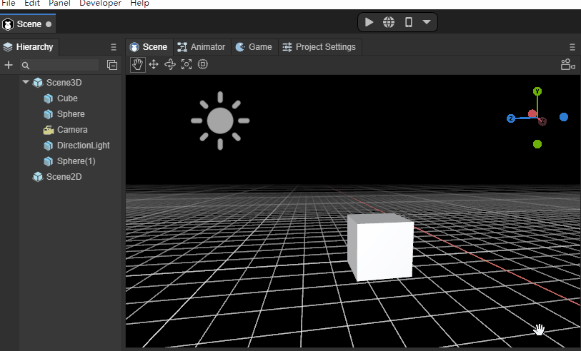
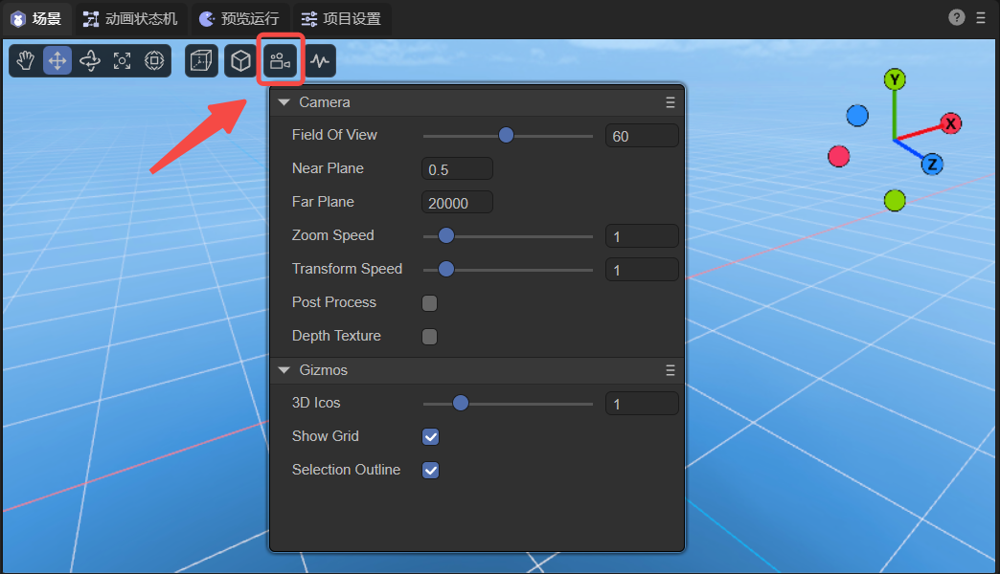
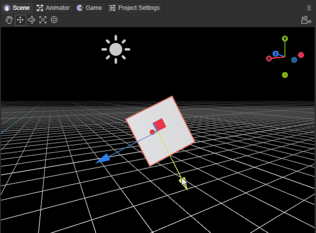
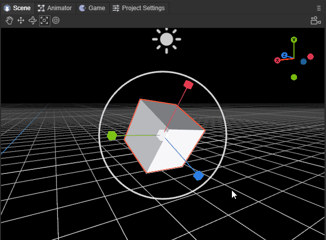

# 3D场景编辑的基础交互

> Author: Charley、孟星煜

3D场景中的基础交互，主要是两大类基础操作，

一是，改变场景视窗的摄像机位置与角度，让开发者如同自己的眼睛一样观察3D场景世界。

二是，改变模型的位置与角度，将模型摆放到场景中适当位置。

我们可以使用如图1所示的基础工具，

 

（图1）

也可以使用快捷键切换到对应的工具。

本篇我们逐个分解示意，让大家了解全部的3D场景编辑的交互基础操作。

## 1. 操作视窗摄像机

### 1.1 旋转视窗摄像机：鼠标右键

在3D场景中，只要持续按住`鼠标右键`即进入视窗摄像机的旋转模式，松开`鼠标右键`即退出视窗摄像机旋转模式。

在该模式下，在屏幕方向上移动鼠标，可以改变视窗摄像机的角度，对整个场景的任意角度进行观察，效果如动图1-1所示。

 

(动图1-1)

### 1.2 空间位移视窗摄像机

当按住鼠标右键 + 键盘功能键，可以让摄像机按上下左右前后，具体功能键如下：

| 功能说明         | 操作          |
| ---------------- | ------------- |
| 摄像机`向上`位移 | 鼠标右键  + E |
| 摄像机`向下`位移 | 鼠标右键  + Q |
| 摄像机`向左`位移 | 鼠标右键  + A |
| 摄像机`向右`位移 | 鼠标右键  + D |
| 摄像机`向前`位移 | 鼠标右键  + W |
| 摄像机`向后`位移 | 鼠标右键  + S |

位移视窗摄像机的效果如动图1-2所示。

 

(动图1-2)

> 上下前后左右，是一个相对的方向，无论旋转到任何角度，都会按这个相对的方向进行位移。

**位移视窗摄像机加速：**

在位移视窗摄像机的基础上，按住Shift叠加，可以在原功能基础上进行加速移动。

操作按键为：鼠标右键 + shift + (E、Q、A、D、W、S)

### 1.3 屏幕内位移视窗摄像机：Q \ 鼠标中键

除了采用`鼠标右键 + 键盘功能键（E、Q、A、D）`实现视窗摄像机上下左右的位移外，还可以通过快捷键Q或鼠标中键来启动屏幕任意方向位移。

使用快捷键Q时，鼠标左键按下并拖拽，即可实现视窗摄像机在屏幕任意方向位移，效果如动图1-3所示。

 

(动图1-3)

要想退出该模式，则需要通过其它模式的快捷键，除非是需要持续不断的采用该模式位移视窗摄像机。否则更建议采用鼠标中键来启动屏幕任意方向位移。

鼠标中键的方式，只有在按下并拖拽时才会进入该模式，松开鼠标中键会自动回到其它模式。

### 1.4 视窗摄像机缩放：鼠标滚轮

视窗摄像机缩放本质上就是视窗摄像机的前后位移，只因在位移过程中，观察目标时基于近大远小的透视原理，有种缩放的错觉，所以称为缩放视窗摄像机。效果如动图1-4所示，

 

(动图1-4）

### 1.5 视窗摄像机绕焦点中心旋转：Alt + 左键拖拽

在观察或操作具体某个模型时，我们可能需要找一个非正面的合适角度。此时，之前介绍的方式都不太方便。所以围绕目标进行任意旋转是最适合的操作。

要旋转视窗摄像机之前，我们首先要做的事，就是聚焦（选中3D对象，快捷键F），将模型处于视窗摄像机的中心位置。

聚焦后，通过`Alt + 左键`的组合，左键向任意角度拖拽，即可实现绕焦点中心旋转，效果如动图1-5所示，

 

(动图1-5)

### 1.6 保存视窗摄像机位置

| 快捷键                          | 功能                                                 |
| ------------------------------- | ---------------------------------------------------- |
| Ctrl + Shift +1/2/3/4/5/6/7/8/9 | 每一个数字可以存储一个摄像机位置，可以保存9个位置    |
| 1/2/3/4/5/6/7/8/9               | 已经存储的摄像机位置，按对应的数字键可以进行快速切换 |

如动图1-6所示，在场景面板中，将相机移动到合适位置后，按下快捷键`Ctrl + Shift +1`，这时，这个摄像机位置就保存在了数字1下，移动相机后，想回到1的位置，按下数字键1即可。

（动图1-6）

剩余位置2~9的操作和1相同，开发者可以根据需求进行保存。

### 1.7 透视投影与正交投影

如动图1-7所示，基础工具中的`透视投影/正交投影`表示：当前场景预览摄像机的投影模式为正交投影还是透视投影。

（动图1-7）

###  1.8 局部坐标与全局坐标

如动图1-8所示，将Cube绕x轴旋转45度，此时可以观察到移动模型相对于局部坐标和全局坐标的区别。

（动图1-8）

### 1.9 显示设置

点击图1-9所示的显示设置，可以设置Camera和Gizmos属性。

（图1-9）

#### 1.9.1 Camera

| 参数            | 作用                                                         |
| --------------- | ------------------------------------------------------------ |
| Field Of View   | 透视模式下的视野范围                                         |
| Near Plane      | 离摄像机视野方向最近的剪裁面                                 |
| Far Plane       | 离摄像机视野方向最远的剪裁面                                 |
| Zoom Speed      | 摄像机的缩放速度                                             |
| Transform Speed | 摄像机的位移速度                                             |
| Post Process    | 勾选后，开启[后处理](../../../3D/advanced/PostProcessing/readme.md) |
| Depth Texture   | 勾选后，开启深度纹理                                         |

#### 1.9.2 Gizmos

| 参数              | 作用                               |
| ----------------- | ---------------------------------- |
| 3D Icons          | 设置场景中摄像机图标的大小         |
| Show Grid         | 勾选后，场景中将显示水平面的网格线 |
| Selection Outline | 勾选后，选中的模型将显示外边框     |

### 1.10 场景视图刷新频率

点击图1-10所示的场景视图刷新频率，可以选择响应式和实时。响应式，是当前的模式，有改动才会刷新；实时，是场景视图以30fps帧率刷新。

（图1-10）

## 2. 操作模型

操作模型的工具有四种，分别是位移、旋转、缩放、混合使用。可以通过快捷键 `W、E、R、T`进行启动不同的工具模式。

| 快捷键名称   | 按键 |
| ------------ | ---- |
| 模型位移工具 | W    |
| 模型旋转工具 | E    |
| 模型缩放工具 | R    |
| 混合编辑模型 | T    |

### 2.1 模型位移工具：W

通过快捷键`W`进入模型位移工具模式后，模型上会出现红绿蓝三色的轴和片。

红绿蓝三个轴分别代表X、Y、Z三个方向，轴的颜色与右上角的坐标轴对应。

箭头所指的方向为正方向，拖动其中一个轴，可使该模型按该轴的正负方向进行位移，效果如动图2-1所示。

 

(动图2-1)

> 留意属性面板，如果该模型没有任何旋转（rotation都为0），拖动其中一个轴，只有该轴的属性值会发生变化 。如果有旋转，则会影响其它轴属性值。

三个相邻的面，蓝色为XY面、绿色XZ面、红色为YZ面。

拖动其中一个面，可使该模型在该面范围内任意位移，效果如动图2-2所示。

 

(动图2-2)

### 2.2 模型旋转工具：E

通过快捷键`E`进入模型旋转工具模式后，模型上出现红绿蓝三色的交叉弧线和外层白圈，当鼠标划到模型上时，还会出现一个半透明圆。

红绿蓝三色的弧线分别代表X、Y、Z三个轴的方向，颜色与右上角的坐标轴对应。

选中其中一个弧线后，会变成完整的圆圈，代表按该该轴方向进行旋转，效果如动图2-3所示。

 

(动图2-3)

外层白圈，是基于屏幕的垂直旋转，效果如动图2-4所示。

 

(动图2-4)

如果鼠标在半透明圆拖拽，则可以任意角度旋转，效果如动图2-5所示。

 

(动图2-5)

### 2.3 模型缩放工具：R

通过快捷键`R`进入模型缩放工具模式后，模型上不仅有红绿蓝三色轴，还有中心白块和外层白色圆圈。

红绿蓝三色轴分别代表X、Y、Z三个轴的方向，拉动其中一个轴，可在该轴对模式进行缩放，效果如动图2-6所示。

 

(动图2-6）

中心的白块与外层白色圆圈均是三轴同时缩放，两者的区别仅是缩放速率差异，效果如动图2-7所示。

 

(动图2-7）

### 2.4 模型工具集合：T

通过快捷键`T`进入模型工具集合后，前文介绍的模型操作工具，都会集合到一起。

唯一需要注意的是，混合模式下，中心块缩放不再保留，只能通过外层白色圆圈整体缩放，以及通过拉动各轴的方块从单轴方向缩放，效果如动图2-8所示。

 

(动图2-8)

### 2.5 模型的多选

多选的方式分别是框选、Shift、Ctrl这几种方式。

模型的框选，就是通过鼠标拉起屏幕矩形区，只要在矩形区内，无论远近都会被选中。

除了框选，也可以通过Shift或Ctrl结合鼠标点击，进行连续多选。

> 无论是单选，还是多选，选中的模型都会出现红色边框。							

### 2.6 模型的吸附

#### 2.6.1 下吸附：End

假设有两个立方体，Cube1在上，Cube2在下，选中Cube1，按下End键（Mac: fn+右方向键），如动图2-9所示，Cube1会直接下落到下面的Cube2上。

（动图2-9）

#### 2.6.2 点吸附：V

点吸附是指，基于模型的顶点与目标模型的顶点进行吸附对齐。选中模型后，持续按住快捷键V，即可进入点吸附模式。此时，鼠标可移到当前模型的任何一个顶点上，然后持续按住顶点拖拽到目标模型上，与目标模型的顶点进行吸附对齐。如动图2-10所示，场景中有两个Cube，选中其中一个，按下V键不松开，移动到另一个Cube的顶点上，**移动过程中也不要松开V键**，可以将两个Cube的顶点对齐。

（动图2-10）

#### 2.6.3 面吸附：Ctrl+Shift

面吸附是指，基于模型与目标模型的网格表面进行对齐。选中模型后，持续按住快捷键Ctrl+Shift（Mac: control+shift），即可进入面吸附模式。鼠标持续按住模型拖拽到目标模型上，模型的中心点会与目标模型的网格表面对齐，此时，可以在目标模型的各个面上移动，但中心点不得离开网格表面，除非退出面吸附模式。如动图2-11所示，将一个Cube的中心点移动到另一个Cube的侧面上，鼠标移动过程中Cube不会发生移动，只有将中心点拖到另一个Cube的面上时，才会移动。

（动图2-11）

如果持续按住快捷键Ctrl+Shift（Mac: control+shift）的同时，持续按下V，可开启面吸附的组合模式。组合模式下Ctrl+Shift+V（Mac: control+shift+V），不再局限于中心点，鼠标可划到当前模型的任意顶点上，然后持续按住该顶点，可以与目标模型的网格表面进行对齐。如动图2-12所示，在面吸附的组合模式下，将一个Cube的顶点移动到另一个Cube的侧面上，鼠标移动过程中Cube不会发生移动，只有将顶点拖到另一个Cube的面上时，才会移动。

（动图2-12）

## 3.  对齐

### 3.1 3D对象一键对齐到视窗摄像机：Ctrl+Shift+F

此方法直接改动了目标对象的位置。

比较常用的情况是，选中摄像机后，可以通过Ctrl+Shift+F快捷键，直接将摄像机（Main Camera）一键对齐到视窗摄像机的位置，如动图3-1所示（注意看右下角Main Camera视口的变化）。这样，视窗摄像机看到什么，那摄像机（Main Camera）也可以直接看到什么。方便用户调整，让摄像机的镜头调整更方便、更精确。

（动图3-1）

如动图3-2所示，Ctrl+Shift+F可以应用于其它3D对象。

（动图3-2）

### 3.2 视窗摄像机一键对齐到3D对象：Shift+F

此方法不改变目标对象位置。

比较常用的情况是，选中摄像机，可以通过Shift+F快捷键，直接将视窗摄像机一键对齐到摄像机（Main Camera）的位置，如动图3-3所示。这样，就能快速转移到摄像机（Main Camera）的视口下了。

（动图3-3）

如动图3-4所示，还可以将视窗摄像机一键（Shift＋Ｆ）对齐到其它3D对象，使其快速具有编辑器的第一人称视口。

（动图3-4）