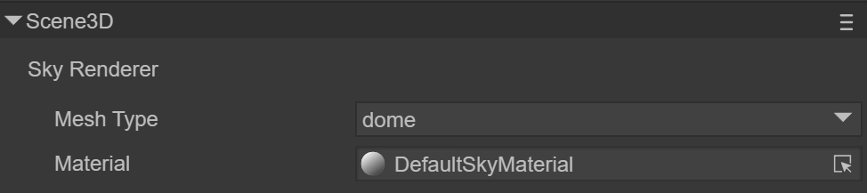
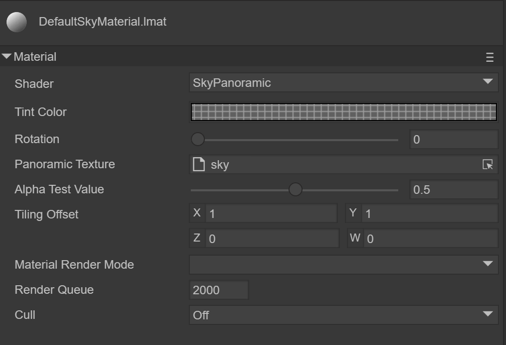
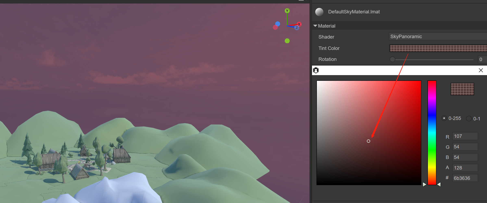
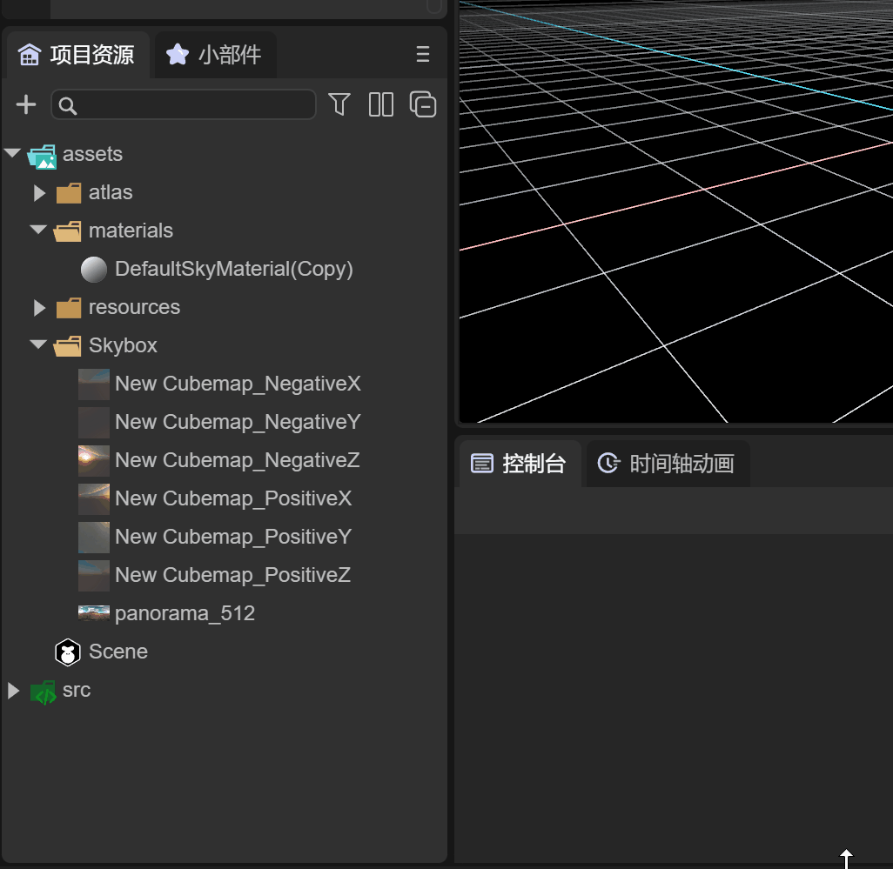
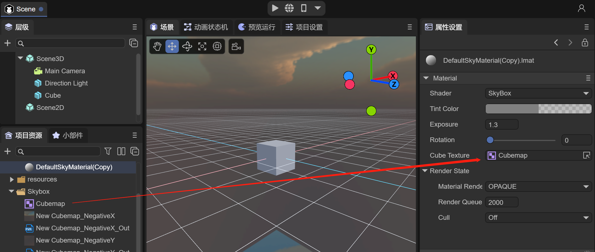
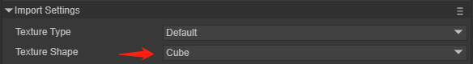
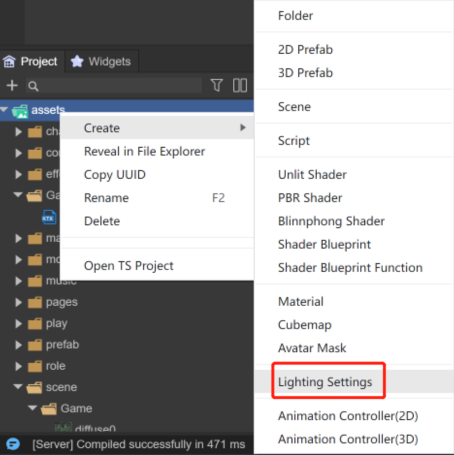

# 3D场景环境设置


本篇，我们将全面了解LayaAir3.0 3D场景编辑的强大功能

 

（图1-1）


## 一、概述

场景即为LayaAir引擎的3D世界容器，用于呈现游戏的3D画面和加载各种3D元素，游戏中的摄像机，灯光，人物，物品等都需要放到场景中才能展示出画面，相当于一个游戏3D播放器或者3D视图。

在LayaAir3.0引擎中，3D和2D可以混合使用，创建的Scene 3D场景和Scene 2D容器或元素可以同时加载到舞台上。

下面我们先来了解一个3D场景的参数都有哪些，为了让一个3D场景达到一个好的效果，都需要考虑的因素。我们通过创建3D-RPG项目来参考，如图1-2所示

 

（图1-2）


创建后的3D-RPG项目，如图1-3所示，这个项目本身就是一个场景

从Hierarchy窗口中，可以看到Scene3D和Scene2D根节点，这里我们只讲解Scene3D场景，其中包括了3D场景中重要的组成部分，3D摄像机，3D精灵等等，我们会在其它文档中讲解


（图1-3）


当我们点击Scene3D节点，在Inspector下看看都有什么参数信息，如图1-4所示

  

（图1-4）

从图1-4看到几个组件，也就是我们需要关心的几个内容，接下来讲解场景涉及到的内容：

- #### 环境天空

- #### 环境光

- #### 环境反射

- #### 环境雾

- #### 光照贴图（烘焙）


## 二、场景天空

场景天空的实现方式是天空盒，天空盒是一种让场景看上去更广阔无垠的一种视觉技术，用无缝对接的封闭纹理将摄像机的视口360度无死角的包裹起来，天空盒也就是3D世界中的天空。

图2-1中我们可以看到天空盒。天空盒的思想就是绘制一个大的立方体，然后将观察者放在立方体的中心，当相机移动时，这个立方体也跟着相机一起移动，这样相机就永远不会运动到场景的边缘。这与我们真实世界中的情况一样的，我们可以看见远处的天空接触到了地平线，但是不论我们怎么朝着那个方向移动，都不可能到达那个地方。

 

（图2-1）


天空渲染器组件  `Sky Renderer` 是Scene3D场景默认的组件，用来指定天空盒的网络形状。

 

（图2-2）


### 2.1 组件属性

`Mesh Type`：网格形状。目前引擎提供常见的两种天空盒网格：**立方体** 和 **球形** 。其中立方体网格更为常用。

​	`Box`：立方体天空盒

​	`Dome`：球形天空盒

`Material`：指定天空盒的材质

 

（图2-3）

展开DefaultSkyMaterial，如图2-3，就是正在使用的天空盒材质，目前我们使用LayaAir内置的`SkyPanoramic`着色器，`SkyPanoramic`的颜色和纹理是两个最重要的设置，我们会在材质一章中详细介绍LayaAir3.0提供的3种天空盒材质 `SkyPanoramic`、`Skybox`、`SkyProcedural`

 *注意：如果需要使用`SkyProcedural`程序化天空，那么只能使用球形天空。因为这种材质使用的顶点着色，需要跟精细的顶点信息。*

 *关于天空盒使用的材质`SkyProcedural` 程序化天空材质 与`SkyBox`天空盒材质在后面的 **Material材质** 篇有讲解*

关于 `SkyPanoramic` 材质，下面看看如何设置

`Tint Color`：颜色，如图2-4，改变颜色，可以看到改变后的颜色叠加到纹理上了

 

（图2-4）

`Rotation`：旋转，从0到360度，旋转可以帮助我们调整天空盒的位置

天空盒随着视角的旋转改变，我们可以观察到四面八方都有远景效果。目前提供的这两种网格中，盒型天空的顶点数据要更少，所以这种天空的性能要更好一些。

`Panoramic Texture`：天空盒的纹理贴图（一张球形模型对应的贴图）


#### 2.1.1 **立方体天空**

立方体天空盒用到的6张可以无缝相接的贴图参考，图2-5所示

 

（图2-5）


#### 2.1.2 **球形天空**

是一个球形模型及一张对应的贴图构成。示例中用到的是一张球形模型对应的贴图，如图2-6

 

（图2-6）


基本上用到纹理和颜色后，配置好天空盒材质，就可以为我们的场景添加好天空效果

 

（动图2-7）

运行3D-RPG项目，旋转摄像机，可以看到天空盒的效果，如动图2-7所示


### 2.2 使用代码设置场景天空材质

当然我们也可以通过代码来加载和指定天空盒

```typescript
var skyRenderer = this.scene.skyRenderer;
//加载相机天空盒材质
Laya.Material.load("sky2.lmat", Laya.Handler.create(null, function(mat: any) {
    //修改天空盒渲染器的天空盒材质
    skyRenderer.material = mat;
}));
```


### 2.3 IDE中创建天空盒

#### 2.3.1 更改IDE默认的球形天空盒

当我们用IDE场景一个3D场景时，默认是采用SkyPanoramic材质的球形天空盒，如图2-8所示

 

（图2-8）

由于系统的材质是在IDE内部，无法直接修改，如果需要修改的话，可以通过克隆的方式复制一个同样的天空盒材质到assets目录下，如动图2-9所示

 

（动图2-9）

然后准备好一张新的球形天空盒贴图，如图2-10所示


（图2-10）

拖入新的贴图到克隆后的材质中，如动图2-11所示


（动图2-11）

此时，不管是在IDE的场景中还是预览的效果，天空盒都换成了新的了


#### 2.3.2 更改立方体天空盒

如果开发者像使用立方体天空盒，首先我们更改上述天空盒材质为Skybox，如动图2-12所示

 

（动图2-12）

Laya.SkyBox材质是支持6张可以无缝相接的贴图，但是需要先创建一个Cube Texture，如动图2-13所示，在assets目录下创建Cube Texture

 

（动图2-13）

在Cube Texture中，添加好预先准备好的6张贴图，并点击应用，如图2-14所示


（图2-14）

最后，拖入配置好贴图的Cube Texture到skyBox材质的天空盒Texture中，立方体天空盒就配置好了，运行场景可以看到效果

 

（图2-15）


## 三、环境光

环境光，也称为漫反射环境光，是场景周围存在的光。并且不来自任何特定的光源。它可以对场景的整体外观和亮度做出重要贡献。
环境光在许多情况下都很有用，这取决于您选择的艺术风格。如果需要在不调整单个灯光的情况下增加场景的整体亮度，也可以使用。

图3-1所示，在3D-RPG项目中`EnvironmentLight`组件来指定环境光

 

（图3-1）


### 3.1 组件属性

`Ambient Mode`：环境光的模式，分为两种

​	`Ambient Color`：固定颜色。使用环境光颜色 Ambient Color 作为环境光源

​	`Ambient Intensity`：颜色强度。

​	`Spherical Harmonics`：球谐光照，通过天空盒生成的球谐数据，直接作用到物体上，后面会介绍当选用球谐光照时，采用IBL来调整效果


### 3.2 固定颜色

 

图（3-2）


我们用一个简单的场景来做参考，当我们关掉Direction Light后（图3-2）

 

动图（3-2）

可以看到使用Ambient Color时，调整颜色对环境光的变化，如动图3-2所示


#### 3.1.1 代码使用

环境光颜色`AmbientColor`，是对材质进行颜色融合染色，使材质趋于某种颜色色调，同时还能对材质进行提亮，模拟灯箱发光效果。如果设置了天空盒且不设置`Scene3D`场景的`AmbientColor`，那么LayaAir3.0会默认使环境光来源于天空盒，也就是球谐光照。

我们也可以通过代码来修改当前场景的环境光

```typescript
//设置场景环境光
scene.ambientColor = new Laya.Color(0,0,0,0);
```


### 3.3 球谐光照

可以看到采用球谐光照的效果，物体的表面受天空盒的影响，如动图3-3所示，下一节我们会介绍采用球谐光照作用到环境反射IBL方式的具体用法

 

动图（3-3）


## 四、环境反射

**环境反射**功能为场景中的每个地方提供了有效的光滑反射效果。 一些重要的材质，比如金属，都依靠各个方向反射效果，这正是环境反射提供的功能。 
场景环境反射分两种，天空盒反射与自定义反射。想要有反射效果就必须在物体Shader中有反射材质，如果没有反射材质也是没有效果的，默认的BlinnPhong不支持，PBR材质是支持环境反射的

`ReflectionProbe`是Scene3D场景的环境反射组件，如图4-1

 

（图4-1）


### 4.1 组件属性

 `Source`：反射来源

​	 `Skybox`：选择此选项可使用天空盒作为反射源

​	 `Custom`：选择此选项可使用自定义反射源

`Resolution`：如果选择天空盒反射，可以是设置分辨率


### 4.2 天空盒作为反射源

上一章的球谐光照的效果，动图（3-3），展示了用场景设置的天空盒作为环境反射


### 4.3 自定义反射源作为反射源

`Cubemap`：如果选择自定义反射，会使用cubemap，是一个由六个独立的正方形纹理组成的集合，它将多个纹理组合起来映射到一个单一纹理，如图4-2所示

  

（图4-2）

注意：纹理贴图要设置成Cube的纹理形状

 

（图4-3）

把cubemap图拖入到cubemap中，配置Cubemap

如图4-4所示，然后点击 Generate Light 生成反射效果

 

（图4-4）

如图4-5所示，球体的反射采用指定的天空盒纹理，而不采用场景的天空盒

  

（图4-5）

不管是哪种天空盒，我们都可以使用IBL来更好的处理反射效果，但是第一步我们先要生成光照 `Generate Light`
通过点击 `Generate Light` 按钮，开始生成环境反射，如图4-6所示

 

（图4-6）

生成过程介绍后，从ReflectionProbe 组件中，可以看到IBL Tex多了天空盒的贴图，如图4-7所示

  

（图4-7）


### 4.3 IBL介绍

`IBL` 是基于物理渲染的真实感的重要来源，是对环境光照的一种处理方案。对于大部分情况来说，环境光来自于天空盒，也就是 `cubemap` 贴图。因此，`IBL` 的重点就在于如何从图像中获取光照信息。

`iblSamples`：基于图像的光照的采用率，采样的越多，就越接近真实

`ibl Tex`：环境立方体贴图 (`Cubemap`) 

`ibl Tex RGBD`：默认采用RGB深度图

采用IBL时，环境光必须采用 `Spherical Harmonics` 方式，当点击 `Generate Light` 后，可以看到IBL Tex纹理会自动生成，并可以在3D物体的材质种调节反射效果。


## 五、场景雾

雾化效果在项目中起着重要的作用，雾化效果就相当于开启大气的效果，看起来有种朦朦胧胧的感觉，让场景更真实。LayaAir 3.0引擎可以设置场景的雾效可见距离（相当于浓度）及雾效的颜色。雾化使用的恰当不但可以提升游戏性能，还可以增加游戏的体验。

雾化组件 `Fog` 是Scene3D场景默认的组件，如图5-1所示

 

（图5-1）


### 5.1 组件属性

`Fog Start`：雾化的起始位置

`Fog Range`：雾化最浓处的距离

`Fog Color`：雾化的颜色

首先勾选雾化属性，然后调整雾化的范围，雾化的颜色


### 5.2 代码使用

```typescript
//雾化代码
this.scene.enableFog = true;
//设置雾化的颜色
this.scene.fogColor = new Laya.Color(0,0,0.6);
//设置雾化的起始位置，相对于相机的距离
this.scene.fogStart = 10;
//设置雾化最浓处的距离。
this.scene.fogRange = 40;
```


## 六、光照贴图

在3D游戏场景中，依赖灯光与模型即时渲染产生投影及颜色影响，是非常耗性能。特别是在移动平台上，手机的显卡功能并不强大，如果全部使用即时光影，性能开销是非常大的，游戏也会变得卡顿。
场景光照贴图就是为了解决这个问题，其优点就是可以通过较少的性能消耗使静态场景看上去更加真实，丰富，更具有立体感。缺点就在于不能实时的处理动态光照。
我们来对比下未使用光照贴图和使用光照贴图的效果

 

（图6-1）未使用光照贴图

 

（图6-2）使用了光照贴图

我们看到区别是很明显的，现在来讲解怎么生成光照贴图。


### 6.1 组件属性

当我们创建一个新的场景的时候，默认 `Lighting` 组件是没有任何设置的，如图6-3

 

（图6-3）

`Lightmaps`：光照贴图，可以是一组贴图，在没有烘焙的情况下，不需要点击加号+

`Lighting Setting`：光照贴图设置文件，下面我们将创建这个文件

`Bake`：Bake按钮用来生成烘焙


### 6.2 创建光照设置文件

接下来创建一个`LightingSetting`文件，如果6-4

 

（图6-4）

将生成的文件，拖入到 `Lighting Settings` 里

 

（图6-5）


### 6.3 属性详解

下面我们可以看到 `LightingSettings` 的所有属性

 

（图6-6）

`Max lightmap size`：光照贴图的最大尺寸，尺寸越大越清晰

`Mode`：

​	`Bake`：模式将生成烘焙图（根据场景分配几张）

​	`View`：模式将生成渲染图（只有一张）

`Max sample`：采样值，越大效果越好，时间越长

`Denoise`：消除光照贴图中的噪点，去噪设置

​	`Enable`：是否开启

​	`prefillter`：去噪方式，可以选择 

​		`accurate` 精细

​		`fast` 快速

​		`none` 无

​	`Denoise Type`：去噪方法，可以选择 

​		`optix` 去噪optix方法

​		`openimagedenoise` 去噪openimagedenoise方法，业内最好的方法

​		`none` 无

`AO`：控制烘焙环境遮挡中表面的相对亮度。用于烘焙光照的光照贴图计算的间接光照。

​	`Bounces`：AO弹射次数，值越大，越慢。默认：8

​	`Factor`：AO影响参数。默认：1

​	`Distance`：影响AO的最大距离，值越大，效果会好，但是烘焙速度越慢。默认：6

`Bounce`：光线反弹次数

​	`Diffuse bounce`：漫反射光线反弹次数。默认：4

​	`Transmission bounce`：透射光线反弹次数。默认：12

​	`Glossy bounce`：玻璃反弹次数。默认：4

​	`Total bounce`：反弹次数。默认：3

`Sample_clamp_direct`：默认：0，用来减少直接光噪点

`Sample_clamp_indirect`：默认：10，用来减少间接光噪点，但是灯光会变暗

`Margin`：渲染扩展边，用来解决边界黑缝的问题，一般选择16

`Margin higher filter`：边界是否高精度采样

`Scene Module Scale`：整个场景lightmap大小的缩放


### 6.4 烘焙

设置好参数后，点击Bake，等几分钟之后，会自动生成烘焙后的光照图，并添加到 `Lightmaps` 中，如图6-7所示

 

（图6-7）


光照贴图就是在物体本身的贴图基础上生成了一张新的贴图，如图6-8所示

 

（图6-8）


烘焙后的场景，树上带有光照效果和阴影效果，如图6-9所示

 

（图6-9）

通过对比，我们能看到光照贴图所带来的效果，并且渲染效率很高，不需要用实时光照。图6-10是没有用光照贴图的对比图

 

（图6-10）


## 七、场景管理

3D-RPG项目仅仅是只有一个场景的3D项目，大型的项目是由多个场景组成的，合理的管理3D场景会提高我们开发效率。


### 7.1 创建新场景

打开3D-RPG项目的Project资源目录，可以看到这里有个scene文件夹，如图7-1所示，这里来存放其它场景文件是比较好的习惯，看起来也比较清晰。

 

（图7-1）


例如在3D-RPG项目中，有了Game场景，可能还需要有游戏登录场景，那么我们来创建一个 `Login` 场景，如动图7-2所示

 

（动图7-2）


也可以从编辑器的File菜单里的New Scene来创建场景，保存到scene目录下，如动图7-3所示

 

（动图7-3）


### 7.2 场景重命名

想对场景进行重新命名，可以直接在Project里对场景文件进行改名操作，如动图7-4所示

 

（动图7-4）


### 7.3 设置为启动场景

通常 Login 场景是启动场景，因此我们在Project Settings中可以设置启动场景，如动图7-5所示

 

（动图7-5）


## 八、场景切换和加载资源

在3D游戏开发过程中，往往我们需要制作多个场景，游戏的主程序需要加载场景做切换，同时释放老的场景资源和内存


### 8.1 代码切换场景

示例代码如下：

```typescript
//打开指定的场景，同时显示Scene2D和Scene3D
Laya.Scene.open("scene/Game.ls",true, null, Laya.Handler.create(this, this.onLoaded), Laya.Handler.create(this, this.onLoading));

//关闭指定的场景
Laya.Scene.close("scene/Login.ls")

//销毁指定的场景
Laya.Scene.destroy("scene/Login.ls")
```

### 8.2 场景资源加载

示例代码如下：

```typescript
//用Laya.Scene3D的方式加载
Laya.Scene3D.load('scene/Game.ls', Laya.Handler.create(null, function (res:any){
	Laya.stage.addChild(res);
}));

//用Laya.loader的方式加载，加载后根节点是Scene2D
Laya.loader.load('scene/Game.ls', Laya.Handler.create(this, this.onLoaded), Laya.Handler.create(this, this.onLoading)).then( (res)=>{
    let scene = res.create();
    //scene.scene3D 可以获得Scene3D资源
    Laya.stage.addChild(scene.scene3D);
    
});
```

