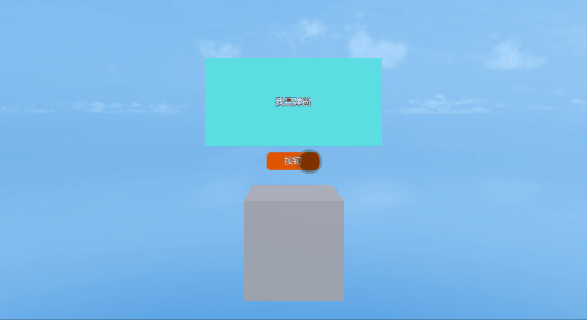

# 使用3DUI

## 一、概述

2D UI都是纯粹的2D图片按层次显示，不会出现三维立体效果，所以都是直接紧贴着视窗上。而3D UI的原理是，创建的UI控件都在一个三维立体空间中，摄像机是一个透视的摄像机，这和2D UI有着截然不同的区别，因为2D UI是一个正交摄像机。因此如果要出现UI有三维变换的效果，就必须用3D UI。

### 1.1 3D UI的本质

3D UI也是UI，就需要承担UI的交互职能。例如，当我们点击UI上的按钮时，按钮会带来交互反馈，并触发设定的事件，以达到逻辑运行的目的。 



（动图1-1）


### 1.2 3D UI的分类

**场景化UI**

3D UI是位于3D场景中，不跟随窗口运动而运动的UI。它更像是一个位于3D场景中的物件，并带有UI的交互特征。


（动图1-2）

**透视UI**

3D UI是始终位于窗口上，和常规的UI一样。但3D UI可以进行XYZ三个轴上的运动，带来明显的透视变化。

 

（动图1-3）


## 二、IDE中使用UI3D组件

### 2.1 创建一个2D的Prefab

在IDE中使用3D UI，首先需要我们创建一个用于在3D场景中展示的2D UI，这里必须使用Prefab2D来实现。首先，我们先创建一个Prefab2D，在Prefab2D中搭建一个希望实现的2D UI，例如，我们要做一个游戏中人物战斗中头顶的血条，如图2-1所示。


（图2-1）

在Prefab2D中，创建一个Progress组件，因为血条有当前血量和总体血量构成，因此Progress正好符合我们的要求。并且血条上面使用Label显示人物的名字。另外注意Prefab的根节点Box的size最好改为2的N次幂，这符合纹理的2的N次幂原则。


### 2.2 创建Sprite3D，添加UI3D组件

在IDE的Scene3D节点下，创建一个Sprite3D对象，添加UI3D组件，如动图2-2所示。


（动图2-2）

在Sprite3D节点属性面板中，点击添加组件，选择渲染，选择UI3D组件。可以看到，当添加UI3D组件后，场景中在Sprite3D节点的位置，多了一个显示的纹理（黑色），这个纹理就是用来显示UI的。


### 2.3 添加2D Prefab资源

准备好UI3D组件后，下一步就是要把之前做好的2D Prefab UI拖入到UI3D组件的Prefab属性中，如动图2-3所示。


（动图2-3）

拖入Prefab后，纹理会立即显示2D UI。但是默认是OPAQUE渲染模式，纹理有黑色的背景色。下面介绍UI3D的属性，来调整纹理效果。


### 2.4 更改UI3D属性

对于UI3D组件，如图2-4所示，有如下一些属性： 


（图2-4）

`Prefab`：需要显示的2D Prefab资源文件。

`Resolution Rate`：纹理的分辨率，当拖入Prefab时，会自动识别Prefab下节点的size，来动态调整纹理的分辨率。

`Scale`：纹理宽高缩放。基于纹理分辨率的缩放比率，通过控制缩放，让2的幂纹理与UI资源宽高相符。

`Billboard`：是否使用广告牌模式。若勾选，UI会始终朝向摄像机；若不勾选，则UI永远朝向Z轴方向，即UI在场景中的透视效果。

`Enable Hit`：是否响应鼠标事件，默认不勾选。勾选后，可以实现按钮的响应、滑动条的拖动、List组件的滑动等。

`Render Mode`：渲染模式。OPAQUE（不透明）、CUTOUT（裁剪）、TRANSPARENT（透明）、ADDTIVE（效果叠加）、ALPHABLENDED（透明度混合）。

`Cull`：剔除模式。Off（不剔除）、Front（剔除正面，只显示背面）、Back（剔除背面，只显示正面）。


通常使用的渲染模式为TRANSPARENT，也就是支持透明色，如图2-5所示，背景变成透明的了。  


（图2-5）


### 2.5 调整UI3D位置

我们的需求是做人物的血条，那首先把我们做好的但丁人物拖入到场景中，并设置为（0,0,0）点，如图2-6所示。 


（图2-6）

但是可以看到，由于之前创建的Sprite3D也在（0,0,0）点，那么位置就会在人物脚下，这时需要调整Sprite3D的位置，来符合血条的效果，如动图2-7所示。 


（动图2-7）

这时来看看运行的效果：


（动图2-8）

可以看到随着人物在摄像机前拉进和拉远，血条也在变大变小，很符合实际的效果 。如果用2D UI来实现的话，就需要动态去计算人物相对摄像机的位置来缩放UI的大小，效果肯定不好。

当然，我们也可以不勾选UI3D的 `Billboard` 属性，调整XYZ轴的旋转，让血条随着人物的旋转而改变朝向。 


（动图2-9）


### 2.6 脚本控制UI3D

通常我们需要对UI中的内容进行操作，此例中血条中血量比例的变化，有向上飘动的伤害数等等，这些都是通过对2D Prefab中UI组件控制来实现的。而UI3D组件通常是用来控制显示效果，比如透视效果，位置信息等。

在2.1节中的Prefab2D中，添加一个Text节点，命名为“value”，并将ProgressBar重命名为“bar”，接着勾选value、bar的`定义变量`选项。保存场景后，就像处理2D UI的操作一样，在根节点上添加Runtime类，添加逻辑代码如下：

```typescript
const { regClass } = Laya;
import { BloodBarBase } from "./BloodBar.generated";
import { Main } from "./Main";

@regClass()
export class BloodBar extends BloodBarBase {

    onAwake(): void {
        this.bar.value = 1;
        this.value.visible = false;
        Laya.stage.on( Laya.Event.CLICK, this, this.onHurt );
    }

    onHurt(): void {
        this.bar.value = this.bar.value - 0.1;
        this.value.y = 35;
        this.value.visible = true;
        Main.instance.animator.play("Stun");
        Laya.Tween.to( this.value, { y : -20 }, 500, null, Laya.Handler.create(this, this.end))
	}

	private end(): void {
		this.value.visible = false;
	}
}
```

上述代码中的`Main.instance.animator.play("Stun");`表示改变动画状态，目的是在减少血量时播放受到攻击的动画。需要在场景的Scene2D中添加如下脚本：

```typescript
const { regClass, property } = Laya;

@regClass()
export class Main extends Laya.Script {

    /** 设置单例 */
    static instance: Main;

    constructor() {
        super();
        Main.instance = this;
    }

    @property({ type: Laya.Sprite3D })
    private target: Laya.Sprite3D;

    public animator: Laya.Animator;

    onAwake(): void {
        //获得状态机
        this.animator = this.target.getComponent<Laya.Animator>(Laya.Animator);
    }
}
```

最后来看看运行效果： 


（动图2-10）

到此为止，UI3D组件已经介绍完了，开发者可以在项目中通过使用UI3D组件来实现更多的3D UI效果。


