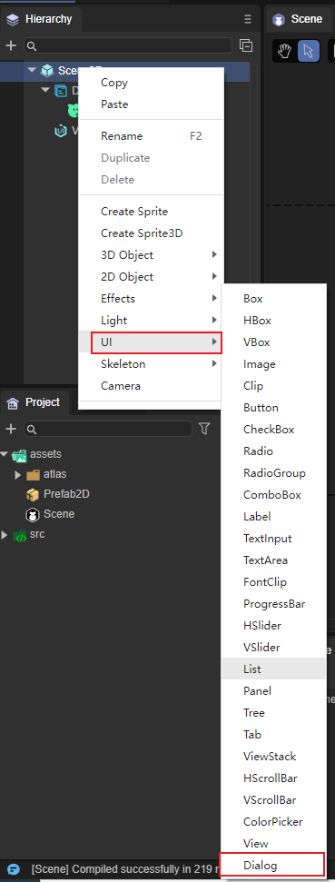
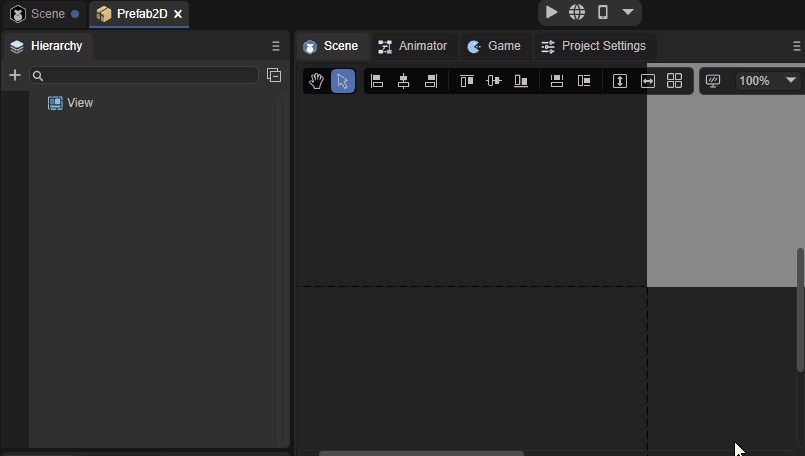
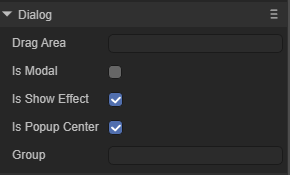
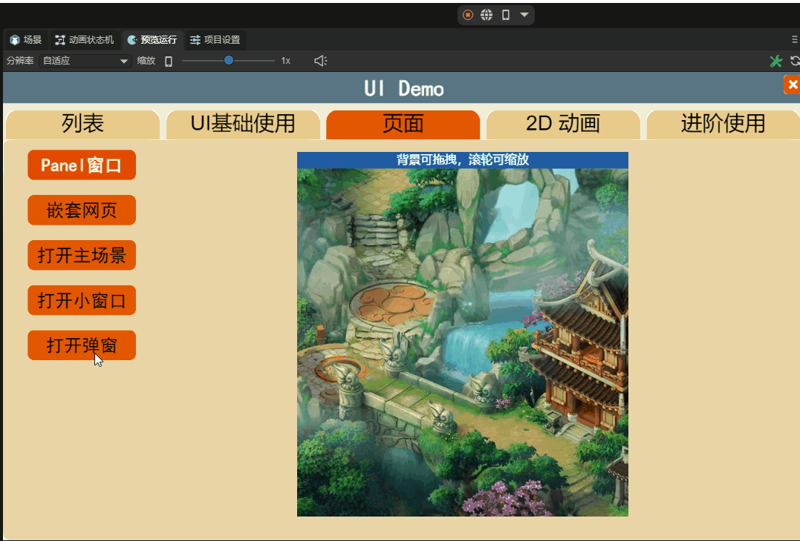
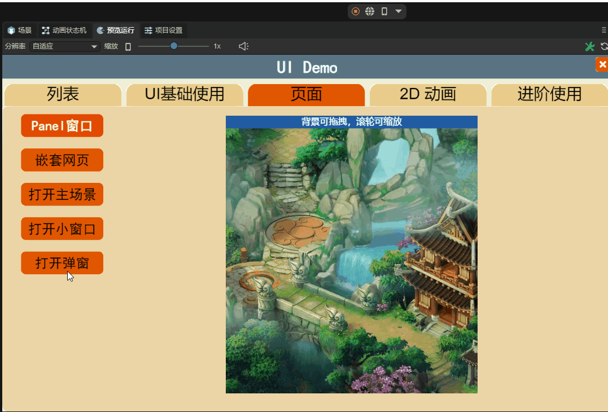

# 弹窗视图组件

弹窗视图(Dialog)用于弹窗面板

## 1、Dialog组件创建

Dialog组件可以通过IDE的可视化操作直接进行创建，步骤为右键单击Scene2D，找到UI，点击Dialog即可创建完毕，如图1所示。

 

（图1）

也可以从IDE资源管理右侧组件面板的UI文件夹中，将Dialog组件拖拽到UI页面中，如动图2所示

 

（动图2）

Dialog的弹窗效果需要将它作为根节点使用，可以在项目面板鼠标右键单击assets，找到Create，点击Prefab 2D，右键单击View，点击Change Type点击UI，点击Dialog即可创建完毕，如图3、动图4所示。创建完毕之后，需要用代码将Dialog与所需要用到该Dialog的场景管关联起来，以下代码块为例。

```typescript
Laya.Scene.open("Prefab2D.lh");
```

 

（图3）

 

（动图4）

## 2、Dialog属性介绍

 

(图5)

| 属性          | 功能                                                       |
| ------------- | ---------------------------------------------------------- |
| dragarea      | 拖动区域（格式：x，y，width，height），默认值为"0,0,0,0"。 |
| ismodal       | 是否是模式窗口，默认为不开启状态。                         |
| isshoweffect  | 是否显示弹出效果，默认为开启状态。                         |
| ispopupcenter | 指定对话框是否居中弹出，默认为开启状态。                   |
| group         | 组名称。                                                   |

### 2.1 Drag Area属性

在设置Drag Area属性后，可以在设置的数值范围内对Dialog进行拖动，默认为不设置，不设置即为不可拖动，如动图6所示。

 

（动图6）

在设置后只可以在设置的数值内拖动，在超出数值内的区域拖动是无效的，如动图6所示。

### 2.2 Is Modal属性

因为Dialog是弹窗，所以要设置弹窗的下层级是否可以进行点击，默认情况下是可以点击的，如果不想开启可自行关闭，关闭后即为不可点击状态（即不可穿透）。

### 2.3 Is Show Effect 属性

在开启**Is Show Effect** 属性后，就可以实现Dialog组件的弹窗效果了，下面我们来展示下它的弹窗效果，如动图7所示。

 

（动图7）

### 2.4 Is Popup Center属性

在开启 **Is Popup Center** 属性后，我们的弹窗就会居中显示，来看下效果，如动图8所示。

 

（动图8）

## 3、代码创建Dialog组件

代码运行结果：

 

```typescript
const { regClass, property } = Laya;

@regClass()
export class UI_Dialog extends Laya.Script {

    private DIALOG_WIDTH: number = 220;
	private DIALOG_HEIGHT: number = 275;
	private CLOSE_BTN_WIDTH: number = 43;
	private CLOSE_BTN_PADDING: number = 5;

	private assets: any[];
    private dialog: Laya.Dialog;

    constructor() {
        super();
    }

    /**
     * 组件被激活后执行，此时所有节点和组件均已创建完毕，此方法只执行一次
     */
    onAwake(): void {

		this.assets = ["resources/res/ui/dialog (1).png", "resources/res/ui/close.png"];
		Laya.loader.load(this.assets).then( ()=>{
            this.onSkinLoadComplete();
        } );
	}

	
	private onSkinLoadComplete(e: any = null): void {
		this.dialog = new Laya.Dialog();

		var bg: Laya.Image = new Laya.Image(this.assets[0]);
		this.dialog.addChild(bg);

		var button: Laya.Button = new Laya.Button(this.assets[1]);
		button.name = Laya.Dialog.CLOSE;
		button.pos(this.DIALOG_WIDTH - this.CLOSE_BTN_WIDTH - this.CLOSE_BTN_PADDING, this.CLOSE_BTN_PADDING);
		this.dialog.addChild(button);

		this.dialog.dragArea = "0,0," + this.DIALOG_WIDTH + "," + this.DIALOG_HEIGHT;
		this.dialog.show();
	}

	onDestroy(): void {
		if (this.dialog) {
			this.dialog.close();
		}
	}
}
```

