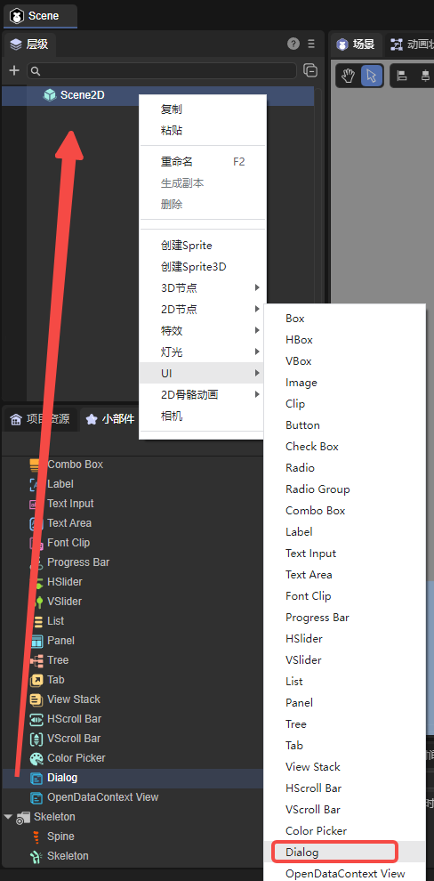
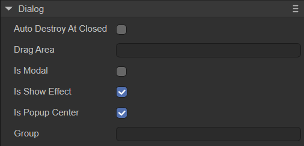
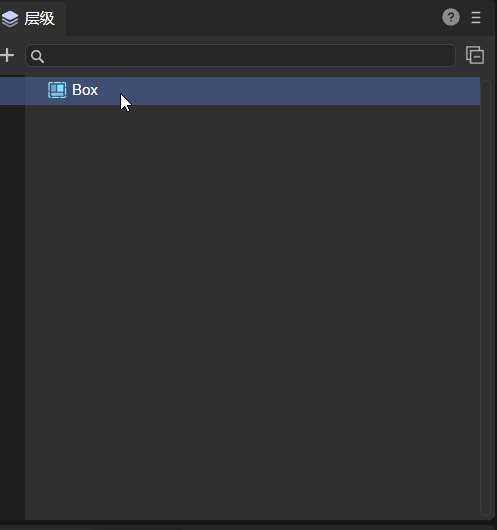
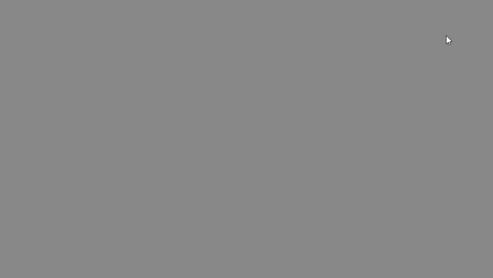
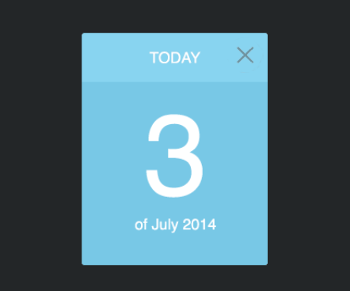

# 弹窗视图组件（Dialog）

Dialog是弹窗视图组件，主要用于弹窗面板。

## 一、通过LayaAir IDE创建Dialog

### 1.1 创建Dialog

如图1-1所示，点击选择小部件面板里的Dialog组件，拖放到页面编辑区，或者在层级窗口中通过右键创建，即可添加Dialog组件到页面上。



（图1-1）


### 1.2 Dialog属性介绍

Dialog的特有属性如下：



（图1-2）

| 属性                | 功能                                                         |
| ------------------- | ------------------------------------------------------------ |
| autoDestoryAtClosed | 场景被关闭后，是否自动销毁（销毁节点和使用到的资源），默认为false |
| dragArea            | 拖动区域（格式：x,y,width,height），默认值为"0,0,0,0"        |
| isModal             | 是否是模式窗口，默认为false。为模式窗口时，点击弹窗空白处，可自动关闭该弹窗 |
| isShowEffect        | 是否显示弹出效果，默认为开启状态。为false时无弹出效果，直接显示弹窗 |
| isPopupCenter       | 指定对话框是否居中弹出，默认为true。为false时，会以左上角的坐标原点弹出 |
| group               | 设置资源的分组标识，设置后可以按组来加载或清理资源           |

在设置dragArea属性后，可以在设置的数值范围内对Dialog进行拖动。将其设置为"0,0,100,100"，效果如动图1-3所示，红色区域为可拖拽区域。在设置后只可以在设置的数值内拖动，在超出数值内的区域拖动是无效的。


（动图1-3）


### 1.3 脚本控制Dialog

#### 1.3.1 创建弹窗

Dialog的弹窗效果需要将它作为根节点使用。可以在项目资源面板创建一个2D预制体Prefab2D，如图1-4所示。


（图1-4）

双击Prefab2D进入编辑界面。右键单击根节点，选择“转换节点类型”，选择`UI->Dialog`即可，如动图1-5所示。



（动图1-5）

然后，在预制体的编辑界面就可以制作弹窗页面了，制作的效果如图1-6所示。


（图1-6）

> 图中的UI图片资源来自“2D入门示例”。


#### 1.3.2 设置关闭按钮

在弹窗页面中，有一个关闭按钮（closeBtn），需要添加脚本实现关闭页面的逻辑。如动图1-7所示，勾选closeBtn的定义变量选项，然后双击Prefab2D的“UI运行时”，创建UI组件脚本。


（动图1-7）

保存场景后，在RuntimeScript.ts中添加如下代码：

```typescript
const { regClass } = Laya;
import { RuntimeScriptBase } from "./RuntimeScript.generated";

@regClass()
export class RuntimeScript extends RuntimeScriptBase {

    onAwake(): void {
        this.closeBtn.on(Laya.Event.CLICK, this, () => {
            this.close();
        });
    }
    
}
```


#### 1.3.3 关联场景

设置好弹窗之后，需要用代码将Dialog与所需要用到该Dialog的场景管关联起来。回到初始场景Scene，在Scene2D的属性设置面板中，增加一个自定义组件脚本。添加如下代码，实现鼠标点击后，弹出Dialog页面：

```typescript
const { regClass, property } = Laya;

@regClass()
export class NewScript extends Laya.Script {

    //鼠标点击后执行
    onMouseClick(): void {
        //使用Prefab，需要转换根节点为Dialog
        Laya.loader.load("resources/Prefab2D.lh").then(res => {
            let dlg: Laya.Dialog = res.create();
            dlg.show();
        });
    }
}
```

运行效果如下：



（动图）


## 二、通过代码创建Dialog

在进行书写代码的时候，免不了通过代码控制UI，创建`UI_Dialog`类，通过代码设定Dialog相关的属性。示例代码如下：

```typescript
const { regClass, property } = Laya;

@regClass()
export class UI_Dialog extends Laya.Script {

    private DIALOG_WIDTH: number = 220;
	private DIALOG_HEIGHT: number = 275;
	private CLOSE_BTN_WIDTH: number = 43;
	private CLOSE_BTN_PADDING: number = 5;

	private assets: any[];
    private dialog: Laya.Dialog;

    constructor() {
        super();
    }

    // 组件被激活后执行，此时所有节点和组件均已创建完毕，此方法只执行一次
    onAwake(): void {
        // 图片资源来自“引擎API使用示例”
		this.assets = ["resources/res/ui/dialog (1).png", "resources/res/ui/close.png"];
		Laya.loader.load(this.assets).then( ()=>{
            this.onSkinLoadComplete();
        } );
	}

	private onSkinLoadComplete(e: any = null): void {
		this.dialog = new Laya.Dialog();

		let bg: Laya.Image = new Laya.Image(this.assets[0]);
		this.dialog.addChild(bg);

		let button: Laya.Button = new Laya.Button(this.assets[1]);
		button.name = Laya.Dialog.CLOSE;
		button.pos(this.DIALOG_WIDTH - this.CLOSE_BTN_WIDTH - this.CLOSE_BTN_PADDING, this.CLOSE_BTN_PADDING);
		this.dialog.addChild(button);

		this.dialog.dragArea = "0,0," + this.DIALOG_WIDTH + "," + this.DIALOG_HEIGHT;
		this.dialog.show();
	}

	onDestroy(): void {
		if (this.dialog) {
			this.dialog.close();
		}
	}
}
```

效果如下动图所示：



（动图2-1）


