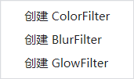
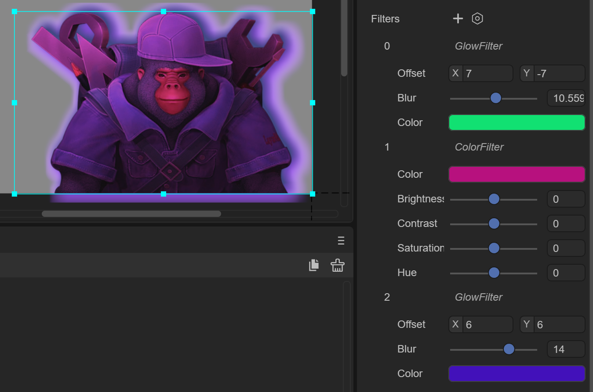
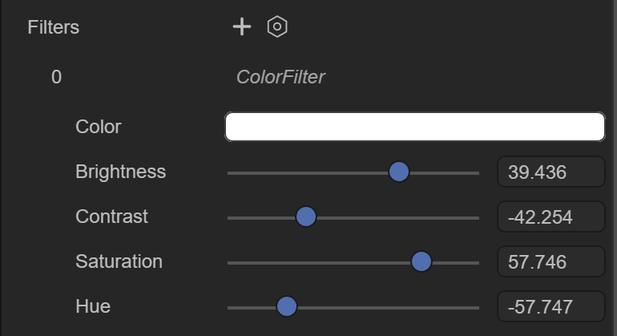
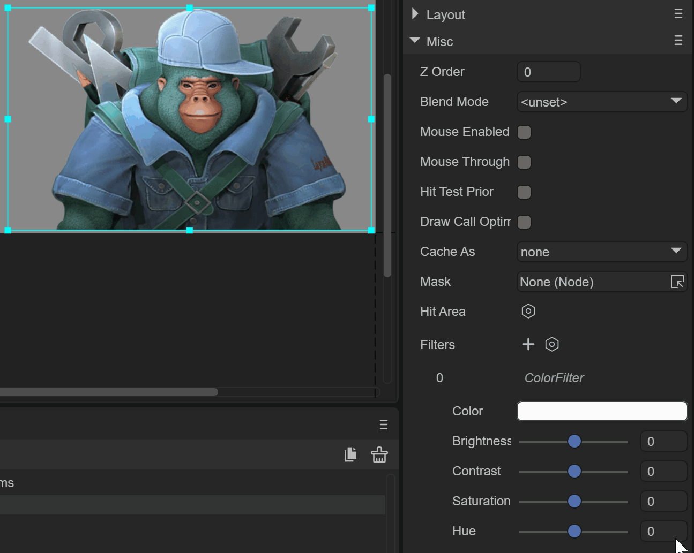
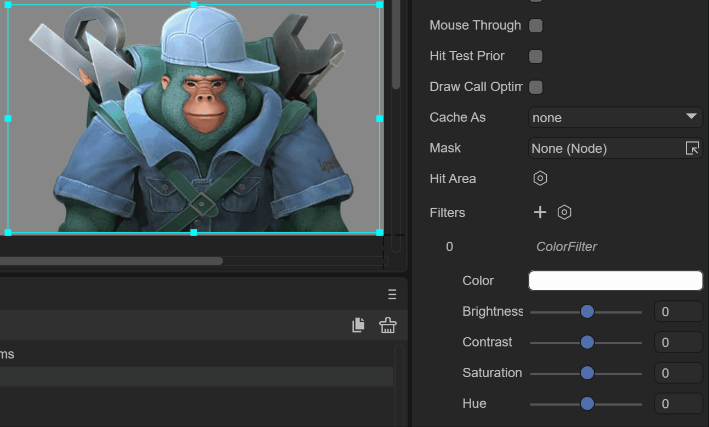
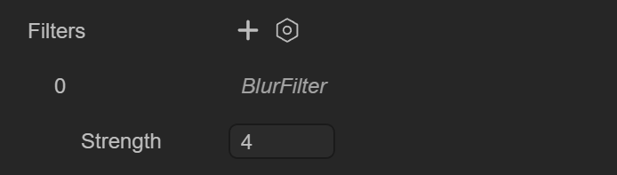
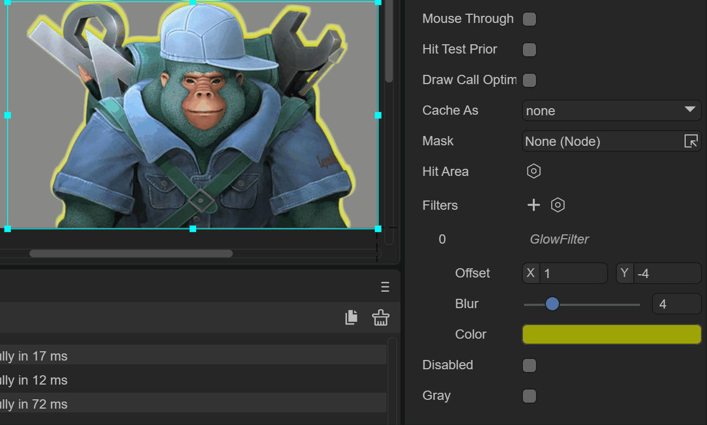
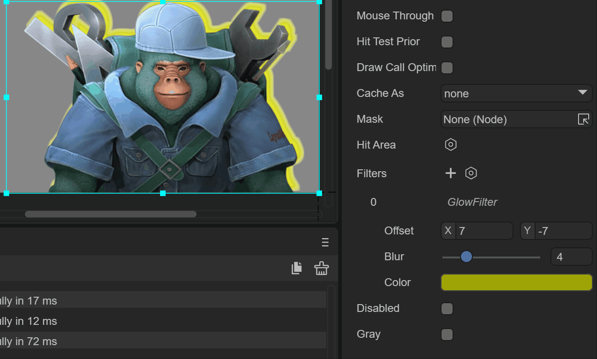
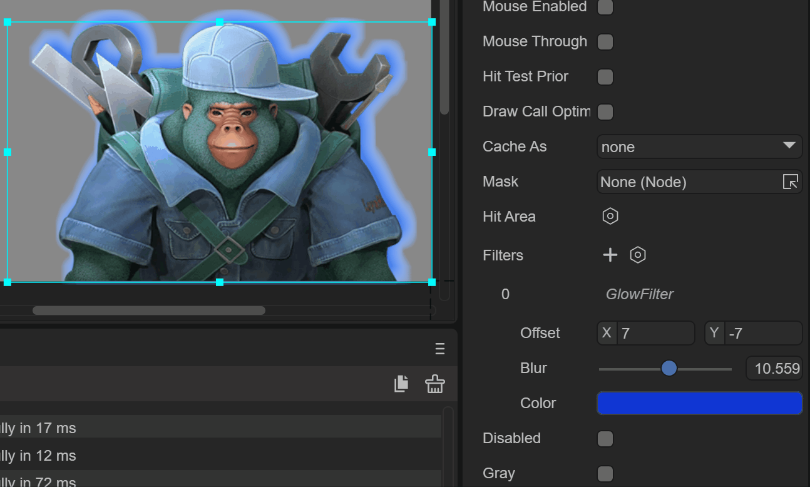

# UI滤镜效果


## 一、概述

滤镜，主要是用来实现图像的各种特殊效果，使图像取得最佳艺术效果。滤镜的类型有很多，但是营造不同的效果需要不同的滤镜功能。

LayaAir 引擎提供了颜色滤镜、发光(或阴影)滤镜、模糊滤镜三种效果，其中颜色滤镜支持 Canvas 与 WebGL 模式，而发光滤镜与模糊滤镜由于对性能的消耗较大，因此仅支持 WebGL 模式。


### 1.1 IDE中创建滤镜

在LayaAir 3.0中，除了Sprite 对象以外，你可以将滤镜应用于任何显示对象，通常我们对Image组件使用最多。如动图1.1所示，我们来看看如何在Image上使用滤镜


（动图1-1）

 

如图1-2所示，我们可以创建这三种滤镜

 

（图1-2）


### 1.2 同时生效

如图1-3所示，三种滤镜效果可以同时生效，开发者可以根据需要设置

 


## 二、颜色滤镜

ColorFilter 是颜色滤镜，颜色滤镜是图像后期处理中非常重要的一部分，它可以改变原有图像中的各种参数，从而在不改变图像大体的前提下，使其呈现出不同的风格。在实际操作时，颜色滤镜主要改变的参数为亮度、对比度、饱和度、色调等，整体来讲只改变颜色，并不对图像进行任何变形处理。正确地使用颜色滤镜，可以修正图像非正常曝光、缓解图片失真现象，从而突出主要细节，弱化掉一些不太好的部分。在艺术领域，颜色滤镜还被用来呈现不同的美学风格。


### 2.1 基础属性

如图2-1所示，颜色滤镜有5个属性

 

（图2-1）

`Color`：设置滤镜色

 

（动图2-2） 

`Brightness`：调整亮度

 

（动图2-3） 

`Contrast`：调整对比度

 

（动图2-3） 

`Saturation`：调整饱和度

 

（动图2-5） 

`Hue`：调整色调

 

（动图2-6） 


### 2.2 代码实现

可以直接创建 ColorFilter 类实现

```
import { MainBase } from "./Main.generated";

const { regClass, property } = Laya;

@regClass()
export class Main extends MainBase {

    onAwake() {
    
        //创建一个颜色滤镜对象
		var colorFilter: Laya.ColorFilter = new Laya.ColorFilter();
		//设置滤镜
		this.Image.filters = [colorFilter];
        //设置颜色
        colorFilter.color( 0.5, 0.5, 0.5, 1 );
        //设置亮度
        colorFilter.adjustBrightness(-50);
        //设置对比度
        colorFilter.adjustContrast(8);        
        //设置饱和度
        colorFilter.adjustSaturation(30);
        //设置对比度
        colorFilter.adjustHue(-15);
        
    }
}
```

也可以在IDE中添加 ColorFilter 后，通过组件获取

```
import { MainBase } from "./Main.generated";

const { regClass, property } = Laya;

@regClass()
export class Main extends MainBase {

    onAwake() {
        
        console.log("Game start");

        //获得Image的颜色滤镜对象
		var colorFilter: Laya.ColorFilter = this.Image.filters[0];
        //设置颜色
        colorFilter.color( 0.5, 0.5, 0.5, 1 );
        //设置亮度
        colorFilter.adjustBrightness(-50);
        //设置对比度
        colorFilter.adjustContrast(8);        
        //设置饱和度
        colorFilter.adjustSaturation(30);
        //设置对比度
        colorFilter.adjustHue(-15);
        
    }
}
```


## 三、模糊滤镜

BlurFilter 是模糊滤镜，就是产生模糊的效果


### 3.1 基础属性

如图3-1所示，模糊滤镜有1个属性

 

（图3-1）

`Strength`：模糊滤镜的强度值

 

（动图3-2） 


### 3.2 代码实现

直接创建 BlurFilter 类的实现方式

```
var blurFilter: BlurFilter = new BlurFilter();
//设置模糊强度
blurFilter.strength = 5;
ape.filters = [blurFilter];
```


## 四、发光滤镜

GlowFilter 是发光滤镜，就是创建放光效果或者阴影的效果，比如外发光


### 4.1 基础属性

如图4-1所示，发光滤镜有3个属性

 

（图4-1）

`Offset`：X轴，Y轴方向的偏移

 

（动图4-2） 

`Blur`：边缘模糊的大小

 

（动图4-3） 

`Color`：滤镜的颜色

 

（动图4-4） 


### 4.2 代码实现

直接创建 GlowFilter 类的实现方式

```
var glowFilter: GlowFilter = new GlowFilter("#ffff00", 10, 0, 0);
```

