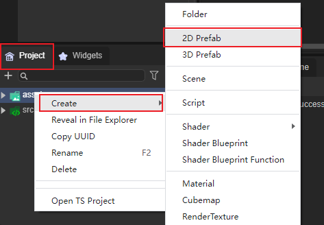
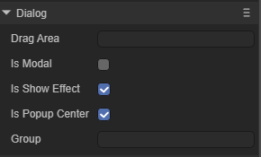

# Dialog组件参考

Dialog继承于View，主要用于弹窗面板，

## 1、Dialog组件创建

Dialog组件可以通过IDE的可视化操作直接进行创建，步骤为右键单击Scene2D，找到UI，点击Dialog即可创建完毕，如图1所示。

 

（图1）

也可以从IDE资源管理右侧组件面板的UI文件夹中，将Dialog组件拖拽到UI页面中，如动图2所示

 

（动图2）

如果我们想将Dialog作为根节点使用，可以在项目面板鼠标右键单击assets，找到Create，点击Prefab 2D，右键单击View，点击Change Type点击UI，点击Dialog即可创建完毕如图3、动图4所示

 

（图3）

 

（动图4）

## 2、Dialog属性介绍

 

(图5)

| 属性          | 功能                                                       |
| ------------- | ---------------------------------------------------------- |
| dragarea      | 拖动区域（格式：x，y，width，height），默认值为"0,0,0,0"。 |
| ismodal       | 是否是模式窗口，默认为不开启状态。                         |
| isshoweffect  | 是否显示弹出效果，默认为开启状态。                         |
| ispopupcenter | 指定对话框是否居中弹出，默认为开启状态。                   |
| group         | 组名称。                                                   |

### 2.1 Drag Area属性

在设置Drag Area属性后，可以在设置的数值范围内对Dialog进行拖动，默认为不设置，不设置即为不可拖动，如动图6所示。

 

（动图6）

在设置后只可以在设置的数值内拖动，在超出数值内的区域拖动是无效的，如动图6所示。

### 2.2 Is Modal属性

因为Dialog是弹窗，所以要设置弹窗的下层级是否可以进行点击，默认情况下是可以点击的，如果不想开启可自行关闭，关闭后即为不可点击状态（即不可穿透）。

### 2.3 Is Show Effect属性

### 2.4 Is Popup Center属性

