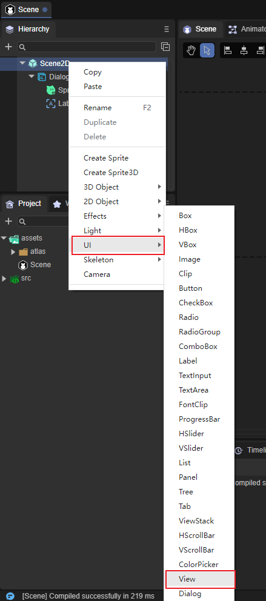
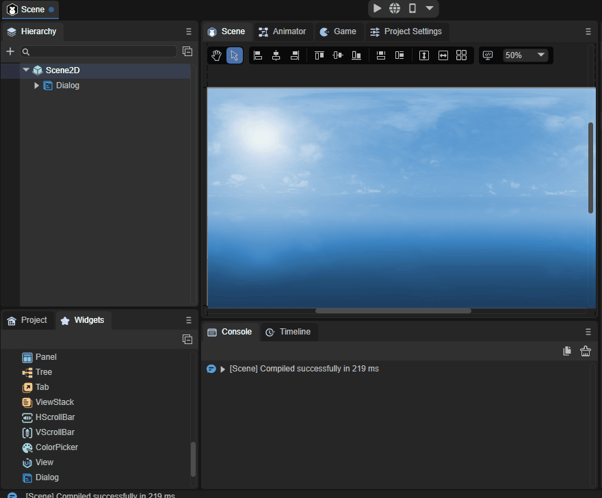
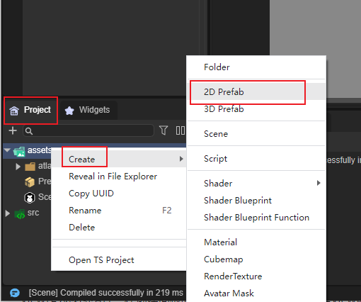
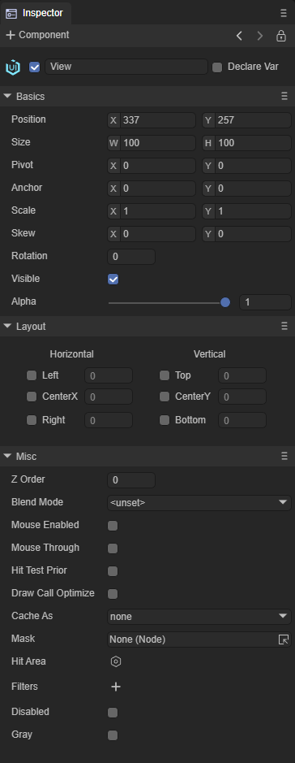

# View组件参考

View是视图组件， 常用于预制体场景的根节点。

## 1、创建View组件

创建View组件非常简单，步骤是右键单击Scene2D，找到UI，点击View即可创建完毕，如图1所示。

 

（图1）

也可以从IDE资源管理右侧组件面板的UI文件夹中，将View组件拖拽到UI页面中，如动图2所示。

 

（动图2）

如果想将view作为根节点使用，可以在项目面板鼠标右键单击assets，找到Create，点击2D Prefab即可创建完毕，如图3所示。

 

（图3）

## 2、View属性介绍

View并没有自己专属的属性。

 

（图4）

View作为视图组件，在创建面板时会用到，与Scence不同的是View增加了相对布局，所以在需要屏幕适配和相对布局时推荐使用View。

