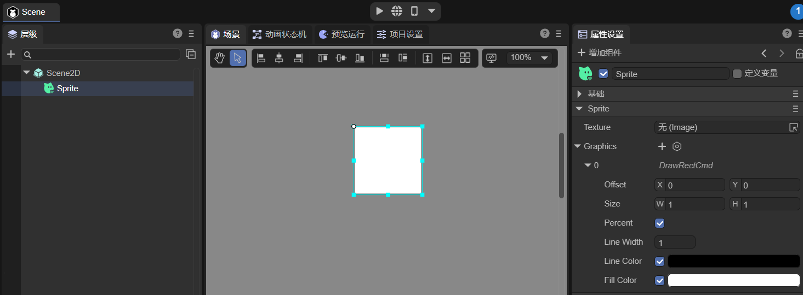
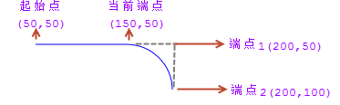
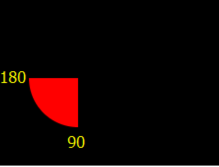
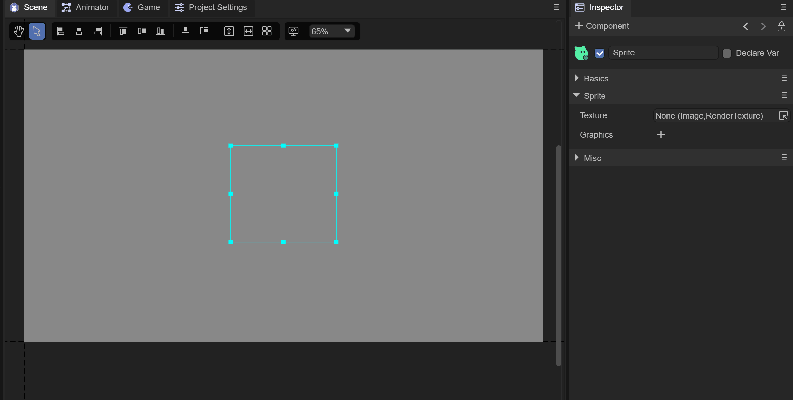
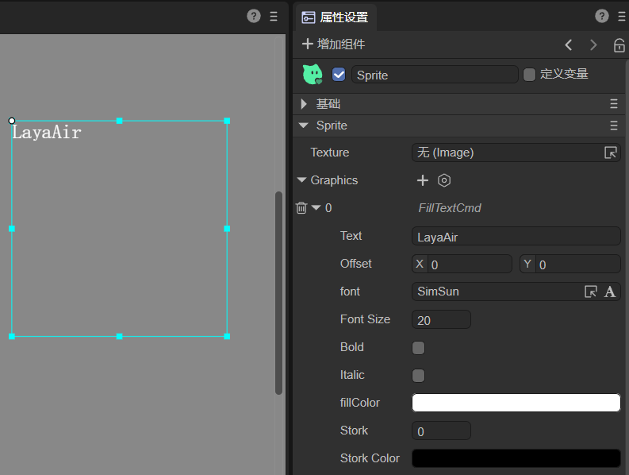
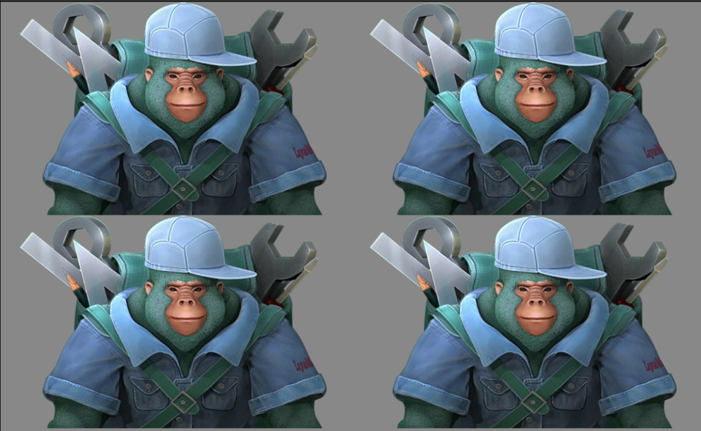

# 绘制图形

## 一、IDE中绘制图形

LayaAir中可以在Sprite对象中通过使用图形组件来绘制各种图形，如动图1-1所示。


（动图1-1）

在IDE中可以通过这些选项来绘制Graphics，如图1-2所示，


（图1-2）

LayaAir引擎中 `laya.display.Graphics` 类可以查看到API的各种矢量绘图方法。

- `drawRect`
- `fillText`
- `drawPath`
- `drawCircle`
- `drawPie`
- `drawLine`
- `drawLines`
- `drawPoly`
- `drawCurves`
- ......

下面将对这些Graphics进行讲解。


## 二、绘制矩形与圆角矩形

### 2.1 IDE绘制矩形

在Sprite对象的 Graphics 组件中，可以通过点击 `+` 来创建一个绘制图形命令。选择第一个选项 `创建 矩形（DrawRectCmd）`，创建后如图2-1所示。



（图2-1）

`Offset`：矩形相对于Sprite对象，X轴，Y轴的偏移量。

`Size`：矩形的尺寸，默认使用百分比，也可以取消百分比勾选，采用像素值设置。

`Percent`：当勾选时，矩形的尺寸为Sprite对象尺寸的百分比，当不勾选时，矩形的尺寸为像素大小。

`Line Width`：绘制矩形的边框宽度值。

`Line Color`：绘制矩形的边框颜色。

`Fill Color`：矩形填充的颜色。

动图2-2演示了这些属性的操作过程：

 

（动图2-2）


### 2.2 代码绘制矩形

LayaAir引擎中的 `drawRect()` 方法用于绘制矢量矩形。该方法的详细说明如下：

```typescript
    /**
     * 绘制矩形。
     * @param x			开始绘制的 X 轴位置。
     * @param y			开始绘制的 Y 轴位置。
     * @param width		矩形宽度。
     * @param height	矩形高度。
     * @param fillColor	填充颜色，或者填充绘图的渐变对象。
     * @param lineColor	（可选）边框颜色，或者填充绘图的渐变对象。
     * @param lineWidth	（可选）边框宽度。
     * @param percent 位置和大小是否是百分比值。
     */
    drawRect(x: number, y: number, width: number, height: number, fillColor: any, lineColor: any = null, lineWidth: number = 1, percent?: boolean): DrawRectCmd {
        return this.addCmd(DrawRectCmd.create(x, y, width, height, fillColor, lineColor, lineWidth, percent));
    }
```

代码示例：

```typescript
let sp = new Laya.Sprite();
//画矩形
sp.graphics.drawRect(20, 20, 100, 50, "#ffff00", "#00ff00", 5, false);
this.owner.addChild(sp);
```

示例中的 20，20 是矩形起始点坐标，100是向右的宽度，如果是负数则是向左的宽度。50是向下的高度，如果是负数则是向上的高度。

运行效果：


（图2-3）


### 2.3 用drawPath绘制矩形

LayaAir引擎 `laya.display.Graphics` 类的绘制路径的方法 `drawPath()` 可以根据路径绘制矢量图形：

```typescript
/**
* 绘制路径。
* @param x		开始绘制的 X 轴位置。
* @param y		开始绘制的 Y 轴位置。
* @param paths	路径集合，路径支持以下格式：[["moveTo",x,y],["lineTo",x,y],["arcTo",x1,y1,x2,y2,r],["closePath"]]。
* @param brush	（可选）刷子定义，支持以下设置{fillStyle:"#FF0000"}。
* @param pen	（可选）画笔定义，支持以下设置{strokeStyle,lineWidth,lineJoin:"bevel|round|miter",lineCap:"butt|round|square",miterLimit}。
*/
drawPath(x: number, y: number, paths: any[], brush: any = null, pen: any = null): DrawPathCmd {
	return this.addCmd(DrawPathCmd.create(x, y, paths, brush, pen));
}
```

代码示例：

```typescript
let sp = new Laya.Sprite();
//自定义路径
let path:Array<any> =  [
["moveTo", 0, 0], //画笔移到A点
["lineTo", 100, 0],//画到B点
["lineTo", 100, 50],//再画到C点
["lineTo", 0, 50], //继续画到D点
["closePath"] //闭合路径
];
//绘制矩形
sp.graphics.drawPath(20, 20, path, {fillStyle: "#ff0000"});
this.owner.addChild(sp);
```

drawPath 第一和第二位的坐标点“20,20”是控制整体位置的起始位置，第三位是路径参数。

描述信息 MoveTo 是将画笔移动初始位置，此时并没有开始画。”0,0”是相对于”20,20”这个起始位置的，所以A点还是在起始位置原点。描述信息 lineto 是绘制到路径点坐标，“100，0”这个就是绘制到B点位置的坐标。C点和D点以此类推，最后通过描述信息 closePath 与MoveTo的起点位置闭合，否则是不会被闭合的。

从绘制矩形来看，drawPath 方法肯定没有 drawRect 方法更加方便。但是开发者可以通过这个示例理解相关的参数用法。

运行效果（A、B、C、D四个点在运行时并不显示，这是截图后为了方便描述加上去的）：

  

（图2-4） 


### 2.4 IDE绘制圆角矩形

在Sprite对象的 Graphics 组件中，可以通过点击 `+` 来创建一个绘制图形命令，如图2-5所示，选择 `创建 圆角矩形（DrawRoundRectCmd）` 绘制圆角矩形。


（图2-5）

`Offset`：圆角矩形相对于Sprite对象，X轴，Y轴的偏移量。

`Size`：圆角矩形的尺寸，默认使用百分比，也可以取消百分比勾选，采用像素值设置。

`Border Radius`：各个圆角的半径。X：左上圆角，Y：右上圆角，Z：左下圆角，W：右下圆角。

`Percent`：当勾选时，圆角矩形的尺寸为Sprite对象尺寸的百分比，当不勾选时，圆角矩形的尺寸为像素大小。

`Line Width`：绘制圆角矩形的边框宽度值。

`Line Color`：绘制圆角矩形的边框颜色。

`Fill Color`：圆角矩形填充的颜色。


### 2.5 代码绘制圆角矩形

LayaAir引擎中的 `drawRoundRect()` 方法用于绘制圆角矩形。该方法的详细说明如下：

```typescript
    /**
     * 绘制圆角矩形
     * @param x             开始绘制的 X 轴位置。
     * @param y             开始绘制的 Y 轴位置。
     * @param width         圆角矩形宽度。
     * @param height        圆角矩形高度。
     * @param lt            左上圆角
     * @param rt            右上圆角
     * @param lb            左下圆角
     * @param rb            右下圆角
     * @param fillColor     填充颜色，或者填充绘图的渐变对象。
     * @param lineColor     （可选）边框颜色，或者填充绘图的渐变对象。
     * @param lineWidth     （可选）边框宽度。
     * @param percent       （可选）位置和大小是否是百分比值。
     * @returns 
     */
    drawRoundRect(x: number, y: number, width: number, height: number, lt: number, rt: number, lb: number, rb: number, fillColor: any, lineColor: any = null, lineWidth: number = 1, percent?: boolean) {
        return this.addCmd(DrawRoundRectCmd.create(x, y, width, height, lt, rt, lb, rb, fillColor, lineColor, lineWidth, percent));
    }
```

代码示例：

```typescript
let sp = new Laya.Sprite();
sp.graphics.drawRoundRect(200, 200, 300, 300, 20, 20, 20, 20, "#ffff00", "#00ff00", 5, false);
this.owner.addChild(sp);
```

示例中的 200，200 是矩形起始点坐标，第一个300是向右的宽度，如果是负数则是向左的宽度。第二个300是向下的高度，如果是负数则是向上的高度。四个20为各圆角的半径。"#ffff00"为填充颜色，"#00ff00"为边框颜色。5是边框宽度，false表示位置和大小不采用百分比值，而采用像素。

运行效果：


（图2-6）

除了用LayaAir自带的方法绘制圆角矩形外，还可以用直线和弧线拼接出一个圆角矩形。


### 2.6 用drawPath绘制圆角矩形

LayaAir引擎中可以使用 graphics 的 `drawPath` 方法绘制圆角或弧线，具体的操作需要三步，指定绘制路径的起始点 ["moveTo", x, y]、绘制一条水平直线["lineTo", x, y]、绘制弧线 ["arcTo", p1.x, p1.y, p2.x, p2.y, r]。

#### 2.6.1 参数示例

```
["moveTo", 50, 50],["lineTo", 150, 50],["arcTo", 200, 50, 200, 100, 50],
```

上述参数运行效果如图2-7所示：



（图2-7）

通过图2-7我们可以看出，`["moveTo", 50, 50]` 将画笔的起始点定位于`"50,50"`这个位置。`["lineTo", 150, 50]` 绘制了一条由于起始点到当前端点（”150, 50“）的直线。`["arcTo", 200, 50, 200, 100, 50]` 绘制了一段r（半径）为50弧线。

#### 2.6.2 弧线绘制原理

在制作这段弧线时，这个弧其实是利用当前端点`"150, 50"`、端点1`"200, 50"`、端点2`"200, 100"`，这三个端点所形成的夹角，制作一条半径为50px并且与两边相切的圆上的一段弧线。

如果已经理解了弧线的绘制原理，还会发现，构成弧线的核心要素为两条边和与两边形成夹角的顶点（上例中的端点1），图2-7中的端点2与端点1形成的x轴边比较好理解，那当前端点与端点1已经构成了y轴边，那与当前端点在同一个y轴的起始点是不是可以去掉呢，事实并不可以。画笔的起始点必须存在，但是绘制直线的lineTo可以去掉，如果`["lineTo", 150, 50],`被注释掉，那么arcTo绘制弧线的时候，会视起始点为当前端点，arcTo找不到lineTo绘制的直线时，会自动添加一条由起始点到弧线起点的直线，因此，绘制圆角矩形时，lineTo可以省略。

#### 2.6.3 绘制圆角矩形示例

下面绘制一个圆角弧线半径为30的圆角矩形，示例代码如下：

```typescript
let sp = new Laya.Sprite();
//自定义路径
var path:any[] =  [
    ["moveTo", 0, 0], //画笔的起始点
    ["lineTo",400,0],
    ["arcTo", 500, 0, 500, 30, 30], //p1（500,0）为夹角B，（500,30）为端点p2
    ["lineTo",500,200],
    ["arcTo", 500, 300, 470, 300, 30],//p1（500,300）为夹角C，（470,300）为端点p2
    ["lineTo",30,300],
    ["arcTo", 0, 300, 0, 270, 30], //p1(0,300)为夹角D，（0,270）为端点p2
    ["lineTo",0,100],
    ["arcTo", 0, 0, 30, 0, 30],//p1(0,0)为夹角A，（30,0）为端点p2
];
//绘制圆角矩形
sp.graphics.drawPath(100, 100, path, {fillStyle: "#ff0000"});
this.owner.addChild(sp);
```

代码运行效果： 


（图2-8） 

在上面的代码里，看起来没有任何问题，其实moveTo的起始点，需要在圆弧之间的直线上，下面我们只需要在 drawPath 绘制时，增加一个边框线，就可以清楚的看出错误。绘制方法 graphics.drawPath 修改为：

```typescript
//绘制圆角矩形
sp.graphics.drawPath(100, 100, path, {fillStyle: "#ff0000"},{"strokeStyle":"#ffffff","lineWidth":"10"});
```

修改后运行效果如图2-9所示，由于画线的时候，从画笔的起始点`0,0`开始的，所以并不是我们想要的结果。


（图2-9） 

下面将示例修改为正确的代码：

```typescript
let sp = new Laya.Sprite();
//自定义路径
var path:any[] =  [
    ["moveTo", 30, 0], //画笔的起始点
    ["lineTo",400,0],
    ["arcTo", 500, 0, 500, 30, 30], //p1（500,0）为夹角B，（500,30）为端点p2
    ["lineTo",500,200],
    ["arcTo", 500, 300, 470, 300, 30],//p1（500,300）为夹角C，（470,300）为端点p2
    ["lineTo",30,300],
    ["arcTo", 0, 300, 0, 270, 30], //p1(0,300)为夹角D，（0,270）为端点p2
    ["lineTo",0,100],
    ["arcTo", 0, 0, 30, 0, 30],//p1(0,0)为夹角A，（30,0）为端点p2
];
//绘制圆角矩形
sp.graphics.drawPath(100, 100, path, {fillStyle: "#ff0000"},{"strokeStyle":"#ffffff","lineWidth":"10"});
this.owner.addChild(sp);
```

运行效果如图2-10所示：


（图2-10） 


## 三、绘制圆形、椭圆与扇形

### 3.1 IDE绘制圆形

在Sprite对象的 Graphics 组件中，可以通过点击 `+` 来创建一个绘制图形命令。选择 `创建 圆形（DrawCircleCmd）` 绘制圆形，创建后如图3-1所示。 


（图3-1）

`Offset`：圆形相对于Sprite对象，X轴，Y轴的偏移量。

`Radius`：圆形相对于Sprite对象的尺寸。

`Percent`：当勾选时，圆形的Offset和Radius为Sprite对象尺寸的百分比，当不勾选时，圆形的尺寸为像素大小。

`Line Width`：圆形线的宽度。

`Line Color`：圆形线的颜色。

`Fill Color`：圆形填充的颜色。


### 3.2 代码绘制圆形

LayaAir引擎中的 `drawCircle()` 方法用于绘制矢量圆形。该方法的详细说明如下：

```typescript
    /**
     * 绘制圆形。
     * @param x			圆点X 轴位置。
     * @param y			圆点Y 轴位置。
     * @param radius	半径。
     * @param fillColor	填充颜色，或者填充绘图的渐变对象。
     * @param lineColor	（可选）边框颜色，或者填充绘图的渐变对象。
     * @param lineWidth	（可选）边框宽度。
     */
    drawCircle(x: number, y: number, radius: number, fillColor: any, lineColor: any = null, lineWidth: number = 1): DrawCircleCmd {
        return this.addCmd(DrawCircleCmd.create(x, y, radius, fillColor, lineColor, lineWidth));
    }
```

代码示例：

```typescript
let sp = new Laya.Sprite();
//画圆
sp.graphics.drawCircle(80,80,50,"#ff0000");
this.owner.addChild(sp);
```

圆形绘制比较简单，“80，80”是圆形中心点坐标。50是半径，”#ff0000”是圆形填充颜色值。

运行效果：


（图3-2）


### 3.3 IDE绘制椭圆

在Sprite对象的 Graphics 组件中，可以通过点击 `+` 来创建一个绘制图形命令。选择 `创建 椭圆形（DrawEllipseCmd）` 绘制椭圆，创建后如图3-3所示。 


（图3-3）

`Offset`：椭圆相对于Sprite对象，X轴，Y轴的偏移量。

`Width`：椭圆相对于Sprite的横向半径。

`Height`：椭圆相对于Sprite的纵向半径。

`Percent`：当勾选时，椭圆的Offset、Width、Height为Sprite对象尺寸的百分比，当不勾选时，圆形的尺寸为像素大小。

`Line Width`：椭圆线的宽度。

`Line Color`：椭圆线的颜色。

`Fill Color`：椭圆填充的颜色。


### 3.4 代码绘制椭圆

LayaAir引擎中的 `drawEllipse` 方法用于绘制矢量椭圆。该方法的详细说明如下：

```typescript
    /**
     * 绘制椭圆形
     * @param x         圆点X 轴位置。
     * @param y         圆点Y 轴位置。
     * @param width     横向半径。
     * @param height    纵向半径。
     * @param fillColor 填充颜色，或者填充绘图的渐变对象。
     * @param lineColor （可选）边框颜色，或者填充绘图的渐变对象。
     * @param lineWidth （可选）边框宽度。
     * @param percent   （可选）位置和大小是否是百分比值。
     */
    drawEllipse(x: number, y: number, width: number, height: number, fillColor: any, lineColor: any, lineWidth: number, percent?: boolean): DrawEllipseCmd {
        return this.addCmd(DrawEllipseCmd.create(x, y, width, height, fillColor, lineColor, lineWidth, percent));
    }
```

代码示例：

```typescript
let sp = new Laya.Sprite();
//画椭圆
sp.graphics.drawEllipse(200, 200, 50, 100, "#ff0000", "#ffffff", 5);
this.owner.addChild(sp);
```

其中，“200，200”是椭圆中心点坐标。50，100是椭圆的横向和纵向半径。”#ff0000”是填充颜色值，"#ffffff"是椭圆边框颜色，5是边框宽度。

运行效果：


（图3-4）


### 3.5 代码绘制扇形

下面继续延伸，介绍一下扇形绘制方法 `drawPie()` ，该方法的详细说明如下：

```typescript
    /**
     * 绘制扇形。
     * @param x				开始绘制的 X 轴位置。
     * @param y				开始绘制的 Y 轴位置。
     * @param radius		扇形半径。
     * @param startAngle	开始角度。
     * @param endAngle		结束角度。
     * @param fillColor		填充颜色，或者填充绘图的渐变对象。
     * @param lineColor		（可选）边框颜色，或者填充绘图的渐变对象。
     * @param lineWidth		（可选）边框宽度。
     */
    drawPie(x: number, y: number, radius: number, startAngle: number, endAngle: number, fillColor: any, lineColor: any = null, lineWidth: number = 1): DrawPieCmd {
        return this.addCmd(DrawPieCmd.create(x, y, radius, Utils.toRadian(startAngle), Utils.toRadian(endAngle), fillColor, lineColor, lineWidth));
    }
```

代码示例：

```typescript
let sp = new Laya.Sprite();
//画扇形
sp.graphics.drawPie(80, 80, 50, 90, 180, "#ff0000");
this.owner.addChild(sp);
```

代码运行效果如下图所示：



（图3-5） 

绘制扇形与圆形类似，前三个参数的用法也是一样的，只是增加了绘制开始与结束的角度。为了让大家更好的理解，扇形的绘制代码与参数沿用圆形代码示例，除了方法名的改变，只增加了90与180两个角度参数。大家可在编码过程中通过调整参数，再深入理解。


## 四、绘制三角形、多边形及根据数据绘制图案

### 4.1 IDE绘制三角形，多边形

在Sprite对象的 Graphics 组件中，可以通过点击 `+` 来创建一个绘制图形命令。选择 `创建 多边形（DrawPolyCmd）` 绘制三角形、多边形，创建后如图4-1所示。


（图4-1）

`Offset`：多边形相对于Sprite对象，X轴，Y轴的偏移量，单位是像素。

`Points`：多边形的点集合，三角形也是一个多边形，只不过是3个点。

`Line Width`：多边形线框的宽度。

`Line Color`：多边形线框的颜色。

`Fill Color`：多边形填充的颜色。

动图4-2演示了如何创建一个多边形：

 

（动图4-2）


### 4.2 代码绘制三角形

绘制三角形、多边形以及根据指定的路径数据绘制出图案，均可使用LayaAir引擎中 laya.display.Graphics 类的 `drawpoly()` 方法实现。该方法的详细说明如下：

```typescript
    /**
     * 绘制多边形。
     * @param x			开始绘制的 X 轴位置。
     * @param y			开始绘制的 Y 轴位置。
     * @param points	多边形的点集合。
     * @param fillColor	填充颜色，或者填充绘图的渐变对象。
     * @param lineColor	（可选）边框颜色，或者填充绘图的渐变对象。
     * @param lineWidth	（可选）边框宽度。
     */
    drawPoly(x: number, y: number, points: any[], fillColor: any, lineColor: any = null, lineWidth: number = 1): DrawPolyCmd {
        return this.addCmd(DrawPolyCmd.create(x, y, points, fillColor, lineColor, lineWidth));
    }
```

代码示例：

```typescript
let sp = new Laya.Sprite();
//画三角形
sp.graphics.drawPoly(30, 28, [0, 100, 50, 0, 100, 100], "#ffff00");
this.owner.addChild(sp);
```

运行效果：

  

（图4-3） 

通过代码可以看出，`drawPoly` 第三位参数的“0，100”是A点坐标。“50，0”是B点坐标。“100, 100”是C点坐标，将三个坐标点连接后填充第四位参数的颜色值，即绘制出上图的黄色三角形。但是这里需要大家理解和注意的是，第三位参数中所有的坐标都是相对坐标，都会受到第一位和第二位坐标参数“30，28”的影响。一旦“30，28”产生改变，整体形状位置都会受到影响。


### 4.3 代码绘制多边形

继续用上面的代码示例，通过增加 `drawPoly` 第三位参数的坐标，来实现多边形的绘制，修改的代码如下：

```typescript
let sp = new Laya.Sprite();
//画多边形
sp.graphics.drawPoly(30, 28, [0, 100, 50, 0, 100, 100, 75, 150, 25, 150], "#ffff00");
this.owner.addChild(sp);
```

代码运行效果如下图所示：

 

（图4-4）

在修改的代码中，新增了D点坐标”75，150“与E点坐标”25，150“。通过将各个坐标点连接填充颜色后，即绘制出我们想要的多边形。要绘制更多边的多边形，按上述方式增加坐标点即可。


### 4.4 根据指定的路径数据绘制出图案

下面通过示例深入介绍一下，如何指定路径绘制一个五角星。示例代码如下：

```typescript
let sp = new Laya.Sprite();
//画五角星
var path: Array<number> = [];
path.push(0, -130);//五角星A点坐标
path.push(33, -33);//五角星B点坐标
path.push(137, -30);//五角星C点坐标
path.push(55, 32);//五角星D点坐标
path.push(85, 130);//五角星E点坐标
path.push(0, 73);//五角星F点坐标
path.push(-85, 130);//五角星G点坐标
path.push(-55, 32);//五角星H点坐标
path.push(-137, -30);//五角星I点坐标
path.push(-33, -33);//五角星J点坐标
sp.graphics.drawPoly(Laya.stage.width / 2, Laya.stage.height / 2, path, "#FF7F50");
this.owner.addChild(sp);
```

代码运行效果如下图所示：

 

 （图4-5）

通过上面的示例代码的写法，是不是感觉代码的可读性得到了增强，大家也可以将之前的三角形或多边形改成这种方式去体验一下，掌握了这些基础，可以衍生出很多灵活的用法。


## 五、绘制线段与折线

### 5.1 IDE绘制线段

在Sprite对象的 Graphics 组件中，可以通过点击 `+` 来创建一个绘制图形命令。选择 `创建 线段（DrawLineCmd）` 绘制线段，创建后如图5-1所示。


（图5-1）

`From`：线的起始点，相对于Sprite对象，X轴，Y轴的偏移量。

`To`：线的终点，相对于Sprite对象，X轴，Y轴的偏移量。

`Percent`：当勾选时，线的起始点和终点为Sprite对象尺寸的百分比，当不勾选时，线的起始点和终点为像素点。

`Line Width`：线的宽度。

`Line Color`：线的颜色。


### 5.2 代码绘制线段

Laya引擎中 `laya.display.Graphics` 类中 `drawLine()` 方法用于绘制线段。该方法的详细说明如下：

```typescript
    /**
     * 绘制一条线。
     * @param fromX		X轴开始位置。
     * @param fromY		Y轴开始位置。
     * @param toX		X轴结束位置。
     * @param toY		Y轴结束位置。
     * @param lineColor	颜色。
     * @param lineWidth	（可选）线条宽度。
     */
    drawLine(fromX: number, fromY: number, toX: number, toY: number, lineColor: string, lineWidth: number = 1): DrawLineCmd {
        return this.addCmd(DrawLineCmd.create(fromX, fromY, toX, toY, lineColor, lineWidth));
    }

```

代码示例：

```typescript
let sp = new Laya.Sprite();
//画直线
sp.graphics.drawLine(10, 58, 146, 58, "#ff0000", 3);
this.owner.addChild(sp);
```

运行效果：


（图5-2）


### 5.3 IDE绘制折线

在Sprite对象的 Graphics 组件中，可以通过点击 `+` 来创建一个绘制图形命令。选择 `创建 折线（DrawLinesCmd）` 绘制折线，创建后如图5-3所示。 


（图5-3）

`Offset`：线段相对于Sprite对象，X轴，Y轴的偏移量，单位是像素。

`Points`：线段的点集合。

`Line Width`：线的宽度。

`Line Color`：线的颜色。


### 5.4 代码绘制折线

Laya引擎中 `laya.display.Graphics` 类中 `drawLines()` 方法用于绘制折线。该方法与 `drawLine` 比较像，编码时千万不要漏掉了末尾的“s”。`drawLines` 的参数详细说明如下：

```typescript
    /**
     * 绘制一系列线段。
     * @param x			开始绘制的X轴位置。
     * @param y			开始绘制的Y轴位置。
     * @param points	线段的点集合。格式:[x1,y1,x2,y2,x3,y3...]。
     * @param lineColor	线段颜色，或者填充绘图的渐变对象。
     * @param lineWidth	（可选）线段宽度。
     */
    drawLines(x: number, y: number, points: any[], lineColor: any, lineWidth: number = 1): DrawLinesCmd | null {
        if (!points || points.length < 4) return null;
        return this.addCmd(DrawLinesCmd.create(x, y, points, lineColor, lineWidth));
    }
```

代码示例：

```typescript
let sp = new Laya.Sprite();
//画折线
sp.graphics.drawLines(20, 88, [0, 0, 39, -50, 78, 0, 120, -50], "#ff0000", 3);
this.owner.addChild(sp);
```

运行效果：  


（图5-4） 

通过代码，我们可以看出，画折线与画直线的参数区别是从第三位开始，第三位参数是Array类型的折线点集合，其中的“0，0”是折点A的起始坐标。“39，-50”是折点B的起始坐标。“78, 0”是折点C的起始坐标，“120, -50”是终点D的坐标。但是这里需要大家理解和注意的是，第三位参数中所有的坐标都是相对坐标，都会受到第一位和第二位参数的“20，88”而影响。一旦“20，88”产生改变，整体折线都会受到影响。


## 六、绘制曲线

相对于直线而言，曲线的绘制与坐标关系更难理解一些。由于LayaAir引擎绘制的是贝塞尔曲线，所以本文中先针对贝塞尔曲线的基础进行说明，然后再结合引擎的API进行讲解。

### 6.1 贝塞尔曲线的基础

贝塞尔曲线在港澳台等地称为貝茲曲線，新加坡马来西亚等地称为贝济埃曲线。一般的矢量图形软件通过它来精确画出曲线，贝塞尔曲线由线段与节点组成，节点是可拖动的支点，线段像可伸缩的皮筋，我们在绘图工具上看到的钢笔工具就是来做这种矢量曲线的。

贝塞尔曲线是应用于二维图形应用程序的数学曲线。曲线的定义有四个点：起始点、终止点（也称锚点）以及两个相互分离的中间点。滑动两个中间点，贝塞尔曲线的形状会发生变化。

基于线性、二次方、三次方等公式的不同，贝塞尔曲线也被称为一次、二次……五次贝塞尔曲线，有些文章也称为一阶、二阶……说的是一回事。下面通过动图让大家直观的理解一下：

#### **6.1.1 一次贝塞尔曲线**

 

（动图6-1）

说明：上图是由 P0 至 P1 的连续点， 描述的是一条线性的贝赛尔曲线。线性贝塞尔曲线函数中的 t 会经过由 P0 至 P1 的 B(t) 所描述的曲线。例如当 t=0.25 时，B(t) 即一条由点 P0 至 P1 路径的四分之一处。就像由 0 至 1 的连续 t，B(t) 描述一条由 P0 至 P1 的直线。

#### 6.1.2 二次贝塞尔曲线

 

 （动图6-2）

 

 （动图6-3）

说明：为建构二次贝塞尔曲线，上图由 P0 至 P1 的连续点 Q0，描述一条线性贝塞尔曲线。由 P1 至 P2 的连续点 Q1，描述一条线性贝塞尔曲线。由 Q0 至 Q1 的连续点 B(t)，描述一条二次贝塞尔曲线。

#### 6.1.3 三次贝塞尔曲线

 

 （动图6-4）

 

 （动图6-5）

说明：对于三次曲线，可由线性贝塞尔曲线描述的中介点 Q0、Q1、Q2，和由二次曲线描述的点 R0、R1 所建构。

#### 6.1.4 高阶贝塞尔曲线

由于高阶贝塞尔曲线并不常见，本文将不再详细说明，想对贝塞尔曲线原理了解更多的可以查看其它相关文章。

 

 （动图6-6） 四次贝塞尔曲线

 

 （动图6-7） 五次贝塞尔曲线


### 6.2 代码绘制二次贝塞尔曲线

LayaAir引擎的曲线绘制采用的是二次贝塞尔曲线，开发者可以用 laya.display.Graphics 类的 `drawCurves()` 方法来绘制曲线。该方法的详细说明如下：

```typescript
    /**
     * 绘制一系列曲线。
     * @param x			开始绘制的 X 轴位置。
     * @param y			开始绘制的 Y 轴位置。
     * @param points	线段的点集合，格式[controlX, controlY, anchorX, anchorY...]。
     * @param lineColor	线段颜色，或者填充绘图的渐变对象。
     * @param lineWidth	（可选）线段宽度。
     */
    drawCurves(x: number, y: number, points: any[], lineColor: any, lineWidth: number = 1): DrawCurvesCmd {
        return this.addCmd(DrawCurvesCmd.create(x, y, points, lineColor, lineWidth));
    }
```

下面我们用LayaAir引擎绘制矢量曲线，示例代码如下：

```typescript
let sp = new Laya.Sprite();
//画折线
sp.graphics.drawCurves(10, 58, [0, 0, 19, -100, 39, 0], "#ff0000", 3);
this.owner.addChild(sp);
```

运行效果如下：


（图6-8）

通过增加 `drawCurves` 的第三位points点集合的参数，我们可以让曲线更复杂一些，修改的示例代码如下：

```typescript
//增加58, 100与78, 0坐标让曲线更复杂一些
sp.graphics.drawCurves(10, 58, [0, 0, 19, -100, 39, 0, 58, 100, 78, 0], "#ff0000", 3) ;
```

运行效果如下： 


（图6-9）

如果想绘制更复杂的曲线，可自行调整 `drawCurves` 中的参数，再结合二次贝赛尔曲线原理进行理解。

最后提醒一下，与绘制折线一样，第三位参数中所有的坐标都是相对坐标，都会受到第一位和第二位参数的“10，58”而影响。一旦“10，58”产生改变，整体曲线都会受到影响。


## 七、绘制文本

### 7.1 IDE绘制文本

在Sprite对象的 Graphics 组件中，可以通过点击 `+` 来创建一个绘制图形命令。选择 `创建 文本（FillTextCmd）` 绘制文本，创建后如图7-1所示。



（图7-1）

`Text`：显示的文本内容。

`Offset`：文本距离Sprite原点（0，0）坐标位置的偏移值。

`font`：文本的字体设置。

`Font Size`：文本的字体大小。

`Bold`：文本是否为粗体。

`Italic`：文本是否为斜体。

`fillColor`：文本颜色。

`Stork`：文本的描边宽度，0表示不描边。

`Stork Color`：文本的描边颜色。


### 7.2 代码绘制文本

Laya引擎中 `laya.display.Graphics` 类中 `fillText()` 方法用于绘制文本。该方法的详细说明如下：

```typescript
    /**
     * 在画布上绘制文本。
     * @param text 在画布上输出的文本。
     * @param x 开始绘制文本的 x 坐标位置（相对于画布）。
     * @param y 开始绘制文本的 y 坐标位置（相对于画布）。
     * @param font 定义字号和字体，比如"20px Arial"。
     * @param color 定义文本颜色，比如"#ff0000"。
     * @param textAlign 文本对齐方式，可选值："left"，"center"，"right"。
     */
    fillText(text: string | WordText, x: number, y: number, font: string, color: string, textAlign: string): FillTextCmd {
        return this.addCmd(FillTextCmd.create(text, x, y, font, color, textAlign, 0, ""));
    }
```

代码示例：

```typescript
let sp = new Laya.Sprite();
// 绘制文本
sp.graphics.fillText("LayaAir", 100, 100, "20px Arial", "#ff0000", "center");
this.owner.addChild(sp);
```

运行效果：


（图7-2）


## 八、绘制填充纹理

### 8.1 IDE绘制填充纹理

在Sprite对象的 Graphics 组件中，可以通过点击 `+` 来创建一个绘制图形命令。选择 `创建 填充纹理（FillTextureCmd）` 绘制填充纹理，创建后如图8-1所示。 


（图8-1）

`Texture`：设置纹理图像。

`Position`：纹理相对于Sprite对象的位置。

`Size`：纹理的尺寸，默认使用百分比，也可以取消百分比勾选，采用像素值设置。

`Percent`：当勾选时，纹理的尺寸为Sprite对象尺寸的百分比，当不勾选时，纹理的尺寸为像素大小。

`Type`：纹理填充的类型：重复、仅x轴重复、仅y轴重复、不重复。

`Offset`：纹理相对于Sprite对象，X轴，Y轴的偏移量，单位是像素。

`Color`：纹理的颜色。


### 8.2 代码绘制填充纹理

Laya引擎中 `laya.display.Graphics` 类中 `fillTexture()` 方法用于绘制填充纹理。该方法的详细说明如下：

```typescript
    /**
     * 用 texture 填充。
     * @param texture		纹理。
     * @param x			X轴偏移量。
     * @param y			Y轴偏移量。
     * @param width		（可选）宽度。
     * @param height	（可选）高度。
     * @param type		（可选）填充类型 repeat|repeat-x|repeat-y|no-repeat
     * @param offset	（可选）贴图纹理偏移
     * @param color	 	 （可选）颜色
     *
     */
    fillTexture(texture: Texture, x: number, y: number, width: number = 0, height: number = 0, type: string = "repeat", offset: Point | null = null, color: string = null): FillTextureCmd | null {
        if (texture && texture.bitmap)
            return this.addCmd(FillTextureCmd.create(texture, x, y, width, height, type, offset || Point.EMPTY, color));
        else
            return null;
    }
```

代码示例：

```typescript
Laya.loader.load("resources/layaAir.png").then((res: Laya.Texture) => {
    let sp = new Laya.Sprite();
    // 绘制填充纹理
    sp.graphics.fillTexture(res, 0, 0, 500, 500, "repeat");
    this.owner.addChild(sp);
});
```

运行效果：


（图8-2）


## 九、绘制九宫格纹理

### 9.1 IDE绘制九宫格纹理

在Sprite对象的 Graphics 组件中，可以通过点击 `+` 来创建一个绘制图形命令。选择 `创建 九宫格纹理（Draw9GridTextureCmd）` 绘制九宫格纹理，创建后如图9-1所示。


（图9-1）

`Texture`：设置纹理图像。

`Position`：纹理相对于Sprite对象的位置。

`Size`：纹理的尺寸，默认使用百分比，也可以取消百分比勾选，采用像素值设置。

`Percent`：当勾选时，纹理的尺寸为Sprite对象尺寸的百分比，当不勾选时，纹理的尺寸为像素大小。

`Size Grid`：位图的有效缩放网格数据（九宫格信息）：上边距、右边距、下边距、左边距、是否重复填充。

`Color`：纹理的颜色。


### 9.2 代码绘制九宫格纹理

Laya引擎中 `laya.display.Graphics` 类中 `draw9Grid()` 方法用于绘制九宫格纹理。该方法的详细说明如下：

```typescript
    /**
     * @private
     * 绘制带九宫格的图片
     * @param	texture
     * @param	x
     * @param	y
     * @param	width
     * @param	height
     * @param	sizeGrid
     * @param	color
     */
    draw9Grid(texture: Texture, x: number = 0, y: number = 0, width: number = 0, height: number = 0, sizeGrid: any[], color?: string): void {
        this.addCmd(Draw9GridTextureCmd.create(texture, x, y, width, height, sizeGrid, false, color));
    }
```

代码示例：

```typescript
Laya.loader.load("atlas/comp/image.png").then((res: Laya.Texture) => {
    let sp = new Laya.Sprite();
    // 绘制九宫格纹理
    sp.graphics.draw9Grid(res, 0, 0, 1024, 626, [0, 0, 0, 0, 1]);
    this.owner.addChild(sp);
});
```

运行效果：



（图9-2）


## 十、消除矢量图绘制

在PC电脑的浏览器上，我们经常发现LayaAir引擎绘制的矢量图会有一些锯齿，这是由于LayaAir引擎基于性能的考虑，做的优化处理，由于移动手机端的像素密度比较大，所以在PC上看起来明显的锯齿问题，其实在移动设备上基本上看不出来。

如果有追求完美的开发者，可以通过开启 Laya.Config.isAntialias=true 开设置，也可以在项目设置中开启，如图10-1所示。


 （图10-1）

