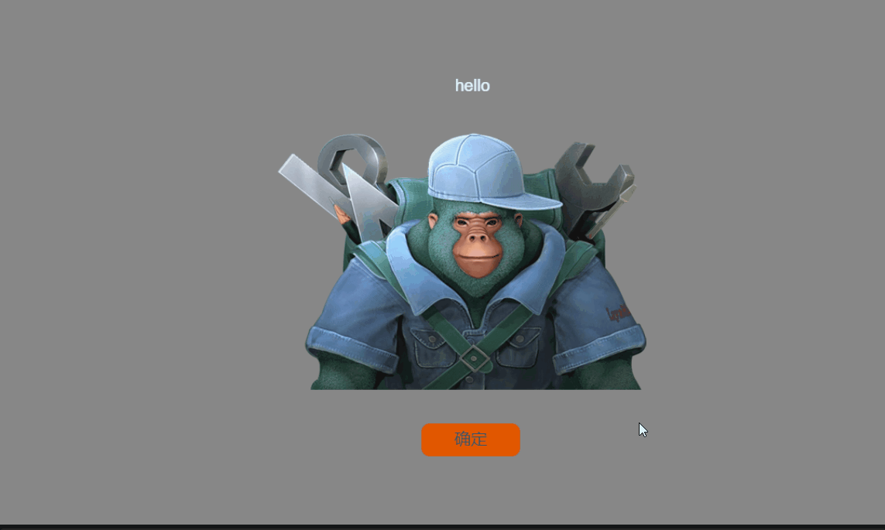
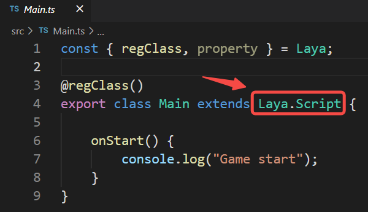
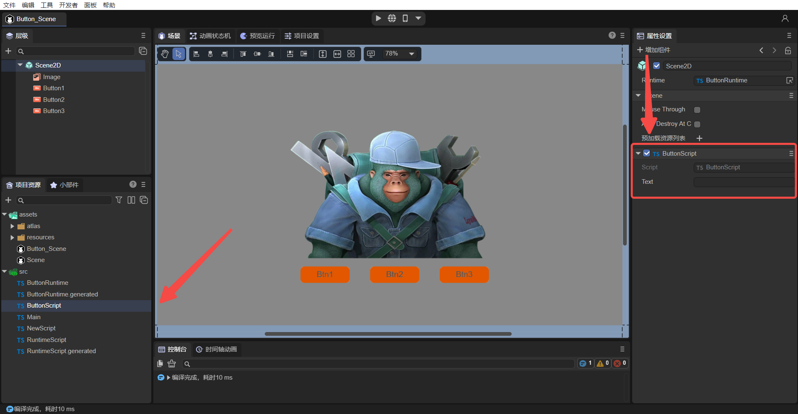

# UI继承类


## 一、概述

在我们项目开发过程中，开发者往往对UI的开发思路不够清晰，开发方式也多种多样，对项目的结构和使用方式会造成一定的混乱。这篇文章可以帮助开发者理清一些思路，我们会从这几个方面来展开

- **UI继承类**
- **UI继承类和自定义脚本的区别**
- **UI继承类和自定义脚本混合使用的高级用法**

但是我们先来聊一聊2D开发UI过程中会遇到的情况


### 1.1 功能划分方式

首先，我们的项目不止一套UI，就比如游戏开发来说，有登陆界面，加载界面，英雄属性界面，背包界面，战斗界面等等，那么这些界面的合理规划我们建议是通过场景或者预制体来划分的，如图1-1所示，这里有很多UI场景，因为UI功能是不一样的

 

（图1-1）

如图1-2所示，这里有很多Prefab，因为UI的功能是一样的，可以重复利用

 

（图1-2）

所以，通常我们把每一套不同功能的UI，用场景（Scene）来规划，把能复用的功能性UI，用预制体（Prefab）来规划 


### 1.2 UI管理方式

其次，在UI开发过程中，我们会使用Image，Box，Tab等等这些LayaAir 提供的UI组件来构成，对于一套相对复杂的UI界面来说，大量的UI组件，用自定义脚本的方式管理并不方便，需要每个组件都拖拽到自定义属性中，繁琐而费力。因此我们建议开发者，使用UI继承类来管理UI组件，后面我们再说UI继承类和自定义脚本类的区别。**UI继承类设计的目的就是在场景或者是预制体的根节点创建，能对其内部所有的组件进行方便的管理。**

如图1-3所示，这是一套复杂的UI的预制体，是通过UI继承类管理的（Runtime）


（图1-3）

从1-3图中可以看到，这套UI并没有使用自定义脚本，而是使用UI继承类（Runtime），在UI的根节点 View 组件上的 Runtime 属性里添加 BagListRT 代码来管理的。下面我们来看看什么是UI继承类。


## 二、UI继承类

UI继承类就是 Runtime 类，可以对场景和预制体内部所有UI组件进行方便的管理，我们来看看它的创建到使用过程，基本上分为如下几步：

- **IDE中创建Runtime类**
- **IDE自动生成代码**
- **勾选UI组件声明**
- **修改继承关系**
- **代码中使用UI组件**


### 2.1 IDE中创建Runtime类

我们以新建一个2D空的项目为例，在默认给定的 Scene 场景中添加一些UI组件，比如有一个背景图，两个Button，如果2-1所示


（图2-1）

上文已经提及，只有在 Scene 或者 Prefab 的根节点才可以看到 Runtime 属性，如图2-1所示

Runtime 属性中需要我们来选择一个 Script 脚本并拖入，用于生成该脚本的场景父类。如动图2-2所示：


（动图2-2）


### 2.2 IDE自动生成代码

按上述操作之后，我们可以在 项目工程中看到多了一个 `Script.generated.ts` 代码，点击这个代码，如图2-3所示

 

（图2-3） 

这个类的名字为 `ScriptBase`，它继承了 `Laya.Scene` ，说明它是有场景管理能力的

> **注意：请不要修改这个代码，随着我们开发过程中不断添加新的UI组件，删除UI组件，这个代码会再次生成的**
>
> Script是拖入Runtime的示例脚本的名字，父类就是以实际脚本名字xxx为基础进行命名，命名后的文件名就是xxx.generated.ts，类名为xxxBase


### 2.3 勾选UI组件声明

下面看看它是如何关联UI组件的，上面的示例中，我们有几个UI组件，要想管理这几个UI组件，需要对这些组件勾选 `Declare Var` 选项，如动图2-4所示


（动图2-4）

勾选 `Declare Var` 选项后，保存场景，此时IDE会识别出组件声明有变化，再来看看 `Script.generated.ts` 代码，多了几个属性，如图2-5所示

 

（图2-5） 

通过这样操作，UI组件和代码就自动关联了


### 2.4 修改继承关系

由于这个类是不可以修改的，也就是说它只建立了UI组件和代码关联关系，那么之前创建的 Script 脚本就可以通过继承此类来作为UI继承类，修改继承关系如动图2-6所示

 

（动图2-6） 

修改为继承 `ScriptBase` 的同时，代码编辑器会自动添加 `import { ScriptBase } from "./Script.generated";` 导入代码


### 2.5 代码中使用UI组件

此时，我们可以在 Scirpt 类中，使用此场景中的已经勾选过的UI组件，例如下面的代码：

```
    onAwake(): void {
        
        // Button1添加鼠标事件，让Image不显示
        this.Button1.on( Laya.Event.MOUSE_DOWN, this, ()=>{
            this.Image.visible = false;
        });

    }
```

运行此场景来看看效果，如动图2-7所示

 

（动图2-7） 

UI继承类（Runtime）就已经介绍完了，再复杂的UI，都可以通过勾选组件声明，IDE会自动创建关联关系，提供给 Runtime 类来使用，不需要像自定义脚本的方式建立关联关系。


## 三、与自定义脚本区别

### 3.1 继承类不同

UI继承类（Runtime）与自定义脚本类似，不同的是 Runtime 的实现方式继承自 Laya.Scene，而自定义脚本继承 Laya.Scirpt。如图3-1和3-2所示

 

（图3-1）Runtime 继承自Laya.Scene

 

（图3-2）自定义脚本类继承自Laya.Script


### 3.2 不同的生命周期

自定义脚本方式的生命周期，如图3-3所示

 

（图3-3）

而 Runtime 类是继承自 Laya.Scene ，生命周期只有如下方法：

```typescript

    /**
    * 组件被激活后执行，此时所有节点和组件均已创建完毕，次方法只执行一次
    * 此方法为虚方法，使用时重写覆盖即可
    */
    onAwake(): void {
    }

    /**
     * 组件被启用后执行，比如节点被添加到舞台后
     * 此方法为虚方法，使用时重写覆盖即可
     */
    onEnable(): void {
    }

    /**
     * 组件被禁用时执行，比如从节点从舞台移除后
     * 此方法为虚方法，使用时重写覆盖即可
     */
    onDisable(): void {
    }
        
    /**
     * 销毁时执行
     * 此方法为虚方法，使用时重写覆盖即可
     */
    onDestroy(): void {
    }
    
    /**
     * 关闭完成后，调用此方法（如果有关闭动画，则在动画完成后执行）
     * @param type 如果是点击默认关闭按钮触发，则传入关闭按钮的名字(name)，否则为null。
     */
    onClosed(type: string = null): void {
    }
```

> **注意：对比我们可以发现，Runtime 是没有 onStart，onUpdate 等方法的**


### 3.3 不同的使用UI组件方式

相比自定义脚本方式，UI继承类，可以直接使用UI定义的属性（通过IDE内var属性定义），比如 this.Button1，this.Image，具有代码提示效果。而自定义脚本获取只能通过代码定义属性，IDE中拖入组件方式获取节点，如图3-4所示，具体过程，请查看《自定义脚本组件》文档。

因此建议开发者：

> **如果是页面级的逻辑，需要频繁访问页面内多个元素，使用 Runtime UI继承式写法，如果是独立小模块，功能单一，建议用自定义脚本方法**


## 四、UI继承类和自定义脚本的混合使用

### 4.1 简单用法

如上述示例中，我们已经在Scene场景中创建好了UI继承类，此时我们把 Scirpt 类改名为 MyRuntime 方便辨识，如动图4-1所示

 

（动图4-1）


其次，我们项目工程创建好之后，有 Main 脚本类可以利用，我们把 Main 脚本类添加到场景的Scene2D下，如动图4-2所示


（动图4-2）


此时 Scene 场景中既有 Runtime，又有自定义脚本，我们通过在Main自定义脚本中添加如下代码，来看看如何在脚本中使用 Runtime 的功能

```
import { MyRuntime } from "./Script";

const { regClass, property } = Laya;

@regClass()
export class Main extends Laya.Script {
	
    private ui: MyRuntime;
    onStart() {

        // 获得场景的Runtime对象
        this.ui = this.owner.scene as MyRuntime;

        // Button2添加鼠标事件，让Image不显示
        this.ui.Button2.on( Laya.Event.MOUSE_DOWN, null, ()=>{
            this.ui.Image.visible = false;
        });

    }
}
```

ui 属性直接从脚本中通过 `this.owner.scene as MyRuntime` 这句代码拿到了 Runtime 对象，那么 Runtime 下的UI组件也就可以直接获取了。通过 UI继承类和 自定义脚本的混合使用，开发者可以在自定义脚本中方便的使用UI组件了。


### 4.2 高级用法

上述方案中，自定义脚本已经可以拿到场景的UI继承类，那么在复杂的项目中，如果有很多的UI界面，我们是否可以对所有的UI界面做一些统一的管理呢？比如统一找到和处理所有UI里的 Button，让所有 Button 点击时自动缩放，更高级的用处比如统一做所有UI的自适应功能。我们通过下面的方式来看看

#### 4.2.1 创建多个场景，Runtime，脚本

那么以“统一找到和处理所有UI的 Button，让所有 Button 点击时自动缩放” 为例，我们需要再创建一个有多个Button的UI场景，叫Scene1，如图4-3所示


（图4-3）

因为不同的UI，所持有的UI组件是不一样的，比如A场景有a1，a2组件，B场景有b1，b2，b3组件，那么不同的场景就需要有不同的 Runtime来关联每个UI的组件，那么下一步，针对这个Scene1的场景，我们再创建好一个 Script1.ts 的代码，拖入 Runtime 属性中，作为Scene1的 Runtime类，如图4-4所示



（图4-4）

接下来，我们要把 Script1.ts 的类名改为 MyRuntime1，继承自Script1Base类，还需要把 Scene1 中的Button1，Button2，Button3都勾选Var 属性，这几步基础操作就不介绍了。

我们再看看，确保 MyRuntime1 类可以代码提示这三个 Button，如动图4-5所示

 

（动图4-5）

最后，我们还需要给 Scene1 再添加一个脚本，名字为 Main1，过程就不介绍了，如图4-6所示


（图4-6）


#### 4.2.2 创建脚本父类 BaseScript

在上述操作后，两个场景都有 Runtime 和 Script脚本了，那么如何做统一处理呢，我们发现 Runtime类是用来关联UI组件的，因为都是继承自各自的生成脚本，就不能再统一继承某个类了。而脚本类都继承自 Laya.Script ，那么我们再多继承一层，让 Main 和 Main1 都继承自一个新的类 MainBase，MainBase 再继承自 Laya.Script，从而实现统一处理的目的。另外 MainBase 类加一个方法 baseUI()，我们来看看修改后效果：

```
const { regClass, property } = Laya;

@regClass()
export class MainBase extends Laya.Script {

	//用来统一处理ui的事情，比如自适应，缩放所有Button
    public baseUI(ui: Laya.Scene){

    }

    constructor() {
        super();
    }
}
```

接下来，修改 Main 和 Main1 都继承自 MainBase，获得 Runtime 对象，并调用 MainBase 的 baseUI方法，传入 runtime 对象，如下

```
import { MainBase } from "./MainBase";
import { MyRuntime } from "./Script";

const { regClass, property } = Laya;

@regClass()
export class Main extends MainBase {

    private ui: MyRuntime;
    onStart() {
        console.log("Game start");
        this.ui = this.owner.scene as MyRuntime;
        super.baseUI(this.ui);
    }
}
```

```
import { MainBase } from "./MainBase";
import { MyRuntime1 } from "./Script1";

const { regClass, property } = Laya;

@regClass()
export class Main1 extends MainBase {

    private ui: MyRuntime1;
    onStart() {
        console.log("Game start");
        this.ui = this.owner.scene as MyRuntime1;
        super.baseUI(this.ui);
    }
}
```


最后，我们在 MainBase 中加入点击缩放 Button的代码，如下：

```
const { regClass, property } = Laya;

@regClass()
export class MainBase extends Laya.Script {

    constructor() {
        super();
    }

	//所有场景的脚本都会调用baseUI做统一处理
    public baseUI(ui: Laya.Scene){
		
        this.searchButton(ui);
    }

	//找出所有ui下的Button包括子节点下
    searchButton( ui: Laya.Node )
    {
        for( let i = 0; i < ui.numChildren; i++ )
        {
            let child = ui.getChildAt(i);
            if( child instanceof Laya.Button )
            {
                console.log("发现一个Button");
                this.onButtonScaleEvent( child );
            }
            else
            {
            	//查找子节点
                this.searchButton( child );
            }
        }
    }

    //处理按钮缩放事件
    onButtonScaleEvent(target : Laya.Button)
    {
        target.on(Laya.Event.MOUSE_DOWN, this, this._onScaleBtnDown);
        target.on(Laya.Event.MOUSE_UP, this, this._onScaleBtnOut);
    }

	//按钮放大
    _onScaleBtnDown(e:Laya.Event)
    {
        console.log("开始缩放");
        e.target.scale(1.1, 1.1);
    }

	//按钮还原
    _onScaleBtnOut(e:Laya.Event)
    {
        console.log("取消缩放");
        e.target.scale(1.0, 1.0);
    }
}
```

最后我们来分别运行两个场景看看效果：

 

（动图4-7）Scene的两个Button都可以点击缩放

 

（动图4-8）Scene1的三个Button都可以点击缩放


到此，我们了解了什么是UI继承类，UI继承类和自定义脚本类的区别，以及混合使用的方式，统一管理UI的高级用法，开发者可以更深一步研究，有更多的混合用法欢迎和我们交流~


 

