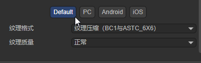

# 纹理压缩


## 一、概述

纹理是指物体表面的纹路样式和细腻程度等外观效果。在计算机图形学中，常用于描述三维模型表面图案的二维图形。

我们日常见到和使用的图片格式，主要为PNG和JPG，虽然在三维和二维的某些情况下，也会把这些图片称为纹理，但他们并不是纹理格式，不能被GPU直接读取并显示。因此，这些图片文件要先经过CPU解码成纹理格式，再传送到GPU进行使用。

而纹理格式，自然就是可以被GPU直接读取并显示的格式。所以，一方面，避免CPU解码可以减少运算带来的性能压力。另一方面，就是直接读取并渲染，也可以避免图像解压到内存的占用开销。

### 1.1 纹理压缩的目的

1，降低内存，特别是移动端应用，内存占用不应过大，否则低端机很容易崩溃
2，降低带宽，手游类应用，在渲染时会有大量贴图传输到GPU，不限制的话不仅会严重影响渲染性能，同时会带来很严重的发热

那纹理格式有哪些？

#### **ASTC**

ASTC（Adaptive Scalable Texture Compression）是一种世界领先的新型纹理压缩格式。ASTC由ARM和AMD联合开发，2012年发布。是一种基于块的有损压缩算法。它的压缩分块从4x4到12x12最终可以压缩每个像素占用1bit以下，并且ASTC格式支持RGBA。以ASTC 4x4 Block Size为例，可以看到每个像素占用8bits即1个字节。因此一张1024x1024的RGBA图片按照该格式压缩后占用的内存大小为1MB。如果你的纹理是选择了生成mipmap的话，那么最终的资源大小还需要乘以1.333也就是大约1.333MB。而相对应的如果采用了ASTC 8x8的格式进行压缩的话，最终纹理资源的大小就应该是 1024 × 1024 × 2 × 1.333333 ÷ 8 ≈ 341K。所以如果想要使用10x10或12x12这种更小的压缩格式的话，选用这两种格式基本也就意味着放弃对画质的基本要求了。因此我们推荐使用6x6的压缩格式。

**适配机型：**

**iOS**
苹果从A8处理器开始支持ASTC，即iPhone6和iPad mini 4及以上的设备都支持，ASTC格式在iOS设备上的显示效果比PVRTC的效果要好很多(PVRTC格式存在两个大问题：首先是透明贴图在iOS上显示比较模糊，失真；另一点是对于颜色比较丰富的图，特别是UI，颜色过渡大的区域会出现色阶问题，目前的方案一般是拆分Alpha通道，见这里：IOS下拆分Unity图集的透明通道（不用TP）),Unity 分离贴图 alpha 通道实践。因此在当前情况下iOS上可以全部使用ASTC作为纹理格式。

**安卓**
安卓中所有支持OpenGL ES 3.1及以上的设备，和大部分支持OpenGL ES 3.0的设备都支持ASTC。因此在安卓上需要根据具体情况来设置纹理压缩格式，一般而言若项目依旧要考虑低端机型，就要退而求其次使用ETC2格式进行压缩。

#### ETC

ETC（Ericsson Texture Compression）最初为移动设备开发，如今它是安卓的标准压缩方案，ETC1在OpenGL和OpenGL ES中都有支持。
RGB ETC1 4 bit：4 bits/pixel，对RGB压缩比6:1，不支持Alpha，绝大部分安卓设备都支持。
RGB ETC2 4 bit：4 bits/pixel，对RGB压缩比6:1。不支持Alpha，ETC2兼容ETC1，压缩质量可能更高，但对于色度变化大的块误差也更大，需要在OpenGL ES 3.0和OpenGL 4.3以上版本。
RGBA ETC2 8bit：8 bits/pixel，对RGBA压缩比4:1。支持完全的透明通道，版本要求同上。

#### PVR

PVRTC（PowerVR Texture Compression）由Imagination公司专为PowerVR显卡核心设计，由于专利原因一般它只被用于苹果的设备，仅iPhone、iPad和部分PowerVR的安卓机支持。

### 1.2 总结

ASTC在压缩率、图像质量、种类上都挺不错的，也正在逐步代替ETC和PVR，最大的缺点可能就是兼容性还不够完善和解码时间较长，但以现在移动端的发展趋势来看，GPU计算能力越来越难成为瓶颈，因此非常有希望在以后能成为统一的压缩格式。

整理网络上的一些资料：

- 安卓：用ETC2没有什么问题；ASTC在Android 5.0/OpenGL ES 3.1后支持，市场大部分机型都支持，可以考虑选择
- iOS：在iPhone6以上（包含）都支持ASTC，6以下可以选择PVRTC2。

LayaAir 3.0引擎及工具也更新了这一情况，全面支持ASTC标准，也仍然支持ETC1和ETC2_RGB，ETC2_RGBA，同时不再支持PVR。

所以我们建议使用ASTC 6x6作为安卓和iOS统一的压缩纹理格式，而且两个平台只需要一个压缩纹理文件，也节省了项目的使用空间。


## 二、IDE中使用纹理压缩

### 2.1 图片纹理压缩

LayaAir3.0 对纹理压缩功能做了很好的改进，不用像2.0那样需要通过纹理压缩工具来使用，而是可以在IDE中直接操作图片做纹理压缩的转换，而且开发者也不用关心图片的使用途径是2D还是3D。如图2-1所示

 

（图2-1）

图2-1中，点击Layabox.png图片，可以在右边的属性面板中，看到默认是使用Default选项，Format是带透明通道的位图(32位)。在没有纹理压缩前，图片在所有平台都使用此格式。如果我们想针对iOS平台使用ASTC 6x6，对安卓平台使用ETC2_RGB，如动图2-2所示

 

（动图2-2）

分别对Andorid和iOS选择ASTC6x6纹理压缩格式并点击应用后，在assets目录下实际上是不会生成对应的压缩文件的。也就是说在预览模式下，也无法使用。只有在发布后，才可以使用压缩纹理。如图2-3所示，通过发布web平台，我们来看看发布后的结果

 

（图2-3）

LayaAir 3.0 IDE会发布出layabox.jpg.json和layabox@1.ktx两个文件。

其中layabox@1.ktx就是上述操作生成的纹理压缩文件，因为都使用了ASTC 6x6，所以只生成一个压缩纹理文件。如果Android和iOS平台分别配置为不同的格式，那么就会生成两个不同的文件。

另外IDE会对每个图片资源生成一份json属性文件，也就是layabox.jpg.json，文件中记录一些对图片属性设置信息，其中包括使用纹理压缩信息，打开json文件如下：

```json
{
  "sRGB": true,
  "wrapMode": 0,
  "filterMode": 1,
  "anisoLevel": 0,
  "readWrite": false,
  "mipmap": true,
  "pma": false,
  "hdrEncodeFormat": 0,
  "files": [
    {
      "file": "",
      "ext": "jpg",
      "format": 1
    },
    {
      "file": "1",
      "ext": "ktx",
      "format": 19
    }
  ],
  "platforms": {
    "0": 0,
    "1": 1,
    "2": 1
  }
}
```

platforms表示图片使用的平台，1和2分别指向Android和iOS平台，两个平台都使用files信息中的ktx为后缀的纹理压缩文件。

接下来通过Android手机来看实际运行效果，如图2-4所示

 

（图2-4）

通过使用chrome手机调试模式，可以看到正在使用layabox@1.ktx，测试成功！LayaAir 引擎会识别当前运行的平台，根据layabox.jpg.json中对应的平台信息找到压缩纹理。

> *注意：在PC平台的Chrome的使用手机模式，是无法使用到纹理压缩的，虽然使用了手机模式，但是LayaAir引擎会判断当前运行的平台依然是win32，而不是ua数据中的设备信息。*

  

（图2-5）


### 2.2 图集纹理压缩

不仅图片可以纹理压缩，通常我们在2D开发中使用的图集也可以使用压缩纹理，如图2-6所示

 

（图2-6）

例如在LayaAir IDE创建项目后自带的图集配置文件，进行纹理压缩配置，发布后可以看到图集也可以使用压缩纹理了，如图2-7所示

 

（图2-7）

再用Android手机来看看运行时的情况，图集压缩纹理comp@1.ktx成功使用了，如图2-8所示

 

（图2-8）

到此，在IDE中配置图片纹理压缩和图集的纹理压缩就介绍完了，开发者可以自己来试一试！


## 三、代码加载纹理压缩

通过IDE配置压缩纹理后，本身LayaAir引擎是可以自动识别运行平台来使用对应的压缩纹理的，这个改进对开发者来说是非常方便的，不用像2.0那样，在代码中判断平台了。如果开发者希望用代码来动态加载压缩纹理也是一样的。

### 3.1 3D纹理的使用

要使用纹理压缩格式，则需要使用`Laya.loader.load()`来加载纹理资源。

示例代码如下所示：

```
Laya.loader.load("resources/CompressTexture/Assets/layabox.jpg").then((texture: Texture2D)=> {
	this.mat.albedoTexture = texture;
});
```

### 3.2 2D纹理的使用

对于2D纹理，需要先预加载纹理文件，然后就可以直接使用。

示例代码如下所示：

```
Laya.loader.load("resources/bg2.png").then((texture: Texture)=> {
	this.img.texture = texture;
});
```

### 3.3 2D图集的使用

对于2D图集，预加载图集atlas文件即可，引擎在加载图集的时候，会检测是否包含了纹理压缩转换的信息，如果包含，会自动识别平台并加载对应的纹理压缩格式文件，不需要开发者在代码里判断平台。

示例代码如下所示：

```
Laya.loader.load(["atlas/comp.atlas"], Laya.Handler.create(this, () => {
    this.img.skin = "atlas/comp/image.png";
}));
```

通过示例代码，我们可以看到，图集的纹理压缩的代码使用是无感的，和普通的图集使用方式完全相同。


## 四、优化效果到底怎么样

由于纹理压缩格式不需要CPU解码，那因解码而产生的瞬间性能压力就没有了，不过如果不是特别多的处理，这个过程并不是持续的，所以并不明显。

比较显著的优化还是在显存上。我们仍然举个例子来说明。

还是之前IDE里自带的那张图，我们将宽高改成`512*512`后，

当舞台上什么显示也没有的时候，初始显存占用是2.31M，使用纹理压缩格式，只增加170K，加上初始大小最终为2.48M。而原图则增加1024K，达到3.31M。如图3-1所示。所以显存优化效果还是非常明显的，减少约83%。

 

（图3-1）

有一些开发者，还不太理解显存的占用与文件的关系。我这里告诉大家一个简单的计算依据。如果是非纹理压缩的图片，比如PNG和JPG，你直接用图片像素的`宽*高*4`就是显存的占用。

所以有一些游戏，为了减少显存的占用，把图片的宽高像素做小，然后用缩放的方式，再显示放大。不过这种方式，虽然显存占用小了，但是质量的损失也大了。纹理压缩虽然也是有损压缩，但同样质量的情况下，显存占用更小，甚至和原图质量差不多的情况下，也比拉伸的方式内存占用小。所以纹理压缩是开发者比较常用的一种节省显存的方案。

那纹理压缩的显存占用，怎么计算呢，除了统计面板上的信息外，也有一种比较简单的统计方案。你直接查看纹理压缩文件的大小就好了，比如纹理压缩文件是170k，那显存占用也是170k。例如图3-2所示。

 

（图3-2）


