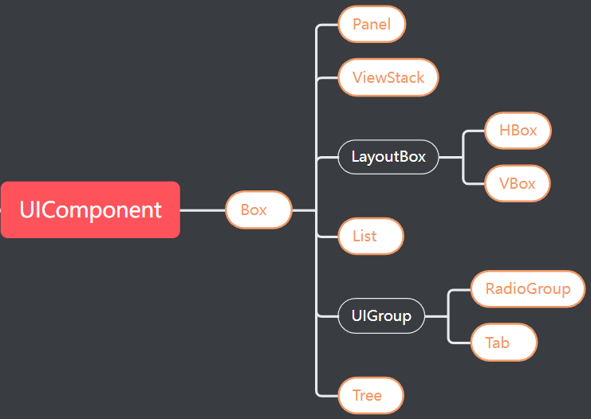

# 容器组件（Box）

> Author : Charley

## 一、什么是容器

所谓容器，便是可以包容或装载物品的贮存器。

在LayaAir引擎里，是指本身并不独立使用，用于装载其它显示对象的组件。

> 不独立使用是常见的情况，某些情况下，容器也可以只用于填充背景色，但这种情况并非容器真正的作用。

例如，List容器组件，没有了其装载的渲染单元子组件，List本身就没有了意义。

又比如，单选框组，没有了单选框的子组件，那这个组本身也失去了意义。

所以，每一个容器主要的作用，都是为了包容或装载其它子组件才能发挥其独有的作用。

## 二、容器有哪些

容器组件的基类是Box，Box自身与继承自Box的组件，都属于容器。

开发者直接使用的容器对象一共有9个。如图2-1的黄字高亮部分所示。

(图2-1)

## 三、Box的属性

创建Box可以在`层级`窗口中右键进行创建，也可以从`小部件`窗口中拖拽添加。如下图所示：

（图3-1）

由于Box继承于UI组件的基类`UIComponent`，所以父类的属性这里就不再重复介绍。

由于Box是个比较纯粹的容器对象，本身没有什么作用，其作用主要用于装载其它子节点。

如果说唯一可以独立使用的作用，那就是填充背景颜色。

在IDE里的操作，如图3-2所示，先勾选设置背景色状态选框，再点击取色器输入栏，然后在取色器窗口里拾取或输入颜色之后，关闭取色器窗口即可。

（图3-2）

## 四、Box与Sprite容器的使用差异

Sprite与Box都属于比较常用的基础容器。

由于Sprite更底层，所以对比之下，Sprite的性能消耗要更低于Box。

在没有海量使用的前提下，也没有太大的差距。但是性能至上的原则上，能使用Sprite的时候，当然优先使用Sprite。

那什么时候使用Box呢？

由于Box属于UI组件，所有UI组件都有一个共同的特性，那就是相对布局与设置数据源。

对于容器，我们考虑是否使用Box，取决于是否有相对布局的需求。

如果有相对布局的需求，就使用Box作为容器，否则就使用Sprite。

