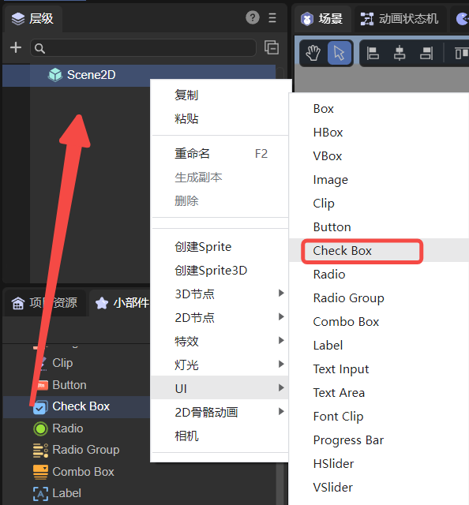
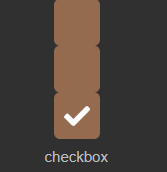
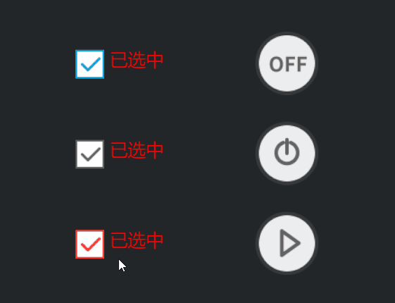

# 多选框组件（CheckBox）

CheckBox是多选框组件，继承自Button。它由两部分组成，选择状态框及内容说明标签。其中选择状态框是图片资源，内容说明标签为文本。CheckBox组件的属性接口介绍请参考[CheckBox API](https://layaair.com/3.x/api/Chinese/index.html?version=3.0.0&type=2D&category=UI&class=laya.ui.CheckBox)。

## 一、通过LayaAir IDE创建CheckBox组件

### 1.1 创建CheckBox

如图1-1所示，点击选择小部件面板里的CheckBox组件，拖放到页面编辑区，或者在层级窗口中通过右键创建，即可添加CheckBox组件到页面上。



（图1-1）

CheckBox组件的选择状态框是图片资源，通常是三态或两态的图片资源。默认皮肤资源如下图所示：



（图1-2）


### 1.2 CheckBox属性

CheckBox的特有属性如下：


（图1-3）

| **属性名**       | **功能说明**                                                 |
| ---------------- | ------------------------------------------------------------ |
| toggle           | 按下时是否切换组件的显示状态。为true时，可以通过点击切换显示状态。为false时，点击后会直接恢复初始状态。该属性一般不要改成false，否则永远都选不中 |
| stateNum         | 选择框的皮肤状态数，支持两态和三态，多选框默认为三态。如果多选框美术资源改为两态，需设置状态值为2，正常情况下多选框至少应当有2个状态。特殊情况下，也可以使用单态 |
| selected         | 多选框是否为选中状态，默认为false。设置为true后，多选框的初始状态会变为保持选中的状态 |
| skin             | 选择框的图像资源，设置后需要根据皮肤资源设置stateNum皮肤状态数 |
| sizeGrid         | 九宫格在CheckBox组件中无效，多选框的实际大小需在制作美术资源时就设置好 |
| label            | 多选框的文本标签                                             |
| labelFont        | 文本标签的字体                                               |
| labelSize        | 文本标签的字体大小                                           |
| labelBold        | 文本标签是否为粗体，默认为false                              |
| labelColors      | 鼠标在鼠标移出（up）、鼠标悬停（over），鼠标按下（down）时，各个状态下的文本标签颜色 |
| labelAlign       | 文本标签的水平对齐模式：left、center、right，默认为居左对齐  |
| labelVAlign      | 文本标签的垂直对齐模式：top、middle、bottom，默认为居顶对齐  |
| labelPadding     | 文本标签的边距。格式：上边距、右边距、下边距、左边距         |
| labelStroke      | 文本标签的描边宽度，以像素为单位。默认值为0，表示不描边      |
| labelStrokeColor | 文本标签描边的颜色，以字符串表示，默认值为#000000（黑色）    |
| strokeColors     | 勾选后，可以根据状态设置文本的描边颜色。分三种状态进行设置：鼠标移出（up）、鼠标悬停（over），鼠标按下（down），三种状态可以设置不同的描边颜色 |

相对于单选框组件，多选框组件的特点是，选中之后可以恢复状态，如动图1-4所示。


（动图1-4）

> 其余属性与Button相同，开发者可以根据[按钮组件](../Button/readme.md)的文档进行理解。


### 1.3 脚本控制CheckBox

在Scene2D的属性设置面板中，增加一个自定义组件脚本。然后，将CheckBox组件拖入到其暴露的属性入口中。需要添加如下的示例代码，实现脚本控制CheckBox：

```typescript
const { regClass, property } = Laya;

@regClass()
export class NewScript extends Laya.Script {

    @property({ type: Laya.CheckBox })
    public checkbox: Laya.CheckBox;

    //组件被激活后执行，此时所有节点和组件均已创建完毕，此方法只执行一次
    onAwake(): void {
        this.checkbox.pos(300, 300);
        // this.checkbox.selected = true;
        this.checkbox.label = "多选框";
        this.checkbox.labelBold = true;
        this.checkbox.labelSize = 30;
        this.checkbox.labelColors = "#0100ff, #16fa0e, #ff0000"; //各状态下的文本颜色
        this.checkbox.labelStroke = 3;
        this.checkbox.strokeColors = "#000000, #c6ff00, #001aff"; //各状态下的描边颜色
    }
}
```


## 二、代码创建CheckBox

在进行书写代码的时候，免不了通过代码控制UI，创建`UI_CheckBox`类，并通过代码设定CheckBox相关的属性。下述示例演示了如何通过代码创建一个CheckBox组件并设置其属性。

示例代码如下：

```typescript
const { regClass, property } = Laya;

@regClass()
export class UI_CheckBox extends Laya.Script {

    private COL_AMOUNT: number = 2;
    private ROW_AMOUNT: number = 3;
    private HORIZONTAL_SPACING: number = 200;
    private VERTICAL_SPACING: number = 100;
    private X_OFFSET: number = 100;
    private Y_OFFSET: number = 50;

    // 图片资源来自“引擎API使用示例”
    private skins: any[] = [
        "resources/res/ui/checkbox (1).png",
        "resources/res/ui/checkbox (2).png",
        "resources/res/ui/checkbox (3).png",
        "resources/res/ui/checkbox (4).png",
        "resources/res/ui/checkbox (5).png",
        "resources/res/ui/checkbox (6).png"
    ];
    constructor() {
        super();
    }

    /**
     * 组件被激活后执行，此时所有节点和组件均已创建完毕，此方法只执行一次
     */
    onAwake(): void {
        Laya.loader.load(this.skins).then(() => {
            this.onCheckBoxSkinLoaded();
        });
    }

    private onCheckBoxSkinLoaded(e: any = null): void {
        let cb: Laya.CheckBox;
        for (let i: number = 0; i < this.COL_AMOUNT; ++i) {
            for (let j: number = 0; j < this.ROW_AMOUNT; ++j) {
                cb = this.createCheckBox(this.skins[i * this.ROW_AMOUNT + j]);
                cb.selected = true;

                cb.x = this.HORIZONTAL_SPACING * i + this.X_OFFSET;
                cb.y += this.VERTICAL_SPACING * j + this.Y_OFFSET;

                // 给左边的三个CheckBox添加事件使其能够切换标签
                if (i == 0) {
                    cb.y += 20;
                    cb.on("change", this, this.updateLabel, [cb]);
                    this.updateLabel(cb);
                }
            }
        }
    }

    private createCheckBox(skin: string): Laya.CheckBox {
        let cb: Laya.CheckBox = new Laya.CheckBox(skin);
        this.owner.addChild(cb);

        cb.labelColors = "white";
        cb.labelSize = 20;
        cb.labelFont = "Microsoft YaHei";
        cb.labelPadding = "3,0,0,5";

        return cb;
    }

    private updateLabel(checkBox: Laya.CheckBox): void {
        checkBox.label = checkBox.selected ? "已选中" : "未选中";
    }
}
```

运行效果如下动图所示：



（动图2-1）


