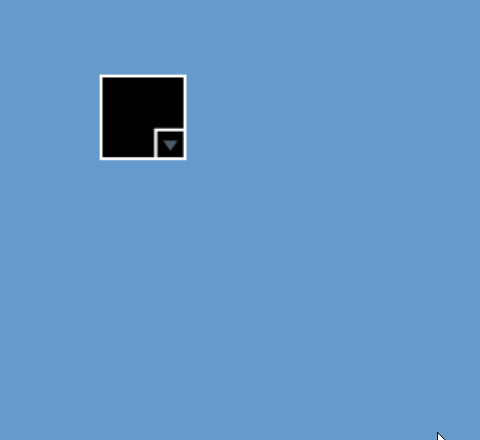
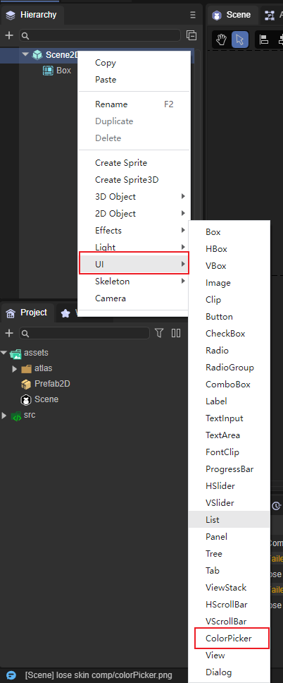
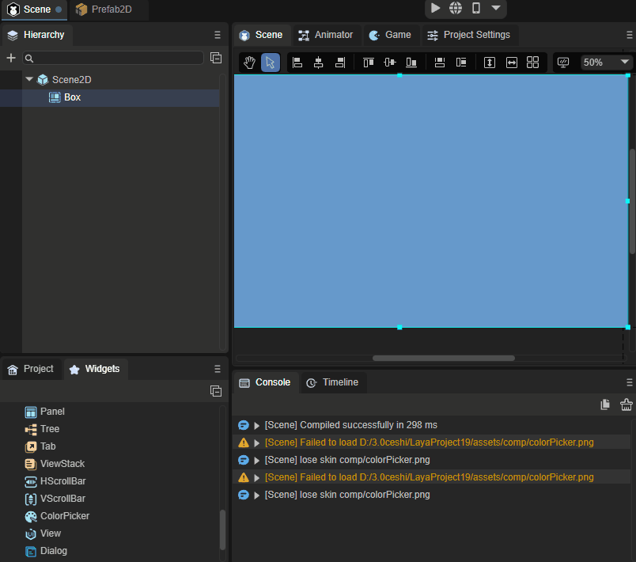
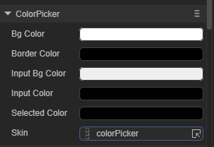
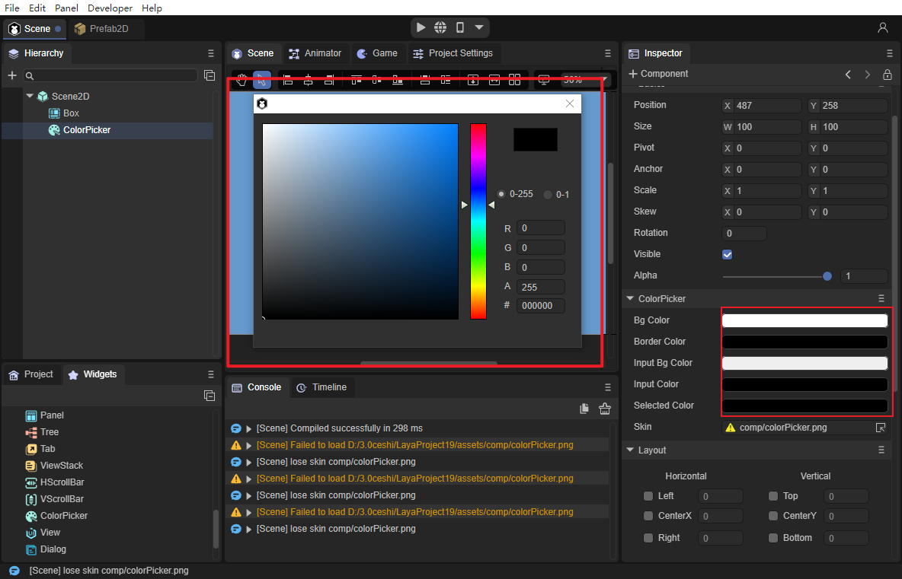
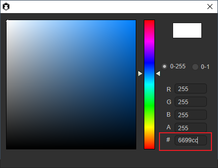

# ColorPicker组件参考

ColorPicker继承自UIComponent，ColorPicker组件将显示包含多个颜色样本的列表，用户可以从中选择颜色，如动图1所示。

 

（动图1）

## 1、ColorPicker组件创建

使用LayaAirIDE创建ColorPicker，步骤：鼠标右键单击Scene2D，然后找到UI，鼠标左键点击ColorPicker即可创建完毕，如图2所示。

 

（图2）

也可以从IDE资源管理右侧组件面板的UI文件夹中，将ColorPicker组件拖拽到UI页面中，如动图3所示。

 

（动图3）

## 2、ColorPicker属性介绍

 

（图4）

| 属性          | 功能                          |
| ------------- | ----------------------------- |
| bgcolor       | 面板背景颜色。                |
| bordercolor   | 面板边框颜色。                |
| inputbgcolor  | 面板文本背景颜色。            |
| inputcolor    | 面板文本字体颜色。            |
| selectedcolor | ColorPicker当前所选择的颜色。 |

ColorPicker组件在拿到颜色值后，就可以项目里进行赋值，在IDE的可视化操作下非常的简单，点击所需要调整的颜色，在颜色面板中自行选择即可，如图5所示。

 

（图5）

可以在颜色面板中输入所获得的颜色的值，如图6所示。

 

（图6）