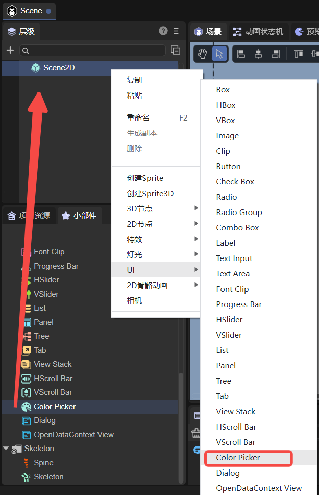
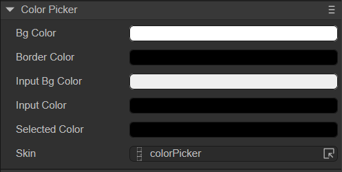
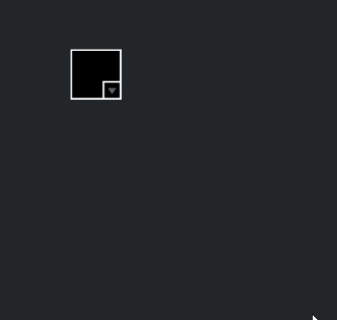

# 取色器组件（ColorPicker）

ColorPicker继承自UIComponent，ColorPicker组件将显示包含多个颜色样本的列表，用户可以从中选择颜色。ColorPicker的详细用法可以参考[ColorPicker API](https://layaair.com/3.x/api/Chinese/index.html?version=3.0.0&type=2D&category=UI&class=laya.ui.ColorPicker)。


## 一、通过LayaAir IDE创建ColorPicker

### 1.1 创建ColorPicker

如图1-1所示，点击选择小部件面板里的ColorPicker组件，拖放到页面编辑区，或者在层级窗口中通过右键创建，即可添加ColorPicker组件到页面上。



（图1-1）


### 1.2 ColorPicker属性

ColorPicker的特有属性如下：



（图1-2）

| 属性          | 功能                                                 |
| ------------- | ---------------------------------------------------- |
| bgColor       | 取色器面板背景颜色                                   |
| borderColor   | 取色器面板边框颜色                                   |
| inputBgColor  | 取色器面板文本框的背景颜色                           |
| inputColor    | 取色器面板文本框中，文本字体的颜色                   |
| selectedColor | ColorPicker当前所选择的颜色                          |
| skin          | 组件的皮肤纹理资源，运行时会根据选取的颜色而发生变化 |

ColorPicker组件在拿到颜色值后，就可以在项目里进行赋值，在IDE的可视化操作下非常的简单，点击所需要调整的颜色，在颜色面板中自行选择即可。


## 二、通过代码创建ColorPicker

在进行书写代码的时候，免不了通过代码控制UI，创建`UI_ColorPicker`类，通过代码设定ColorPicker相关的属性。示例代码如下：

```typescript
const { regClass, property } = Laya;

@regClass()
export class UI_ColorPicker extends Laya.Script {

	private skin: string = "atlas/comp/colorPicker.png";

    constructor() {
        super();
    }

    // 组件被激活后执行，此时所有节点和组件均已创建完毕，此方法只执行一次
    onAwake(): void {
		Laya.loader.load(this.skin).then( ()=>{
            this.onColorPickerSkinLoaded();
        } );
	}

	private onColorPickerSkinLoaded(e: any = null): void {
		let colorPicker: Laya.ColorPicker = new Laya.ColorPicker();
		colorPicker.selectedColor = "#ff0033";
		colorPicker.skin = this.skin;
		colorPicker.pos(100, 100);
		colorPicker.changeHandler = new Laya.Handler(this, this.onChangeColor, [colorPicker]);
		this.owner.addChild(colorPicker);

		this.onChangeColor(colorPicker);
	}

	private onChangeColor(colorPicker: Laya.ColorPicker, e: any = null): void {
		console.log(colorPicker.selectedColor);
	}
}
```

运行效果如下动图所示：



（动图2-1）


