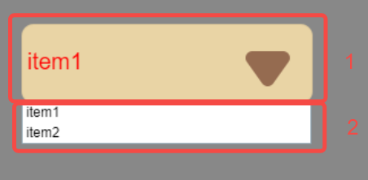

# 下拉选项框组件（ComboBox）

## 一、通过LayaAir IDE创建ComboBox组件

ComboBox是一个下拉选项框组件。ComboBox的脚本请接口参考[ComboBox API](https://layaair.com/3.x/api/Chinese/index.html?version=3.0.0&type=2D&category=UI&class=laya.ui.ComboBox)。

### 1.1 创建ComboBox

如图1-1所示，点击选择小部件面板里的ComboBox组件，拖放到页面编辑区，或者在层级窗口中通过右键创建，即可添加ComboBox组件到页面上。


（图1-1）

ComboBox组件的图像资源示例如下图所示：


（图1-2）

ComboBox组件由**下拉按钮**（图1-3上部分1）和**下拉选项**（图1-3下部分2）构成，运行时点击下拉按钮会弹出下拉选项，在属性设置中这两项是分别进行设置的。



（图1-3）


### 1.2 ComboBox属性

ComboBox的特有属性如下：


（图1-4）

| **属性**       | **功能说明**                                                 |
| -------------- | ------------------------------------------------------------ |
| skin           | 组件的图像资源                                               |
| sizeGrid       | 组件图像资源的有效缩放网格数据（九宫格数据）                 |
| stateNum       | 下拉按钮的状态值                                             |
| labels         | 组件的标签文本内容集合字符串，以逗号分隔（英文输入法）       |
| labelFont      | 下拉按钮中，文本的字体                                       |
| labelSize      | 下拉按钮中，字体的大小                                       |
| labelBold      | 下拉按钮中，文本是否粗体显示                                 |
| labelColors    | 下拉按钮中，各状态下的文本颜色值集合。UP：鼠标在元素释放时（抬起移开）；OVER：鼠标移动到元素之上时；DOWN：鼠标按下时 |
| labelPadding   | 下拉按钮中，文本的边距。U：上边距；R：右边距；D：下边距；L：左边距 |
| itemSize       | 下拉选项内，字体的大小                                       |
| itemHeight     | 下拉选项内，选项框的高度                                     |
| itemPadding    | 下拉选项内，文本的边距。U：上边距；R：右边距；D：下边距；L：左边距 |
| itemColors     | 下拉选项内，可以设置三部分的颜色。`背景颜色`，UP：鼠标在元素释放时（抬起移开）；OVER：鼠标移动到元素之上时。`标签颜色`，UP：鼠标在元素释放时（抬起移开）；OVER：鼠标移动到元素之上时。`边框颜色`，只有一种状态颜色 |
| visibleNum     | 下拉选项的列表内，可显示的最大行数（最多选项数）             |
| scrollType     | 下拉选项列表的滚动类型，只可以设置：无滚动、垂直方向滚动     |
| scrollBarSkin  | 下拉选项列表的滚动条图像资源，只可以设置垂直滚动条皮肤       |
| selectedIndex  | 表示当前选择的项的索引                                       |
| selectedLablel | 按照标签文本labels，设置下拉列表默认选项值，即下拉按钮显示的选项 |
| defaultLablel  | 未设置下拉列表选项值时（selectedIndex为-1），在下拉按钮显示框中用于提示的文本 |

> 其中，labelFont、labelSize、labelBold、labelColors、labelPadding属性为下拉按钮的属性，itemSize、itemHeight、itemPadding、itemColors、visibleNum、scrollType、scrollBarSkin属性为下拉选项相关属性。

使用默认的skin属性，设置stateNum为3，labels属性设置为“item0,item1,item2,item3,item4,item5,item6,item7,item8”。再将selectedIndex设置为0后，selectedLablel会变为item0，效果如图1-5所示。


（图1-5）

由于设置了visibleNum为6，所以最多展示6个选项。

接下来设置**下拉选项**相关属性，如图1-6所示，设置下拉选项中字体大小为30，选项框的高度为50，设置下拉选项的文本边距为合适大小。itemColors属性保持默认，开发者可以对应观察，其中item1选项为OVER状态。再增加一个垂直滚动条，用于显示item6,item7,item8。


（图1-6）

然后设置**下拉按钮**相关属性，如动图1-7所示，设置下拉按钮中字体大小为50，仿宋字体并加粗显示。labelColors保持默认，labelPadding设置为合适大小。


（动图1-7）


### 1.3 脚本控制ComboBox

在Scene2D的属性设置面板中，增加一个自定义组件脚本。然后，将ComboBox拖入到其暴露的属性入口中。需要添加如下的示例代码，实现脚本控制ComboBox：

```typescript
const { regClass, property } = Laya;

@regClass()
export class NewScript extends Laya.Script {

    @property({ type: Laya.ComboBox })
    public combobox: Laya.ComboBox;

    //组件被激活后执行，此时所有节点和组件均已创建完毕，此方法只执行一次
    onAwake(): void {
        this.combobox.pos(100, 100);
        this.combobox.labels = "item0,item1,item2,item3,item4,item5,item6,item7";
        this.combobox.labelColors = "#32556b,#32cc6b,#ff0000";
        this.combobox.itemHeight = 60;
        // itemColors格式："悬停或被选中时背景颜色,悬停或被选中时标签颜色,标签颜色,边框颜色,背景颜色"
        this.combobox.itemColors = "#5e95b6,#ffffff,#000000,#ff0000,#ffffff";
        this.combobox.selectedIndex = 1;
        this.combobox.scrollBarSkin = "atlas/comp/vscroll.png";
    }
}
```


## 二、通过代码创建ComboBox组件 

在进行书写代码的时候，免不了通过代码控制UI，创建`UI_ComboBox`类，通过代码设定ComboBox相关的属性。下述示例演示了如何通过代码设置下拉选项，并通过点击获取到选项。

**运行示例效果：**


（动图2-1）

**示例代码：**

```typescript
const { regClass, property } = Laya;

@regClass()
export class UI_ComboBox extends Laya.Script {

    private skin: string = "resources/res/ui/combobox.png";//资源来自“引擎API使用示例”
    pageWidth: number;

    constructor() {
        super();
    }

    // 组件被激活后执行，此时所有节点和组件均已创建完毕，此方法只执行一次
    onAwake(): void {
        Laya.loader.load(this.skin).then(() => {
            let ComboBox: Laya.ComboBox = new Laya.ComboBox(this.skin, "item0,item1,item2,item3,item4,item5");
            ComboBox.labelSize = 30;
            ComboBox.itemSize = 25
            this.owner.addChild(ComboBox);
            ComboBox.autoSize = true;
            ComboBox.pos(200, 200);
        });
    }
}
```


