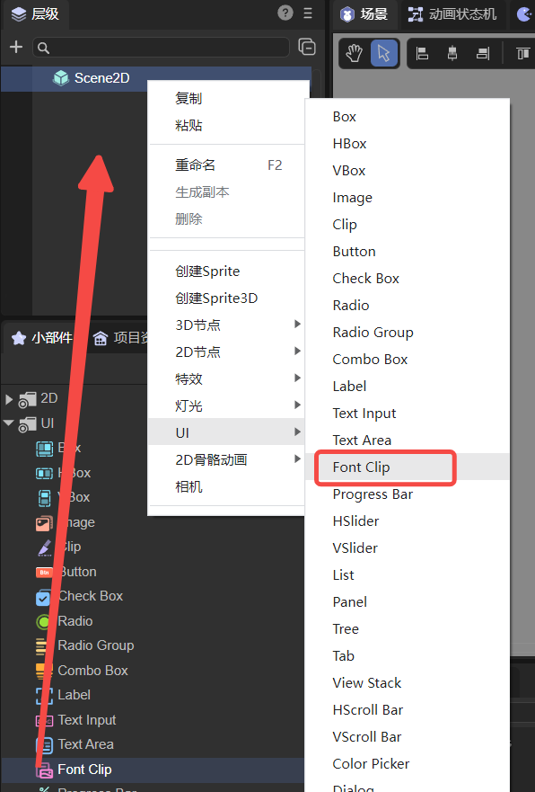
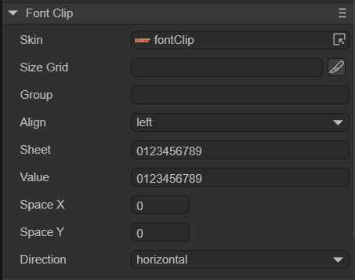
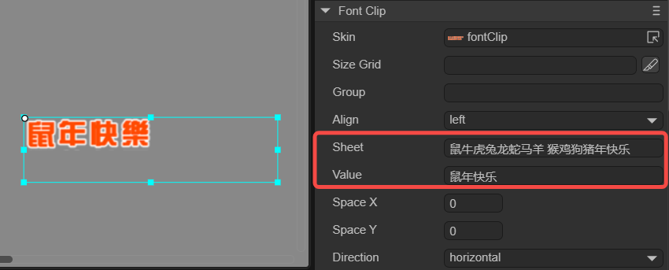
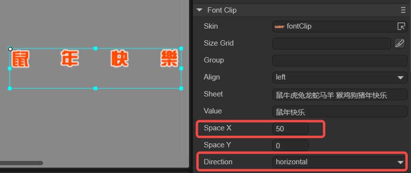
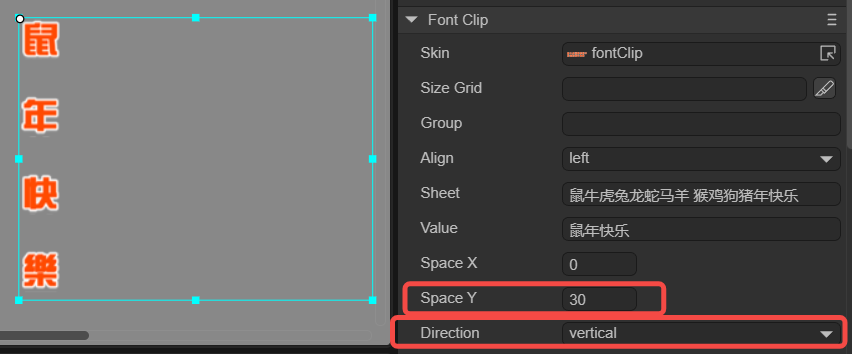
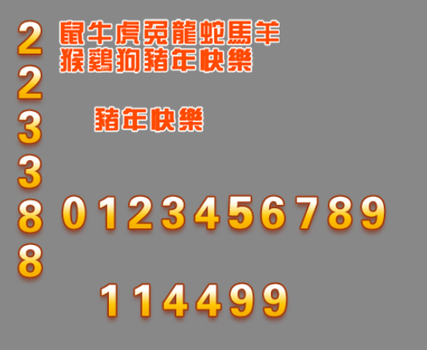

# 字体切片组件（FontClip）

FontClip组件本质上是对位图从方向上进行等比切割，FontClip继承于Clip。FontClip的组件脚本接口请参考[FontClip API](https://layaair.com/3.x/api/Chinese/index.html?version=3.0.0&type=2D&category=UI&class=laya.ui.FontClip)。


## 1、使用LayaAir IDE创建FontClip

### 1.1 创建FontClip

创建FontClip非常简单，通过IDE的可视化操作，只需要用鼠标就可以实现。如图1-1所示，可以在`层级`窗口中右键进行创建，也可以从`小部件`窗口中拖拽添加。



（图1-1）

在LayaAir中，自带了一个字体切片的图像资源（fontClip.png），如图1-2所示，


（图1-2）


### 1.2 FontClip属性介绍

FontClip的特有属性如下：



（图1-3）

| 属性      | 功能说明                                                     |
| --------- | ------------------------------------------------------------ |
| skin      | 字体切片组件的纹理，需要添加图像资源。                       |
| sizeGrid  | 位图的有效缩放网格数据（九宫格信息）：上边距、右边距、下边距、左边距、是否重复填充。 |
| group     | 加载分组，设置后可以按组管理资源。                           |
| align     | 水平对齐方式，共有三种方式。left：居左对齐，center：居中对齐，right：居右对齐。 |
| sheet     | 位图内容范围，位图内容在有换行时需要在换行的位置添加空格。   |
| value     | 位图数字内容。                                               |
| spacex    | X方向项间隔，以像素为单位。                                  |
| spacey    | Y方向项间隔，以像素为单位。                                  |
| direction | 位图内容排列方向，共有两个选项。horizontal：水平方向排列，vertical：垂直方向排列。 |

FontClip相比于Clip更适用于字体切片，所以叫FontClip。FontClip在游戏中比Clip用的更多更广，FontClip也是我们推荐使用的，一些特殊的文本或者字体就会用到FontClip。

#### 1.sheet和value属性使用方法

FontClip如果位图内容是图形的话，可以将其等份切割成一个个独立的单元，按索引处理。

演示一下sheet属性的使用方法，如图1-4所示，sheet值按照位图内容填上对应图1-2所示的15个字符。其中”羊“字和”猴“字中间分段了，所以要在这两个字中间加一个空格，让引擎知道这个位图文本是多行排行的。然后在value中输入想要显示的内容，就可以将其显示出来。



（图1-4）

总之，sheet就相当于一个位图切片样板，value会直接对比sheet中的内容，取值非常方便和灵活。


#### 2.SpaceX和SpaceY属性使用方法

SpaceX用来调节X方向的间隔，需要配合Direction来使用，如图1-5所示，设置Direction方向为horizontal。



（图1-5）

SpaceY用来调节Y方向的间隔，需要配合Direction来使用，如图1-6所示，设置Direction方向为vertical。



（图1-6）


### 1.3 脚本控制FontClip

在Scene2D的属性设置面板中，增加一个自定义组件脚本。然后，将FontClip拖入到其暴露的属性入口中。下面给出一个示例代码，实现脚本控制FontClip：

```typescript
const { regClass, property } = Laya;

@regClass()
export class NewScript extends Laya.Script {

    @property( { type : Laya.FontClip } )
    public fontclp: Laya.FontClip;

    constructor() {
        super();
    }

    // 组件被激活后执行，此时所有节点和组件均已创建完毕，此方法只执行一次
    onAwake(): void {
        this.fontclp.pos(Laya.stage.width >> 1, Laya.stage.height >> 1); //位置
        this.fontclp.size(500, 60); //大小
        this.fontclp.pivot(this.fontclp.width/2, this.fontclp.height/2); //轴心点

        this.fontclp.skin = "atlas/comp/fontClip_num.png";
        this.fontclp.sheet = "0123456789"; 
        this.fontclp.value = "5201314"; 

        this.fontclp.direction = "horizontal"; //位图排列方向
        this.fontclp.spaceX = 50; //水平间隔

        // this.fontclp.direction = "vertical"; //位图排列方向
        // this.fontclp.spaceY = 10; //垂直间隔

    }
}
```


## 2、代码创建FontClip

有时，不想让FontClip组件一开始就在舞台上，而是在要用的时候才添加，这就要通过代码来创建了。在Scene2D的属性设置面板中，增加一个自定义组件脚本，代码运行示例：



（图2-1）

示例代码如下：

```typescript
const { regClass, property } = Laya;

@regClass()
export class UI_FontClip extends Laya.Script {

    private TestClipNum: string = "atlas/comp/fontClip_num.png";
    private _ClipNum: string = "atlas/comp/fontClip_num.png";
    private _ClipNum1: string = "atlas/comp/fontClip_num.png";
    private TestFontClip: string = "atlas/comp/fontClip.png";
    private _FontClip: string = "atlas/comp/fontClip.png";

    //组件被激活后执行，此时所有节点和组件均已创建完毕，此方法只执行一次
    onAwake(): void {
        Laya.loader.load([this.TestClipNum, this.TestFontClip, this._ClipNum, this._FontClip, this._ClipNum1]).then( ()=>{
            this.ShowContent();
        } );
    }

    private ShowContent(): void {
        var clipnum: Laya.FontClip = new Laya.FontClip(this._ClipNum);
        var fontClip: Laya.FontClip = new Laya.FontClip(this._FontClip);
        var testFontClip: Laya.FontClip = new Laya.FontClip(this.TestFontClip);
        var testClipNum: Laya.FontClip = new Laya.FontClip(this.TestClipNum);
        var clipnum1: Laya.FontClip = new Laya.FontClip(this._ClipNum1);

        clipnum.pos(240, 400);
        clipnum.size(250, 50);
        clipnum.sheet = "0123456789";
        clipnum.value = "114499";
        clipnum.spaceY = 10;

        testClipNum.pos(200, 300);
        testClipNum.sheet = "0123456789";
        testClipNum.value = "0123456789";

        clipnum1.pos(150, 100);
        clipnum1.direction = "vertical";
        clipnum1.sheet = "0123456789";
        clipnum1.value = "223388";

        fontClip.pos(240, 200);
        fontClip.sheet = "鼠牛虎兔龙蛇马羊 猴鸡狗猪年快乐";
        fontClip.value = "猪年快乐";
        fontClip.spaceY = 10;

        testFontClip.pos(200, 100);
        testFontClip.sheet = "鼠牛虎兔龙蛇马羊猴鸡狗猪年快乐";
        testFontClip.value = "鼠牛虎兔龙蛇马羊猴鸡狗猪年快乐";
        testFontClip.spaceY = 10;

        this.owner.addChild(clipnum);
        this.owner.addChild(fontClip);
        this.owner.addChild(testFontClip);
        this.owner.addChild(testClipNum);
        this.owner.addChild(clipnum1);
    }
}
```


> 通常FontClip已经可以满足开发者的基本需求。如果有特殊情况，可以通过BitmapFont位图字体来实现。
>
> 位图字体的内容请参考[《文本进阶使用》](../../../../2D/advanced/useText/readme.md)。