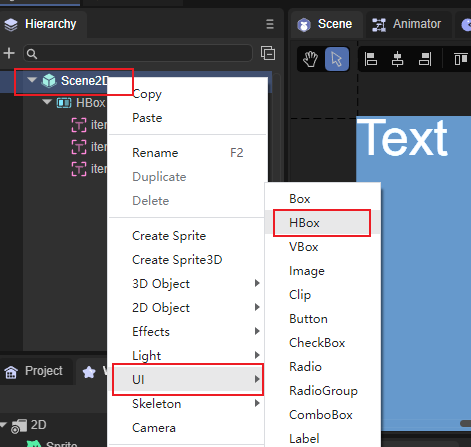
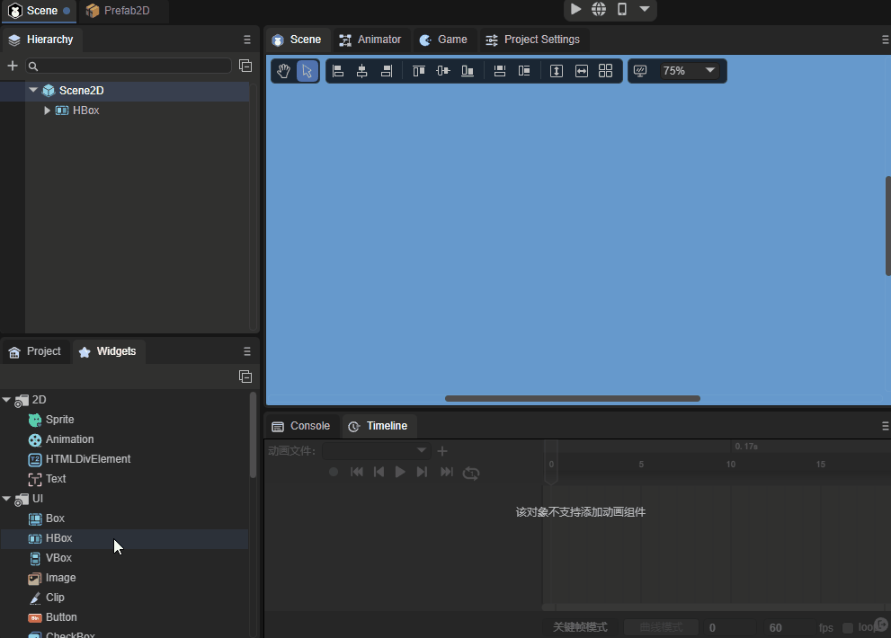
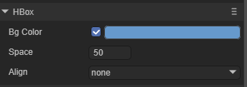
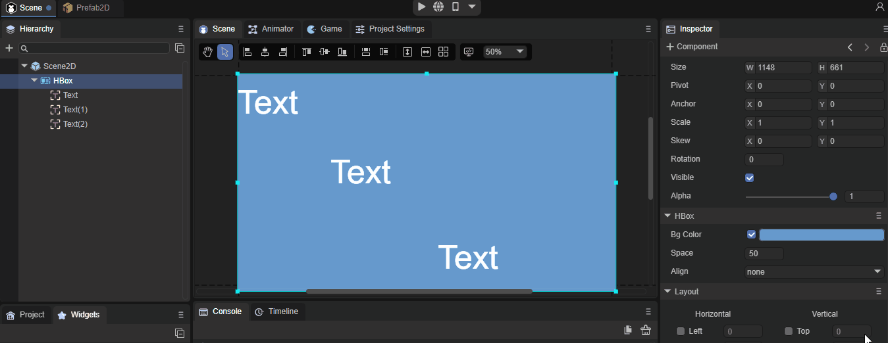
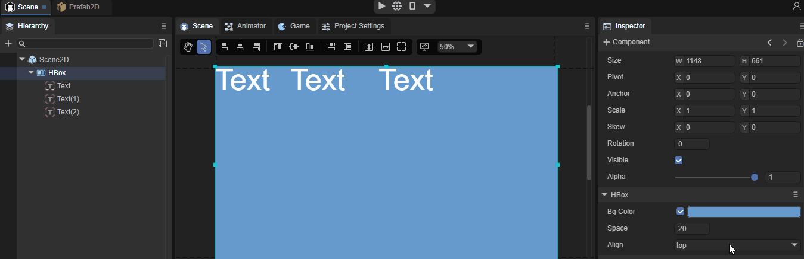

# HBox组件参考

HBox其本质是容器类组件，所有的容器类组件都继承自Box，HBox也不例外。

HBox是常用于水平布局的容器组件，相较于Box它增加了绝对布局的功能。 

[HBox API]:https://layaair.layabox.com/3.x/api/Chinese/index.html?version=3.0.0&type=2D&category=UI&class=laya.ui.HBox

## 1、HBox组件创建

通过IDE的可视化操作可以直接在层级面板对HBox进行创建，步骤为鼠标右键单击Scence2D，找到UI，点击HBox即可完成创建，如图1所示。

 

（图1）

 也可以从IDE资源管理右侧组件面板的UI文件夹中，将HBox组件拖拽到UI页面中，如动图2所示。

 

（动图2）

## 2、HBox属性介绍

 

（图3）

| 属性  | 功能                                                         |
| ----- | ------------------------------------------------------------ |
| space | 子对象的间隔，以像素为单位。                                 |
| align | 布局元素的垂直对齐，共有四个选项。none：不进行垂直对齐，top：居顶垂直对齐，middle：居中垂直对齐，bottom：居底垂直对齐，默认为none。 |

### 2.1 Align属性

HBox的子节点无论在IDE中怎样排列，在设置了Align选项后都会变成相对应的垂直排序，如动图4所示。

 

（动图4）

### 2.2 Space属性

Space属性就是设置子对象的间隔，以像素为单位，可以自行输入数字，也可以通过鼠标左键长按滑动来输入数值，非常的容易操作与理解，如动图5所示。

（动图5）