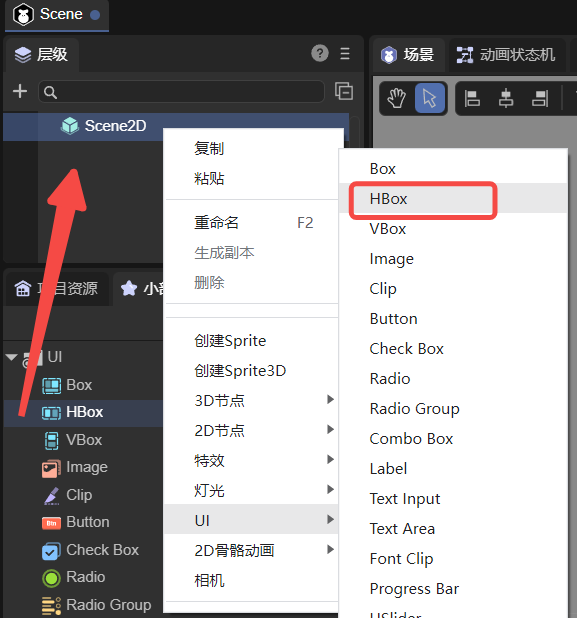
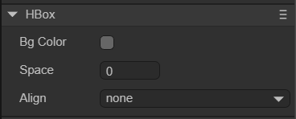
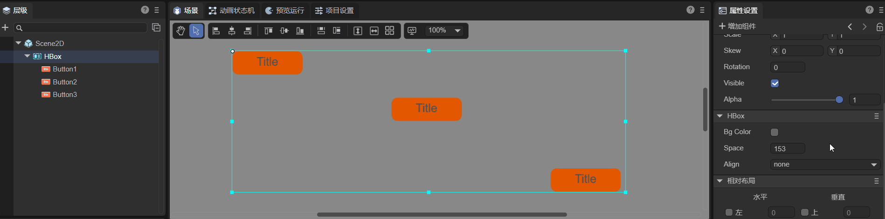

# 水平布局容器组件（HBox）

HBox其本质是容器类组件，所有的容器类组件都继承自Box，HBox也不例外。HBox是常用于水平布局的容器组件，相较于Box它增加了更加细致的功能。 HBox的详细属性可以查看[API](https://layaair.com/3.x/api/Chinese/index.html?version=3.0.0&type=2D&category=UI&class=laya.ui.HBox)。


## 一、通过LayaAir IDE创建HBox组件

### 1.1 创建HBox

通过IDE的可视化操作可以直接在层级面板对HBox进行创建，如图1-1所示，可以在`层级`窗口中右键进行创建，也可以从`小部件`窗口中拖拽添加。



（图1-1）


### 1.2 HBox属性

HBox的特有属性如下：



（图1-2）

| 属性    | 功能                                                         |
| ------- | ------------------------------------------------------------ |
| bgColor | 背景颜色，勾选后可以直接输入颜色值，例如：`#ffffff`，也可以点击输入条右侧的拾色器选取颜色 |
| space   | 子对象之间的水平间隔，以像素为单位。                         |
| align   | 布局元素的垂直对齐模式，共有四个选项。none：不进行垂直对齐，top：居顶垂直对齐，middle：居中垂直对齐，bottom：居底垂直对齐，默认为none。 |

space属性就是设置子对象之间的水平间隔，以像素为单位，可以自行输入数字，也可以通过鼠标左键长按滑动来输入数值。假设HBox有三个Button组件子对象，调节space属性的效果如动图1-3所示。


（动图1-3）

HBox的子节点无论在IDE中怎样排列，在设置了align属性后都会变成相对应的垂直排序，如动图1-4所示。



（动图1-4）


### 1.3 脚本控制HBox

在Scene2D的属性设置面板中，增加一个自定义组件脚本。然后，将HBox拖入到其暴露的属性入口中，由于只有一个HBox无法查看效果，所以开发者可以在HBox下添加一些子节点。示例代码如下：

```typescript
const { regClass, property } = Laya;

@regClass()
export class NewScript extends Laya.Script {

    @property({ type: Laya.HBox })
    public hbox: Laya.HBox;

    //组件被激活后执行，此时所有节点和组件均已创建完毕，此方法只执行一次
    onAwake(): void {
        this.hbox.pos(100, 100);
        this.hbox.bgColor = "#ffffff";
        this.hbox.space = 100;
        this.hbox.align = "middle";
    }
}
```


## 二、通过代码创建HBox组件

有时，需要用代码管理UI，创建UI_HBox类用于创建HBox组件。由于单独创建一个HBox组件的意义并不大，所以再创建三个Button组件用于演示效果。示例代码如下：

```typescript
const { regClass, property } = Laya;

@regClass()
export class UI_HBox extends Laya.Script {

    private hbox: Laya.HBox;
    private btn1: Laya.Button;
    private btn2: Laya.Button;
    private btn3: Laya.Button;

    // 按钮皮肤资源
    private skins: string = "atlas/comp/button.png";

    //组件被激活后执行，此时所有节点和组件均已创建完毕，此方法只执行一次
    onAwake(): void {
        Laya.loader.load(this.skins).then(() => {
            this.createBtn();
            this.createHbox();
            // 添加HBox组件
            this.owner.addChild(this.hbox);
        });
    }

    // 创建Button组件
    private createBtn(): void {
        this.btn1 = new Laya.Button(this.skins);
        this.btn2 = new Laya.Button(this.skins);
        this.btn3 = new Laya.Button(this.skins);
    }

    // 创建HBox组件
    private createHbox(): void {
        this.hbox = new Laya.HBox;
        this.hbox.pos(100, 100);
        this.hbox.size(600, 300);
        this.hbox.bgColor = "#ffffff";
        this.hbox.addChild(this.btn1);
        this.hbox.addChild(this.btn2);
        this.hbox.addChild(this.btn3);
        this.hbox.space = 100;
        this.hbox.align = "middle";
    }
}
```

