# 水平滚动条组件（HScrollBar）

##  一、通过LayaAir IDE创建HScrollBar组件

HScrollBar组件是一个水平方向滚动条组件。当数据太多以至于显示区域无法容纳时，最终用户可以使用 HScrollBar 组件控制所显示的数据部分。HScrollBar 组件的脚本接口请参考 [HScrollBar API](https://layaair.com/3.x/api/Chinese/index.html?version=3.0.0&type=2D&category=UI&class=laya.ui.HScrollBar)。

###         1.1 创建HScrollBar

如图1-1所示，可以在`层级`窗口中右键进行创建，也可以从`小部件`窗口中拖拽添加。

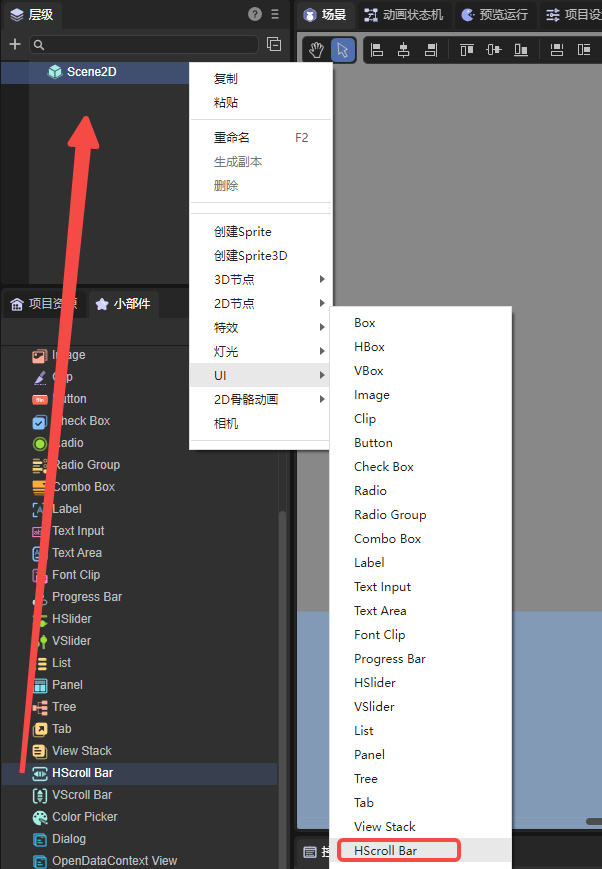

（图1-1）

滚动条由四部分组成：一个轨道图、一个滑块按钮和两个箭头按钮。HScrollBar组件图像资源的命名要符合[资源命名规则](../readme.md)，LayaAir自带的资源示例如下所示：

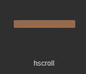

（图1-2）轨道图

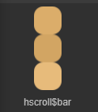

（图1-3）滑块按钮

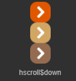

（图1-4）箭头按钮1

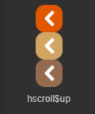

（图1-5）箭头按钮2

创建HScrollBar后的显示效果如下：

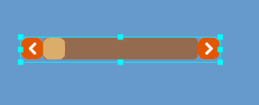

（图1-6）


### 1.2 HScrollBar属性

HScrollBar的特有属性如下：

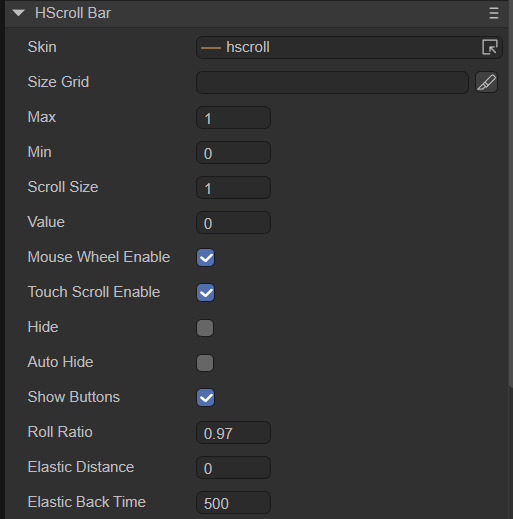

（图1-7）

| **属性**          | **功能说明**                                                 |
| ----------------- | ------------------------------------------------------------ |
| skin              | 滚动条轨道图的图像资源地址。                                 |
| sizeGrid          | 滚动条轨道图资源的有效缩放网格数据（九宫格数据）。           |
| max               | 表示滑块的最大滚动位置（滑块位于最右侧时的value值）。        |
| min               | 表示滑块的最小滚动位置（滑块位于最左侧时的value值）。        |
| scrollSize        | 点击按钮滚动量。每一次点击滚动条箭头按钮时，滚动条的值改变的量（滑块移动的量）。 |
| value             | 滚动条当前进度值（滑块当前位置）。                           |
| mouseWheelEnable  | 是否开启鼠标滚轮滚动，默认值为true。该属性设置滚动对象target以后有效。 |
| touchScrollEnable | 是否开启触摸滚动，默认值为true。该属性设置滚动对象target以后有效。 |
| hide              | 是否隐藏滚动条，默认为false。设为true后，不显示滚动条，但是可以正常滚动。 |
| autoHide          | 是否自动隐藏滚动条，默认值为false。设为true后，无需滚动时隐藏滚动条，内容需要滚动时显示滚动条。 |
| showButtons       | 是否显示箭头按钮，默认值为true。设为false后，箭头按钮将不显示。 |
| rollRatio         | 滚动衰减系数，默认为0.97。                                   |
| elasticDistance   | 橡皮筋效果极限距离，0为没有橡皮筋效果。                      |
| elasticBackTime   | 橡皮筋回弹时间，单位为毫秒。                                 |

下面展示一些滚动条属性设置的效果：

设置 HScrollBar 的属性 max 的值为 10、属性 min 的值为0、属性 value 的值为3后，显示效果如下：

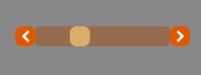

（图1-8）

在运行时，可以拖动滑块或点击箭头按钮控制滚动条的值。设置属性scrollSize为1，那么每次点击滚动条箭头按钮时，滚动条的值value就改变1，效果如下所示：


（动图1-9）

设置mouseWheelEnable属性为true后，可以开启鼠标滚轮滚动。但是该属性必须设置滚动对象后才有效，这里的滚动对象以Panel为例，效果如动图1-10所示，通过鼠标滑轮控制水平滚动条。

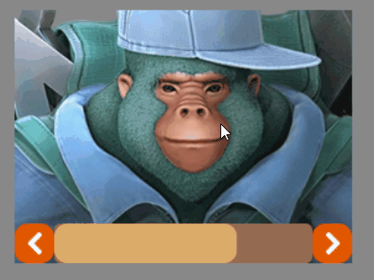

（动图1-10）

设置touchScrollEnable属性为true后，可以开启触摸滚动。该属性也必须设置滚动对象后才有效，如动图1-11所示，可以对Panel组件进行拖拽，水平滚动条会跟着进行滚动。

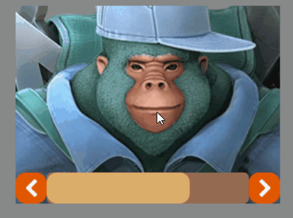

（动图1-11）

设置hide属性为true后，不显示滚动条，但是可以正常滚动。效果如下动图所示：


（动图1-12）

设置autoHide属性为true后，滚动条会自动隐藏。当操作内容进行滚动时，滚动条会显示出来，当停止滚动时，滚动条会自动隐藏。效果如下：


（动图1-13）

设置rollRatio属性，数值越小，滚动的速度变化越小。动图1-14左图是rollRatio设置为1的效果，右图是rollRatio设置为0.1的效果，显然rollRatio的值越大，滚动速度越快。

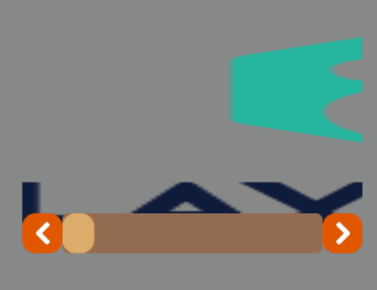

（动图1-14）

水平滚动条支持橡皮筋技术。动图1-15演示的是设置橡皮筋效果极限距离elasticDistance为200、橡皮筋回弹时间elasticBackTime为500毫秒的效果。


（动图1-15）


### 1.3 脚本控制HScrollBar

在Scene2D的属性设置面板中，增加一个自定义组件脚本。然后，将HScrollBar拖入到其暴露的属性入口中。需要添加如下的示例代码，实现脚本控制HScrollBar：

```typescript
const { regClass, property } = Laya;

@regClass()
export class NewScript extends Laya.Script {

    @property({ type: Laya.HScrollBar })
    public hscroll: Laya.HScrollBar;

    //组件被激活后执行，此时所有节点和组件均已创建完毕，此方法只执行一次
    onAwake(): void {
        this.hscroll.skin = "atlas/comp/hscroll.png";//滚动条皮肤
        this.hscroll.width = 300;//滚动条的宽度
        this.hscroll.pos(300, 300);//滚动条的位置
        this.hscroll.min = 0;//滑块的最小滚动位置
        this.hscroll.max = 10;//滑块的最大滚动位置
        this.hscroll.scrollSize = 1;//点击按钮的滚动量
    }

}
```


## 二、通过代码创建HScrollBar组件

在进行书写代码的时候，免不了通过代码控制UI，创建`UI_HScrollBar`类，并通过代码设定HScrollBar相关的属性。下述示例演示了如何通过代码创建HScrollBar，并通过一个Text组件显示滚动条的value值。开发者可以自己通过代码设置HScrollBar，创建出符合自己需要的HScrollBar。

**示例代码：**

```typescript
const { regClass, property } = Laya;

@regClass()
export class UI_HScrollBar extends Laya.Script {

    constructor() {
        super();
    }

    // 文本组件，用于显示滚动条的value值
    public text: Laya.Text;

    // 组件被激活后执行，此时所有节点和组件均已创建完毕，此方法只执行一次
    onAwake(): void {
        // 创建文本组件
        this.text = new Laya.Text();
        this.text.pos(300, 260);
        this.owner.addChild(this.text);

        // 滚动条皮肤资源
        var skins: any[] = [];
        skins.push("atlas/comp/hscroll.png", "atlas/comp/hscroll$bar.png", "atlas/comp/hscroll$down.png", "atlas/comp/hscroll$up.png");

        Laya.loader.load(skins).then(() => {
            // 创建滚动条
            var hs: Laya.HScrollBar = new Laya.HScrollBar();
            hs.skin = "atlas/comp/hscroll.png";
            hs.width = 300;
            hs.pos(300, 300);
            hs.min = 0;
            hs.max = 100;
            hs.changeHandler = new Laya.Handler(this, this.onChange);
            this.owner.addChild(hs);
        });
    }

    private onChange(value: number): void {
        this.text.text = "滚动条的位置： value=" + value;
    }
}
```

**运行效果：**

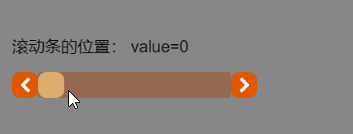

（动图2-1）