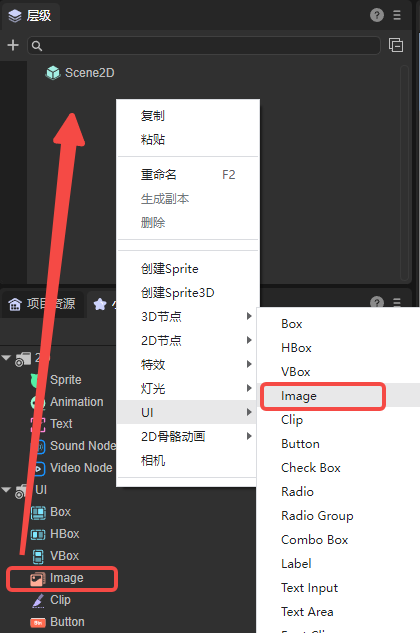
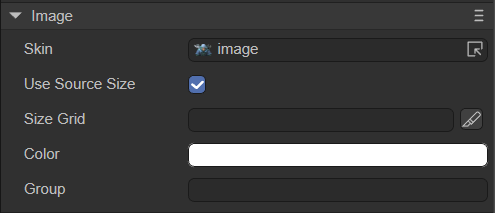
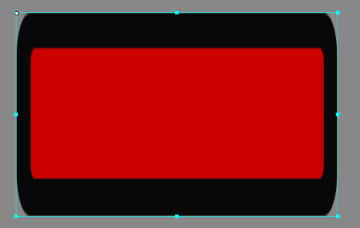
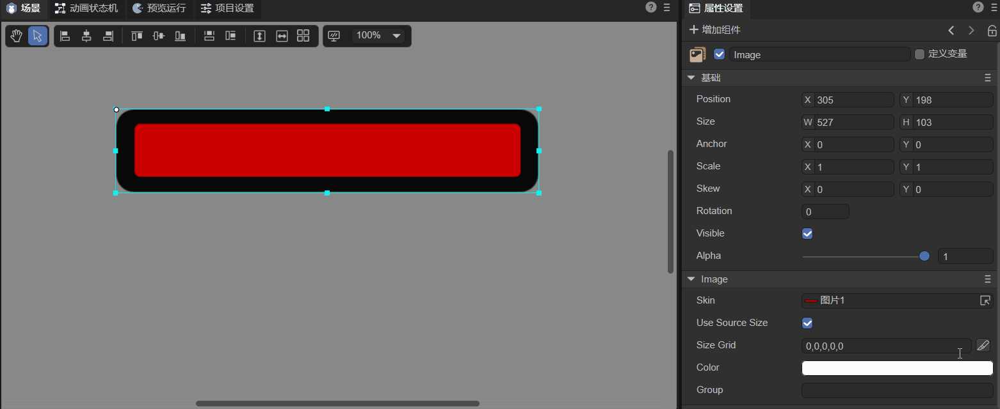
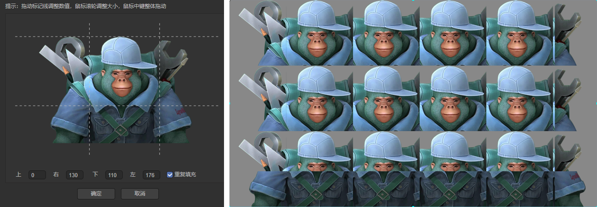

# 图像组件（Image）

## 一、通过LayaAir IDE创建Image组件

###        1.1 创建image

Image 是 UI 里最常见的显示图像的组件，用来显示位图图像。可以设置 Image 组件的 skin 属性来改变 Image 组件呈现的图像。Image 组件支持九宫格数据设定，用于实现图像放大后图像显示不失真的效果。Image 组件的脚本接口请参考 [Image API](https://layaair.com/3.x/api/Chinese/index.html?version=3.0.0&type=2D&category=UI&class=laya.ui.Image)。

如图1-1所示，可以在`层级`窗口中右键进行创建，也可以从`小部件`窗口中拖拽添加。



（图1-1）

Image 组件拖放到编辑区后显示效果如图1-2所示：


(图1-2) 


### 1.2 常用属性

Image组件的特有属性如下：



（图1-3）

| **属性**        | **功能说明**                                                 |
| --------------- | ------------------------------------------------------------ |
| skin            | 图像组件的纹理，需要添加位图的资源。                         |
| use source size | 使用位图资源的原大小。                                       |
| sizeGrid        | 位图的有效缩放网格数据（九宫格信息）：上边距、右边距、下边距、左边距、是否重复填充。 |
| color           | 更改图片颜色。                                               |
| Group           | 加载分组，设置后可以按组管理资源。                           |

这里详细说明一下九宫格的设置。假设有一张位图，如图1-4所示，它的边框颜色正好符合作为一个弹窗的需求（这里只是举例，具体色彩搭配要根据需求选择），但是图片的长度太短了，要做弹窗需要将其拉长。


（图1-4）

拉长后的效果如图1-5所示，可以看到，黑色边框会跟着被拉长。



（图1-5）

如果只想放大红色区域，黑色边框保持原来的粗细，那么就要用到sizeGrid了。具体的设置如动图1-6所示，最终可以看到，放大后的弹窗边框粗细不变，中间红色部分为有效缩放区域。



（动图1-6）

重复填充指的是，如果勾选，则放大图像时，有效缩放区域会重复填充放大的区域，而不会进行放大。效果如图1-7所示。



（图1-7）


### 1.3 脚本控制Image

有时，要通过代码设定Image相关的属性，就需要用到脚本了。在Scene2D的属性设置面板中，增加一个自定义组件脚本。然后，将Image组件拖入到其暴露的属性入口中。下面给出一个示例代码，实现脚本控制Image：

```typescript
const { regClass, property } = Laya;

@regClass()
export class NewScript extends Laya.Script {

    @property({ type: Laya.Image })
    public img: Laya.Image;

    constructor() {
        super();
    }

    /**
     * 组件被激活后执行，此时所有节点和组件均已创建完毕，此方法只执行一次
     */
    onAwake(): void {
        this.img.skin = "resources/layaAir.png";//设置皮肤
        this.img.useSourceSize = true;//设置图片大小为源大小
        this.img.color = "#0000FF";//设置颜色为蓝色
    }

}
```


## 二、通过代码创建Image组件

有时，不想让图像组件一开始就在舞台上，而是在要用的时候才添加，这就要通过代码来创建了。在Scene2D的属性设置面板中，增加一个自定义的组件脚本，在代码中创建Image。示例代码如下： 

```typescript
const { regClass, property } = Laya;

@regClass()
export class UI_Image extends Laya.Script {

    constructor() {
        super();
    }

    /**
     * 组件被激活后执行，此时所有节点和组件均已创建完毕，此方法只执行一次
     */
    onAwake(): void {
		this.setup();
	}

	private setup(): void {
		let img: Laya.Image = new Laya.Image("resources/layaAir.png");
		img.pos(165, 62.5);
		this.owner.addChild(img);
	}
}
```

