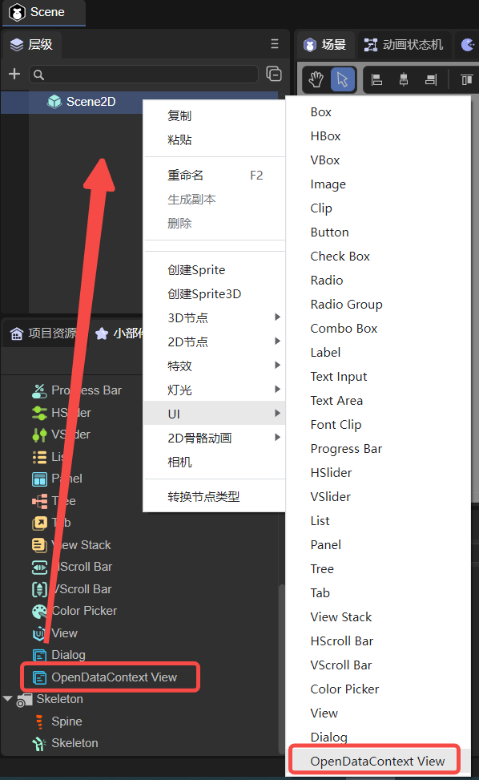
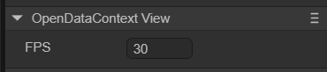

# 开放数据域（OpenDataContextView）

## 1. LayaAir IDE中创建OpenDataContextView

如图1-1所示，可以在`层级`窗口中右键进行创建，也可以从`小部件`窗口中拖拽添加。



（图1-1）

将OpenDataContextView组件添加到场景编辑的视图区后，属性面板中OpenDataContextView组件的专属属性如下图所示： 



（图1-2）

它只有FPS一个属性，表示sharedCanvas（主域和开放数据域都可以访问的一个离屏画布，详见[这里](https://developers.weixin.qq.com/minigame/dev/guide/open-ability/opendata/basic.html#%E5%B1%95%E7%A4%BA%E5%85%B3%E7%B3%BB%E9%93%BE%E6%95%B0%E6%8D%AE)）更新到主域的帧率。

除了在IDE中，还可以用脚本代码调节它的属性，在Scene2D的属性设置面板中，增加一个自定义组件脚本。然后，将OpenDataContextView拖入到其暴露的属性入口中。下面给出一个示例代码，实现脚本控制OpenDataContextView：

```typescript
const { regClass, property } = Laya;

@regClass()
export class NewScript extends Laya.Script {
    //declare owner : Laya.Sprite3D;

    @property({ type: Laya.OpenDataContextView })
    public opendata: Laya.OpenDataContextView;

    constructor() {
        super();
    }

    /**
     * 组件被激活后执行，此时所有节点和组件均已创建完毕，此方法只执行一次
     */
    onAwake(): void {
        this.opendata.pos(100,100);
        this.opendata.size(500,500);
    }
}
```


## 2. 代码创建OpenDataContextView

有时，不想让OpenDataContextView一开始就在舞台上，这就要通过代码来创建了。在Scene2D的属性设置面板中，增加一个自定义组件脚本，示例代码如下：

```typescript
const { regClass, property } = Laya;

@regClass()
export class NewScript extends Laya.Script {
    //declare owner : Laya.Sprite3D;

    constructor() {
        super();
    }

    /**
     * 组件被激活后执行，此时所有节点和组件均已创建完毕，此方法只执行一次
     */
    onAwake(): void {
        let opendata = new Laya.OpenDataContextView();
        Laya.stage.addChild(opendata);
        opendata.pos(100,100);
        opendata.size(500,500);
    }
}
```


## 3. 作用与效果

开放数据域一般用来显示好友排行榜，需要发布为微信小游戏，然后用微信开发者工具才能看到效果。详细的流程请参考[《微信小游戏》](../../../../released/miniGame/wechat/readme.md)。

