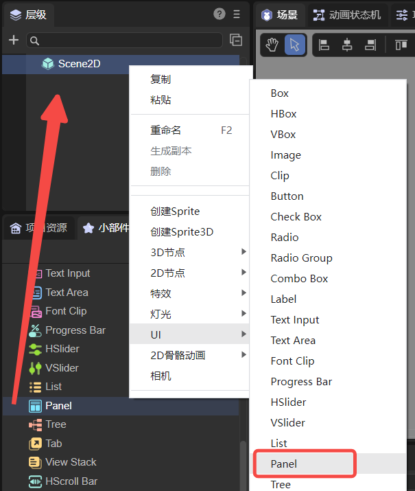

# 面板容器组件（Panel）

Panel是一个带有裁剪功能的面板容器类，常用来设置元素的显示区域。可以直接将要显示的元素添加到Panel容器中，Panel的宽高就是元素将要显示的宽高。Panel的详细属性可以查看[API](https://layaair.com/3.x/api/Chinese/index.html?version=3.0.0&type=2D&category=UI&class=laya.ui.Panel)。


## 一、通过LayaAir IDE创建Panel组件

### 1.1 创建Panel

通过IDE的可视化操作可以直接在层级面板对Panel进行创建，如图1-1所示，可以在`层级`窗口中右键进行创建，也可以从`小部件`窗口中拖拽添加。



（图1-1）

给Panel设置宽高（例如：`200*200`）。然后给Panel组件添加子节点，放入一张图片（`512*313`）。显示效果以及层级结构如图1-2所示。


（图1-2）

由图1-2可以看出放入的图片被裁剪了，图片最终所显示的宽高就是Panel容器的宽高（200*200）。开发者可以直接调整图片的坐标改变其显示的内容。


### 1.2 Panel属性

Panel组件的特有属性如下：


（图1-3）

| 属性           | 说明                                                         |
| -------------- | ------------------------------------------------------------ |
| bgColor        | 背景颜色，勾选后可以直接输入颜色值，例如：`#ffffff`，也可以点击输入条右侧的拾色器选取颜色 |
| scrollType     | 滚动类型，选项有：无滚动、水平方向滚动、垂直方向滚动、水平与垂直都滚动。不同的滚动类型要设置对应的滚动条皮肤 |
| vScrollBarSkin | 垂直滚动条皮肤，默认不设置。滚动条皮肤资源要符合[资源命名规则](../readme.md) |
| hScrollBarSkin | 水平滚动条皮肤，默认不设置。滚动条皮肤资源要符合[资源命名规则](../readme.md) |
| elasticEnabled | 是否使用橡皮筋回弹效果，默认为false                          |

对Panel组件设置滚动条，可以只设置垂直滚动条VScrollBarSkin，也可以只设置水平滚动条HScrollBarSkin，还可以两者都设置。

如果只设置垂直滚动条，则需要将ScrollType设置为垂直方向滚动；如果只设置水平滚动条，则需要将ScrollType设置为水平方向滚动；如果两者都设置，则需要将ScrollType设置为水平与垂直都滚动。

**除List组件外，Panel是唯一一个可以设置滚动条的容器组件**。对Panel设置水平与垂直都滚动的效果如下：


（动图1-4）

开启橡皮筋回弹效果ElasticEnabled后，当滑块滚动到边界时，滑块会继续滚动一段距离，然后回弹。橡皮筋效果如动图1-5所示，这样可以增加滚动的流畅性和用户体验。


（动图1-5）


### 1.3 脚本控制Panel

在Scene2D的属性设置面板中，增加一个自定义组件脚本。然后，将Panel组件拖入到其暴露的属性入口中，由于只有一个Panel组件无法查看效果，所以开发者可以在Panel下添加一些子节点。需要添加如下的示例代码，实现脚本控制Panel：

```typescript
const { regClass, property } = Laya;

@regClass()
export class NewScript extends Laya.Script {

    @property({ type: Laya.Panel })
    public panel: Laya.Panel;

    //组件被激活后执行，此时所有节点和组件均已创建完毕，此方法只执行一次
    onAwake(): void {
        this.panel.pos(100, 100);
        this.panel.size(200, 200);
        this.panel.scrollType = Laya.ScrollType.Both; //滚动类型：水平与垂直都滚动
        this.panel.vScrollBarSkin = "atlas/comp/vscroll.png";
        this.panel.hScrollBarSkin = "atlas/comp/hscroll.png";
        this.panel.elasticEnabled = true; //橡皮筋效果
    }
}
```


## 二、通过代码创建Panel组件

Panel组件除了可以直接在UI界面中可视化的操作之外，在代码中进行创建也是很简单的。创建UI_Panel类，实现代码创建Panel组件。示例代码如下：

```typescript
const { regClass, property } = Laya;

@regClass()
export class UI_Panel extends Laya.Script {

    constructor() {
        super();
    }

    // 组件被激活后执行，此时所有节点和组件均已创建完毕，此方法只执行一次
    onAwake(): void {
        // 创建Panel组件
        let panel: Laya.Panel = new Laya.Panel();
        panel.hScrollBarSkin = "atlas/comp/hscroll.png";
        panel.size(600, 275);
        panel.pos(150, 150);
        this.owner.addChild(panel);

        // 创建Image组件，作为Panel的子节点
        let img: Laya.Image;
        for (var i: number = 0; i < 4; i++) {
            // 创建4个Image，水平排列
            img = new Laya.Image("atlas/comp/image.png");
            img.x = i * 512;
            panel.addChild(img);
        }
    }
}
```

效果如下动图所示：


（动图2-1）

