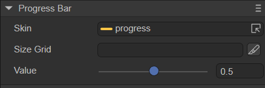
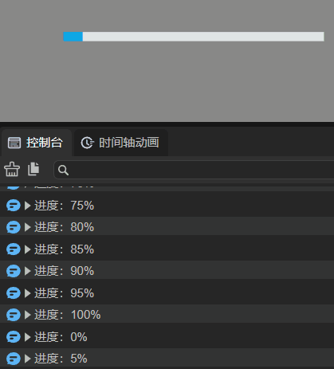

# 进度条组件（ProgressBar）

##  一、通过LayaAir IDE创建ProgressBar组件

ProgressBar经常被用于显示游戏中某个操作的进度，例如加载资源的进度、角色经验或血量的进度。ProgressBar的脚本接口参考 [API](https://layaair.com/3.x/api/Chinese/index.html?version=3.0.0&type=2D&category=UI&class=laya.ui.ProgressBar)。

### 	1.1 创建ProgressBar

如图1-1所示，可以在`层级`窗口中右键进行创建，也可以从`小部件`窗口中拖拽添加。


（图1-1）

ProgressBar组件由两部分组成：底图`progress.png`和进度`progress$bar.png`，资源示例如图1-2所示。


（图1-2）

LayaAir默认创建的ProgressBar组件效果如下图所示：


（图1-3）


### 1.2 ProgressBar属性

ProgressBar的特有属性如下：



（图1-4）

| **属性** | **功能说明**                                   |
| -------- | ---------------------------------------------- |
| skin     | 进度条的底图资源                               |
| sizeGrid | 进度条底图资源的有效缩放网格数据（九宫格数据） |
| value    | 进度条的进度值，范围在0到1之间                 |

设置ProgressBar组件的属性value的值为0.3后，显示效果如下所示：


（图1-5）


### 1.3 脚本控制ProgressBar

有时，需要将加载过程等进度用进度条的方式展示出来，这就需要用脚本代码控制了。

在Scene2D的属性设置面板中，增加一个自定义组件脚本。然后，将ProgressBar拖入到其暴露的属性入口中。再添加一个Text组件，用于描述加载进度。需要添加如下的示例代码：

```typescript
const { regClass, property } = Laya;

@regClass()
export class NewScript extends Laya.Script {

    @property({ type: Laya.ProgressBar })
    public progressBar: Laya.ProgressBar;

    @property({ type: Laya.Text })
    public loadText: Laya.Text;

    //组件被激活后执行，此时所有节点和组件均已创建完毕，此方法只执行一次
    onAwake(): void {
        this.progressBar.value = 0.01; //初始进度值
        this.loadText.text = "资源加载中……";
        // 测试加载效果
        Laya.timer.loop(100, this, this.changeProgress);
    }

    //这里仅模拟加载演示效果
    changeProgress(): void {
        this.progressBar.value += 0.05; //每次进度条的改变量
        if (this.progressBar.value == 1) {
            this.loadText.text = "资源加载完成";
            Laya.timer.clear(this, this.changeProgress);
        }
    }
}
```

效果如下：


（动图1-6）


##  二、通过代码创建ProgressBar

在进行项目开发的时候，免不了通过代码创建UI，创建UI_ProgressBar类，并通过代码设定ProgressBar相关的属性，示例代码如下：

```typescript
const { regClass, property } = Laya;

@regClass()
export class UI_ProgressBar extends Laya.Script {

    private progressBar: Laya.ProgressBar;

    constructor() {
        super();
    }

    onAwake(): void {
        // 加载进度条资源，图片资源来自“引擎API使用示例”
        Laya.loader.load(["resources/res/ui/progressBar.png", "resources/res/ui/progressBar$bar.png"]).then(() => {
            // 创建进度条
            this.progressBar = new Laya.ProgressBar("resources/res/ui/progressBar.png");
            this.progressBar.pos(100, 500);
            this.progressBar.width = 400;
            this.progressBar.sizeGrid = "5,5,5,5";
            this.progressBar.changeHandler = new Laya.Handler(this, this.onChange);
            this.owner.addChild(this.progressBar);
            Laya.timer.loop(100, this, this.changeValue);
        });
    }

    // 模拟进度条加载
    private changeValue(): void {
        if (this.progressBar.value >= 1)
            this.progressBar.value = 0;
        this.progressBar.value += 0.05;
    }

    private onChange(value: number): void {
        // 控制台打印输出进度
        console.log("进度：" + Math.floor(value * 100) + "%");
    }
}
```

示例效果如下：



（动图2-1）

ProgressBar的其他属性也可以通过代码来设置，上述示例演示了如何通过代码创建ProgressBar，有兴趣的开发者可以自己通过代码设置ProgressBar，创建出符合自己需要的进度条。