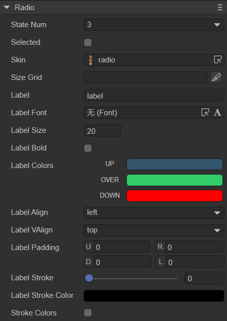
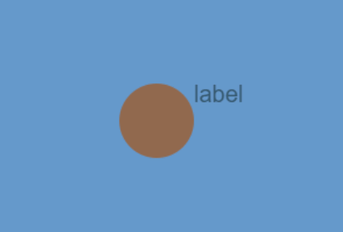

# 单选框组件（Radio）

Radio继承自Button，它的很多属性也继承自Button，所以前面Button中介绍过的这里就不再过多讲述。Radio的详细用法可以参考[Radio API](https://layaair.com/3.x/api/Chinese/index.html?version=3.0.0&type=2D&category=UI&class=laya.ui.Radio)。


## 一、通过LayaAir IDE创建Radio组件

### 1.1 创建Radio

使用LayaAir IDE创建Radio非常简单，通过IDE的可视化操作，就可以实现组件的创建与布局，也是推荐使用的组件创建方式。可以从层级面板右键进行创建，也可以选择小部件面板里的Radio组件，拖拽进行添加，如图1-1所示。


（图1-1）


### 1.2 Radio属性

Radio组件的特有属性如下：



（图1-2）

| 属性             | 功能说明                                                     |
| ---------------- | ------------------------------------------------------------ |
| stateNum         | 单选框皮肤的状态数，支持单态（1）、两态（2）和三态（3）      |
| selected         | 单选框是否为选中状态，默认为false。设置为true后，单选框会一直保持选中（持续选中）的状态，而不会再对其它状态产生变化（除非在代码中进行状态改变） |
| skin             | 单选框的皮肤纹理资源。设置后需要根据皮肤资源设置stateNum皮肤状态数 |
| sizeGrid         | 位图的有效缩放网格数据（九宫格信息）：上边距、右边距、下边距、左边距、是否重复填充 |
| label            | 单选框的文本标签                                             |
| labelFont        | 文本标签的字体                                               |
| labelSize        | 文本标签的字体大小                                           |
| labelBold        | 文本标签是否加粗，默认为false                                |
| labelColors      | 鼠标在元素释放时（up）、鼠标移动到元素时（over），鼠标按下时（down）各个状态下的文本标签颜色 |
| labelAlign       | 文本标签的水平对齐模式：left、center、right，默认为居左对齐  |
| labelVAlign      | 文本标签的垂直对齐模型：top、middle、bottom，默认为居顶对齐  |
| labelPadding     | 文本标签的边距。格式：上边距、右边距、下边距、左边距         |
| labelStroke      | 文本标签的描边宽度，以像素为单位。默认值为0，表示不描边      |
| labelStrokeColor | 文本标签描边的颜色，以字符串表示，默认值为#000000（黑色）    |
| strokecolors     | 勾选后，可以根据状态设置文本的描边颜色。分三种状态进行设置：鼠标在元素释放时（up）、鼠标移动到元素时（over），鼠标按下时（down），三种状态可以设置不同的描边颜色 |

Radio继承于Button，是一个单选框组件。相对于按钮组件，单选框组件的特性是，点中之后不会恢复状态，如动图1-3所示。



（动图1-3）

> 其余属性与Button相同，开发者可以根据[按钮组件](../Button/readme.md)的文档进行理解。


### 1.3 脚本控制Radio

在Scene2D的属性设置面板中，增加一个自定义组件脚本。然后，将Radio组件拖入到其暴露的属性入口中。需要添加如下的示例代码，实现脚本控制Radio：

```typescript
const { regClass, property } = Laya;

@regClass()
export class NewScript extends Laya.Script {

    @property({ type: Laya.Radio })
    public radio: Laya.Radio;

    //组件被激活后执行，此时所有节点和组件均已创建完毕，此方法只执行一次
    onAwake(): void {
        this.radio.skin = "atlas/comp/radio.png"; //皮肤
        this.radio.stateNum = 3; //皮肤状态

        this.radio.label = "确定"; //文本标签
        this.radio.labelFont = "宋体"; //文本标签字体
        this.radio.labelSize = 20; //文本标签字体大小
        this.radio.labelBold = true; //文本标签加粗
        this.radio.labelVAlign = "middle"; //文本标签垂直居中对齐

        this.radio.labelStroke = 3; //文本标签字体描边宽度
        this.radio.labelStrokeColor = "#ffffff"; //描边颜色
        this.radio.strokeColors = "#000000, #c6ff00, #001aff"; //各状态下的描边颜色
        this.radio.labelColors = "#0100ff, #16fa0e, #ff0000"; //各状态下的文本颜色

        // this.radio.selected = true; //是否选中
    }
}
```


## 二、通过代码创建Radio组件

在进行书写代码的时候，免不了通过代码控制UI，创建`UI_Radio`类，并通过代码设定Radio相关的属性。下述示例演示了如何通过代码创建一个Radio组件并设置其属性。

示例代码如下：

```typescript
const { regClass, property } = Laya;

@regClass()
export class UI_Radio extends Laya.Script {

    constructor() {
        super();
    }

    // 组件被激活后执行，此时所有节点和组件均已创建完毕，此方法只执行一次
    onAwake(): void {
        let radio: Laya.Radio = new Laya.Radio();
        radio.pos(200, 200);
        radio.size(160, 64);
        radio.stateNum = 3;
        radio.selected = false;
        radio.skin = "atlas/comp/radio.png";
        radio.label = "LayaAir";
        radio.labelSize = 20;
        radio.labelBold = true;
        radio.labelVAlign = "top";
        this.owner.addChild(radio);
    }
}
```

效果如动图2-1所示：


（动图2-1）

