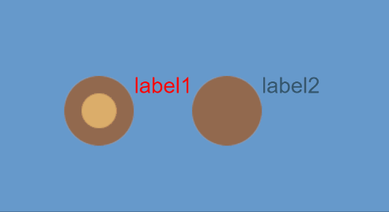
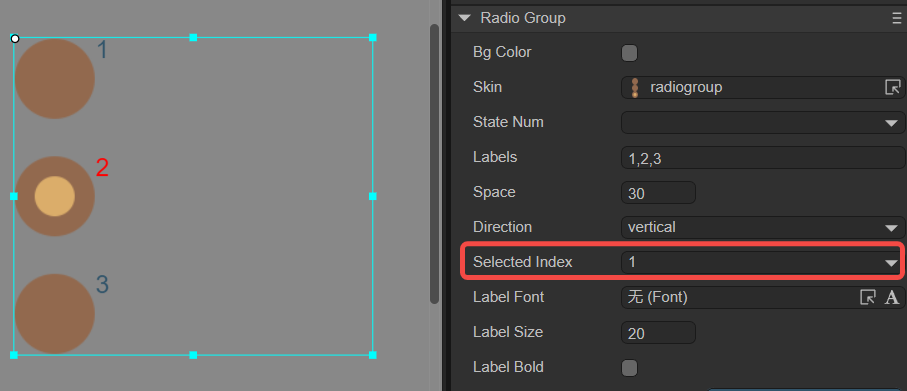
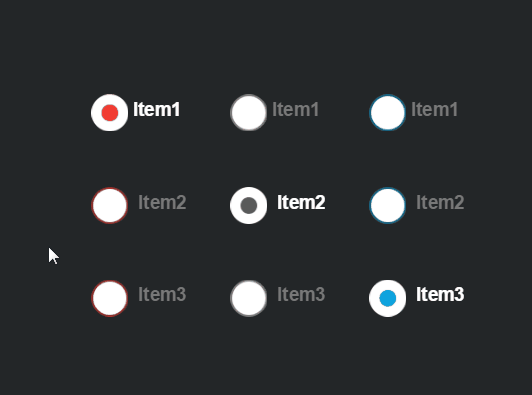

# 单选框组组件（RadioGroup）

RadioGroup是单选框按钮组，按钮组之内的组件选项互相排斥，用户每次只能选择一个单选框（Radio）组件，如动图1所示。



（动图1）

Radio与RadioGroup不同的是，Radio是一个单选框，而RadioGroup可以通过修改labels属性来增加单选框。RadioGroup组件的详细用法可以参考[RadioGroup API](https://layaair.com/3.x/api/Chinese/index.html?version=3.0.0&type=2D&category=UI&class=laya.ui.RadioGroup)。


## 一、通过LayaAir IDE创建RadioGroup组件

### 1.1 创建RadioGroup

如图1-1所示，点击选择小部件面板里的RadioGroup组件，拖放到页面编辑区，或者在层级窗口中通过右键创建，即可添加RadioGroup组件到页面上。


（图1-1）

RadioGroup组件的默认皮肤资源如下图所示：


（图1-2）

> RadioGroup组件的皮肤无法使用九宫格属性，所以要在资源设计的时候就确定好实际应用时的大小。


### 1.2 RadioGroup属性

RadioGroup的特有属性如下：


（图1-3）

| 属性             | 功能说明                                                     |
| ---------------- | ------------------------------------------------------------ |
| bgColor          | 单选框组背景颜色，勾选后可以直接输入颜色值，例如：`#ffffff`，也可以点击输入条右侧的拾色器选取颜色 |
| skin             | 单选框的皮肤纹理资源。设置后需要根据皮肤资源设置stateNum皮肤状态数 |
| stateNum         | 单选框皮肤的状态数，支持单态（1）、两态（2）和三态（3）      |
| labels           | 单选框组的文本标签集合。可根据文本标签数量，确定单选框组中单选框的数量 |
| space            | 单选框之间的间隔，以像素为单位                               |
| direction        | 单选框的排列方向。有vertical（垂直排列）和horizontal（水平排列）两种 |
| selectedIndex    | 选择索引，默认为-1。设置后，单选框会保持选中状态。索引数量会根据labels数量（单选框数量）动态改变 |
| labelFont        | 文本标签的字体                                               |
| labelSize        | 文本标签的字体大小                                           |
| labelBold        | 文本标签是否加粗，默认为false                                |
| labelColors      | 鼠标在元素释放时（up）、鼠标移动到元素时（over），鼠标按下时（down）各个状态下的文本标签颜色 |
| labelStroke      | 文本标签的描边宽度，以像素为单位。默认值为0，表示不描边      |
| labelStrokeColor | 文本标签描边的颜色，以字符串表示，默认值为#000000（黑色）    |
| labelAlign       | 文本标签的水平对齐模式：left、center、right，默认为居左对齐  |
| labelPadding     | 文本标签的边距。格式：上边距、右边距、下边距、左边距         |
| strokecolors     | 勾选后，可以根据状态设置文本的描边颜色。分三种状态进行设置：鼠标在元素释放时（up）、鼠标移动到元素时（over），鼠标按下时（down），三种状态可以设置不同的描边颜色 |

可通过设置labels属性增加单选框个数，如动图1-4中所示，默认的单选框组中只有两个单选框。如想增加单选框，只需在labels属性中增加新的标签即可，且修改文本标签的内容也在该属性中设置。


（动图1-4）

还可以改变单选框组RadioGroup的布局方向与间距，RadioGroup默认是水平布局（horizontal），通过更改direction属性，实现垂直布局（vertical）。设置间距可以通过space属性实现，如图1-5所示。


（图1-5）

设置单选框组RadioGroup默认选择的选项，需要通过selectedIndex属性设置。该属性改变单选框组的索引值，默认设置为-1时，不选择任何选项框。设置为0是第1个单选框，1是第2个单选框……以此类推。假设将属性值设置为1时，效果如图1-6所示。



（图1-6）


### 1.3 脚本控制RadioGroup

在Scene2D的属性设置面板中，增加一个自定义组件脚本。然后，将RadioGroup拖入到其暴露的属性入口中。需要添加如下的示例代码，实现脚本控制RadioGroup：

```typescript
const { regClass, property } = Laya;

@regClass()
export class NewScript extends Laya.Script {

    @property({ type: Laya.RadioGroup })
    public radiogroup: Laya.RadioGroup;

    //组件被激活后执行，此时所有节点和组件均已创建完毕，此方法只执行一次
    onAwake(): void {
        this.radiogroup.pos(100, 100);
        this.radiogroup.labels = "label0,label1,label2";
        this.radiogroup.space = 20;
        this.radiogroup.selectedIndex = 0;
        this.radiogroup.direction = "vertical";
    }
}
```


## 二、创建自定义的RadioGroup组件

上一小节，使用了同一种单选框资源，在RadioGroup中通过设置labels生成了三个单选框。然而在实际的游戏中，在同一个RadioGroup组件中对单选框样式有不同的需求，那么通过labels设置的方式是无法完成这个需求的。这个时候就需要使用自定义RadioGroup组件的方式。下面是具体步骤：


### 2.1 准备美术资源

用三张不同的Raido单选框美术资源，组成自定义的RadioGroup组件，资源如图2-1所示。


（图2-1）

**Tips**：

这里要特别注意一下皮肤图片的命名规则，在自定义的RadioGroup组件中，不能使用`RadioGroup`或`RadioGroup_`为前缀命名。因为要使用Radio单选框组件来作为它的子项组件，所以本例中的图片资源命名使用`radio_`为前缀。


### 2.2 在IDE中创建Radio组件

将资源拷贝到项目的资源文件夹下，然后在IDE中，将Radio组件逐个拖拽到场景编辑器，从左到右（或从上到下）。再将每个Radio组件的name属性，按先后顺序依次修改成“item0、item1、item2.....”（若不按此规则增加名字属性，生成的RadioGroup组件为无效组件，不能正常运行）。

当设置完各个Radio组件的皮肤、文本、大小、位置等属性后，效果如图2-2所示。


（图2-2）


### 2.3 转换成RadioGroup容器

当修改好子项属性后，全选子组件，右键单击调出设置面板，点击`转换为容器->RadioGroup`，最终转换成RadioGroup容器类型，步骤如动图2-3所示。


（动图2-3）

转换成功后，如图2-4所示，需要保证RadioGroup的skin属性值为空。这样，在同一个RadioGroup组件中的三个单选框样式都不同了。


（图2-4）

开发者还可以调节RadioGroup组件的属性，最终效果如下动图所示：


（动图2-5）


## 三、通过代码创建RadioGroup

在进行书写代码的时候，免不了通过代码控制UI，创建`UI_RadioGroup`类，通过代码设定RadioGroup相关的属性。示例代码如下：

```typescript
const { regClass, property } = Laya;

@regClass()
export class UI_RadioGroup extends Laya.Script {

    private SPACING: number = 150;
    private X_OFFSET: number = 200;
    private Y_OFFSET: number = 80;

    private skins: any[];

    constructor() {
        super();
    }

    // 组件被激活后执行，此时所有节点和组件均已创建完毕，此方法只执行一次
    onAwake(): void {
        this.skins = ["resources/res/ui/radioButton (1).png", "resources/res/ui/radioButton (2).png", "resources/res/ui/radioButton (3).png"];
        Laya.loader.load(this.skins).then(() => {
            this.onLoadComplete();
        });
    }

    private onLoadComplete(e: any = null): void {
        for (let i: number = 0; i < this.skins.length; ++i) {
            let rg: Laya.RadioGroup = this.createRadioGroup(this.skins[i]);
            rg.selectedIndex = i;
            rg.x = i * this.SPACING + this.X_OFFSET;
            rg.y = this.Y_OFFSET;
        }
    }

    private createRadioGroup(skin: string): Laya.RadioGroup {
        let rg: Laya.RadioGroup = new Laya.RadioGroup();
        rg.skin = skin;
        rg.space = 70;
        rg.direction = "vertical";
        rg.labels = "Item1, Item2, Item3";
        rg.labelColors = "#787878,#d3d3d3,#FFFFFF";
        rg.labelSize = 20;
        rg.labelBold = true;
        rg.selectHandler = new Laya.Handler(this, this.onSelectChange);
        this.owner.addChild(rg);
        return rg;
    }

    private onSelectChange(index: number): void {
        console.log("你选择了第 " + (index + 1) + " 项");
    }

}
```

效果如图所示：



（图3-1）


