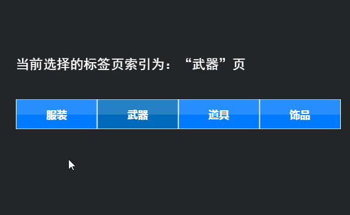

# Tab 组件详解

> 由于很多组件属性是通用的，常用及通用的组件属性在`属性设置器`文档中已进行介绍。阅读本篇内容前请先阅读《属性设置器》文档。

## 1、了解Tab组件

### 1.1 Tab组件的作用

​        Tab 组件用于定义选项卡按钮组，例如多页面切换显示。如动图1所示。

  

（动图1）

### 1.2 Tab组件的皮肤（skin）规范

Tab组件的皮肤是以`tab`或以`tab_`为前缀进行命名，在皮肤设计规范方面，是竖向等分的两态图或三态图，如图2所示。

  

 (图2)三态Tab皮肤

*Tips：Tab组件的皮肤无法使用九宫格属性，所以要在资源设计的时候就确定好实际应用时的大小。*

### 1.3 Tab 组件的API介绍

Tab 组件的API介绍请参考  [http://layaair.ldc.layabox.com/api/index.html?category=Core&class=laya.ui.Tab](https://layaair2.ldc2.layabox.com/api2/Chinese/index.html?version=2.9.0beta&type=2D&category=UI&class=laya.ui.Tab)

## 2、通过LayaAirIDE创建Tab组件

### 2.1 创建Tab        

​        点击选择`资源管理器`里的 Tab 组件资源，拖拽到场景编辑器，即在页面中成功的创建了一个 Tab组件。如动图3所示。

  

（动图3）

### 2.2 通过labels增加标签

 如动图3中所示，默认的Tab组件中只有两个标签。如想增加标签，只需在labels属性中增加新的标签即可，修改标签中的文本内容也在该属性中设置，操作如动图4-1所示。

  

(动图4-1)

### 2.3 改变Tab组件的布局方向与间距

Tab组件 默认是水平布局（*horizontal*），通过更改direction属性，实现垂直布局（*vertical*）。**设置间距**可以通过space属性实现。如动图4-2所示。

 

（动图4-2）

### 2.4 设置单选框组Tab的默认选项

SelectedIndex属性是用于改变Tab组件的索引值，默认不设置时，不选择任何选项，如果要设置Tab组件的默认标签选项，可以设置SelectedIndex的属性值，0为第1个标签，1为第2个标签……以此类推。运行效果如动图4-3所示。

 

（动图4-3）

