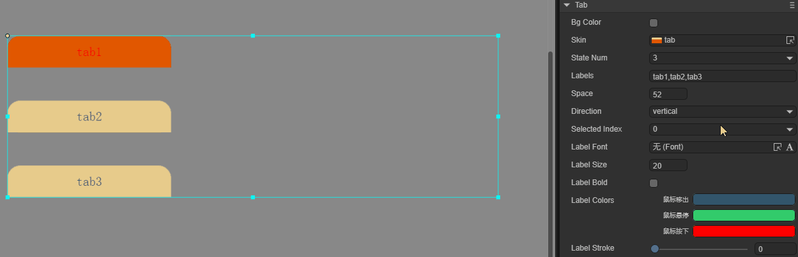

# 导航标签组组件（Tab）

Tab是导航标签组组件，用于定义选项卡按钮组，例如多页面切换显示，效果如动图1所示。Tab的详细属性可以参考[Tab API](https://layaair.com/3.x/api/Chinese/index.html?version=3.0.0&type=2D&category=UI&class=laya.ui.Tab)。


（动图1）


## 一、通过LayaAir IDE创建Tab组件

### 1.1 创建Tab

使用LayaAir IDE创建Tab非常简单，通过IDE的可视化操作，就可以实现组件的创建与布局，也是推荐使用的组件创建方式。可以从层级面板右键进行创建，也可以选择小部件面板里的Tab组件，拖拽进行添加，如图1-1所示。


（图1-1）

Tab组件的皮肤一般是竖向等分的两态图或三态图，默认的皮肤资源是三态的，如图1-2所示。


（图1-2）

> 注意：Tab组件的皮肤无法使用九宫格属性，所以要在资源设计的时候就确定好实际应用时的大小。


### 1.2 Tab属性

Tab组件的特有属性如下：


（图1-3）

| 属性             | 说明                                                         |
| ---------------- | ------------------------------------------------------------ |
| bgColor          | 背景颜色，勾选后可以直接输入颜色值，例如：`#ffffff`，也可以点击输入条右侧的拾色器选取颜色 |
| skin             | 组件的皮肤纹理资源。设置后需要根据皮肤资源设置stateNum皮肤状态数 |
| stateNum         | 组件皮肤的状态数，支持单态（1）、两态（2）和三态（3）        |
| labels           | 文本标签集合，以逗号分隔（英文输入法）。可根据文本标签数量，确定导航标签组中标签的数量 |
| space            | 各标签之间的间隔，以像素为单位                               |
| direction        | 导航标签的排列方向。有vertical（垂直排列）和horizontal（水平排列）两种 |
| selectedIndex    | 选择索引，默认为0。设置后，导航标签会保持选中状态。索引数量会根据labels数量（标签数量）动态改变 |
| labelFont        | 文本标签的字体                                               |
| labelSize        | 文本标签的字体大小                                           |
| labelBold        | 文本标签是否加粗，默认为false                                |
| labelColors      | 鼠标在鼠标移出（up）、鼠标悬停（over），鼠标按下（down）时，各个状态下的文本标签颜色 |
| labelStroke      | 文本标签的描边宽度，以像素为单位。默认值为0，表示不描边      |
| labelStrokeColor | 文本标签描边的颜色，以字符串表示，默认值为#ffffff（白色）    |
| labelAlign       | 文本标签的水平对齐模式：left、center、right                  |
| labelPadding     | 文本标签的边距。格式：上边距、右边距、下边距、左边距         |
| strokeColors     | 勾选后，可以根据状态设置文本的描边颜色。分三种状态进行设置：鼠标移出（up）、鼠标悬停（over），鼠标按下（down），三种状态可以设置不同的描边颜色 |

Tab组件可以通过labels增加标签，如动图1-4中所示，默认的Tab组件中只有两个标签。如果想增加标签，只需在labels属性中增加即可，且修改标签中的文本内容也在该属性中设置。


（动图1-4）

改变Tab组件的布局方向与间距，可通过更改direction属性进行设置。默认是水平布局（horizontal），垂直布局是vertical。设置标签之间的间距可以通过space属性实现。操作如动图1-5所示。


（动图1-5）

设置Tab的默认选项可以通过selectedIndex属性实现。selectedIndex属性是用于改变Tab组件的索引值，默认不设置时，不选择任何选项，0为第1个标签，1为第2个标签……以此类推。效果如动图1-6所示。



（动图1-6）


### 1.3 脚本控制Tab

在Scene2D的属性设置面板中，增加一个自定义组件脚本。然后，将Tab组件拖入到其暴露的属性入口中。需要添加如下的示例代码，实现脚本控制Tab：

```typescript
const { regClass, property } = Laya;

@regClass()
export class NewScript extends Laya.Script {

    @property({ type: Laya.Tab })
    public tab: Laya.Tab;

    //组件被激活后执行，此时所有节点和组件均已创建完毕，此方法只执行一次
    onAwake(): void {
        this.tab.pos(200, 200);
        this.tab.labelBold = true;
        this.tab.labelSize = 20;
        this.tab.labelStrokeColor = "#000000";
        this.tab.labels = "Tab 1,Tab 2,Tab 3";
        this.tab.labelColors = "#32556b,#8FB299,#ff0000";
        this.tab.selectedIndex = -1;
    }
}
```


## 二、通过代码创建Tab组件

在进行书写代码的时候，免不了通过代码控制UI，创建`UI_Tab`类，并通过代码设定Tab相关的属性。下述示例演示了如何通过代码创建一个Tab组件并设置其属性。

示例代码如下：

```typescript
const { regClass, property } = Laya;

@regClass()
export class UI_Tab extends Laya.Script {

	// 图片资源来自“引擎API使用示例”
    private skins: any[] = ["resources/res/ui/tab1.png", "resources/res/ui/tab2.png"];

    constructor() {
        super();
    }

    // 组件被激活后执行，此时所有节点和组件均已创建完毕，此方法只执行一次
    onAwake(): void {
		Laya.loader.load(this.skins).then( ()=>{
            this.onLoadComplete();
        } );
	}

	private onLoadComplete(e: any = null): void {
		let tabA: Laya.Tab = this.createTab(this.skins[0]);
		tabA.pos(40, 120);
		tabA.labelColors = "#000000,#d3d3d3,#333333";

		let tabB: Laya.Tab = this.createTab(this.skins[1]);
		tabB.pos(40, 220);
		tabB.labelColors = "#FFFFFF,#8FB299,#FFFFFF";
	}

	private createTab(skin: string): Laya.Tab {
		let tab: Laya.Tab = new Laya.Tab();
		tab.skin = skin;
		tab.labelBold = true;
		tab.labelSize = 20;
		tab.labelStrokeColor = "#000000";
		tab.labels = "Tab Control 1,Tab Control 2,Tab Control 3";
		tab.selectedIndex = 1;
		this.onSelect(tab.selectedIndex);
		tab.selectHandler = new Laya.Handler(this, this.onSelect);
		this.owner.addChild(tab);
		return tab;
	}

	private onSelect(index: number): void {
		console.log("当前选择的标签页索引为 " + index);
	}
}
```

运行效果如下动图所示：


（动图2-1）


