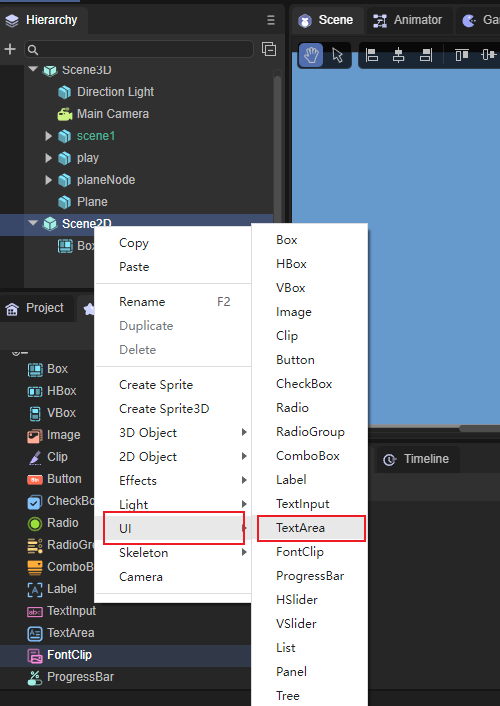
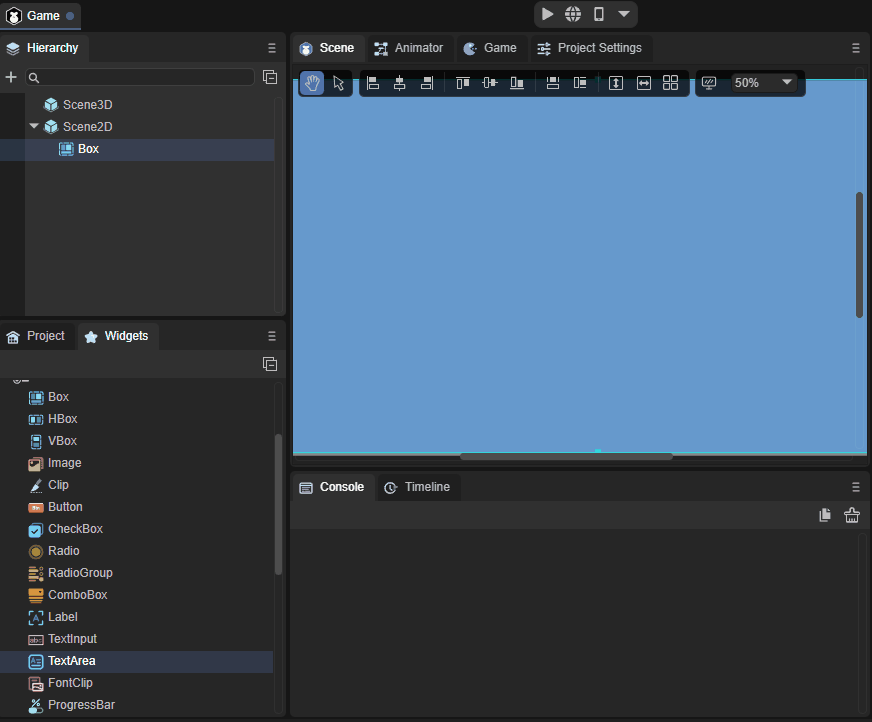
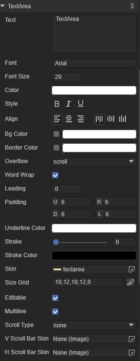
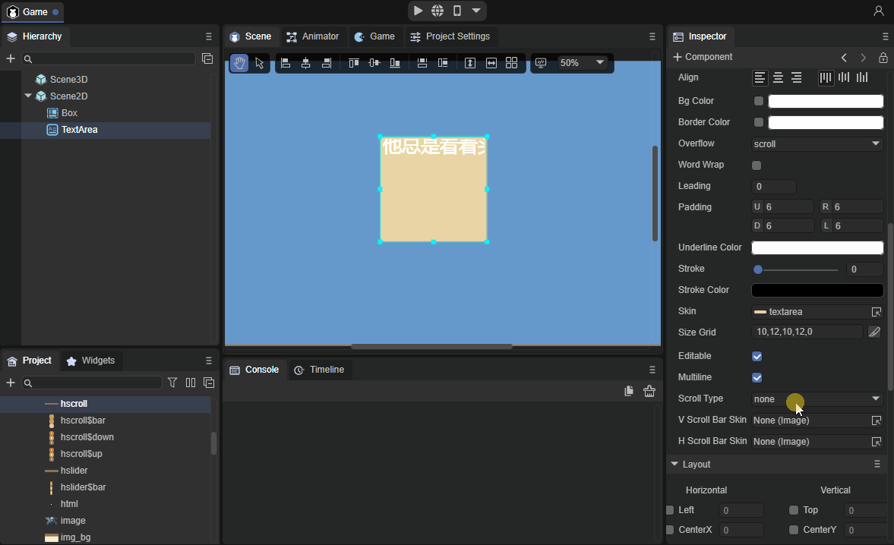

# TextArea组件详解

​        由于TextArea继承于Textinput，两者相同点太多这篇文章只介绍两者不同的地方，Textinput介绍到的点这里不再过多讲解。

## 1、创建TextArea组件

​        使用LayaAirIDE创建TextArea非常简单，通过IDE的可视化操作，完全不需要程序基础，即可实现组件的创建与布局，也是推荐使用的组件创建方式。可以从层级面板创建，步骤是右键单击Scene2D，找到UI，点击TextArea即可创建完毕，如图1所示。

 

（图1）

​          我们也可以从IDE资源管理右侧组件面板的UI文件夹中，将TextArea组件拖拽到UI页面中，如动图2所示。

 

（动图2）

## 2、TextArea组件属性介绍

 

（图3）

| 属性           | 功能说明                                                     |
| -------------- | ------------------------------------------------------------ |
| vscrollbarskin | 添加垂直滚动条皮肤。                                         |
| hscrollbarskin | 添加水平滚动条皮肤。                                         |
| scrolltype     | 文本域的滚动类型，需要配合对应的滚动条皮肤使用，共有四种类型，默认不滚动。none：不滚动，horizontal：水平滚动，vertical：垂直滚动，both：水平滚动和垂直滚动都支持。 |

​        TextArea是一个用于多行的文本域，相较于Textinput的区别是它可以添加垂直滚动条皮肤和水平滚动条皮肤。效果如动图4、5所示。

 

（动图4）

 

（动图5）

## 3、通过代码创建TextArea

```typescript
const { regClass, property } = Laya;

@regClass()
export class UI_TextArea extends Laya.Script {
	
	private skin: string = "resources/res/ui/textarea.png";

    constructor() {
        super();
    }

    /**
     * 组件被激活后执行，此时所有节点和组件均已创建完毕，此方法只执行一次
     */
    onAwake(): void {

		Laya.loader.load(this.skin).then( ()=>{
            this.onLoadComplete();
        } );
	}

	private onLoadComplete(e: any = null): void {

		let ta: Laya.TextArea = new Laya.TextArea("");
		ta.skin = this.skin;

		ta.font = "Arial";
		ta.fontSize = 18;
		ta.bold = true;

		ta.color = "#3d3d3d";

		ta.pos(100, 15);
		ta.size(375, 355);

		ta.padding = "70,8,8,8";

		this.owner.addChild(ta);
	}
}
```

运行结果：

 