# Tree 组件参考


## 一、通过LayaAirIDE创建Tree组件

​        Tree 组件用来显示树状结构。用户可以查看排列为可扩展树的层次结构数据。
​        Tree 组件的脚本接口请参考 [Tree API](https://layaair.layabox.com/3.x/api/Chinese/index.html?version=3.0.0&type=2D&category=UI&class=laya.ui.Tree)。 

### 1.1 Tree 组件主要由两个部分组成：

- 项单元格（可以是 Box 、页面 View、自定义页面）；
- 纵向滚动条 VScrollBar；

### 1.2 Tree 组件的单元格通常由四部分组成：

- 一个单元格选择状态切片动画 Clip；
- 一个折叠箭头切片动画 Clip ；
- 一个文件状态切片动画 Clip ；
- 单元格其他内容元素；

### 1.3 Tree 组件的图像资源示例

#### 1.3.1单元格选择状态切片动画 Clip 资源：

切片数为2，切片索引从0开始依次代表：单元格未被选中状态图、单元格选中或悬停状态图。
​        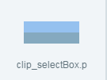​    

（图1）

#### 1.3.2折叠箭头切片动画 Clip 资源：

切片数为2，切片索引从0开始依次代表：文件夹节点折叠状态图、文件夹节点展开状态图。
​        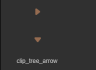 

（图2）

#### 1.3.3文件状态切片动画 Clip 资源：

如果切片数是3，则切片索引从0开始依次代表：文件夹节点折叠状态图、文件夹节点展开状态图、非文件夹节点状态图；
如果切片数是2，则切片索引从0开始依次代表：文件夹节点状态图、非文件夹节点状态图；
​        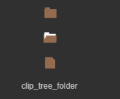 

（图3）


### 1.4创建 Tree 组件

####  1. 编辑 Tree 组件的列表项。

首先在Scence2D中创建一个Clip组件，设置此Clip 组件对象的 name 属性值为 selectBox，设置属性 ClipY 的值为2，然后从项目资源面板里将一个单元格选择状态的切片动画（ clip_selectBox.png），拖入刚刚创建的Clip组件的Skin属性中，如图4所示。

注意：此处的选择状态切片动画 （Clip 组件）对象的 name 属性值必须设置为 selectBox，只有这样程序才能识别它，并实现此 Clip 组件对象的显示状态跟随单元项的选择状态而改变的功能，否则此 Clip 对象将会被识别为此单元项的普通显示对象。

​        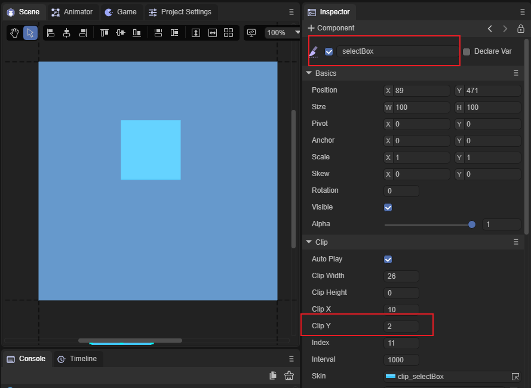​    （图4）

在Scence2D中创建一个Clip组件，设置此Clip 组件对象的 name 属性值为 arrow，设置属性 ClipY 的值为2，然后从项目资源面板里将一个单元格的折叠箭头切片动画（clip_tree_arrow.png），拖入刚刚创建的Clip组件的Skin属性中，如图5所示。
   *注意：此处的折叠箭头切片动画 （Clip 组件）的 name 属性值必须设置为 arrow，只有这样程序才能识别它，并实现点击此 Clip 对象打开或折叠树形节点的功能。否则此 Clip 对象将会被识别为此单元项的普通显示对象。*
        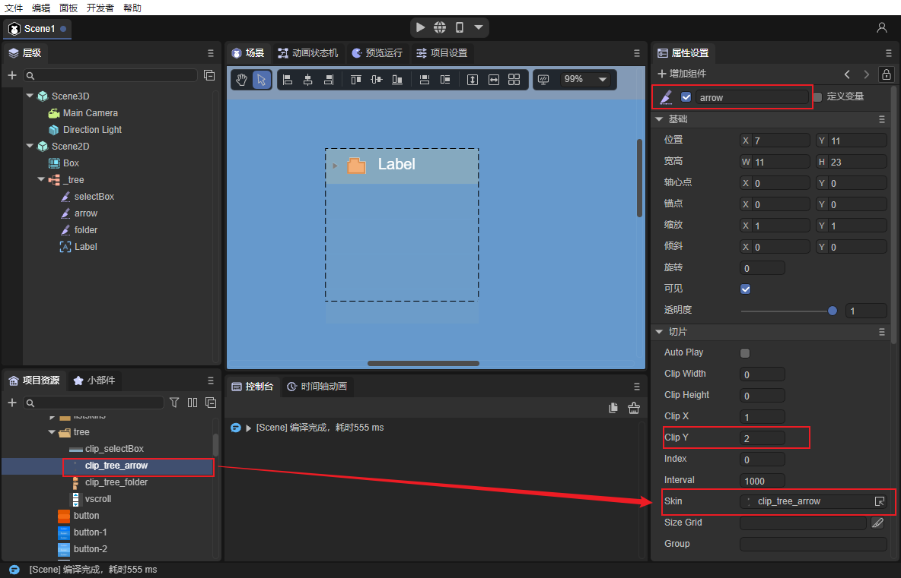    （图5）

在Scence2D中创建一个Clip组件，设置此Clip 组件对象的 name 属性值为 folder，设置属性 ClipY 的值为 3，然后从项目资源面板里将一个单元格的文件状态切片动画（clip_tree_folder.png），拖入刚刚创建的Clip组件的Skin属性中，如图6所示。

注意：此处的文件状态切片动画（Clip 组件）的 name 属性值必须设置为 folder，只有这样程序才能识别它，并实现此 Clip 组件对象的显示状态跟随单元项的折叠、展开、节点类型（是否有字节点）而改变的功能。否则此 Clip 对象将会被识别为此单元项的普通显示对象。
        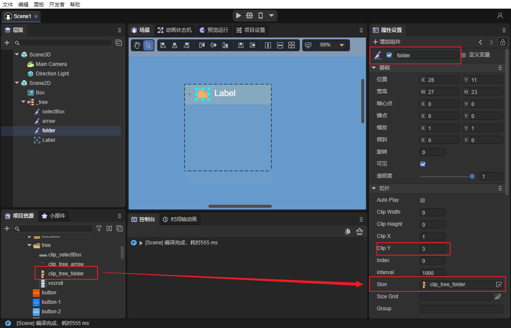    （图6）

拖入此单元项的普通显示对象。

此处以 Label 为例，从资源面板里选择并拖入一个 Label 组件对象，在此给这个 Label 对象设置一下属性 name 值为 label ，方便在脚本中对它进行赋值，此name 属性值自定义即可。再设置一下 Label 对象显示相关的属性，使它看起来更美观。

​        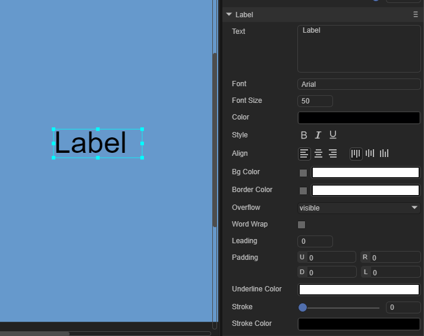 

​    （图7）

   然后拖入一个Box容器组件，并将之前创建好的Clip组件全部放入Box容器组件中。

​        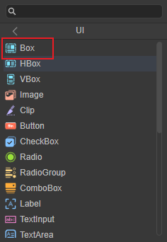 

​    （图8）

​    

#### 2. 转化为 Tree 容器。

选择列表渲染项对象，右键单击调出设置面板，点击change Type，点击UI，点击Tree，完成 Tree 容器的添加。

​           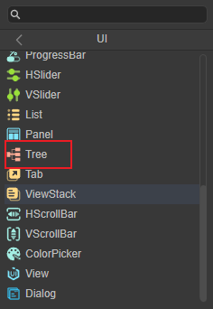  

​       （图9）

#### 3. 指定 Tree 组件的列表渲染项。

点击 Tree 组件对象，设置 Tree 组件的属性 name 的值为 render。
   *注意：此处列表渲染项属性 name 的值必须为 render，否则程序将无法识别。*
   ​        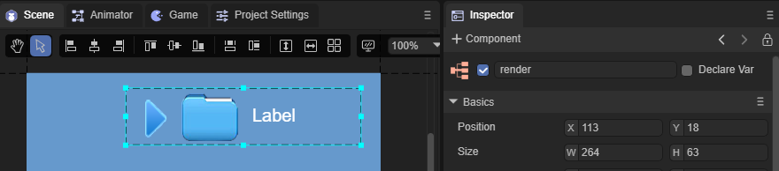    ​    （图10）

#### 4.为 Tree 组件添加滚动条。

从资源面板里选择一个 VScrollBar 组件，将VScrollBar 组件的资源地址（skin 属性值）设置为 Tree 组件属性scrollBarSkin 的值。

​           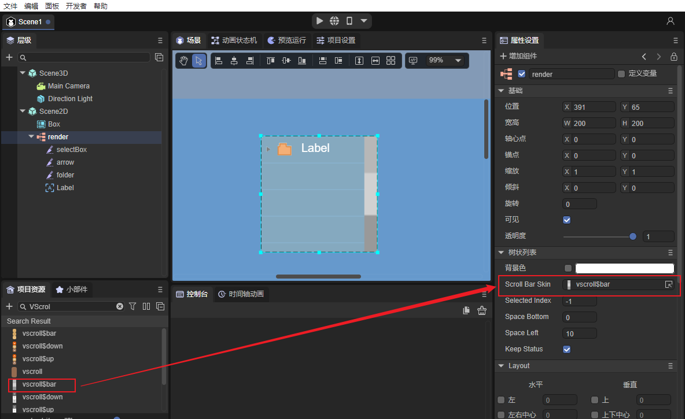（图11）

#### 5. 调整 Tree 的宽高。

设置 Tree 对象的属性 var（全局引用名）的值为 render，此处名字可以自定义，目的是在脚本中对此 Tree 组件对象赋值。

​           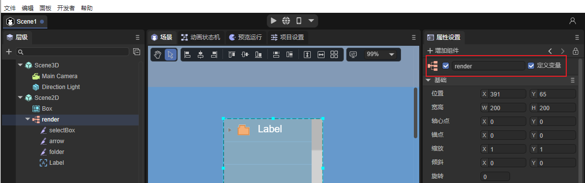（图12）

#### 6.在代码里给 Tree 对象赋值

```javascript
var xmlString:string="<data>"+
                        "<dir label='box1' isOpen='true'>"+
                            "<file label='child1 ' isOpen='true'/>"+
                            "<file label='child2 ' isOpen='true'/>"+
                            "<file label='child3 ' isOpen='true'/>"+
                            "<file label='child4 ' isOpen='true'/>"+
                            "<file label='child5 ' isOpen='true'/>"+
                        "</dir>"+
                        "<dir label='box2' isOpen='true'>"+
                            "<file label='child1 ' isOpen='true'/>"+
                            "<file label='child2 ' isOpen='true'/>"+
                            "<file label='child3 ' isOpen='true'/>"+
                            "<file label='child4 ' isOpen='true'/>"+
                            "<file label='child5 ' isOpen='true'/>"+
                        "</dir>"+
  					"</data>";
//解析xml字符。 
var xml:any = domParser.parseFromString(xmlString, "text/xml");
//设置 render 的数据源。
render.xml =xml;
```
#### 7.在程序中运行查看效果

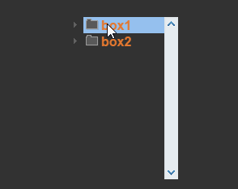 

（动图13）

### 8. Tree 组件常用属性

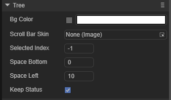 

（图14）

 

| **属性**      | **功能说明**                                                 |
| ------------- | ------------------------------------------------------------ |
| scrollBarSkin | 滚动条皮肤。                                                 |
| spaceBottom   | 每一项之间的间隔距离。单位是像素。                           |
| spaceLeft     | 左侧缩进距离。单位是像素。                                   |
| selectedindex | 当前选择的项索引。                                           |
| keepstatus    | 数据源发生变化后，是否保持之前打开状态，默认为true。true：保持之前打开状态。false：不保持之前打开状态。 |


##  二、通过代码创建Tree组件

在我们进行书写代码的时候，免不了通过代码控制UI，创建UI_Tree类，在代码中导入`laya.ui.Tree`的包，并通过代码设定Tree相关的属性。

**运行示例效果：**

​	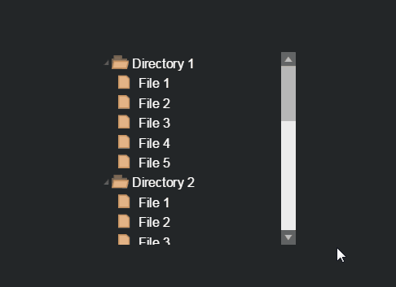 

​	(动图15)

Tree的其他属性也可以通过代码来设置，下述示例代码演示了如何通过代码创建不同皮肤（样式）的Tree，有兴趣的读者可以自己通过代码设置Tree，创建出符合自己需要的文件夹。

**示例代码：**

```javascript
const { regClass, property } = Laya;

@regClass()
export class UI_Tree extends Laya.Script {


    constructor() {
        super();
    }

    /**
     * 组件被激活后执行，此时所有节点和组件均已创建完毕，此方法只执行一次
     */
    onAwake(): void {

		var res: any[] = ["resources/res/ui/vscroll.png",
			"resources/res/ui/vscroll$bar.png",
			"resources/res/ui/vscroll$down.png",
			"resources/res/ui/vscroll$up.png",
			"resources/res/ui/tree/clip_selectBox.png",
			"resources/res/ui/tree/clip_tree_folder.png",
			"resources/res/ui/tree/clip_tree_arrow.png"];

		Laya.loader.load(res).then( ()=>{
            this.onLoadComplete();
        } );
	}

	private onLoadComplete(e: any = null): void {
		// 组装tree的数据
		var treeData:string = "<data>";
		for (var i: number = 0; i < 5; ++i) {
			treeData += "<item label='Directory " + (i + 1) + "' isOpen='true'>";
			for (var j: number = 0; j < 5; ++j) {
				treeData += "<leaf label='File " + (j + 1) + "'/>";
			}
			treeData += "</item>";
		}
		treeData += "</data>";
		// 解析tree的数据
		var xml: any = Laya.Utils.parseXMLFromString(treeData);

		var tree: Laya.Tree = new Laya.Tree();
		tree.scrollBarSkin = "resources/res/ui/vscroll.png";
		tree.itemRender = Item;
		tree.xml = xml;
		tree.size(300, 300);
		tree.x = (Laya.stage.width - tree.width) / 2;
		tree.y = (Laya.stage.height - tree.height) / 2;
		this.owner.addChild(tree);
	}
}


// 此类对应的json对象：
// {"child": [{"type": "Clip", "props": {"x": "13", "y": "0", "left": "12", "height": "24", "name": "selectBox", "skin": "ui/clip_selectBox.png", "right": "0", "clipY": "2"}}, {"type": "Clip", "props": {"y": "4", "x": "14", "name": "folder", "clipX": "1", "skin": "ui/clip_tree_folder.png", "clipY": "3"}}, {"type": "Label", "props": {"y": "1", "text": "treeItem", "width": "150", "left": "33", "height": "22", "name": "label", "color": "#ffff00", "right": "0", "x": "33"}}, {"type": "Clip", "props": {"x": "0", "name": "arrow", "y": "5", "skin": "ui/clip_tree_arrow.png", "clipY": "2"}}], "type": "Box", "props": {"name": "render", "right": "0", "left": "0"}};
class Item extends Laya.Box {
	constructor() {
		super();
		this.right = 0;
		this.left = 0;

		var selectBox: Laya.Clip = new Laya.Clip("resources/res/ui/tree/clip_selectBox.png", 1, 2);
		selectBox.name = "selectBox";//设置 selectBox 的name 为“selectBox”时，将被识别为树结构的项的背景。2帧：悬停时背景、选中时背景。	
		selectBox.height = 32;
		selectBox.x = 13;
		selectBox.left = 12;
		this.addChild(selectBox);

		var folder: Laya.Clip = new Laya.Clip("resources/res/ui/tree/clip_tree_folder.png", 1, 3);
		folder.name = "folder";//设置 folder 的name 为“folder”时，将被识别为树结构的文件夹开启状态图表。2帧：折叠状态、打开状态。
		folder.x = 14;
		folder.y = 4;
		this.addChild(folder);

		var label: Laya.Label = new Laya.Label("treeItem");
		label.name = "label";//设置 label 的name 为“label”时，此值将用于树结构数据赋值。
		label.fontSize = 20;
		label.color = "#FFFFFF";
		label.padding = "6,0,0,13";
		label.width = 150;
		label.height = 30;
		label.x = 33;
		label.y = 1;
		label.left = 33;
		label.right = 0;
		this.addChild(label);

		var arrow: Laya.Clip = new Laya.Clip("resources/res/ui/tree/clip_tree_arrow.png", 1, 2);
		arrow.name = "arrow";//设置 arrow 的name 为“arrow”时，将被识别为树结构的文件夹开启状态图表。2帧：折叠状态、打开状态。
		arrow.x = 0;
		arrow.y = 5;
		this.addChild(arrow);
	}
}
```


 