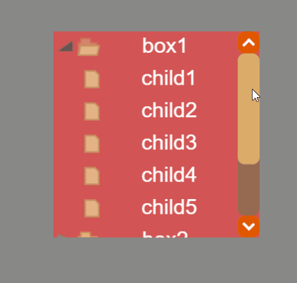
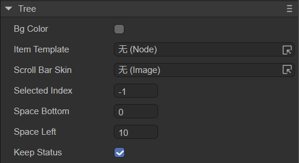
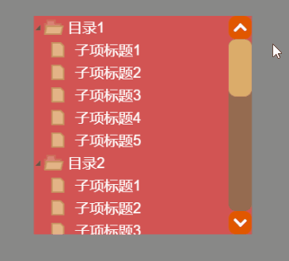

# 树状列表组件（Tree）

## 一、通过LayaAir IDE创建Tree组件

Tree 组件用来显示树状结构。用户可以查看排列为可扩展树的层次结构数据。Tree 组件的脚本接口请参考 [Tree API](https://layaair.com/3.x/api/Chinese/index.html?version=3.0.0&type=2D&category=UI&class=laya.ui.Tree)。 

### 1.1 Tree的组成

#### 1.1.1 Tree 组件主要由两个部分组成：

**1.项单元格**（可以是 Box、自定义页面）

项单元格通常由四部分组成：

（1）一个单元格选择状态切片动画 Clip；

（2）一个折叠箭头切片动画 Clip ；

（3）一个文件状态切片动画 Clip ；

（4）单元格其他内容元素；

**2.纵向滚动条** VScrollBar


#### 1.1.2 Tree 组件的图像资源示例

- 单元格选择状态切片动画 Clip 资源（clip_selectBox.png）：

  切片数为2，切片索引从0开始依次代表：单元格悬停状态图（白色）、单元格未选中状态图。


（图1-1）

- 折叠箭头切片动画 Clip 资源（clip_tree_arrow.png）：

  切片数为2，切片索引从0开始依次代表：文件夹节点折叠状态图、文件夹节点展开状态图。


（图1-2）

- 文件状态切片动画 Clip 资源（clip_tree_folder.png）：

  切片数为3，切片索引从0开始依次代表：文件夹节点折叠状态图、文件夹节点展开状态图、非文件夹节点状态图；


（图1-3）


### 1.2 创建 Tree 组件

####  1.2.1 编辑 Tree 组件的列表项

（1）首先在Scence2D中创建一个Clip组件，设置此Clip 组件对象的 name 属性值为 selectBox，设置属性 ClipY 的值为2，然后从项目资源面板里将一个单元格选择状态的切片动画（ clip_selectBox.png），拖入刚刚创建的Clip组件的Skin属性中，如图1-4所示。

> 注意：此处的选择状态切片动画 （Clip 组件）对象的 name 属性值必须设置为 selectBox，只有这样程序才能识别它，并实现此 Clip 组件对象的显示状态跟随单元项的选择状态而改变的功能，否则此 Clip 对象将会被识别为此单元项的普通显示对象。


（图1-4）

（2）在Scence2D中创建一个Clip组件，设置此Clip 组件对象的 name 属性值为 arrow，设置属性 ClipY 的值为2，然后从项目资源面板里将一个单元格的折叠箭头切片动画（clip_tree_arrow.png），拖入刚刚创建的Clip组件的Skin属性中，如图1-5所示。

> 注意：此处的折叠箭头切片动画 （Clip 组件）的 name 属性值必须设置为 arrow，只有这样程序才能识别它，并实现点击此 Clip 对象打开或折叠树形节点的功能。否则此 Clip 对象将会被识别为此单元项的普通显示对象。


（图1-5）

（3）在Scence2D中创建一个Clip组件，设置此Clip 组件对象的 name 属性值为 folder，设置属性 ClipY 的值为 3，然后从项目资源面板里将一个单元格的文件状态切片动画（clip_tree_folder.png），拖入刚刚创建的Clip组件的Skin属性中，如图1-6所示。

> 注意：此处的文件状态切片动画（Clip 组件）的 name 属性值必须设置为 folder，只有这样程序才能识别它，并实现此 Clip 组件对象的显示状态跟随单元项的折叠、展开、节点类型（是否有子节点）而改变的功能。否则此 Clip 对象将会被识别为此单元项的普通显示对象。


（图1-6）

（4）拖入此单元项的普通显示对象。此处以 Label 为例，从资源面板里选择并拖入一个 Label 组件对象，在此给这个 Label 对象设置一下属性 name 值为 label （注意“l”是小写），方便在脚本中对它进行赋值。再设置一下 Label 对象显示相关的属性，使它看起来更美观。

> 注意：此name 属性值自定义即可（但要与给 Tree 对象赋值中的名称相同）。


（图1-7）

然后，将（1）~（4）步骤创建的节点，拖入一个Box容器组件，并将它们进行合理的排版，如图1-8所示。


（图1-8）


#### 1.2.2 指定 Tree 组件的列表渲染项

创建一个Tree组件，设置Tree组件的Item Template属性为刚刚1.2.1创建Box，如图1-9所示。


（图1-9）


#### 1.2.3 为 Tree 组件添加滚动条

当Tree的列表项太多时，就需要添加一个滚动条。如图1-10所示，给Tree组件属性scrollBarSkin添加滚动条皮肤。


（图1-10）

> 这里还设置了背景颜色等属性，属性的详细说明见1.3节。


#### 1.2.4 在代码里给 Tree 对象赋值

在Scene2D的属性设置面板中，增加一个自定义组件脚本。然后将Tree节点拖入到其暴露的属性入口中，在代码里给 Tree 对象赋值的示例如下：

```typescript
const { regClass, property } = Laya;

@regClass()
export class NewScript extends Laya.Script {

    @property({ type: Laya.Tree })
    public tree: Laya.Tree;

    //组件被激活后执行，此时所有节点和组件均已创建完毕，此方法只执行一次
    onAwake(): void {
        //初始化树状列表的数据源
        let treeData: string = "<data>";
        //给Tree列表赋值
        treeData +=
            "<dir label='box1' isOpen='true'>" +
            "<file label='child1 ' />" +
            "<file label='child2 ' />" +
            "<file label='child3 ' />" +
            "<file label='child4 ' />" +
            "<file label='child5 ' />" +
            "</dir>" +
            "<dir label='box2' isOpen='false'>" +
            "<file label='child1 ' />" +
            "<file label='child2 ' />" +
            "<file label='child3 ' />" +
            "<file label='child4 ' />" +
            "<file label='child5 ' />" +
            "</dir>" +
            "<dir label='box3' isOpen='true'>" +
            "<file label='child1 ' />" +
            "<file label='child2 ' />" +
            "<file label='child3 ' />" +
            "<file label='child4 ' />" +
            "<file label='child5 ' />" +
            "</dir>" ;
        //数据源data标签，需要拼接一个结束标签
        treeData += "</data>";

        //把字符串解析为xml对象并返回
        this.tree.xml = new Laya.XML(treeData);

    }
}
```
这里给Tree列表赋的值，是写死的模拟数据。其中，拼接模拟数据，最多只能是二层结构，不支持层级很深的结构。

上述代码中，`<dir></dir>`标签为一个文件夹，`<file />`表示一个文件。`isOpen='true'`表示文件夹的初始状态是否为打开。`label='XXX'`是对1.2.1中步骤（4）的label组件进行赋值。

> 注：开发者可以参考第二节的代码中，程序创建的模拟数据的部分，加深理解xml数据规则。


#### 1.2.5 在IDE中运行查看效果

运行的效果如下：



（动图1-11）

可以看到，显示选择状态切片跟随单元项的选择状态而改变、折叠箭头切片跟随打开或折叠树形节点而改变、文件状态切片跟随单元项的折叠或展开而改变。


### 1.3 Tree 组件常用属性

Tree组件的特有属性如下图：



（图1-12）

| **属性**      | **功能说明**                                                 |
| ------------- | ------------------------------------------------------------ |
| bgColor       | 背景颜色，勾选后可以直接输入颜色值，例如：`#ffffff`，也可以点击输入条右侧的拾色器选取颜色。 |
| itemTemplate  | 渲染单元，具体用法已在1.2节的步骤中给出。                    |
| scrollBarSkin | 滚动条皮肤。                                                 |
| selectedIndex | 当前选择的项索引。-1表示初始状态下无选取项。                 |
| spaceBottom   | 每一项之间的间隔距离。单位是像素。                           |
| spaceLeft     | 子项的左侧缩进距离。单位是像素。                             |
| keepstatus    | 数据源发生变化后，是否保持之前打开状态，默认为true。true：保持之前打开状态。false：不保持之前打开状态。 |


##  二、通过代码创建Tree组件

开发者在进行书写代码的时候，免不了通过代码控制UI。在LayaAir IDE中，创建自定义的组件脚本，命名为UI_Tree，然后通过代码设定Tree相关的属性。

**运行示例效果：**



（动图2-1）

**示例代码：**

```typescript
const { regClass, property } = Laya;

@regClass()
export class UI_Tree extends Laya.Script {

    constructor() {
        super();
    }

    // 组件被激活后执行，此时所有节点和组件均已创建完毕，此方法只执行一次
    onAwake(): void {

        var res: any[] = ["atlas/comp/vscroll.png",
            "atlas/comp/vscroll$bar.png",
            "atlas/comp/vscroll$down.png",
            "atlas/comp/vscroll$up.png",
            "resources/tree/clip_selectBox.png",
            "resources/tree/clip_tree_folder.png",
            "resources/tree/clip_tree_arrow.png"];

        Laya.loader.load(res).then(() => {
            this.onLoadComplete();
        });
    }

    private onLoadComplete(e: any = null): void {
        // 初始化树状列表的数据源
        var treeData: string = "<data>";

        //程序创建的模拟数据，模拟树状列表数据，拼接列表的数据源
        for (let i: number = 0; i < 5; i++) {
            //拼接目录数据结构（item标签这里可以自己定义标签名，用什么开头就用什么结束,但是title这里，一定要对应列表渲染单元的label文本节点name）
            treeData += "<item title='目录" + (i + 1) + "' isOpen='true'>";
            for (let j: number = 0; j < 5; j++) {
                //拼接子项（即不会再有展开）的结构，(这里的subpage标签也是可以自己任意定义名称，title这里，一定要对应列表渲染单元的label文本节点name）
                treeData += "<subpage title='子项标题" + (j + 1) + "' />";
            }
            //每一个子项的外层，要有一个完整的结束标签，目录开始用什么标签名就用什么标签名结束。
            treeData += "</item>";
        }

        //数据源data标签，需要拼接一个结束标签
        treeData += "</data>";
        

        var tree: Laya.Tree = new Laya.Tree();
        tree.scrollBarSkin = "atlas/comp/vscroll.png";
        // 添加列表渲染项
        tree.itemRender = Item;
        // 解析tree的数据
        tree.xml = new Laya.XML(treeData);
        tree.size(300, 300);
        tree.x = (Laya.stage.width - tree.width) / 2;
        tree.y = (Laya.stage.height - tree.height) / 2;
        tree.bgColor = "#d25454";
        this.owner.addChild(tree);
    }
}


class Item extends Laya.Box {
    constructor() {
        super();
        this.right = 0;
        this.left = 0;

        var selectBox: Laya.Clip = new Laya.Clip("resources/tree/clip_selectBox.png", 1, 2);
        selectBox.name = "selectBox";//设置 selectBox 的name 为“selectBox”时，将被识别为树结构的项的背景。
        selectBox.height = 32;
        selectBox.x = 13;
        selectBox.left = 12;
        this.addChild(selectBox);

        var folder: Laya.Clip = new Laya.Clip("resources/tree/clip_tree_folder.png", 1, 3);
        folder.name = "folder";//设置 folder 的name 为“folder”时，将被识别为树结构的文件夹开启状态图表。
        folder.x = 14;
        folder.y = 4;
        this.addChild(folder);

        var label: Laya.Label = new Laya.Label;
        label.name = "title";//设置 label 的name 为“title”时，此值将用于树结构数据赋值。
        label.fontSize = 20;
        label.color = "#FFFFFF";
        label.padding = "6,0,0,13";
        label.width = 150;
        label.height = 30;
        label.x = 33;
        label.y = 1;
        label.left = 33;
        label.right = 0;
        this.addChild(label);

        var arrow: Laya.Clip = new Laya.Clip("resources/tree/clip_tree_arrow.png", 1, 2);
        arrow.name = "arrow";//设置 arrow 的name 为“arrow”时，将被识别为树结构的文件夹开启状态图表。
        arrow.x = 0;
        arrow.y = 5;
        this.addChild(arrow);
    }
}
```


 