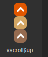
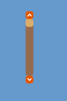

# VScrollBar 组件参考


## 一、通过LayaAirIDE创建VScrollBar 组件

### 1.1 创建VScrollBar

 VScrollBar 组件是一个垂直方向滚动条组件。

当数据太多以至于显示区域无法容纳时，最终用户可以使用 VScrollBar 组件控制所显示的数据部分。

 滚动条由四部分组成：一个轨道图、一个滑块按钮和两个箭头按钮。

 点击选择资源面板里的 VScrollBar 组件，拖放到页面编辑区，即可添加 VScrollBar 组件到页面上。

VScrollBar 组件的脚本接口请参考 [VScrollBar API](https://layaair.layabox.com/3.x/api/Chinese/index.html?version=3.0.0&type=2D&category=UI&class=laya.ui.VScrollBar)。

 VScrollBar 组件的图像资源示例：

​        

​    （图1）

​        

​    （图2）

​        

​    （图3）

​        

​    （图4）

​        VScrollBar 拖放到编辑器区后，显示效果：

​        

​    （图5）

​        设置 VScrollBar 的属性 max 的值为 10、属性 min 的值为0、属性 value 的值为3后，显示效果如下：

​        

​    （图6）

​        在程序中运行时，可以拖动滑块或点击箭头按钮控制进度条的值：

​        

​    （图7）

​        设置 VScrollBar 的属性 showButtons 的值为 false时的显示效果：

​        

​    （图8）

​        在程序里运行时的效果：

​        

​    （图9）

### 1.2 VScrollBar 组件常用属性

​        

​    （图10）

 

| **属性**          | **功能说明**                                                 |
| ----------------- | ------------------------------------------------------------ |
| skin              | 滚动条的图像资源地址。                                       |
| sizeGrid          | 滚动条轨道图资源的有效缩放网格数据（九宫格数据）。           |
| value             | 表示当前滚动位置的数字。                                     |
| min               | 表示最低滚动位置的数字。                                     |
| max               | 表示最高滚动位置的数字。                                     |
| scrollSize        | 表示按下滚动条轨道时页面滚动的增量。                         |
| mouseWheelEnable  | 一个布尔值，指定是否滑轮滚动，默认值为true。                 |
| touchScrollEnable | 一个布尔值，指定是否开启触摸，默认值为true。                 |
| hide              | 是否隐藏滚动条，不显示滚动条，但是可以正常滚动，默认为false。 |
| autoHide          | 一个布尔值，指定是否自动隐藏滚动条(无需滚动时)，默认值为false。 |
| showButtons       | 一个布尔值，指定是否显示向上、向下按钮，默认值为true。       |
| rollratio         | 滚动衰减系数，默认为0.95。                                   |
| elasticdistance   | 橡皮筋效果极限距离，0为没有橡皮筋效果。                      |
| elasticbacktime   | 橡皮筋回弹时间，单位为毫秒。                                 |

 

 

##  二、通过代码创建VScrollBar组件 

在我们进行书写代码的时候，免不了通过代码控制UI，创建`UI_ScrollBar` 类，并通过代码设定VScrollBar 相关的属性。

**运行示例效果:**
​	

​	(图11)通过代码创建VScrollBar 


VScrollBar 的其他属性也可以通过代码来设置，下述示例代码演示了如何通过代码创建的VScrollBar ，有兴趣的读者可以自己通过代码设置VScrollBar ，创建出符合自己需要的滚动条。

**示例代码：**

```javascript
const { regClass, property } = Laya;

@regClass()
export class UI_VScrollBar extends Laya.Script {


    constructor() {
        super();
    }

    /**
     * 组件被激活后执行，此时所有节点和组件均已创建完毕，此方法只执行一次
     */
    onAwake(): void {

      
		var skins: any[] = [];
		skins.push("resources/res/ui/vscroll.png", "resources/res/ui/vscroll$bar.png", "resources/res/ui/vscroll$down.png", "resources/res/ui/vscroll$up.png");
		
		Laya.loader.load(skins).then( ()=>{
            this.onLoadComplete();
        } );
	}

	private onLoadComplete(e: any = null): void {
		this.placeVScroller();
		
	}

	private placeVScroller(): void {
		var vs: Laya.VScrollBar = new Laya.VScrollBar();
		vs.skin = "resources/res/ui/vscroll.png";
		vs.height = 300;
		vs.pos(400, 50);

		vs.min = 0;
		vs.max = 100;

		vs.changeHandler = new Laya.Handler(this, this.onChange);
		this.owner.addChild(vs);
	}


	private onChange(value: number): void {
		console.log("滚动条的位置： value=" + value);
	}

 
}
```

