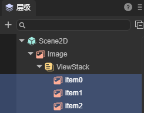

# 导航容器组件（ViewStack）

> 本篇中会涉及一些Tab组件知识，请先阅读[Tab组件](../Tab/readme.md)的文档。

ViewStack组件是导航容器组件，主要用于多页面视图切换。它包含多个子页面，但默认只显示一个，可以通过子页面索引进行显示切换。一般情况下，用它与Tab标签组合制作标签切换页面，效果如动图1所示。ViewStack组件的详细用法请查看[ViewStack API](https://layaair.com/3.x/api/Chinese/index.html?version=3.0.0&type=2D&category=UI&class=laya.ui.ViewStack)。


（动图1） 


## 1. 创建ViewStack

### 1.1 准备美术资源

准备好页面背景图以及需要切换的页面美术资源，如图1-1所示，放到LayaAir IDE的项目目录中。


（图1-1）

> 图中资源来自“2D入门示例”。

然后设置背景的九宫格属性，如图1-2所示。


（图1-2）


### 1.2 创建页面

如图1-3所示，将刚刚设置过九宫格的背景图拖拽到场景中，然后创建子节点ViewStack页面，再将页面中涉及的UI基础组件拖拽到ViewStack组件下，作为其子页面，并调整页面的UI布局。


（图1-3）

ViewStack组件是容器类组件，没有独立的组件资源规范。本例中直接采用的是Image组件资源，在实际的游戏开发中，可以根据实际开发需求使用各种UI组件。


### 1.3 设置ViewStack组件子页面的name属性

ViewStack子页面name属性的命名规则为item0、item1、item2.....”如果有更多页面以此类推，如图1-4所示。



（图1-4）

> 若不按此规则增加name属性，生成的ViewStack组件为无效组件，不能正常运行。


### 1.4 设置ViewStack的页面索引selectedIndex

ViewStack组件默认显示item0，可以通过调整selectedIndex属性值来改变ViewStack组件的默认显示页面，效果如动图1-5所示。


（动图1-5）


### 1.5 创建控制用的Tab标签

通常，ViewStack组件需要一个相应的控制标签，创建一个Tab标签来控制ViewStack的子页面切换显示。

点击选择资源面板里的Tab资源，拖拽到场景中生成Tab组件。然后，调整位置与背景图适配对齐。设置labels为“页面0,页面1,页面2”，选择的按钮索引selectedIndex设置为0。最后设置字体大小、粗体、字体状态颜色等属性。设置之后的显示效果如图1-6所示：


（图1-6）


### 1.6 通过代码控制ViewStack组件切换显示

创建Tab后，需要通过程序代码把Tab标签和ViewStack的子页面切换显示关联起来。

在Scene2D的属性设置面板中，增加一个自定义组件脚本。然后，将ViewStack和Tab组件拖入到其暴露的属性入口中。需要添加如下的示例代码：

```typescript
const { regClass, property } = Laya;

@regClass()
export class NewScript extends Laya.Script {

    @property({ type: Laya.ViewStack })
    public viewstack: Laya.ViewStack;

    @property({ type: Laya.Tab })
    public tab: Laya.Tab;

    //组件被激活后执行，此时所有节点和组件均已创建完毕，此方法只执行一次
    onAwake(): void {
        //点击Tab选择按钮的处理
        this.tab.selectHandler = new Laya.Handler(this, this.onSelecte);
    }

    // 根据选择tab的索引切换页面
    private onSelecte(index: number): void {
        //切换ViewStack子页面
        this.viewstack.selectedIndex = index;
    }
}
```

最终的效果如动图1-7所示：


（动图1-7）


## 2. ViewStack属性

ViewStack的特有属性如下：


（图2-1）

| 属性          | 说明                                                         |
| ------------- | ------------------------------------------------------------ |
| bgColor       | 背景颜色，勾选后可以直接输入颜色值，例如：`#ffffff`，也可以点击输入条右侧的拾色器选取颜色 |
| selectedIndex | 选择索引，默认为0，表示第一项。-1表示没有选中的子项。索引数量会根据子项数量（item数量）动态改变 |


