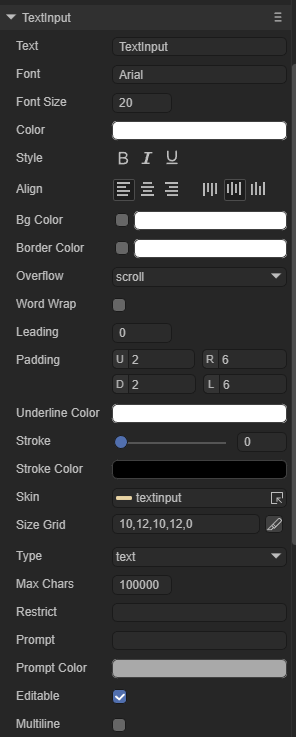

# TextInput组件介绍

## 1、TextInputAPI参数

​        文本输入框是游戏中经常会用到的一个UI组件，任何时候需要输入的时候都要使用到textInput这个类，我们先看一下TextInput这个类的API。

| laya.ui.textInput中所有的API参数 |                                                              |           |
| -------------------------------- | ------------------------------------------------------------ | :-------: |
| editable : Boolean               | 设置可编辑状态。                                             | TextInput |
| focus : Boolean                  | 表示焦点是否在显示对象上。                                   | TextInput |
| height : Number                  | 表示显示对象的高度，以像素为单位。注：当值为0时，高度为自适应大小。 | TextInput |
| inputElementXAdjuster:int        | 设置原生inputs输入框的x坐标偏移。                            | TextInput |
| inputElementYAdjuster:int        | 设置原生inputs输入框的y坐标偏移。                            | TextInput |
| maxChars : int                   | 字符数量限制，默认为100000。设置字符数量限制时，小于等于0的值将会限制字符数量为100000。 | TextInput |
| multiline : Boolean              | 指示当前是否是文本域。值为true表示当前是文本域，否则不是文本域。 | TextInput |
| prompt : String                  | 设置输入提示符。                                             | TextInput |
| promptColor : String             | 设置输入提示符颜色。                                         | TextInput |
| restrict : String                | 限制输入的字符                                               | TextInput |
| sizeGrid : String                | 当前实例的背景图(AutoBitmap)实例的有效缩放网格数据。数据格式："上边距，右边距，下边距，左边距，是否重复填充（值为0：不重复填充，1：重复填充）"，以逗号分隔。例如："4,4,4,4,1" | TextInput |
| skin : String                    | 对象的皮肤地址，以字符串表示。如果资源未加载，则先加载资源，加载完成后应用于此对象。注意：资源加载完成后，会自动缓存至资源库中。 | TextInput |
| type : String                    | 输入框类型为Input静态常量之一。平台兼容性参见http:/www.w3school.com.cn/html5/html_5_form_input_ types_asp。 | TextInput |
| width : Number                   | [override]表示显示对象的宽度，以像素为单位。注：当值为0时，宽度为自适应大小。 | TextInput |

## 2、TextInput相关属性：

 

（图1）

| 属性名      | 功能说明                                                     |
| ----------- | ------------------------------------------------------------ |
| type        | 输入框类型，共有十三种类型：text、password、email、url、number、range、date、month、week、time、dateime、dateime—local、search |
| maxchars    | 最大字符数，默认为100000。                                   |
| restrict    | 限制输入的字符，输入到这里的是只能输入这些。不建议开启，适用于简单的文本，不支持反斜杠。 |
| prompt      | 输入前提示文本。                                             |
| promptcolor | 输入前提示文本的颜色。                                       |
| editable    | 设置可编辑状态，默认为true。                                 |
| multiline   | 是否是文本域，值为true表示当前是文本域，可多行输入，否则不是文本域。默认为false |

## 3、Textinput代码创建

```typescript
const { regClass, property } = Laya;

@regClass()
export class UI_Input extends Laya.Script {

    private SPACING: number = 100;
	private INPUT_WIDTH: number = 300;
	private INPUT_HEIGHT: number = 50;
	private Y_OFFSET: number = 50;

	private skins: any[];

    constructor() {
        super();
    }

    /**
     * 组件被激活后执行，此时所有节点和组件均已创建完毕，此方法只执行一次
     */
    onAwake(): void {


		this.skins = ["resources/res/ui/input (1).png", "resources/res/ui/input (2).png", "resources/res/ui/input (3).png", "resources/res/ui/input (4).png"];
		Laya.loader.load(this.skins).then( ()=>{
            this.onLoadComplete();
        } );
	}

	private onLoadComplete(e: any = null): void {
		for (var i: number = 0; i < this.skins.length; ++i) {
			var input: Laya.TextInput = this.createInput(this.skins[i]);
			input.prompt = 'Type:';
			input.x = (Laya.stage.width - input.width) / 2;
			input.y = i * this.SPACING + this.Y_OFFSET;
		}
	}

	private createInput(skin: string): Laya.TextInput {
		var ti: Laya.TextInput = new Laya.TextInput();

		ti.skin = skin;
		ti.size(300, 50);
		ti.sizeGrid = "0,40,0,40";
		ti.font = "Arial";
		ti.fontSize = 30;
		ti.bold = true;
		ti.color = "#606368";

		this.owner.addChild(ti);

		return ti;
	}
}
```

运行结果：

</br>

 （图2）