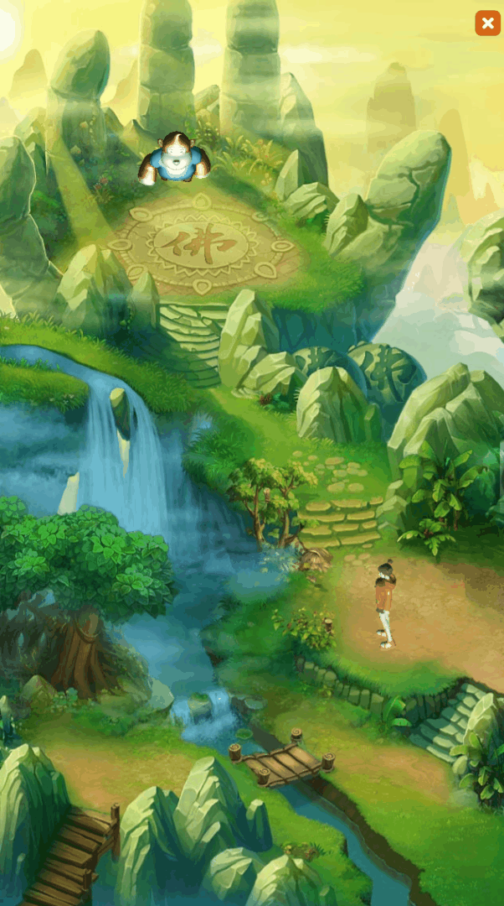
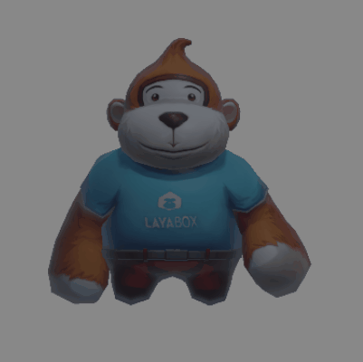

# 混合使用3D


## 一、概述

在我们2D项目开发过程中，开发者往往需要在UI界面显示3D场景或者3D物体，比如游戏开发中，3D人物在2D背景地图上跑动，英雄属性界面里会展示3D的英雄模型等等，如动图1-1所示，

 

（动图1-1）

动图1-1，是LayaAir创建的2D入门示例中的“混合3D”示例

首先，利用LayaAir引擎中的 `RenderTexture` 可以很方便的实现这个功能。渲染纹理 （Render Texture）是在运行时不断更新渲染的一种特殊类型纹理 。渲染纹理的一个典型用法是将其设置为摄像机的“目标纹理”属性，这将使摄像机渲染到纹理， 而不是渲染到屏幕。随后可以如同普通纹理 (Texture) 一样在2D UI下的Sprite对象中使用。

现在我们分别讲解在IDE和代码中是如何利用渲染纹理混合使用3D的

## 二、IDE中混合使用3D

### 2.1 IDE中创建RenderTexture文件

如图2-1所示，我们先在IDE的 assets 资源中创建一个RenderTexture文件

 

（动图2-1）

点击新创建的RenderTexture文件，在属性面板中，会显示属性信息，如图2-2所示

 

（图2-2）

Width：渲染纹理的像素宽度

Height：渲染纹理的像素高度

Color Format：渲染纹理的颜色格式

Depth Format：渲染纹理的深度格式

Generate Mipmap：如果勾选了，则自动生成多级渐进纹理级别

Multi Samples：多重采样

sRGB：此渲染纹理是否使用sRGB读/写转换（只读）

对本篇来说，渲染纹理的宽度，高度，颜色格式和深度格式，对效果有一定影响，暂时我们使用默认设置


### 2.2 3D场景添加渲染物

在IDE中的3D场景中，添加我们希望显示的3D物体，此例中把LayaMonkey添加到3D场景中，如图2-3所示


（图2-3）

摄像机正对LayaMonkey，同时把摄像机的 Render 组件中的Clear Color定义为“#000000”

然后如图2-4所示，改摄像机为正交投影，并调整好摄像机的显示比例


（图2-4）

### 2.3 设置摄像机的目标纹理

把之前创建好的渲染纹理文件，拖入摄像机的目标纹理属性中，此时摄像机渲染到纹理， 而不是渲染到屏幕了。如动图2-5所示


（动图2-5）


### 2.4 设置Sprite的Texture

在Scene2D中创建一个Sprite，作为显示3D物体的载体，把之前创建的渲染纹理拖入Sprite的Texture属性中，如图2-6所示


（动图2-6）

可以看到，LayaMonkey已经显示在2D Sprite中了，不过背景是黑色的，需要再次对渲染纹理的颜色格式修改，支持透明色


### 2.5 修改渲染纹理属性

如动图2-7所示，修改渲染纹理的颜色格式为R16G16B16A16，背景黑色变成透明了


（动图2-7）

仔细观察LayaMonkey，图像比较粗糙，主要原因是渲染纹理的分辨率是256x256的，分辨率太低导致，下面修改分辨率为1024x1024，如动图2-8所示


（动图2-8）

这样，LayaMonkey一下变清晰了，到此我们就把3D对象通过渲染纹理的方式，混合到UI界面了。运行效果如动图2-9所示

 

（动图2-9）


## 三、代码中混合使用3D

LayaAir引擎提供的2D入门示例中有完整的3D混合使用代码示例，如下：

```typescript
const { regClass, property } = Laya;
import KeyBoardManager = Laya.InputManager;
import Keyboard = Laya.Keyboard;
import Vector3 = Laya.Vector3;

 @regClass()
export default class D3Main extends Laya.Script {
    /**3D 场景 */
    private scene3D: Laya.Scene3D = new Laya.Scene3D();
    /** dudu的节点精灵 */
    private spDude: Laya.Sprite;
    /** 程序猿的节点精灵 */
    private spMonkey: Laya.Sprite;
    /** 拖尾的节点精灵 */
    private spTrail: Laya.Sprite;
    /** 拖尾的当前转向 */
    private turnLeft: boolean = true;
    /** 当前所处的旋转方位 */
    private _rotation: Vector3 = new Vector3(0, 0, 0);
    private rotationW: Vector3 = new Vector3(0, 180, 0);
    private rotationS: Vector3 = new Vector3(0, 0, 0);
    private rotationA: Vector3 = new Vector3(0, -90, 0);
    private rotationD: Vector3 = new Vector3(0, 90, 0);
    private sp3Role: Laya.Sprite3D = new Laya.Sprite3D();
    /** 记录上次播放的跑动动画名称，用于去重播放 */
    private lastRunAniName: string;
    private _animator: Laya.Animator;

    onEnable(): void {


        //在场景中找到对应的节点
        this.spDude = this.owner.getChildByName("spDude") as Laya.Sprite;
        this.spMonkey = this.owner.getChildByName("spMonkey") as Laya.Sprite;
        this.spTrail = this.owner.getChildByName("spTrail") as Laya.Sprite;
        //初始化设置
        this.sceneInit();

        Laya.timer.frameOnce(1, this, () => {
            //加载3D精灵（模型），添加到2D精灵上
            this._3Dto2D("3d/girl/girl.lh", this.spDude, 1, true);
            //设置2D精灵坐标位置
            this.spDude.pos(30, 768);
            
            this._3Dto2D("3d/LayaMonkey/LayaMonkey.lh", this.spMonkey, 2);
            this.spMonkey.pos(150, 110);

            this._3Dto2D("3d/trail/Cube.lh", this.spTrail, 5); 
            this.spTrail.pos(100, 500);            
        });
    }

    /** 初始化场景 */
    sceneInit(): void {
        //添加3D场景到舞台上
        Laya.stage.addChild(this.scene3D);

        //创建场景里的平行光
        let directionLight = new Laya.DirectionLight();
        //添加平行光到场景上
        this.scene3D.addChild(directionLight);
        //设置平行光的强度
        directionLight.intensity = 0.9;
    }

    /** 加载3D精灵画到2D Texture上 
     * @param lh 模型的字符串路径
     * @param sp 2D精灵节点，用于画3D的texture
     * @param layer 手动指定层ID
     * @param isRole 是否是可以被控制的主角
    */
    _3Dto2D(lh: string, sp: Laya.Sprite, layer: number, isRole: boolean = false): void {
        //加载指定的模型，并画到2D精灵上
        Laya.loader.load(lh).then(res => {
            //把指定的模型节点添加3D到场景上
            let sp3 : Laya.Sprite3D = res.create();
            this.scene3D.addChild(sp3);


            //创建一个3D摄像机
            let _camera = new Laya.Camera(0, 0.1, 1000);
            //把摄像机添加到3D场景上
            this.scene3D.addChild(_camera);
            //设置摄像机旋转角度
            _camera.transform.rotate(new Vector3(-45, 0, 0), false, false);
            //设置摄像机清除颜色
            _camera.clearColor = new Laya.Color(0, 0, 0, 0);

            //把摄像机设置为正交模式，2\3D混合游戏一般不使用透视模式
            _camera.orthographic = true;
            //近大远小，
            _camera.orthographicVerticalSize = 10;

            //清除其它层，避免几个层混合到一起
            _camera.removeAllLayers();
            //设置摄像机的层
            _camera.addLayer(layer);
            //一定要给对应的渲染对象节点设置层与摄像机一样的层，如果不清楚是哪个节点，就写个循环，把所有节点都遍历设置一下，否则会影响显示结果
            if( isRole )
                (<Laya.Sprite3D>sp3.getChildAt(0).getChildAt(1)).layer = layer;
            else    
                (<Laya.Sprite3D>sp3.getChildAt(0).getChildAt(0)).layer = layer;

            //临时坐标，用于2D转3D的输出
            let _tempPos = new Vector3(0, 0, 0);
            //把想显示在2D位置的屏幕坐标转换为3D空间坐标
            _camera.convertScreenCoordToOrthographicCoord(new Vector3(220, 900, 0), _tempPos);
            //把转换后的坐标设置在3D场景中，以便吻合2D屏幕的观察
            sp3.transform.position = _tempPos;
            //缩放值为1
            if( isRole )
                sp3.transform.localScale = new Vector3(3, 3, 3);
            else    
                sp3.transform.localScale = new Vector3(1, 1, 1);
            //把3D摄像机视图画到256宽高的纹理上
            _camera.renderTarget = new Laya.RenderTexture(256, 256, Laya.RenderTargetFormat.R8G8B8A8, Laya.RenderTargetFormat.DEPTHSTENCIL_24_8);
            // 再将离屏3D画到2D节点上，至此，就完成把3D画到2D的基础渲染流程
            sp.texture = new Laya.Texture(_camera.renderTarget);


            //根据参数决定是否要控制哪个节点
            isRole && (this.sp3Role = sp3);

            if( isRole )
            {
                this._animator = sp3.getChildAt(0).getComponent<Laya.Animator>(Laya.Animator);
                Laya.stage.on( Laya.Event.KEY_UP , this, ()=>{
                    this.switchAni("Idle");
                } );
            }
        });
    }

    onUpdate(): void {
        //调整拖尾转向
        if (this.spTrail.x < 20 && this.turnLeft) this.turnLeft = false;
        else if (this.spTrail.x > (Laya.stage.width - 200) && !(this.turnLeft)) this.turnLeft = true;
        //控制拖尾的自动移动
        if (this.turnLeft) this.spTrail.x -= 1;
        else this.spTrail.x += 1;

        //侦听键盘事件，让用户来控制主角移动
        if (KeyBoardManager.hasKeyDown(Keyboard.W)) {
            this.spDude.y -= 1;
            this.rotateRole(this.rotationW);
        } else if (KeyBoardManager.hasKeyDown(Keyboard.S)) {
            this.spDude.y += 1;
            this.rotateRole(this.rotationS);
        } else if (KeyBoardManager.hasKeyDown(Keyboard.A)) {
            this.spDude.x -= 1;
            this.rotateRole(this.rotationA);
        } else if (KeyBoardManager.hasKeyDown(Keyboard.D)) {
            this.spDude.x += 1;
            this.rotateRole(this.rotationD);
        } 
    }

    /** 改变角色的朝向 
     * @param r Vector3旋转值
     */
    private rotateRole(r: Vector3): void {
        this.switchAni("Run");
        if (r === this._rotation) return;
        //按世界坐标改变到指定的方位
        this.sp3Role.transform.rotationEuler = r;
        //纪录当前方位，避免重复改变
        this._rotation = r;
        
    }

    switchAni(aniType: string): void {
        if (aniType == "Run") {
            if (aniType !== this.lastRunAniName) {
                this._animator.play(aniType);
                
            }
        } else {
			this._animator.play(aniType);
        }  
        this.lastRunAniName = aniType;
    }

    onDisable(): void {
        //页面关闭后，清除3D场景
        this.scene3D.destroy();
    }
}
```

运行效果如动图1-1所示

 

（动图1-1）

核心代码是通过使用 `Laya.RenderTexture` 来创建渲染纹理，并把渲染纹理分别应用到摄像机对象和Sprite对象中

```typescript
// 把3D摄像机视图画到256宽高的纹理上
_camera.renderTarget = new Laya.RenderTexture(256, 256, Laya.RenderTargetFormat.R8G8B8A8, Laya.RenderTargetFormat.DEPTHSTENCIL_24_8);
// 再将离屏3D画到2D节点上，至此，就完成把3D画到2D的基础渲染流程
sp.texture = new Laya.Texture(_camera.renderTarget);
```


至此，在IDE中混合使用3D和代码中把3D画到2D的基础渲染流程就介绍完了，欢迎开发者相互交流~