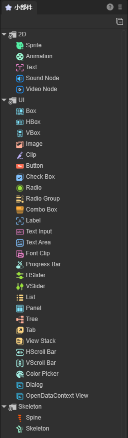

# UI小部件

LayaAir引擎的UI小部件，分为三类。

分别是基础的显示对象：2D精灵、2D节点动画、HTML文本、文本

UI组件：图像、按钮、显示文本、文本输入、文本域、下拉框、多选框、单选框、单选框组、导航标签组、导航容器、位图切片、位图字体切片、 垂直滚动条、水平滚动条、进度条、垂直划动条、水平划动条、取色器、基础容器、列表、树状列表、面板容器

骨骼：Spine骨骼，内置骨骼

如图1所示：

 

(图1)

在使用的时候，直接将小部件拖拽到场景视窗中即可。

