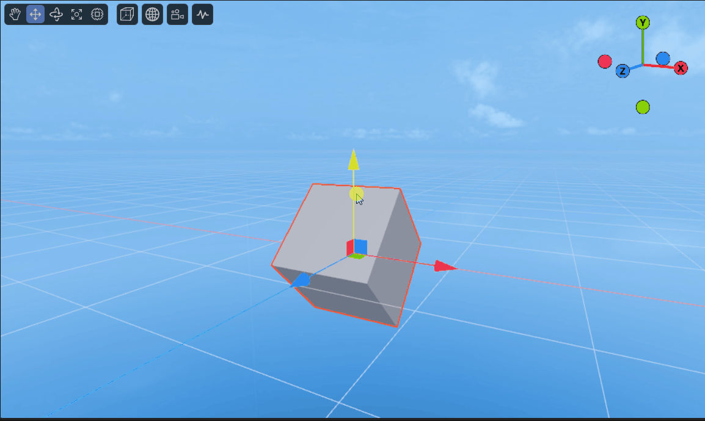

# 3D变换

在前面[《3D概念入门》](../beginner/readme.md)讲过了LayaAir中的坐标系和几个基础数学工具，这些基础概念的一个重要应用，就是三维变换，三维变换也是三维图形世界的基础。LayaAir中实现三维变换用到了Transform3D这个类，包含了平移变换、旋转变换、缩放变换等。

本节以一个立方体模型演示这些变换。在LayaAir IDE中创建一个“3D空项目”，打开项目后，IDE已经默认创建了一个立方体。在Scene2D的属性面板中，新建一个组件脚本，添加装饰器暴露cube的属性，代码如下：

```typescript
@property({ type: Laya.Sprite3D })
public cube: Laya.Sprite3D;
```

然后在IDE中，将Cube节点拖入装饰器暴露的属性入口，即可用代码控制Cube节点了。


## 1. 平移变换

平移变换的定义如下：

```typescript
	/**
	 * 平移变换。
	 * @param 	translation 移动距离。
	 * @param 	isLocal 是否局部空间。
	 */
	translate(translation: Vector3, isLocal: boolean = true): void {
		if (isLocal) {
			Matrix4x4.createFromQuaternion(this.localRotation, Transform3D._tempMatrix0);
			Vector3.transformCoordinate(translation, Transform3D._tempMatrix0, Transform3D._tempVector30);
			Vector3.add(this.localPosition, Transform3D._tempVector30, this._localPosition);
			this.localPosition = this._localPosition;
		} else {
			Vector3.add(this.position, translation, this._position);
			this.position = this._position;
		}
	}
```

平移变换方法translate()有两个参数，第一个translation表示移动的距离，它是一个Vector3类型的变量，既包含移动距离，也包含了移动方向。第二个isLocal判断是否是局部空间，默认为true是局部空间，若传入false则是世界空间。

> 如果物体在局部空间和世界空间的起始位置都是一样的，并没有经过旋转等变换，那么它在两种空间中移动的结果是相同的，在第5节中会说明二者的区别。

使用平移变换移动立方体，在x、y和z方向上分别移动距离1，示例代码如下：

```typescript
const { regClass, property } = Laya;

@regClass()
export class NewScript extends Laya.Script {

    @property({ type: Laya.Sprite3D })
    public cube: Laya.Sprite3D;

    // 平移距离
    private translate: Laya.Vector3 = new Laya.Vector3(1, 1, 1);

    constructor() {
        super();
    }

    /**
     * 组件被激活后执行，此时所有节点和组件均已创建完毕，此方法只执行一次
     */
    onAwake(): void {
        // 平移cube
        this.cube.transform.translate(this.translate, false);
    }

}
```

效果如图1-1所示，其中1是原位置，2是平移后的位置。


（图1-1）


## 2. 旋转变换

关于旋转，在Transform3D中提供了两种旋转接口：

### 2.1 rotate()

第一种是角度/弧度旋转rotate()，定义如下：

```typescript
	/**
	 * 旋转变换。
	 * @param 	rotation 旋转幅度。
	 * @param 	isLocal 是否局部空间。
	 * @param 	isRadian 是否弧度制。
	 */
	rotate(rotation: Vector3, isLocal: boolean = true, isRadian: boolean = true): void {
		var rot: Vector3;
		if (isRadian) {
			rot = rotation;
		} else {
			Vector3.scale(rotation, Math.PI / 180.0, Transform3D._tempVector30);
			rot = Transform3D._tempVector30;
		}

		Quaternion.createFromYawPitchRoll(rot.y, rot.x, rot.z, Transform3D._tempQuaternion0);
		if (isLocal) {
			Quaternion.multiply(this._localRotation, Transform3D._tempQuaternion0, this._localRotation);
			this.localRotation = this._localRotation;
		} else {
			Quaternion.multiply(Transform3D._tempQuaternion0, this.rotation, this._rotation);
			this.rotation = this._rotation;
		}
	}
```

旋转方法rotate()有三个参数。第一个rotation表示旋转幅度，也就是绕x、y、z方向旋转的角度。第二个isLocal判断是否是局部空间，默认为true是局部空间，若传入false则是世界空间。第三个isRadian判断是否是弧度制，默认为true是弧度制，传入false则表示角度值。

使用旋转变换rotate()旋转立方体，绕y轴不停旋转，采用角度值，示例代码如下：

```typescript
const { regClass, property } = Laya;

@regClass()
export class NewScript extends Laya.Script {

    @property({ type: Laya.Sprite3D })
    public cube: Laya.Sprite3D;

    // 旋转角度
    private rot: Laya.Vector3 = new Laya.Vector3(0, 1, 0);

    constructor() {
        super();
    }

    /**
     * 组件被激活后执行，此时所有节点和组件均已创建完毕，此方法只执行一次
     */
    onAwake(): void {
        //设置定时器执行,定时重复执行(基于帧率)
        Laya.timer.frameLoop(1, this, this.animate);
    }

    private animate(): void {
        // 旋转立方体（四元数）
        this.cube.transform.rotate(this.rot, false, false);
    }

}
```

旋转的效果如动图2-1所示：


（动图2-1）

### 2.2 localRotationEuler()

第二种是欧拉角旋转localRotationEuler():Vector3，它的使用非常简单，只需要给旋转角度进行赋值即可。将立方体绕x、y、z方向分别旋转45度，采用角度值，示例代码如下：

```typescript
const { regClass, property } = Laya;

@regClass()
export class NewScript extends Laya.Script {

    @property({ type: Laya.Sprite3D })
    public cube: Laya.Sprite3D;

    // 旋转角度
    private rot: Laya.Vector3 = new Laya.Vector3(45, 45, 45);
    
    constructor() {
        super();
    }

    /**
     * 组件被激活后执行，此时所有节点和组件均已创建完毕，此方法只执行一次
     */
    onAwake(): void {
        // 旋转立方体（欧拉角）
        this.cube.transform.localRotationEuler = this.rot;
    }

}
```

旋转后的效果如图2-2所示：


（图2-2）

如果想实现动图2-1所示的效果，即绕Y轴进行旋转动画，则每帧需要增加localRotationEulerY的值，示例代码如下：

```typescript
const { regClass, property } = Laya;

@regClass()
export class NewScript extends Laya.Script {

    @property({ type: Laya.Sprite3D })
    public cube: Laya.Sprite3D;

    // 旋转角度
    private rot: Laya.Vector3 = new Laya.Vector3(0, 1, 0);

    constructor() {
        super();
    }

    /**
     * 组件被激活后执行，此时所有节点和组件均已创建完毕，此方法只执行一次
     */
    onAwake(): void {
        //设置定时器执行,定时重复执行(基于帧率)
        Laya.timer.frameLoop(1, this, this.animate);
    }

    private animate(): void {
        // 旋转立方体（欧拉角）
        this.cube.transform.localRotationEulerY += this.rot.y;
    }

}
```


## 3. 缩放变换

缩放变换可以使用方法localScale(): Vector3。如果传入的Vector3是类似（2，2，2）、（3，3，3）这样的x、y、z方向相同的值，那么缩放变换进行的就是等比缩放，即等比放大2倍、3倍。

如果是非等比缩放，例如，将立方体按x轴方向放大为原来的2倍，y和z方向保持不变，示例代码如下：

```typescript
const { regClass, property } = Laya;

@regClass()
export class NewScript extends Laya.Script {

    @property({ type: Laya.Sprite3D })
    public cube: Laya.Sprite3D;

    // 缩放倍数
    private scale: Laya.Vector3 = new Laya.Vector3(2, 1, 1);

    constructor() {
        super();
    }

    /**
     * 组件被激活后执行，此时所有节点和组件均已创建完毕，此方法只执行一次
     */
    onAwake(): void {
        // 缩放立方体
        this.cube.transform.localScale = this.scale;
    }

}
```

效果如图3-1所示：


（图3-1）


## 4. 其它变换

除了上面介绍的3种常用变换，Transform3D中还有一些其他常用的方法和属性：

`lookAt(target: Vector3, up: Vector3, isLocal: boolean = false, isCamera: boolean = true): void`：观察目标位置。

`localPosition:Vector3`：局部位置。

`localMatrix:Matrix4x4`：局部矩阵。

`position:Vector3`：世界位置。

`worldMatrix:Matrix4x4`：世界矩阵。

`getRight(right: Vector3): void`：获取向右方向。

`getUp(up: Vector3): void`：获取向上方向。

`getForward(forward: Vector3)`：获取向前方向。


## 5. 局部空间与世界空间

局部空间，又称为物体空间，是相对于物体自身的坐标系。在局部空间中，物体自己的位置被视为原点（0，0，0），并且每个物体都有自己独立的局部空间。而世界空间是指一套用于描述所有物体位置的公共的，全局的坐标系。局部空间可以使物体的行为（如移动和旋转）变得独立，不受其他物体或全局空间的直接影响。 

举一个例子来说明，当立方体绕x轴旋转45度后，在局部空间中移动立方体，是指按照其自身的坐标系方向进行移动，如动图5-1所示：


（动图5-1）

相对应的，在世界空间中移动立方体，是指按照全局的、固定的坐标系方向进行移动，如动图5-2所示：



（动图5-2）

> 本篇只是利用简单的立方体说明用法，对于复杂模型的变换与立方体是类似的，详细的示例可以参考”引擎API使用示例“中的TransformDemo场景。


## 6. 3D世界中的子父关系

在3D世界中父节点变换，其子节点会跟着响应变换。但是子节点发生变换并不会影响父节点。

例如，”引擎API使用示例“中的Sprite3DParent场景，如动图6-1所示，旋转父节点，子节点会跟着旋转。


（动图6-1）

旋转子节点，父节点不受子节点的影响，如动图6-2所示。


（动图6-2）