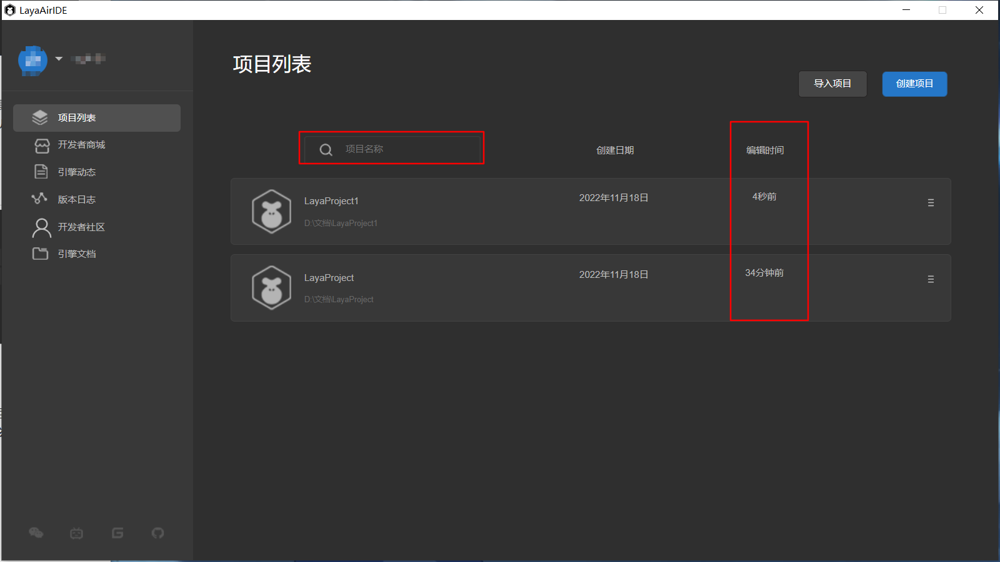
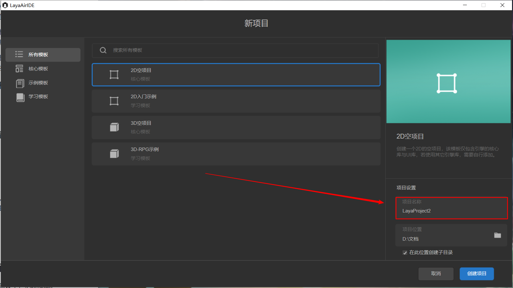
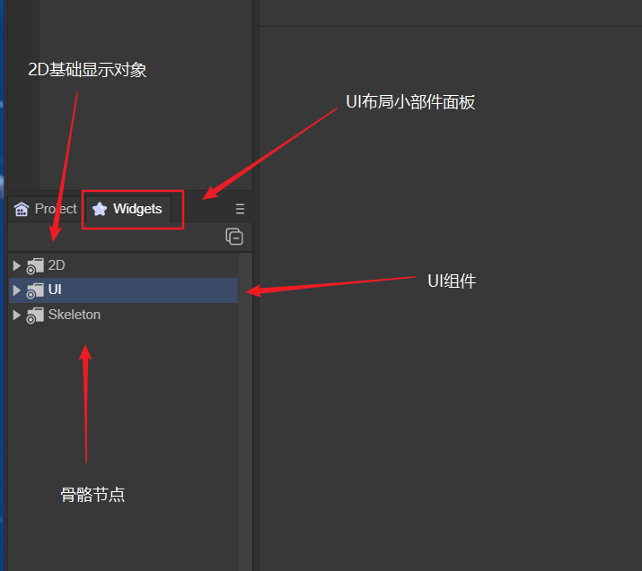
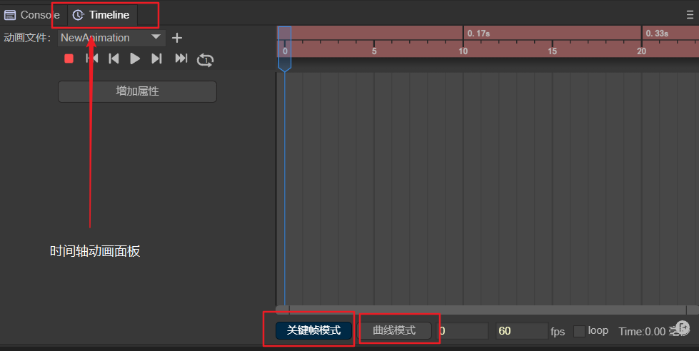
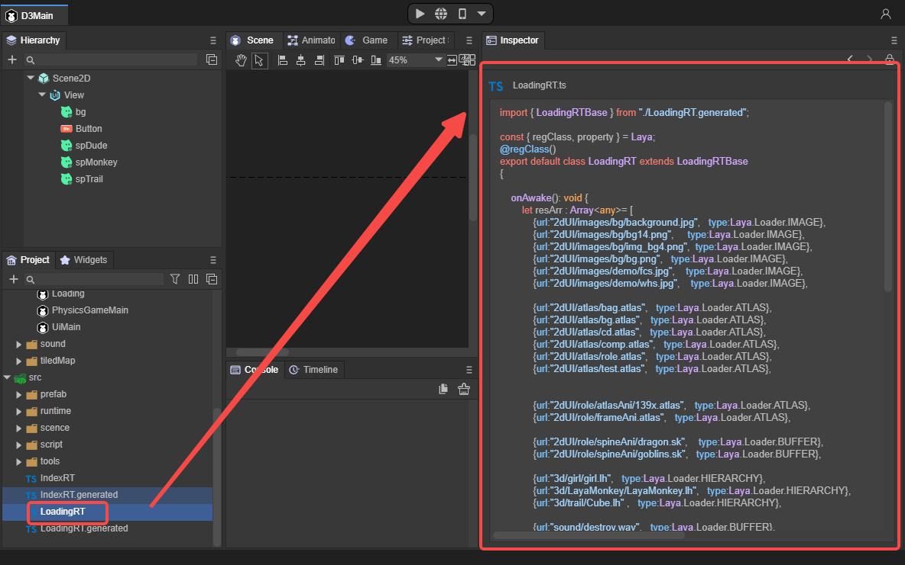
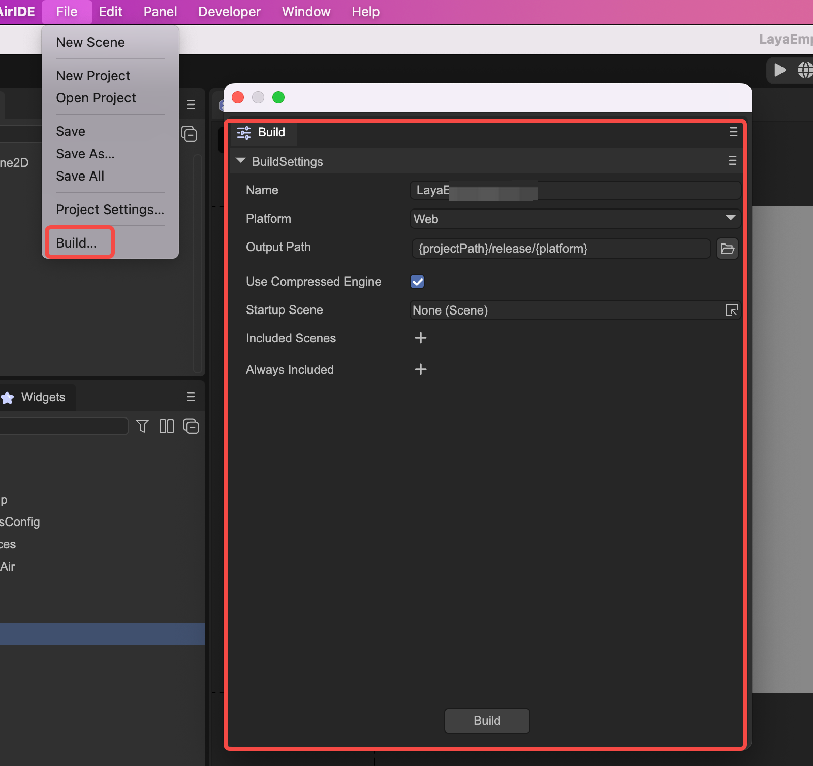

# IDE开发工作流模块概述

> Author：Charley  &&  高宇浩

## 一、IDE帐号登录

LayaAir3.x由于在IDE内使用了资源商店，社区、IDE核心配置云存储等高度依赖网络的功能，因此必须要登录帐号才可以使用IDE。

帐号登录的方式有三种，中文版本帐号支持微信扫码登录与手机帐号登录。英文版本帐号支持邮箱注册登录。

登录界面如图1-1所示。

 

(图1-1)

> 公测前只支持微信登录。

## 二、IDE首页

登录之后的IDE首页，集合了帐号模块、项目列表、创建项目、删除项目引用、项目描述设置、资源商店、web链接（引擎动态、版本日志、开发者社区、引擎文档）等功能。

### 2.1 项目列表

登录之后的默认模块就是项目列表，此处是导入或创建的项目列表，点击鼠标选中的高亮区，即可打开项目，进入编辑器模式。

效果如图2-1所示。

(图2-1)

默认的项目排列顺序是依据编辑时间的由近到远，如果项目数量较多，也可以在搜索框内输入项目关键字找到对应的项目。

效果如图2-2所示。

(图2-2)

在项目列表单元的右侧菜单里，有着项目相关的设置功能，分别是：设置项目图标、设置项目描述、打开项目的目录、将该项目从列表出移除。效果如动图2-3所示。

(动图2-3)

### 2.2 导入项目

点击导入项目，可以将其它电脑中创建的3.x项目或被移除列表的项目，导入到项目列表中。操作如图2-4所示。

(图2-4)

### 2.3 创建项目

如果要创建一个新的项目，我们可以点击创建项目，如图3-1所示，创建一个新的项目。

（图3-1）

#### 2.3.1 选择模板

在创建新项目的界面，我们有三种类型的模板供开发者选择，如图3-2所示。

(图3-2)

核心模板是指2D与3D的空项目模板，适合已经上手的开发者创建一个纯净的模板环境。

示例模板是功能相对简单和独立的功能模块示例，适用于针对具体某些功能进行理解。

学习模板是指模板里的项目功能相对完整与丰富，适合项目开发的入门学习借鉴。

#### 2.3.2 项目名称

如图3-3所示。

(图3-3)

#### 2.3.3 项目位置

如图3-4所示。

(图3-4)

2.3.4 创建项目

完成以上选项后，点击创建项目，如图3-5所示。即可完成项目的创建，进入IDE编辑界面。如图3-5所示。

(图3-5)

### 2.4 开发者商城

开发者商城正在建设中，稍晚推出。

### 2.5 Web链接

链接功能正在建设中，稍晚推出。

### 2.6 帐号设置

帐号设置功能，当前仅支持退出登录。其它功能正在建设中。如图4-6所示。

 

(图4-6)

## 三、编辑器初始界面

编辑器的初始界面，包括层级管理面板、工程管理项目、UI布局小部件面板、场景视窗、预览窗口、动画状态机面板、项目设置面板、控制台、时间轴动画面板、属性面板。

### 3.1 层级管理面板

层级管理面板，主要包括了2D节点与3D节点，如果是存粹的2D项目，也可以只包括2D节点。面板如图5-1所示。

 

(图5-1)

层级的关系就代表着父子节点的关系，子节点会受到父节点的影响，例如父节点改变了位置，或旋转了角度，子节点也会同步产生变化。

3D节点的根节点是Scene3D，2D节点的根节点是Scene2D。2D与3D节点之间不可以混合形成父子层级关系。

### 3.2 工程管理面板

工程管理面板里，包括了项目全部的资源与代码。资源位于assets目录，代码位于src目录。面板如图5-2所示。

 

(图5-2)

### 3.3 UI布局小部件面板

 UI布局小部件面板，包括了2D基础显示对象、UI组件、骨骼节点三部分，用于UI的排版与布局。面板如图5-3所示。

 

(图5-3)

### 3.4 场景视窗

场景视窗是编辑2D场景与3D场景的地方，是开发者可视化编辑虚拟世界的窗口。面板如动图5-4所示。

 

（动图5-4）

### 3.5 预览窗口

预览窗口是通过开发者布局编辑与代码逻辑展示给用户的视觉效果预览窗口。面板如图5-5所示。

 

（图5-5）

### 3.6 动画状态机面板

动画状态机，是控制时间轴动画逻辑的工具，动画状态机面板包括动画图层与状态机相关的功能。面板如图5-6所示。

 

（图5-6）

### 3.7 项目设置面板

项目设置面板包括了屏幕适配设置、引擎初始化设置、项目启动设置等。面板如图5-7所示。

 

（图5-7）

### 3.8 控制台面板

控制台面板用来打印日志信息，可以复制和清空所打印的日志信息。面板如图5-8所示。

 

（图5-8）

### 3.9 时间轴动画面板

时间轴动画面板用于2D与3D动画的编辑，有两个模式，分别是关键帧模式和曲线模式。如图5-9所示。

 

（图5-9）

### 3.10 属性设置面板

属性面板就是用于设置对象或文件属性的地方，

例如，IDE层级面板中的2D与3D对象属性，资源文件的属性设置或预览查看。以及组件的添加。

**对象属性设置，如图6-1所示：**

 

（图6-1）

 **资源属性设置，如图6-2所示：**

 

（图6-2）

 **代码预览，如图6-3所示：**

（图6-3）

 **添加组件（自定义的属性），如图6-4所示：**

  

（图6-4）

## 四、其它编辑面板

除了初始界面所显示的面板外，还有通过预制体文件打开的预制体面板标签，以及通过蓝图文件打开的蓝图编辑面板。

### 4.1 预制体面板标签

场景文件打开的标签，都是同一个。点击预制体文件，会形成独立的预制体面板标签。效果如动图7-1所示。

（动图7-1）

预制体面板标签，其实并没有专属于自己的独有面板。仅仅是层级管理面板的根节点与场景文件的根节点不同。

### 4.2 蓝图编辑面板

蓝图编辑面板可以不写代码就快捷的编写自定义的材质，大幅降低开发者的使用门槛。

打开Shader蓝图文件或Shader蓝图函数文件，即可进入蓝图编辑面板。如图动图7-2所示。

(动图7-2)

## 五、项目预览与发布

### 5.1 项目预览

项目预览用来查看项目在不同环境中的运行效果。

项目预览分为三种模式，分别是IDE内预览，浏览器预览，移动端预览。如图8所示。

  

（图8）

### 5.2  项目发布

项目发布是将开发版本发布成为网页版本、小游戏版本、Naitve APP版本。

通过File菜单的Build调出发布界面，如图9所示。

 

