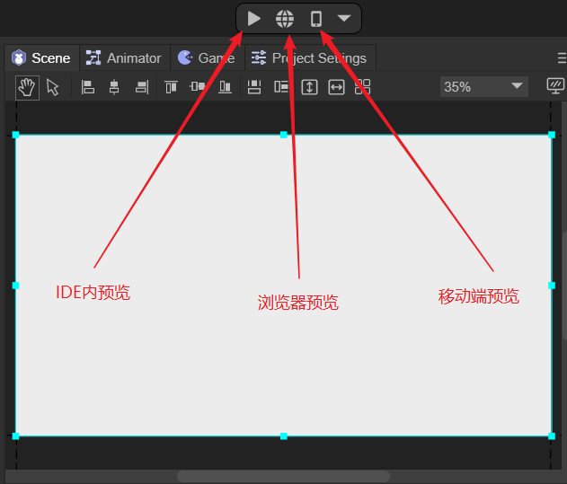
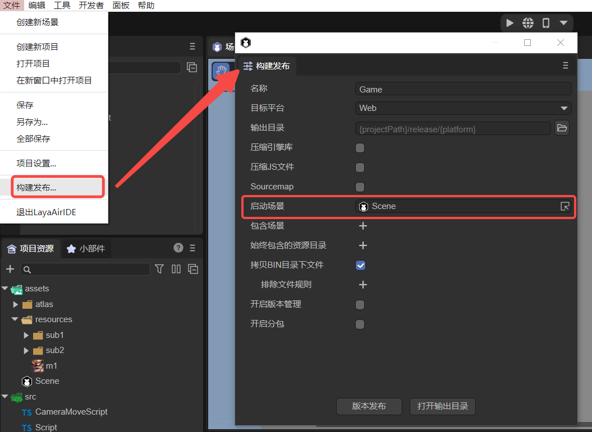
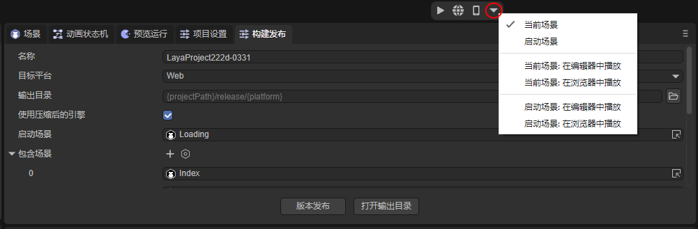
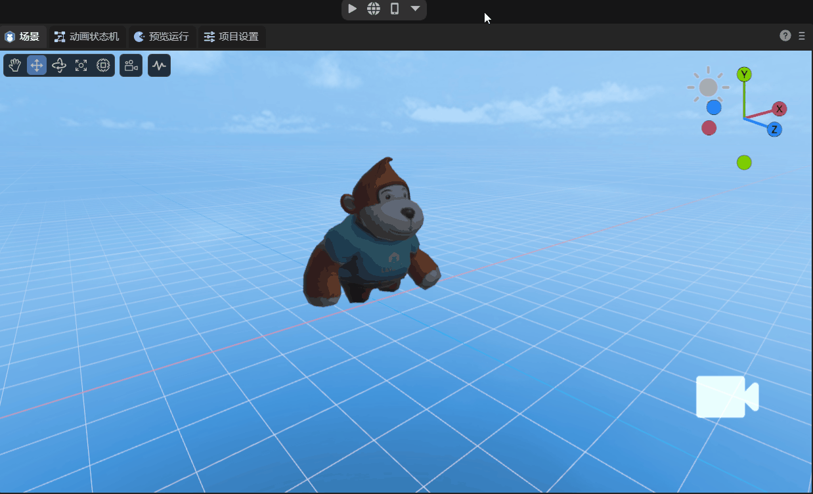

# 预览运行面板说明

## 一、项目预览

### 1.1 预览运行

项目预览用来查看项目在不同环境中的运行效果。项目预览分为三种模式，分别是IDE内预览，浏览器预览，移动端预览。如图1-1所示。

（图1-1）

> 预览相关的快捷键可以参考一下[《IDE快捷键与鼠标交互操作大全》](../../../basics/IDE/shortcutKeyCombinations/readme.md)的1.5节。

在开启IDE内预览后会出现两个按钮，分别是`重新启动`和`打开开发者工具`：

重新启动顾名思义，对当前预览运行场景进行重启，如图1-2所示。

（图1-2）

点击打开开发者工具会调出Developer Tools，方便开发者进行调试，也可以通过 `Ctrl + Alt + I` 快捷键来打开开发者工具。

（图1-3）

### 1.2  预览运行的入口

启动场景在[构建发布](../../../released/web/readme.md)里进行线上版本的发布后，毫无疑问是作为项目的入口来率先加载与显示的。如图1-4所示，在构建发布中设置启动场景。

（图1-4）

但是在项目**预览运行**调试的时候，有的时候并不希望将启动场景优先显示，这会使得调试流程变的很长。所以，点击图1-5红圈中的下拉箭头，可以通过点击勾选的方式，将`启动场景`或者`当前场景`作为预览运行的**入口**。

（图1-5） 

> 当前场景是指，当前在IDE里正处于打开编辑状态的场景。

## 二、IDE预览运行面板的作用

### 2.1 不运行时

先[自定义界面布局](../../../basics/IDE/layouts/readme.md)，将预览运行窗口按如动图2-1所示的方式拖动，方便观察效果。

（动图2-1）

这样布局的好处，可以方便开发者进行UI布局排版，这也是预览运行窗口在不运行时的一个作用。如动图2-2所示，在场景面板中，是无法同时显示2D与3D界面的，假如我想在模型下显示一个标签，并且需要将它们的位置对齐，这时就需要在预览运行窗口中观察效果。

（动图2-2）

实际上，在点击运行按钮之前，预览运行窗口只是不执行脚本，其它的效果都会显示。比如粒子效果，如动图2-3所示，但是为了效率，粒子效果在预览运行窗口不会实时显示，它是隔一段时间刷新一次。

（动图2-3）

### 2.2 运行时

点击运行后，就会连脚本也运行。如动图2-4所示，点击运行按钮会自动跳转到预览运行界面，这里给Main Camera添加了一个通过鼠标和键盘来控制摄像机的脚本（参考文档[《使用3D精灵》](../../../3D/Sprite3D/readme.md)第六节），如果不点击运行，那么这个脚本就不会被执行。

（动图2-4）

## 三、预览运行面板的功能

### 3.1 分辨率

不运行时，如动图3-1所示，预览运行的分辨率就是项目设置中的分辨率。

（动图3-1）

如果是运行时，分辨率有多种选项可以选择，如动图3-2所示，还可以自己创建选项，Dimensions是选项的名称，点击对勾后，就可以设置需要的分辨率数值了。

（动图3-2）

### 3.2 横屏和竖屏

运行时，点击如动图3-3所示的图标，可以切换横屏和竖屏显示。

（动图3-3）

### 3.3 缩放、恢复1X

预览运行面板支持缩放，还可以快速恢复为1倍大小，操作如动图3-4所示。

（动图3-4）

### 3.4 静音

如果项目中有音频，则点击如动图3-5所示的图标，在预览运行时将会静音演示。

（动图3-5）