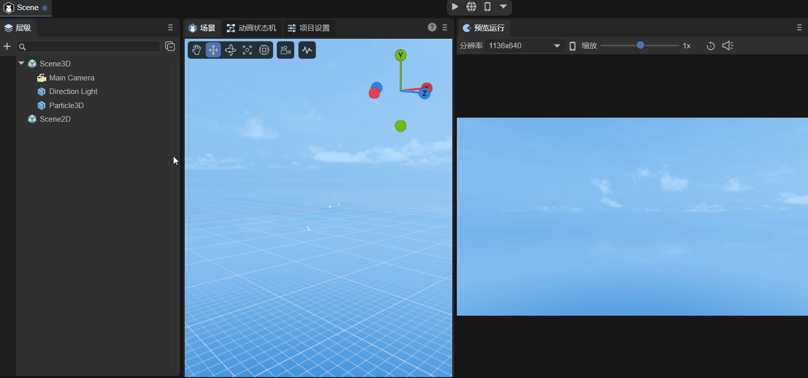

# 预览运行面板说明

## 一、预览运行面板的作用

开发者一定要先看一下[《IDE开发流程界面概述》](../../../basics/IDE/GUI/readme.md)的5.1节、[《IDE快捷键与鼠标交互操作大全》](../../../basics/IDE/shortcutKeyCombinations/readme.md)的1.5节、[《项目入口说明》](../../../basics/IDE/entry/readme.md)的1.4节。

### 1.1 不运行时

先[自定义界面布局](../../../basics/IDE/layouts/readme.md)，将预览运行窗口按如动图1-1所示的方式拖动，方便观察效果。

（动图1-1）

这样布局的好处，可以方便开发者进行UI布局排版，这也是预览运行窗口在不运行时的一个作用。如动图1-2所示，在场景面板中，是无法同时显示2D与3D界面的，假如我想在模型下显示一个标签，并且需要将它们的位置对齐，这时就需要在预览运行窗口中观察效果。

（动图1-2）

实际上，在点击运行按钮之前，预览运行窗口只是不执行脚本，其它的效果都会显示。比如粒子效果，如动图1-3所示，但是为了效率，粒子效果在预览运行窗口不会实时显示，它是隔一段时间刷新一次。

（动图1-3）

### 1.2 运行时

点击运行后，就会连脚本也运行。如动图1-4所示，点击运行按钮会自动跳转到预览运行界面，这里给Main Camera添加了一个通过鼠标和键盘来控制摄像机的脚本（参考文档[《使用3D精灵》](../../../3D/Sprite3D/readme.md)第六节），如果不点击运行，那么这个脚本就不会被执行。

（动图1-4）

> 重新启动和打开开发者工具请参考[《IDE开发流程界面概述》](../../../basics/IDE/GUI/readme.md)的5.1节。

## 二、预览运行面板的功能

### 2.1 分辨率

不运行时，如动图2-1所示，预览运行的分辨率就是项目设置中的分辨率。

（动图2-1）

如果是运行时，分辨率有多种选项可以选择，如动图2-2所示，还可以自己创建选项，Dimensions是选项的名称，点击对勾后，就可以设置需要的分辨率数值了。

（动图2-2）

### 2.2 横屏和竖屏

运行时，点击如动图2-3所示的图标，可以切换横屏和竖屏显示。

（动图2-3）

### 2.3 缩放、恢复1X

预览运行面板支持缩放，还可以快速恢复为1倍大小，操作如动图2-4所示。

（动图2-4）

### 2.4 静音

如果项目中有音频，则点击如动图2-5所示的图标，在预览运行时将会静音演示。

（动图2-5）