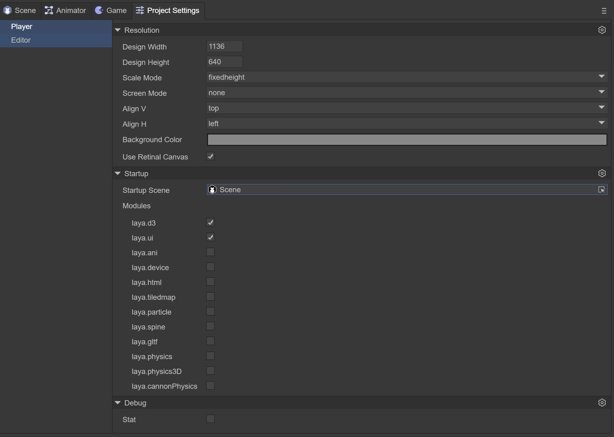
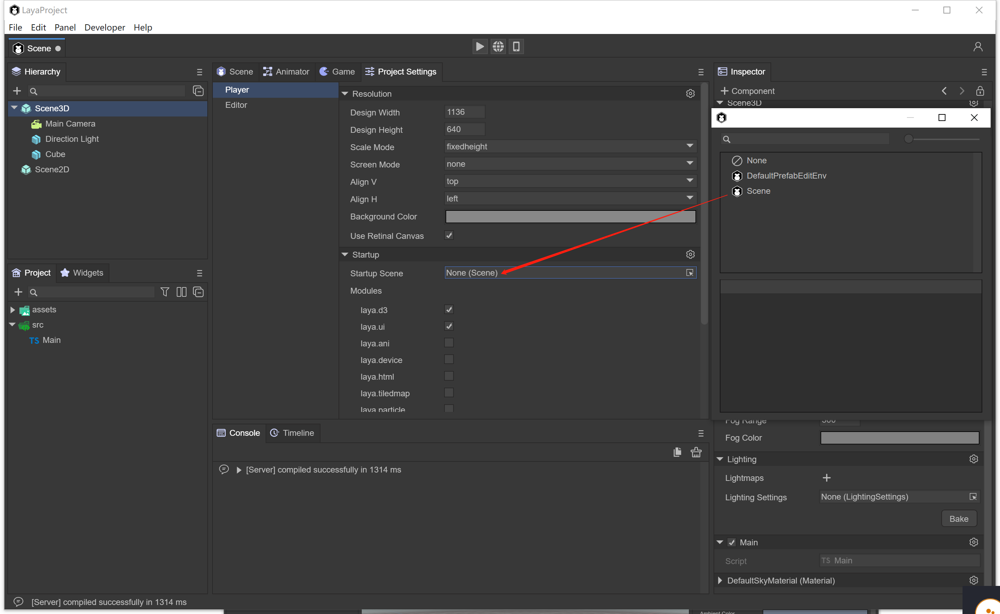
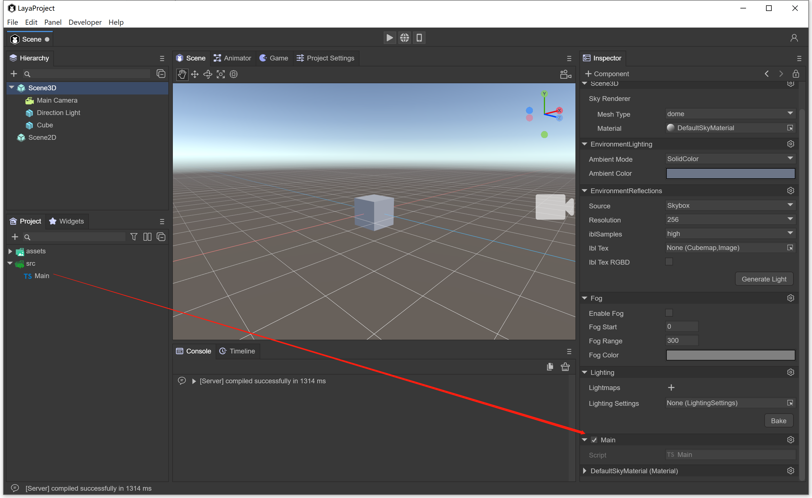
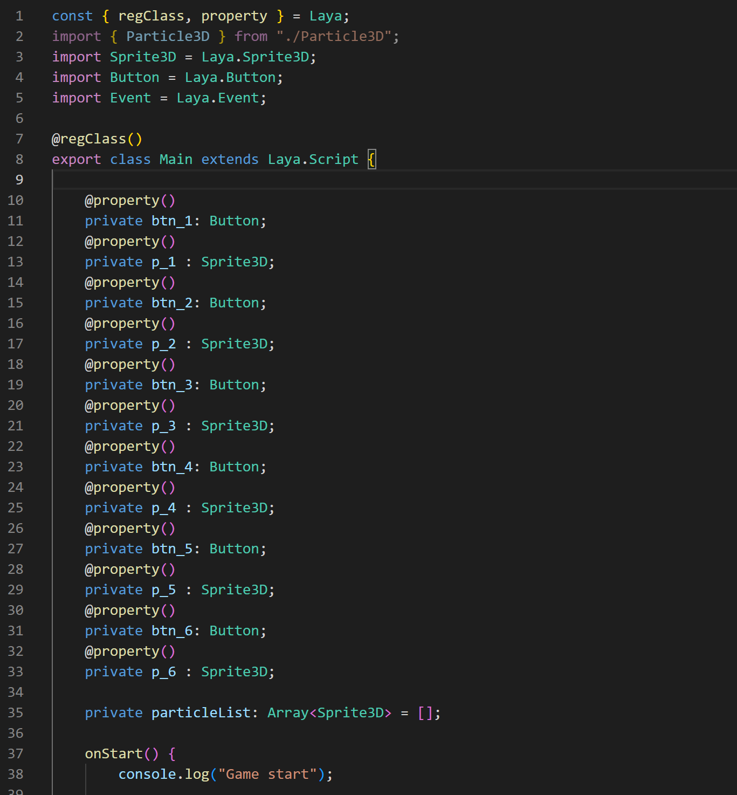
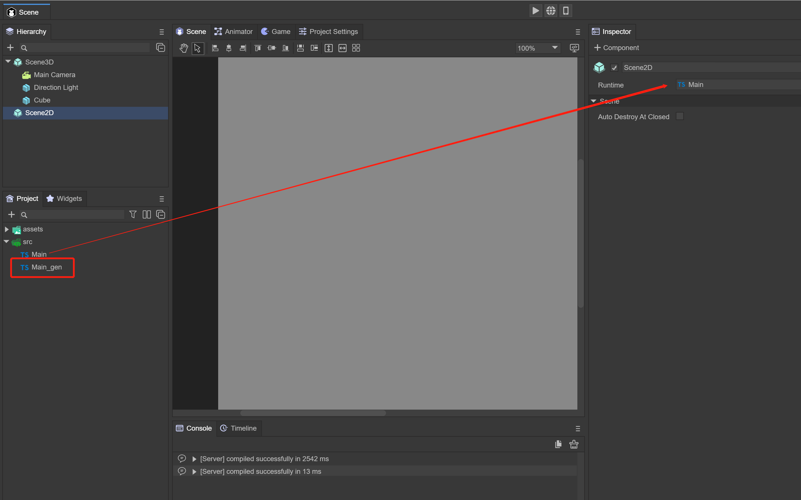
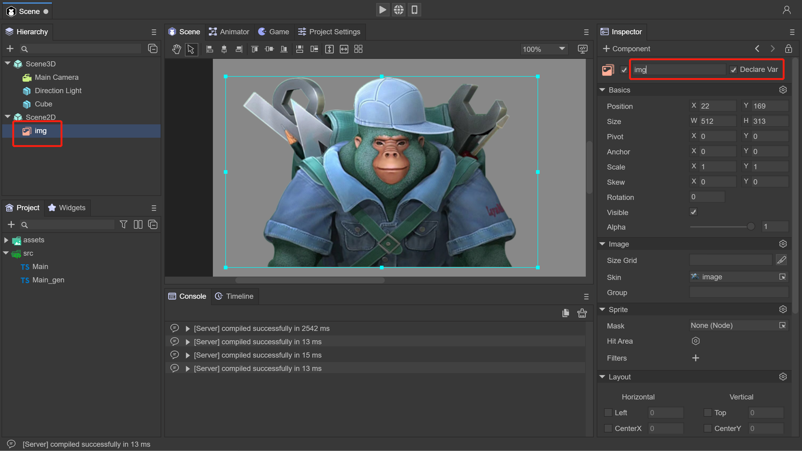
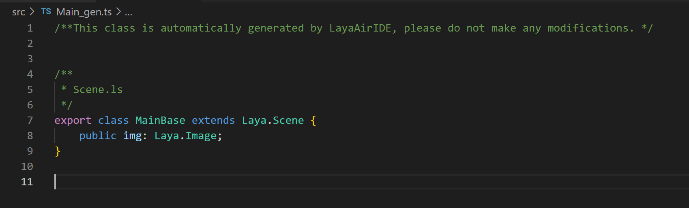

# 入口


## 默认入口

在使用LayaAir2.0中，只能使用Main类来作为项目的入口，并使用如下方式启动，设置参数配置：

在LayaAir3.0中，项目的入口做了根本的改变，在IDE中，可以在Project Setting中对项目做初始化参数设置，启动默认场景

 

（图1）

## 设置初始入口

使用LayaAir3.0创建工程后，会建立一个默认的场景，位于Assets下的Scene.ls，同时会创建一个Main的脚本，位于Src目录下。点击IDE的Project Setting，可以指定初始场景Scene。打开Scene场景，在场景中的Scene3D或者Scene2D节点都可以拖入Main脚本，已启动项目

 

（图2）

 

（图3）

## 入口类

在LayaAir3.0中，可以使用LayaAir自定义脚本或者runTime作为入口类。

**自定义脚本**：自定义脚本，请参考“自定义脚本组件”文档

 

（图4）

**Runtime**：在LayaAirIDE中资源面板下所有的组件均有Runtime的属性，Runtime是该组件运行时的逻辑类；相同组件可使用同一Runtime类来实现相同的功能，比如不同页面上需要对相同的组件实现同一功能。需要注意的是组件的Runtime逻辑类如果不继承组件自身，并且继承的对象中没有该组件的属性时，这个属性则会失效。（不支持在View和Dialog页面中使用）。Runtime脚本与自定义脚本类似，不同的是Runtime不能对组件添加新的属性。

**使用Runtime流程：**

 

（图5）

点击Scene2D节点，可以在Inspector里看到Runtime，拖入一个代码Main.ts，保存场景后，会在同级目录下生产Main_gen.ts 文件，此文件为当前节点的生产类，不可修改。

 

（图6）

在Scene2D下创建一个Image组件，在属性面板勾选Declare Var，并修改名字为img，保存场景

 

（图7）

Main_gen.ts会再次生产，多了一个img属性，此时Main.ts代码中可以直接使用img属性如图8

 

（图8） 


## 入口方法

当通过自定义脚本或者Runtime，在场景中指定入口后，可以在如下方法中做初始化代码：

**自定义脚本：**

```
const { regClass, property } = Laya;

@regClass()
export class Main extends Laya.Script {

    @property()
    private img: Laya.Image;      

    onStart() {
        console.log("Game start");
        this.img.visible = false;
    }
}
```

> 注意，使用自定义脚本，需要在编辑器拖入想使用的属性组件

**Runtime**：

```
import { MainBase } from "./Main_gen";
const { regClass, property } = Laya;

@regClass()
export class Main extends MainBase {

    onStart() {
        console.log("Game start");
        this.img.visible = false;
    }
}
```

