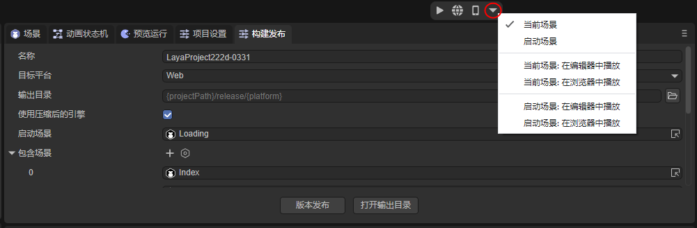
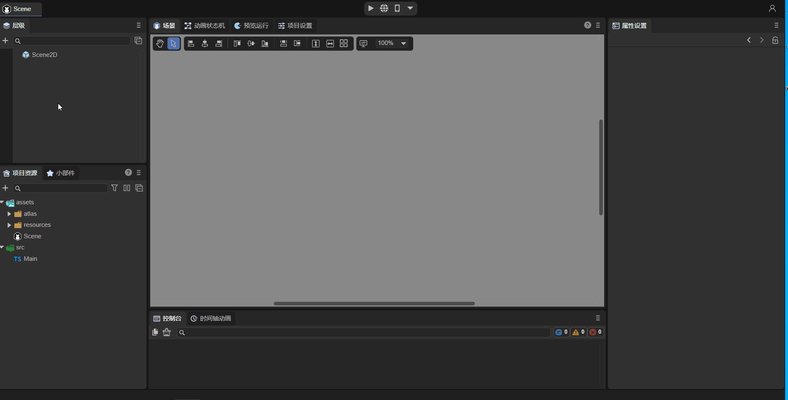
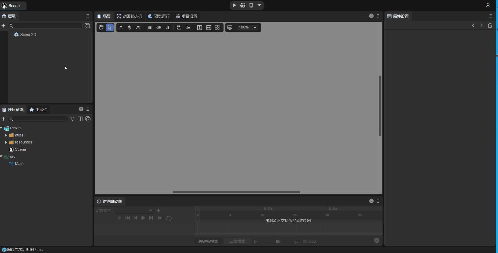

# 项目入口说明

> Author：Charley 、孟星煜
>

项目入口是在引擎初始化之后，项目首先要执行的地方。

对于大型项目通常是资源预加载与全局初始化的入口，无需预加载的微型产品，通常是主界面与全局入口逻辑。

## 一、启动场景

### 1.1 LayaAir2.0用户必看，入口变了

LayaAir2.x引擎中，是通过Main类来作为项目的入口类，所以一些引擎的初始化配置工作只能是在入口类中通过代码进行设置（如图1-1）。


（图1-1）

但是在LayaAir3.0中，为了简化开发者的理解与流程，项目的入口不再是以入口类的形式出现。项目的入口变为了启动场景。引擎的初始化配置工作仅需要在IDE里可视化的配置，即可完成。下文会详细介绍。

> LayaAir2.0的老用户们，不要再找Main入口类了，已被干掉~

### 1.2 设置启动场景

LayaAir 3.0引擎，只能在IDE里设置启动场景作为项目的入口。如果需要初始化引擎全局配置，直接在IDE的项目设置中配置。如果需要代码逻辑，直接为场景关联脚本，即可以执行代码逻辑。

本小节，我们先来介绍如何设置启动场景。

我们在`文件`导航菜单中打开 `构建发布` 面板。如图1-2所示，

 

（图1-2）

`构建发布`面板的`启动场景`用于指定项目的启动场景，如图1-3所示。

  

（图1-3） 

开发者可以在弹出的面板中，选择一个场景文件，指定为启动场景。操作如动图1-4所示，

 

（动图1-4） 

### 1.3 项目入口之前的引擎配置项 

在执行项目入口之前，开发者也可以先配置一些引擎的初始化设置，如图1-5，我们打开`项目设置`面板，直接在引擎选项里进行配置即可。

 

（图1-5） 

具体的参数设置说明，请查阅文档[《项目设置详解》](../projectSettings/readme.md) 。

### 1.4 预览运行的入口设置

启动场景在构建发布里进行线上版本的发布后，毫无疑问是作为项目的入口来率先加载与显示的。

但是在项目**预览运行**调试的时候，我们有的时候并不希望将启动场景优先显示，这会使得调试流程变的很长。

所以，点击图1-6红圈中的下拉箭头，可以通过点击勾选的方式，将`启动场景`或者`当前场景`作为预览运行的**入口**。

 

（图1-6） 

> 当前场景是指，当前在IDE里正处于打开编辑状态的场景。


## 二、入口的逻辑脚本

虽然这个知识点并不属于项目入口的专属，但我们还是概要的讲一下流程。

首先，LayaAir3.0里并不建议开发者采用自定义的脚本作为项目的入口。所以从正常的流程上，代码的逻辑必须要跟随入口场景，通过入口场景激活与添加到舞台等引擎的生命周期方法来执行对应的逻辑。

对于场景的3D根节点Scene3D，可以绑定的脚本只有自定义的组件脚本。场景的2D根节点Scene2D，除了自定义的组件脚本还可以绑定UI组件脚本。

> 关于自定义的组件脚本与UI组件脚本区别与使用，请查阅相关文档，本篇仅介绍项目入口的核心流程。
>
> 自定义的组件脚本（装饰器暴露属性、事件方法、生命周期方法等）请参考[《实体组件系统（ECS）》](../../common/Component/readme.md)
>
> UI组件脚本（关联UI组件、与自定义组件脚本的区别等）请参考[《UI继承类》](../../../IDE/uiEditor/runtime/readme.md)


### 2.1 自定义组件脚本的基础使用流程

**自定义的组件脚本**继承自Laya.Script类，定义了组件的事件方法和自身生命周期方法。

动图2-1演示了如何给Scene2D节点添加自定义的组件脚本。在`属性设置`面板中，点击`增加组件`->`新建组件脚本`，然后可以对要新建的脚本进行重命名（图中重命名为aaa），最后点击`创建并添加`即可创建脚本。



（动图2-1）

 按以上动图添加的自定义组件脚本aaa.ts，生成了名称为aaa的脚本模板类，如图2-2，直接在该脚本中编写代码即可。

 

（图2-2）

> [!Tip]
>
> 具体的组件脚本使用文档请参考[《实体组件系统（ECS）》](../../common/Component/readme.md)


### 2.2 UI组件脚本

除了自定义的组件脚本以外，也可以使用UI组件脚本作为项目入口的逻辑代码。

> UI组件主要是用于2D场景中，需要管理的节点比较多的时候，以及需要在打开场景的时候需要为场景传递参数（例如弹窗的动态提示等）的应用场景。
>
> UI组件可以独立使用，也可以与组件脚本同时使用。

**UI组件脚本**需要在`UI运行时（Runtime）`属性入口进行添加，如图2-3所示。并且，只有在场景的Scene2D节点或2D预制体的`属性设置`面板中

 

（图2-3）

> 2D预制体只要是根节点都有UI运行时（Runtime）这个属性。

下面以Scene2D节点为例，介绍创建UI组件脚本的方式。在`UI运行时`属性输入框进行**鼠标双击**操作，IDE会弹窗提示创建UI组件脚本文件，默认是`RuntimeScript.ts`，开发者可以对其进行重命名，例如动图2-5所示的bbb，点击`保存`即可创建脚本。



（动图2-5）

> 建议先学习完自定义的组件脚本及其使用，再学习UI组件脚本的相关内容。


## 三、自定义初始化

由于之前的流程，是先初始化引擎，然后再加载与启动入口场景。但是在某些特殊的情况下，开发者可能需要在引擎初始化之前执行一些逻辑，例如需要提前判断不同的运行环境等。

那我们也提供了自定义的代码流程，通过`Laya.LayaEnv.beforeInit`定义引擎初始化之前要执行的逻辑，通过`Laya.LayaEnv.afterInit`定义引擎初始化之后要执行的逻辑。

例如，在开发者创建项目时会自动生成一个`Main.ts`，加入下面的代码：

```typescript
Laya.LayaEnv.beforeInit = function(config: Laya.IStageConfig) {
    //这个方法会在Laya.init前调用
    console.log("before init");
    //这里可以对config以及Laya.Config、Laya.Config3D进行自定义的修改
}

Laya.LayaEnv.afterInit = function() {
    //这个方法会在Laya.init后调用
    console.log("after init");
}

const { regClass, property } = Laya;
@regClass()
export class Main extends Laya.Script {

    onStart() {
        console.log("Game start");
    }
}
```

要注意的是，需保证这些代码所在的脚本文件是被场景中引用的，否则在发布版本时被消除项目中未使用的代码，那就无效了。

**注意：如果没有特殊需求，不推荐使用本小节方法进行游戏初始化。开发者应使用为场景挂载组件脚本的方式。**

运行可以看到，输出结果如图3-1所示：  


（图3-1）

