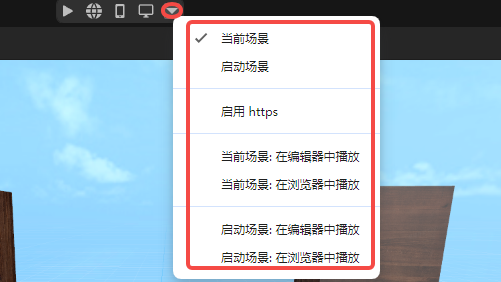
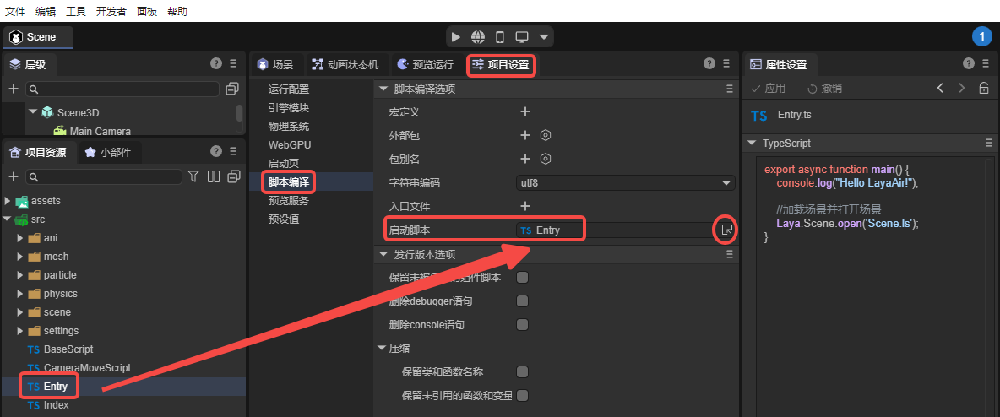
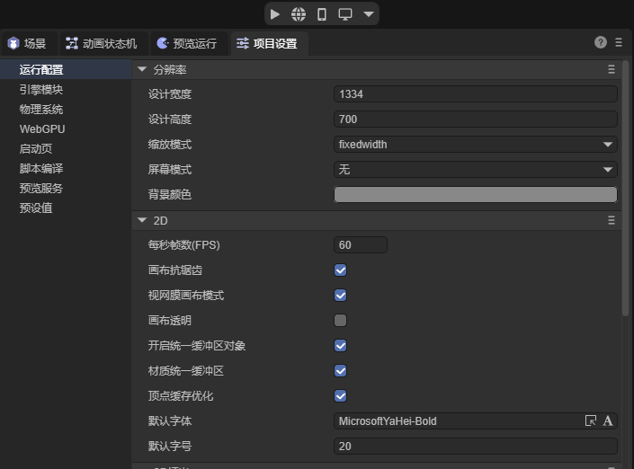
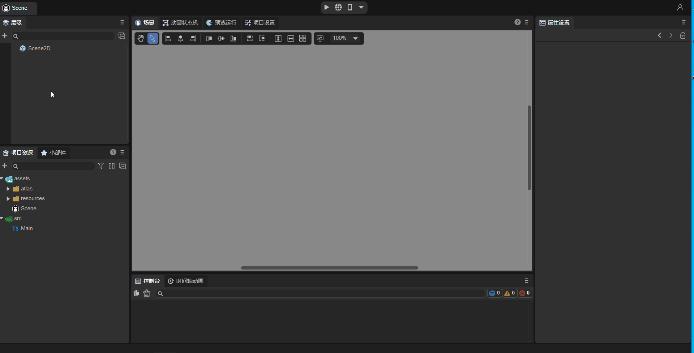
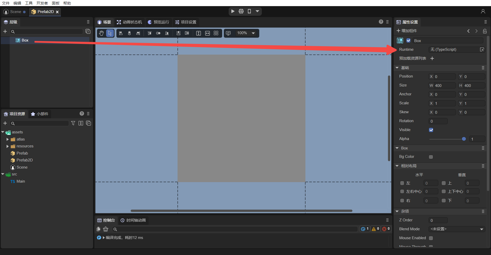

# 项目入口说明

> Author：Charley
>

项目入口是在引擎初始化之后，项目首先要执行的地方。

对于大型项目通常是资源预加载与全局初始化的入口，无需预加载的微型产品，通常是主界面与全局入口逻辑。

## 一、项目运行的启动入口

LayaAir3的项目入口设置有两种方式，

一种是在**构建发布**的界面**指定启动场景**，这样发布后就会按指定的场景作为入口。

另一种，是在**项目设置**里，**指定启动脚本**，开发者可以在启动脚本中，根据代码逻辑自行决定哪开哪个场景作为入口。

### 1.1 设置启动场景

我们先来介绍如何通过`构建发布`设置启动场景。

首先在`文件`导航菜单中打开 `构建发布` 面板。然后在`通用`栏中，找到`资源选项`的`启动场景`设置项，

通过输入框右侧的场景选择器选择目标场景，或者直接拖拽场景到输入框即可。

  

（图1-1）

需要注意的是，构建发布这里的设置主要是用于发布后的入口启动场景，如果是IDE内的测试，更常见的是，运行当前打开的场景 ，而不是启动场景。

所以在运行的时候，我们可以选择是运行当前场景还是启动场景。如图1-2所示。

 

（图1-2）

### 1.2 设置启动脚本

首先，我们需要创建一个启动脚本（TS）。

这个脚本必须是一个异步的main函数，不能修改命名，我们的入口逻辑写到main函数内即可。

创建一个Entry.ts，示例代码如下：

```typescript
export async function main() {
    console.log("Hello LayaAir!");

    //加载场景并打开场景
    Laya.Scene.open('Scene.ls');
}
```

然后，我们在`项目设置`的`脚本编译`栏中，找到`脚本编译选项`分类下的`启动脚本`设置项，

通过输入框右侧的脚本选择器选择目标脚本，或者直接拖拽脚本到输入框即可。如图1-3所示。

 

（图1-3）

一旦启动脚本设置生效，无论是IDE内还是发布后，将不再打开默认场景。

即便是运行设置里勾选的是打开默认场景，默认也只会执行启动脚本main函数内的逻辑。

例如图1-3中，Entry.ts里执行了打开场景Scene.ls逻辑，如果我们加上逻辑判断，就可以根据不同环境，打开不同的入口场景了。


## 二、其它入口相关

### 2.1 自定义引擎启动配置 

在项目入口启动之前，引擎也有一些初始化的启动配置。

通常，我们直接在`项目设置`面板中配置即可，如图2-1所示。

  

（图2-1） 

具体的参数设置说明，请查阅文档[《项目设置详解》](../projectSettings/readme.md) 。

除了在IDE中可以直接配置的设置外，我们也可以通过代码的方式，在引擎初始化之前或初始化之后添加引擎配置或逻辑。

如果我们是添加到启动脚本里，示例代码如下：

```typescript
// 在引擎初始化前执行自定义逻辑(此方法在Laya.init前调用)
Laya.addBeforeInitCallback(() => {
    // 默认启用WebGL2渲染模式
    Laya.Config.useWebGL2 = true;
    console.log("before init");
});
// 在引擎初始化后执行自定义逻辑(此方法在Laya.init后调用)
Laya.addAfterInitCallback(() => {
    console.log("after init");
});

export async function main() {
    console.log("Hello LayaAir!");
    //加载场景并打开场景
    Laya.Scene.open('Scene.ls');
}
```

如果没有启动脚本，只有启动场景，那我们就在启动场景的脚本类之前添加引擎初始化逻辑配置。

示例代码如下：

```typescript
// 在引擎初始化前执行自定义逻辑(此方法在Laya.init前调用)
Laya.addBeforeInitCallback(() => {
    // 默认启用WebGL2渲染模式
    Laya.Config.useWebGL2 = true;
    console.log("before init");
});
// 在引擎初始化后执行自定义逻辑(此方法在Laya.init后调用)
Laya.addAfterInitCallback(()=>{
    console.log("after init");
});


const { regClass, property } = Laya;
@regClass()
export class Main extends Laya.Script {

    onStart() {
        console.log("Game start");
    }
}
```

### 2.2 场景的脚本说明

前面讲了项目的入口，

本小节简述一下场景的脚本。场景的脚本主要是两类，

一类是自定义的`组件脚本`。这种脚本，无论是2D还是3D都是通用的，通常情况下，我们更建议使用自定义脚本。

另一类是`UI运行时`，只能用于2D场景根节点，以及2D预制体。这是一种为了满足重写UI组件以及管理较多UI子节点等需求的一种UI组件继承类。

#### 2.2.1 自定义组件脚本的基础使用流程

**自定义的组件脚本**继承自Laya.Script类，定义了组件的事件方法和自身生命周期方法。

动图2-1演示了如何添加自定义的组件脚本。在`属性设置`面板中，点击`增加组件`->`新建组件脚本`，然后可以对要新建的脚本进行重命名（图中重命名为aaa），最后点击`创建并添加`即可创建脚本。



（动图2-2）

 按以上动图添加的自定义组件脚本aaa.ts，生成了名称为aaa的脚本模板类，如图2-3所示，直接在该脚本中编写代码即可。

  

（图2-3）

更多关于自定义组件脚本（装饰器暴露属性、事件方法、生命周期方法等）的介绍，请参考[《实体组件系统（ECS）》](../../common/Component/readme.md)

#### 2.2 UI运行时的使用

除了自定义的组件脚本以外，也可以使用UI运行时（**UI组件脚本**）作为项目入口的逻辑代码。

UI运行时可以独立使用，也可以与组件脚本同时使用。

UI运行时的应用场景是，需要管理的节点比较多的时候，以及需要在打开场景的时候需要为场景传递参数（例如弹窗的动态提示等）、重写引擎的UI组件，重新组织UI的数据源等。

UI运行时需要在`UI运行时（Runtime）`属性入口进行添加，如图2-4所示。并且，只能添加在2D场景根节点（Scene2D）或2D预制体根节点。

 

（图2-4）

先双击`UI运行时`输入框，然后在弹出的面板中，选择好目录，以及重命名脚本的文件名，点击`保存`即可，如动图2-5所示。

 

（动图2-5）

关于UI运行时的具体使用，请参考相关文档：[《UI运行时》](../../../IDE/uiEditor/runtime/readme.md)


